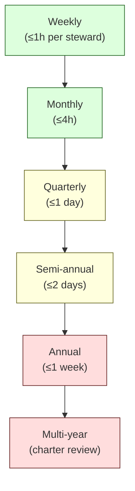
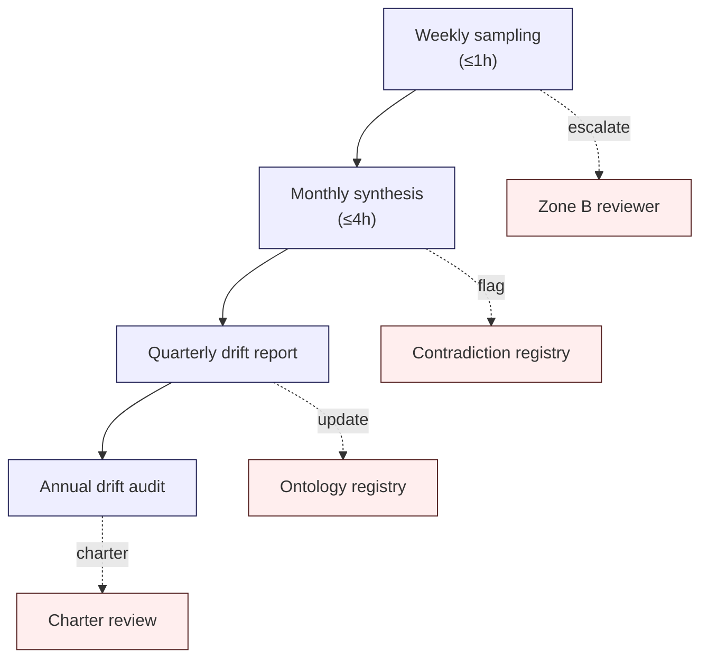
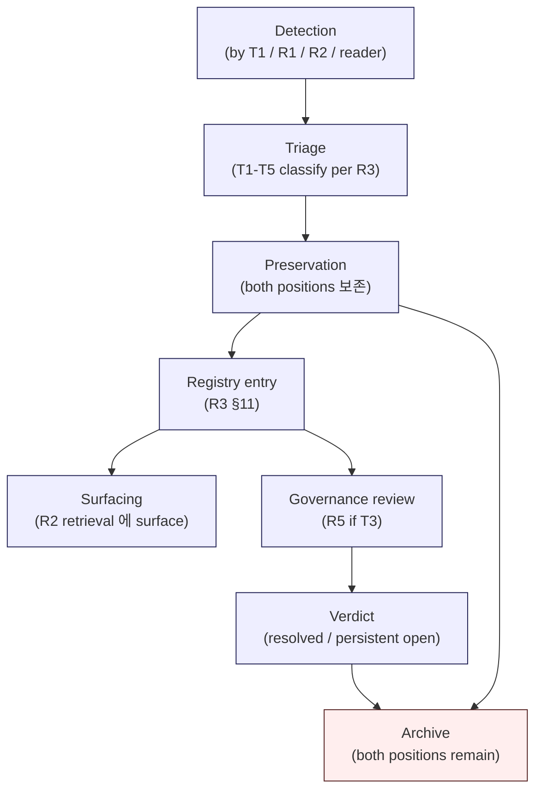
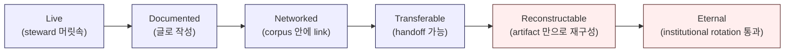
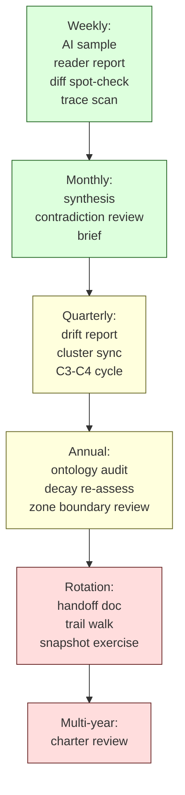

# 7. Governance & Stewardship Workflow
> corpus 를 살아 있는 system 으로 운영하기

이 문서는 **corpus 를 누가 / 언제 / 어떤 권한으로 유지보수하는지** 의 실무 workflow 를 설명합니다.

핵심 메시지:

> **이 corpus 는 단순 문서 저장소가 아니라 운영되는 reasoning institution 이다.**

---

## 1. Stewardship 의 4 가지 mental model

처음 합류한 사람에게 가장 중요한 mental model 4 가지:

| Mental model | 의미 |
|--------------|------|
| **Stewardship ≠ Authorship** | 글을 쓰는 것이 아니라 corpus 의 운영 조건을 유지하는 것 |
| **Discipline lives in practice** | R-series 의 규율은 spec 이지만, T-series 의 practice 가 진짜 작동시킴 |
| **Visible evolution > Silent change** | 변경은 항상 audit trail + R7 snapshot 으로 기록 |
| **Stewardship is fallible** | steward 자신이 빠지는 함정이 10 가지 있음 (T5 SF1-SF10) |

이 4 가지가 stewardship 의 spirit 입니다. 자세한 background 는 [`docs/architecture/t0-theory-stewardship-charter.md`](../docs/architecture/t0-theory-stewardship-charter.md) 참고.

---

## 2. Stewardship cadence (운영 박자)

corpus 는 **여러 cadence 로 운영** 됩니다. cadence 가 정해져 있지 않으면 reactive 운영이 됩니다.



각 cadence 의 활동:

| Cadence | 활동 |
|---------|------|
| **Weekly** | Reader-report triage, AI output sampling (3-5 개), trace audit, drift signal 점검 |
| **Monthly** | C0-C2 change 처리, contradiction registry review, drift signal 종합, 월간 brief 작성 |
| **Quarterly** | C3-C4 change cycle, cluster lead sync, cross-cluster consistency check, drift report 발행 |
| **Semi-annual** | C5 new doc review, reader-feedback 집계, drift signal 종합 review |
| **Annual** | C6-C7 change, ontology audit (R4), decay class re-assessment (R6), zone boundary review (R8), drift audit |
| **Multi-year** | C8 charter change, stewardship rotation, major restructure |

자세한 cadence guidance 는 [`docs/architecture/t0-theory-stewardship-charter.md §8`](../docs/architecture/t0-theory-stewardship-charter.md) 참고.

---

## 3. Stewardship 역할 분담

R5 에서 정의된 6 가지 역할:

| 역할 | 책임 범위 | 임기 |
|------|-----------|------|
| **Reader** | feedback / 질문 제출 (권한 없음) | N/A |
| **Steward** | 1 cluster 의 C0-C2 변경 권한 | 1-2 년 rotating |
| **Steward council** | C3-C4 변경의 quorum review | multi-person |
| **Cluster lead** | 1 cluster 의 C5 (new doc) 권한 | 1-2 년 rotating |
| **R-series steward** | R-series 변경 권한 (D/C/E/T steward 와 별개) | distinct |
| **Charter council** | C6-C8 charter-level 변경 | multi-year, rotating |

**Hard rules**:
- **No single owner.** 어떤 role 도 C3+ 변경을 단독 실행 못함.
- **Rotating stewardship.** Steward 는 rotate 해서 capture 방지.
- **Distinct R-series authority.** R-series steward 와 D/C/E/T steward 가 다른 사람 — self-dealing 방지.

자세한 governance 모델은 [`docs/architecture/r5-evolution-governance-model.md`](../docs/architecture/r5-evolution-governance-model.md) 참고.

---

## 4. Change classification (변경 분류)

모든 corpus 변경은 8 가지 class 로 분류됩니다 (R5):

| Class | 예 | Authority | Cooling-off |
|-------|-----|-----------|-------------|
| **C0** typo / format | 오타 수정, 형식 fix | Steward solo | None |
| **C1** clarification | 표현 명확화, 예시 추가 | Steward solo | None |
| **C2** amendment | 새 ≠ proposition 추가, 섹션 확장 | Steward + peer | 7 days |
| **C3** position revision | invariant 의 scope 변경 | Steward council (≥2) | 30 days |
| **C4** supersession | doc supersession + 후속 doc | Steward council + R7 | 90 days |
| **C5** new doc | new doc 추가 | Cluster lead + council | 90 days |
| **C6** restructure | folder/topology/cluster 재배치 | Charter review | 1 year |
| **C7** ontology change | term rename / sense version | Charter + R4 process | per R4 |
| **C8** charter change | R0 modification | Full charter review | multi-year |

대부분의 변경은 **C0-C2** 입니다. C3+ 는 신중한 governance event.

---

## 5. Audit trail (감사 추적)

모든 변경은 **machine-readable audit trail** 을 남깁니다.

```yaml
id: change-<id>
class: C0..C8
proposer: <id>
proposed: <date>
triaged_by: <id>
cooling_off_start: <date>
cooling_off_end: <date>
reviewers:
  - id: <id>
    verdict: accept | amend | reject
    rationale: <text>
quorum_satisfied: true | false
decision: accept | amend | reject
decision_rationale: <text>
published: <date>
affected_docs:
  - <doc§>
affected_invariants:
  - <C2 ref>
historical_snapshot:
  - <R7 ref>
rollback_window_expires: <date>
rolled_back: false
notes: <text>
```

★ Hypothesis: 향후 `_stewardship/audit-trail/<year>/<change-id>.yaml` 같은 디렉토리에 저장. 현재는 log.md 에 stage 단위로 기록.

---

## 6. Drift detection workflow (T1)

stewardship 의 가장 중요한 weekly 활동입니다.



### Weekly (steward 1 명, ≤ 1 시간)

- **AI output sampling**: 최근 reader-facing answer 3-5 개를 fresh reader 처럼 읽기. R4 sense 일관성, ★ 보존, citation honesty 검증.
- **Reader-report triage**: factual / clarity / contradiction / silent rewrite 우려 / ontology drift / decay candidate / charter concern 으로 분류.
- **Doc diff spot-check**: 최근 amendment 된 doc 1-2 개의 diff 를 읽고 silent scope expansion / terminology shift / audience drift 검증.
- **Trace log scan**: escalation rate 의 sudden drop 은 signal — escalation suppression 가능성.

### Monthly synthesis (steward council, ≤ 4 시간)

- 주간 sample 들을 집계.
- T4 (definitional) contradiction registry 의 신규 entry 확인.
- Reader-report category spike 확인.
- 월간 brief (★ ≤500 words) 작성 → 누적되는 baseline 이 됨.

### Quarterly drift report

- 5 species (D1-D5) 별 drift signal count.
- Hotspot (가장 signal 이 많은 doc / cluster / term).
- 분기 over 분기 trend.
- Resolved drift (R3/R4/R6 registry update 로 변환된 것).
- Open drift (아직 변환되지 않은 것).
- Escalation candidates.

### Annual drift audit

- Cross-cluster invariant integrity check.
- Ontology full audit.
- Decay class re-assessment.
- Reading-path coherence walk-through.
- External literature 와의 framing drift check.

자세한 drift detection 실무는 [`docs/architecture/t1-corpus-drift-detection.md`](../docs/architecture/t1-corpus-drift-detection.md) 참고.

---

## 7. Contradiction handling workflow (T2 + R3)

corpus 가 자기 자신과 disagree 하는 일은 **건강한 일** 입니다. 단, **silent 하게 resolve 하면 안 됩니다**.

### Contradiction lifecycle



### 5 가지 contradiction type (R3)

| Type | 정의 | 처리 |
|------|-----|------|
| **T1 Apparent** | 표현 충돌, 실제로는 다른 scope | annotate + 같이 두기 |
| **T2 Evolved** | 시간 흐름에 따라 worldview 가 바뀜 | supersession + R7 snapshot |
| **T3 Real** | 진짜 disagreement | both 보존 + escalate R5 + open question 으로 |
| **T4 Definitional** | 같은 term 의 다른 sense | R4 ontology 갱신 |
| **T5 Inter-cluster** | 다른 cluster 의 다른 optimization | trade-off invariant 로 보존 |

**Hard rule**: contradiction 은 **silent 하게 resolve 하지 않는다**. resolve 하더라도 published rationale 필수.

자세한 contradiction governance 실무는 [`docs/architecture/t2-contradiction-governance.md`](../docs/architecture/t2-contradiction-governance.md) 참고.

---

## 8. Memory survivability (T3)

corpus 의 reasoning 이 **steward rotation 후에도 reconstructable** 해야 합니다.

### 6 단계 memory lifecycle



대부분의 institutional memory 는 **Live** (steward 머릿속) 또는 **Documented** (글) 단계에서 멈춥니다. Stewardship 의 목표는 그것을 **Networked / Transferable / Reconstructable / Eternal** 단계로 이동시키는 것.

### 6 가지 memory artifact class (M1-M6)

| Class | 예 | Rotation 후 생존? |
|-------|-----|------------------|
| **M1 Canonical content** | D/C/E/R/T docs | Yes (file 보존) |
| **M2 Audit trail** | R5 changes, R3/R4 registry, R7 snapshot | Yes (저장) |
| **M3 Steward conversations** | T2 discussions, T1 obs notes | Only if archived |
| **M4 Decision rationale** | verdict + dissent + reasoning | Only if written |
| **M5 Worldview context** | R7 Layer-4 annotations | Only if maintained |
| **M6 Steward judgment** | tacit "이 invariant 가 load-bearing 이다" | Rarely survives |

**가장 fragile 한 것은 M6** (tacit judgment). 명시적 conversion (decision journals, "why this matters" annotations, counterfactual writing, apprenticeship) 이 필요.

자세한 memory practice 는 [`docs/architecture/t3-institutional-memory-survivability.md`](../docs/architecture/t3-institutional-memory-survivability.md) 참고.

---

## 9. Stewardship rotation

Stewardship 의 **가장 high-risk event** 입니다.

### Rotation 의 4 가지 risk

| Risk | 어떤 일이 일어나나 |
|------|-------------------|
| **Knowledge loss** | M6 (tacit judgment) 가 함께 떠남 |
| **Authority discontinuity** | 누가 무엇을 결정할지 ambiguous |
| **Worldview drift** | 신규 steward 의 자체 framing 으로 corpus 가 굴절 |
| **Discipline relaxation** | "이번 한 번만" 의 cascade |

### Rotation discipline (T0 §11)

1. **Overlap window** — incoming/outgoing 이 ≥ 3 개월 co-steward
2. **Handoff document** — outgoing 이 작성: in-flight contradictions, pending proposals, open questions, AI-assistance configuration history, reader-report patterns, current drift signals
3. **Trail walk** — incoming 이 outgoing 과 함께 최근 N (★ 100) 개 audit trail entry 검토
4. **Snapshot exercise** — incoming 이 random R7 snapshot 을 retrieve 해서 worldview reconstruct (test for R7 integrity)
5. **Reader-report cadence reset** — incoming 이 자기 SLA 정립
6. **First-quarter no-major-change** — incoming 은 첫 분기 동안 C3+ change 자제

### Rotation 의 anti-pattern

- **Abrupt rotation** — overlap 없음 → M6 손실
- **Bus-factor of 1** — single owner → 단일 실패점
- **Stewardship as tenure** — 10 년+ 한 사람 → capture risk
- **Anonymous review** — Zone A 의 reviewer ID 부재 → accountability 손실

---

## 10. 6 가지 stewardship 산출물

Stewardship 은 corpus content 외에 **6 가지 별도 artifact** 를 생산합니다:

| Artifact | 누가 | 언제 |
|----------|------|------|
| **Audit trail entries** | reviewer | 모든 change 마다 (R5) |
| **R7 snapshot triggers** | steward | 모든 supersession 마다 |
| **Contradiction registry entries** | steward (T2 conversation) | 매 발견된 contradiction |
| **Ontology registry updates** | R4 steward | sense addition / version |
| **Stewardship handoff documents** | outgoing steward | 매 rotation (T0 §11) |
| **Quarterly drift reports** | steward council | 분기 (T1) |

이 artifact 들이 **institutional memory 의 backbone**. content 만 있는 corpus 는 stewardship vacuum (R10 FM3) 에 취약.

---

## 11. Stewardship 실패 모드 (T5 SF1-SF10)

stewards 자신이 빠지는 10 가지 함정. **알고 있는 것 자체가 방어** 입니다.

| # | 실패 모드 | 신호 |
|---|----------|------|
| **SF1** | Stewardship capture | 한 명의 steward 가 disproportionately 결과를 shape |
| **SF2** | Ideology hardening | personal commitment 로 position 방어 |
| **SF3** | Hidden simplification | nuance 제거 "for accessibility" |
| **SF4** | Authority centralization | 결정 권한이 한 role 로 migration |
| **SF5** | Drift normalization | drift signal 을 "natural evolution" 으로 수용 |
| **SF6** | Maintenance fatigue | 규율 corner 자르기, "이번 한 번만" |
| **SF7** | Conceptual fossilization | "settled" status 누적, revisit 거부 |
| **SF8** | Institutional complacency | "우리는 성공" framing, surveillance 완화 |
| **SF9** | Form-over-substance | R-series step 의 형식 이행, substance 부재 |
| **SF10** | Conflict avoidance | disagreement 가 빠르게 consensus 로 smooth |

자세한 self-recognition discipline 은 [`docs/architecture/t5-stewardship-failure-modes.md`](../docs/architecture/t5-stewardship-failure-modes.md) 참고.

---

## 12. AI 와의 boundary (R8 + R9)

stewardship 에는 AI 가 참여합니다. **AI 의 역할은 명시적으로 bounded** 됩니다.

| Zone | 역할 |
|------|------|
| **Zone A — Always human** | Charter / Ontology rename / T3 contradiction resolution / Sunset Class A / Vendor recommendation / Quorum participation |
| **Zone B — Human-supervised AI** | Proposal drafting / Contradiction detection / Drift detection / Reasoning trace audit / Summarization |
| **Zone C — AI-permissible** | Retrieval execution / Re-ranking / Citation extraction / Trace logging / Snapshot retrieval |

**Hard rules**:
- AI 는 **proposer 가 될 수 있지만, decider 가 될 수 없습니다** (Zone A 의 decision-maker 는 항상 사람).
- AI 는 **quorum 에 포함될 수 없습니다**.
- AI 의 **silent model update** 는 R5 governance event.
- AI 가 **draft 한 content** 는 명시적 marker (`proposer: ai-<id>`).

자세한 AI boundary 는 [`docs/architecture/r8-human-review-boundary-escalation-criteria.md`](../docs/architecture/r8-human-review-boundary-escalation-criteria.md) 및 [`docs/architecture/r9-ai-assisted-reasoning-constraints.md`](../docs/architecture/r9-ai-assisted-reasoning-constraints.md) 참고.

---

## 13. 한 페이지 요약



각 cadence 의 outputs 가 누적되어 corpus 의 **institutional health** 를 형성합니다.

핵심:
- **Stewardship 은 부수적 활동이 아닙니다**. 시간이 explicitly 할당되어야 합니다 (institution 의 정식 role).
- **silent 한 운영은 금지**. 모든 변경은 audit trail.
- **stewards 자신도 fallible** 입니다. SF1-SF10 을 자기 자신에게서 확인하는 self-recognition 이 핵심.

---

## 다음 읽을 글

- 절대 하면 안 되는 것들 → [08-anti-patterns.md](08-anti-patterns.md)
- audience 별 reading order → [09-reading-paths.md](09-reading-paths.md)
- 실제 사례 → [10-walkthrough-nodeinfra.md](10-walkthrough-nodeinfra.md)
