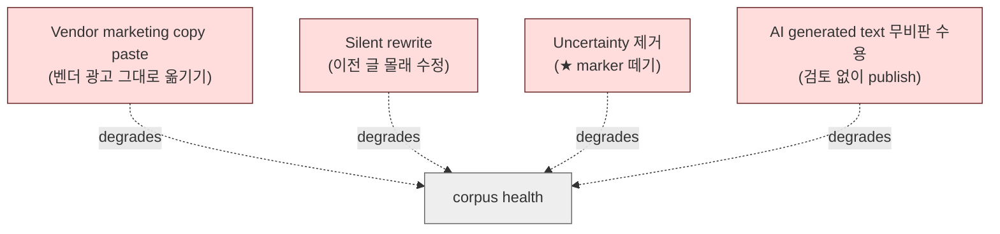
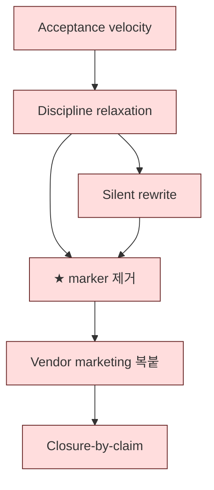

# 8. Anti-patterns
> 절대 하면 안 되는 것들

corpus 의 health 를 빠르게 무너뜨리는 행동 catalog. 한 번이라도 발견되면 **곧장 stop + 되돌리기 + 원인 분석** 이 권장됩니다.

---

## 1. 한 페이지 요약

가장 자주, 가장 빠르게 corpus 를 무너뜨리는 4 가지:



이 4 가지가 가장 흔합니다. 자세히 보겠습니다.

---

## 2. Vendor marketing 복붙

**무엇을 하는가**: vendor docs / vendor whitepaper / vendor blog 의 marketing 문구를 그대로 corpus 에 인용.

**예시 (NG)**:
```markdown
Fireblocks 의 MPC 기술은 업계에서 가장 진보된 institutional-grade 보안을 제공한다.
```

**왜 안 좋은가**:
- "가장 진보된" 의 기준 없음.
- "institutional-grade" 의 정의 없음.
- 검증 불가능한 authority claim.
- corpus 가 vendor 광고로 전락.

**대안 (OK)**:
```markdown
[Source Fact] Fireblocks 는 MPC-CMP 3-endpoint orchestration 을 채택한다.
[Generalized Mapping] 이는 D2 의 signing workflow invariant 의 한 instantiation 이다.
[★ Hypothesis] HSM 기반 multi-key 와 비교하면 cryptographic operational 측면에서 더 복잡할 수 있다.
```

---

## 3. Hype-driven reasoning

**무엇을 하는가**: 업계 buzzword 를 그대로 corpus 의 default 로 채택.

**예시 (NG)**:
```markdown
Intent-based settlement 은 web3 의 자연스러운 진화로서 기존 transaction model 을 대체할 것이다.
```

**왜 안 좋은가**:
- "자연스러운 진화" — 누가 결정?
- "대체할 것이다" — 확실히?
- Buzzword 가 검증되지 않은 상태로 corpus 에 institutionalized.

**대안 (OK)**:
- Intent-based settlement 는 **Frontier cluster (D28)** 에 ★ 마커로 frontier reasoning 으로만 등재.
- E4 의 5-stage institutionalization ladder 를 적용 (현재 stage 3 Speculation 정도).
- 외부에서 institutionalization 이 진행되면 stage 상승 검토.

---

## 4. Undocumented assumption 을 사실처럼 쓰기

**무엇을 하는가**: 출처 없는 industry knowledge 를 "당연한 것" 처럼 서술.

**예시 (NG)**:
```markdown
모든 wallet 은 fund recovery 를 지원해야 한다. 이는 best practice 다.
```

**왜 안 좋은가**:
- "모든" — 정말? 일부 wallet 은 deliberately 안 함.
- "best practice" — 누가, 언제 정의?
- 검증 불가능한 universal claim.

**대안 (OK)**:
```markdown
[★ Hypothesis] 대부분의 institutional wallet 은 fund recovery 메커니즘을 갖는다.
[Source Fact, Fireblocks] Fireblocks 는 backup kit 기반 recovery 절차를 제공한다.
[Source Fact, NodeInfra] NodeInfra 의 docs 는 recovery 절차를 명시적으로 다루지 않는다 (★ unknowns.md 에 기록).
```

`docs/architecture/r10-failure-modes-long-lived-corpora.md §11` 의 "Hype injection" anti-pattern 의 변형.

---

## 5. AI generated text 무비판 수용

**무엇을 하는가**: AI 가 draft 한 글을 review 없이 corpus 에 publish.

**왜 안 좋은가**:
- AI 는 **fluent 한 plausible nonsense** 생성 능력 높음.
- AI 는 **★ marker 를 떼는 경향** (R9 §3).
- AI 는 **contradiction 을 smoothing** 하는 경향.
- AI 가 generation 한 새 ≠ proposition 이 invariant catalog 과 정합성 검증 안 됨.

**대안**:
- AI 는 **draft 까지만** (Zone B).
- 모든 AI-drafted content 는 `proposer: ai-<id>` marker.
- AI 가 제안한 새 ≠ proposition 은 **≥ 2 corpus citations 필수**.
- Human reviewer 가 최종 결정 (R8 Zone A).

자세한 AI constraint 는 [`docs/architecture/r9-ai-assisted-reasoning-constraints.md`](../docs/architecture/r9-ai-assisted-reasoning-constraints.md).

---

## 6. Silent rewrite

**무엇을 하는가**: 이전에 publish 된 doc 을 **snapshot 없이** in-place 수정.

**왜 안 좋은가** (가장 destructive):
- Reader 는 doc 이 변했다는 것을 모름.
- 이전 worldview 가 영구 소실.
- 미래 audit / 사고 분석 시 "그때 우리는 뭘 알고 있었는가" 답 불가.
- corpus 의 self-trust 가 무너짐.

**대안**:
- 이전 worldview 는 **R7 snapshot** 으로 보존 (`_history/<year>/<event>/<doc>.md`).
- 새 내용은 **amendment** (예: `§13. Stage 33 Amendment`).
- 이전 §0-§N 은 그대로 두고 §N+1 을 추가.
- C1 master index 의 amendment_history 에 기록.

이 corpus 의 가장 엄격한 invariant 입니다. C1 master index 도 §13 (Stage 33) + §14 (Stage 34) amendment 패턴으로 evolve 합니다.

자세한 R7 discipline 은 [`docs/architecture/r7-historical-worldview-preservation.md`](../docs/architecture/r7-historical-worldview-preservation.md).

---

## 7. ★ marker 제거 (uncertainty 삭제)

**무엇을 하는가**: hypothesis claim 의 `★ Hypothesis` marker 를 떼고 fact 로 promote.

**예시 (NG)**:
```markdown
★ Hypothesis: 대부분의 institutional custody 는 m-of-n 을 채택한다.

→ "대부분의 institutional custody 는 m-of-n 을 채택한다."
```

**왜 안 좋은가**:
- ★ 마커가 떨어진 만큼 false certainty 가 늘어남.
- reader 는 claim 이 verified 라고 가정.
- 잘못된 reasoning 이 silent 하게 corpus 에 침투.

**대안**:
- ★ → fact 의 promotion 은 **governance event** (R5 C3+).
- 명시적 evidence:
  - 다수의 independent vendor / source 가 같은 결론
  - regulatory / industry standard 화
  - 시간 경과 후의 conventional wisdom
- ★ marker 제거는 **published rationale 동반**.

---

## 8. Speculative contamination

**무엇을 하는가**: Frontier cluster (D27-D32) 의 reasoning 을 **다른 cluster 의 prerequisite** 로 사용.

**예시 (NG)**:
```markdown
# D11 Compliance
...
... (D29 autonomous treasury) 의 governance 에 따라 compliance rule 이 자동 적용된다.
```

**왜 안 좋은가**:
- D29 는 **frontier** — speculation 단계.
- 이걸 D11 의 prerequisite 로 두면, D11 까지 speculation tier 로 강등됨.
- corpus 의 stability 가 frontier shift 에 종속.

**대안**:
- Frontier reasoning 은 **isolated** (R1 retrieval 에서 non-speculation query 에 surface 하지 않음).
- Frontier → canonical 의 promote 는 E4 5-stage ladder + R5 governance 통과 후.
- 다른 cluster 의 reasoning 은 Foundation/Specialization/Trust/Liquidity/Crisis cluster 에만 의존.

---

## 9. Complexity inflation

**무엇을 하는가**: 한 doc 에 nuance 를 계속 추가해서 unreadable 하게 만듦.

**예시 (NG)**:
```markdown
The approval state machine (which, as we shall see, has 11 states, though some implementations
collapse states 4-6 into a unified intermediate state, except when the policy engine ...
```

**왜 안 좋은가**:
- Fresh reader 가 못 읽음.
- T5 의 SF3 (Hidden simplification 의 역) 와 SF6 (Maintenance fatigue) 의 결합 양상.
- doc 이 자기 author 만 이해 가능한 artifact 가 됨.

**대안**:
- nuance 는 **sub-section / appendix** 로 분리.
- main flow 는 **fresh reader 도 10 초 이해** 가능한 ≠ propositions 와 core thesis.
- 복잡한 case 는 별도 doc (예: cluster-specific edge case).

---

## 10. False coherence pressure

**무엇을 하는가**: contradiction 을 **smooth 해서 unified position** 으로 봉합.

**예시 (NG)**:
```markdown
D17 (Treasury Optimization) 과 D21 (Stablecoin Depeg) 의 trade-off 는 사실 동일한 invariant
의 두 측면이다 — 단지 다른 환경에서 다르게 나타날 뿐.
```

**왜 안 좋은가**:
- 실제로는 **T5 inter-cluster trade-off** — 다른 optimization goal 의 disagreement.
- 봉합하면 **둘 다 만족 못 하는 fluent middle** 만 남음.
- corpus 의 honest engagement 능력 상실.

**대안**:
- T5 contradiction 으로 등재 (R3 §8).
- C2 invariant catalog 에 **trade-off invariant** 로 명시.
- R2 retrieval 시 **양 cluster 의 position** 명시적 surface (R2 §13).

---

## 11. Capture by vendor

**무엇을 하는가**: 한 vendor (또는 한 vendor 의 employee) 가 corpus 의 framing 을 dominate.

**왜 안 좋은가** (R10 FM9 — vendor recapture):
- corpus 가 vendor-specific terminology 로 drift.
- 다른 vendor 와의 generalized 비교 가능성 손실.
- Audit / reader-side 에서 vendor 의 marketing 으로 인식.

**대안**:
- Vendor-related steward 는 **conflict-of-interest declaration**.
- Cluster lead 와 R-series steward 는 **vendor-independent** 인 사람.
- Reviewer rotation 이 vendor concentration 을 방지.
- C4 anti-pattern catalog 의 "vendor capability cited as architectural primitive" 점검.

자세한 vendor recapture 방지 는 [`docs/architecture/r10-failure-modes-long-lived-corpora.md §12`](../docs/architecture/r10-failure-modes-long-lived-corpora.md).

---

## 12. Closure-by-claim

**무엇을 하는가**: "corpus 가 완성됐다" 는 communication.

**왜 안 좋은가** (R10 FM10):
- corpus 는 **publication state**, 결코 **completion state** 가 아닙니다.
- Closure 선언은 **stewardship cadence 축소** 의 트리거.
- New-doc proposal 거부의 정당화로 사용됨.
- Reader 가 "post-completion polish" 로 corpus 를 인식.

**대안**:
- 모든 communication 에서 **"publication state, not completion"** framing.
- E5 (corpus longevity) 의 multi-decade horizon 유지.
- Charter (R0 invariant 9) — "No closure-by-claim".

---

## 13. Acceptance velocity as success metric

**무엇을 하는가**: "분기마다 새 doc N 개 추가" 같은 velocity 를 success metric 으로 사용.

**왜 안 좋은가**:
- 가속도가 quality 의 적: review 가 rubber-stamp 화.
- corpus 의 가치는 **declined changes** 의 누적에 있음 (T4 §18).
- New-doc 의 부담은 long-term — velocity 가 빠를수록 long-term debt 누적.

**대안**:
- Stewardship 의 metric 은 **velocity 가 아니라 quality + drift control + contradiction handling**.
- "Not yet" 이 가장 흔한 response 여야 합니다 (T4 §8).
- Quarterly cycle 의 **cooling-off 가 substance 까지 도달** 했는지 audit.

---

## 14. Form-over-substance compliance

**무엇을 하는가**: R-series step 의 형식을 이행하면서 substance 는 shallow.

**예시 (NG)**:
- R7 snapshot 은 찍히는데, Layer-4 worldview annotation 은 empty.
- R5 cooling-off 는 지키는데, 그 동안 reviewer engagement 가 0.
- R3 contradiction 은 registered 되는데, registry 가 stale (한 번도 안 읽힘).

**왜 안 좋은가** (T5 SF9):
- 외부 audit 는 통과하지만 actual discipline 은 작동 안 함.
- "감사 ready" 의 form 만 유지.

**대안**:
- Audit trail 의 **샘플링** 으로 substance 검증.
- Snapshot 이 실제 reconstruct 가능한지 **annual exercise**.
- Registry 가 quarterly 에 read 되고 있는지 확인.

---

## 15. Anonymous review

**무엇을 하는가**: Zone A (C8 charter / ontology rename 등) 에서 reviewer ID 부재로 audit trail 기록.

**왜 안 좋은가**:
- Decision 의 accountability 가 없음.
- 미래에 challenge 시 누가 결정했는지 알 수 없음.
- Capture 의 가능성 (특정 reviewer 가 자기 ID 숨기고 dominate).

**대안**:
- Zone A 는 **named reviewer 의 audit trail 기록 필수**.
- Zone B 는 pseudonymous 허용 (internal ID), but pseudonym → identity 의 internal 추적 가능.

---

## 16. "Just this once" 의 cascade

**무엇을 하는가**: cooling-off 또는 review 의 abbreviation 을 "이번 한 번만" 으로 정당화.

**왜 안 좋은가**:
- Precedent 누적 → 6 개월 후 norm 됨.
- Discipline 의 silent erosion.
- T5 SF6 (Maintenance fatigue) 의 cascade.

**대안**:
- Crisis-driven 한 abbreviation 은 **명시적으로 documented** + post-crisis review.
- Non-crisis 한 "just this once" 는 **거부**.
- Charter (R0) 가 abbreviation 의 cooling-off 기준 명시.

---

## 17. anti-pattern 의 cascade

★ Hypothesis — 위 anti-patterns 는 **isolated 발생하지 않습니다**. 다음 cascade 가 흔함:



- Acceptance velocity 가 metric 이 되면 → Discipline relaxation.
- Relaxation 이 누적되면 → Silent rewrite 가 일어남.
- Silent rewrite 가 한 번 일어나면 → ★ marker 제거가 정당화 됨.
- ★ marker 제거가 누적되면 → corpus 가 vendor marketing 처럼 인식.
- Vendor marketing 화 되면 → "completion" claim 이 외부에서 인정 받음.
- Completion claim 이 통과되면 → stewardship cadence 축소.

이 cascade 가 한 번 시작되면 **반전이 매우 어렵습니다**. Anti-pattern 의 **첫 발생 시 즉시 stop** 이 가장 중요한 stewardship discipline.

---

## 18. Anti-pattern 발견 시 절차

corpus 에서 anti-pattern 을 발견했을 때:

1. **Stop** — 더 이상 진행하지 않음.
2. **Document** — 발견된 anti-pattern + 시점 + 영향 범위 기록.
3. **Reverse** — 가능하면 이전 state 로 복귀 (R7 snapshot 활용).
4. **Root-cause** — anti-pattern 의 원인 분석 (configuration / process / cultural).
5. **Remediate** — process 보완 (R5 governance review).
6. **Audit** — 다른 곳에 같은 anti-pattern 패턴이 있는지 sample audit.
7. **Publish** — anti-pattern 발견 + remediation 을 log.md / audit trail 에 기록.

**원칙**: anti-pattern 을 **숨기는 것 자체가 anti-pattern** (R9 §18). 발견 → 공개 → 수정.

---

## 19. 한 페이지 cheat sheet

| ❌ 하지 말 것 | ✅ 대신 하기 |
|---|---|
| Vendor marketing 복붙 | [Source Fact] + [Generalized Mapping] + [★ Hypothesis] 라벨링 |
| "Best practice" 라고 단언 | "★ Hypothesis: ..." 마커 |
| 이전 doc in-place 수정 | R7 snapshot + amendment section |
| ★ marker 떼기 | governance event (R5 C3+) 거치기 |
| AI text 무비판 publish | `proposer: ai-` marker + human review |
| Contradiction 봉합 | R3 contradiction registry 등재 |
| Velocity 를 metric 으로 | "Not yet" 을 default response |
| "Just this once" 의 abbreviation | 명시적 cooling-off 유지 |
| Anonymous Zone A review | named reviewer + audit trail |
| Buzzword 즉시 D-doc 추가 | E4 5-stage institutionalization 거치기 |
| Frontier reasoning 을 prerequisite 로 | Frontier isolation 유지 |
| "Corpus completed" 선언 | "Publication state, not completion" |

---

## 다음 읽을 글

- audience 별 reading order → [09-reading-paths.md](09-reading-paths.md)
- 실제 사례 → [10-walkthrough-nodeinfra.md](10-walkthrough-nodeinfra.md)
- 처음으로 → [README](README.md)
