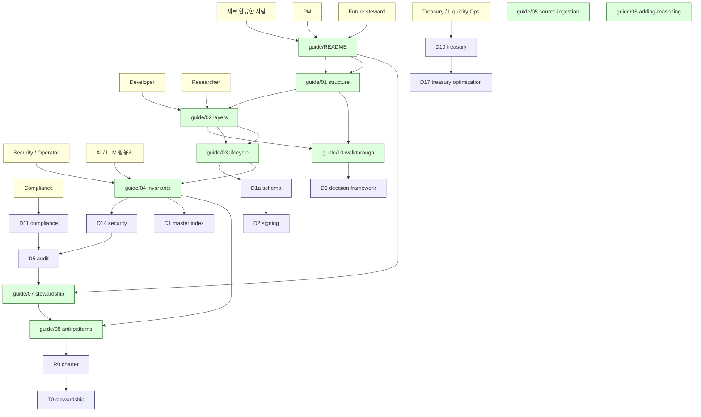

# 9. Reading Paths
> 독자별 추천 reading 순서

corpus 는 누구를 위해서도 동시에 작성되지 않습니다. **각 audience 별로 다른 entry point** 가 필요합니다.

이 문서는 [`docs/architecture/c5-audience-reading-paths.md`](../docs/architecture/c5-audience-reading-paths.md) 와 일관성을 유지하면서, **guide 와 docs/architecture 양쪽을 어떻게 navigate** 할지 정리합니다.

---

## 1. Reader navigation map (한 페이지)

---

## 2. 처음 합류한 사람 (New joiner)

**목표**: 30 분 안에 corpus 의 전체 구조와 운영 원칙 이해.

| 순서 | 문서 | 시간 |
|------|------|------|
| 1 | [guide/README](README.md) | 5 분 |
| 2 | [guide/01-repository-structure](01-repository-structure.md) | 5 분 |
| 3 | [guide/02-corpus-layers](02-corpus-layers.md) | 10 분 |
| 4 | [guide/10-walkthrough-nodeinfra](10-walkthrough-nodeinfra.md) | 10 분 |

**핵심 mental model**:
- D/C/E/R/T 5 layer
- Source ≠ Reasoning
- ≠ propositions

이 시점에서 어떤 D-doc 이 자기 관심사인지 알게 됩니다.

---

## 3. PM (Product Manager)

**목표**: corpus 를 활용해서 새 시스템 design 또는 vendor 비교.

| 순서 | 문서 | 무엇을 얻나 |
|------|------|------------|
| 1 | [guide/README](README.md) | 전체 framing |
| 2 | [guide/01-repository-structure](01-repository-structure.md) | repository 지도 |
| 3 | [guide/10-walkthrough-nodeinfra](10-walkthrough-nodeinfra.md) | 실제 ingestion 사례 — PM-actionable extraction |
| 4 | [D6 3-way custody decision framework](../docs/architecture/three-way-custody-decision-framework.md) | 3-way 비교 framework |
| 5 | [sources/nodeinfra/source-notes/pm-db-design-notes.md](../sources/nodeinfra/source-notes/pm-db-design-notes.md) | DB 설계 패턴 + PM checklist |
| 6 | [guide/05-source-ingestion](05-source-ingestion.md) | 새 vendor 추가 절차 |

**Bonus** (관심사별):
- 새 vendor 비교 → [guide/05](05-source-ingestion.md) + sources/fireblocks + sources/nodeinfra
- 새 reasoning 추가 검토 → [guide/06](06-adding-reasoning.md)

**핵심 산출물 (PM 이 corpus 에서 추출 가능한 것)**:
- 3-way 비교 자료 (SaaS / Hosted MPC / Direct-build)
- Vendor 별 architecture mapping
- PM-actionable design template (T1-T5 from vendor-specific-patterns.md)
- DB schema 패턴 (NEVER STORE / APPEND-ONLY / SET-ONCE 분류)
- Operational burden 추정 (★ Hypothesis)

---

## 4. Developer

**목표**: 시스템 implementation 시 corpus 의 reasoning 을 reference.

| 순서 | 문서 | 무엇을 얻나 |
|------|------|------------|
| 1 | [guide/02-corpus-layers](02-corpus-layers.md) | D-series 의 cluster 구조 |
| 2 | [guide/03-reasoning-lifecycle](03-reasoning-lifecycle.md) | source → reasoning 흐름 |
| 3 | [D1a vault/wallet/ledger schema](../docs/architecture/vault-wallet-ledger-db-schema.md) | DB schema reasoning |
| 4 | [D2 signing workflow](../docs/architecture/signing-workflow-orchestration.md) | signing state machine |
| 5 | [D3 approval state machine](../docs/architecture/approval-state-machine-governance.md) | approval state machine |
| 6 | [D5 audit / event sourcing](../docs/architecture/audit-event-sourcing-evidence-chain.md) | evidence chain |
| 7 | 관심 영역의 D-doc |

**Bonus** (도메인별):
- Multi-chain integration → [D9](../docs/architecture/multi-chain-adapter-pattern.md)
- Security implementation → [D14](../docs/architecture/security-threat-model-adversarial-resilience.md)
- API design → [sources/nodeinfra/normalized/docs/dev__architecture.md](../sources/nodeinfra/normalized/docs/dev__architecture.md)

**Developer 가 자주 reference 하는 패턴들**:
- 4 state machine 분리 (Transaction / Approval / Signing / Broadcast — D1a, D2, D3, D8)
- Append-only invariant (D5)
- Idempotency 가 mandatory 인 이유 (D2)
- 2-layer audit (D5 + NodeInfra 사례)

---

## 5. Security / Operator

**목표**: threat model, audit chain, operational discipline 이해.

| 순서 | 문서 | 무엇을 얻나 |
|------|------|------------|
| 1 | [guide/04-invariants-and-discipline](04-invariants-and-discipline.md) | trust boundary 의 의미 |
| 2 | [D14 security threat model](../docs/architecture/security-threat-model-adversarial-resilience.md) | 14+ trust boundaries |
| 3 | [D5 audit / evidence chain](../docs/architecture/audit-event-sourcing-evidence-chain.md) | audit 와 logging 의 차이 |
| 4 | [D12 operational maturity / incident command](../docs/architecture/operational-maturity-incident-command.md) | incident response framework |
| 5 | [D4 recovery ceremony](../docs/architecture/recovery-ceremony-generalization.md) | recovery 의 ceremony 측면 |
| 6 | [D26 custody failure generalization](../docs/architecture/custody-failure-generalization.md) | failure cascade |
| 7 | [guide/07-stewardship](07-stewardship.md) | stewardship cadence |

**Bonus** (specific concerns):
- HSM / TEE 비교 → [sources/nodeinfra/normalized/docs/security__keys__hsm.md](../sources/nodeinfra/normalized/docs/security__keys__hsm.md) + [security__keys__tee-enclave.md](../sources/nodeinfra/normalized/docs/security__keys__tee-enclave.md)
- Tenant isolation → [D14 §tenant boundary](../docs/architecture/security-threat-model-adversarial-resilience.md) + [NodeInfra tenant](../sources/nodeinfra/normalized/docs/security__architecture__tenant.md)
- Real-time vs forensic evidence → [D5 §Layer 1 / Layer 2](../docs/architecture/audit-event-sourcing-evidence-chain.md)

---

## 6. Compliance Officer

**목표**: compliance engine, regulatory mapping, audit reporting.

| 순서 | 문서 | 무엇을 얻나 |
|------|------|------------|
| 1 | [guide/02-corpus-layers](02-corpus-layers.md) §2 Foundation cluster | 위치 확인 |
| 2 | [D11 compliance / AML / sanctions](../docs/architecture/compliance-aml-sanctions-boundary.md) | compliance 의 boundary |
| 3 | [D24 regulatory reporting / audit interface](../docs/architecture/regulatory-reporting-audit-interface.md) | reporting framework |
| 4 | [D16 identity / KYT / counterparty graph](../docs/architecture/identity-kyt-counterparty-graph.md) | KYC 와 identity |
| 5 | [sources/nodeinfra/normalized/docs/compliance__decision-lifecycle.md](../sources/nodeinfra/normalized/docs/compliance__decision-lifecycle.md) | 10 rule types + 결정 lifecycle |
| 6 | [sources/nodeinfra/normalized/docs/compliance__regulations__travel-rule.md](../sources/nodeinfra/normalized/docs/compliance__regulations__travel-rule.md) | Travel Rule implementation 예시 |

**Bonus** (regulatory regime):
- 한국 (특금법 / EFTA / VACPA) → [NodeInfra compliance/regulations/*](../sources/nodeinfra/normalized/docs/) 
- FATF R.16 (Travel Rule) → [travel-rule.md](../sources/nodeinfra/normalized/docs/compliance__regulations__travel-rule.md)
- E2 regulatory evolution → [E2](../docs/architecture/e2-regulatory-sovereign-evolution.md)

---

## 7. Treasury / Liquidity Operator

**목표**: treasury 운영, liquidity coordination, cross-institution.

| 순서 | 문서 | 무엇을 얻나 |
|------|------|------------|
| 1 | [D10 treasury / reserve / mint-burn](../docs/architecture/treasury-reserve-mint-burn.md) | stablecoin treasury 패턴 |
| 2 | [D17 treasury optimization / capital efficiency](../docs/architecture/treasury-optimization-capital-efficiency.md) | optimization 의 survivability boundary |
| 3 | [D18 clearing / prime brokerage / omnibus](../docs/architecture/clearing-prime-brokerage-omnibus.md) | omnibus 패턴 |
| 4 | [D19 internal netting / settlement](../docs/architecture/internal-netting-settlement.md) | internal liquidity compression |
| 5 | [D20 cross-institution liquidity coordination](../docs/architecture/cross-institution-liquidity-coordination.md) | cross-institution |
| 6 | [D25 systemic liquidity freeze](../docs/architecture/systemic-liquidity-freeze.md) | crisis 시나리오 |

---

## 8. Researcher

**목표**: corpus 의 reasoning 구조, evolution thesis, frontier boundary 이해.

| 순서 | 문서 | 무엇을 얻나 |
|------|------|------------|
| 1 | [guide/02-corpus-layers](02-corpus-layers.md) | 5 layer 의 framing |
| 2 | [guide/03-reasoning-lifecycle](03-reasoning-lifecycle.md) | 작업 lifecycle |
| 3 | [guide/04-invariants-and-discipline](04-invariants-and-discipline.md) | 운영 원칙 |
| 4 | [C1 master corpus index](../docs/architecture/c1-master-corpus-index.md) | 전체 navigation |
| 5 | [C2 invariant catalog](../docs/architecture/c2-invariant-catalog.md) | 200+ ≠ propositions |
| 6 | [C3 dependency graph](../docs/architecture/c3-dependency-graph.md) | doc 간 관계 |
| 7 | [E1-E5 evolution thesis](../docs/architecture/) | evolution 의 5 가지 driver |
| 8 | [C6 open questions / frontier boundary](../docs/architecture/c6-open-questions-frontier-boundary.md) | resolved / unresolved |
| 9 | 관심 frontier doc (D27-D32) |

**Bonus** (research-specific):
- Frontier domain 의 maturity 추적 → [E4 frontier integration discipline](../docs/architecture/e4-frontier-integration-discipline.md)
- Corpus 자체에 대한 reasoning → [E5 corpus longevity / knowledge survivability](../docs/architecture/e5-corpus-longevity-knowledge-survivability.md)
- AI / automation pressure → [E3 AI / automation evolution pressure](../docs/architecture/e3-ai-automation-evolution-pressure.md)

---

## 9. Future steward

**목표**: corpus 의 운영 인계 받기 + steward role 수행.

전체 다 읽어야 하지만, 우선순위:

| 순서 | 문서 | 우선순위 |
|------|------|---------|
| 1 | [guide/README](README.md) | 필수 |
| 2 | [guide/01-08 전부](README.md) | 필수 |
| 3 | [R0 charter](../docs/architecture/r0-reasoning-operations-charter.md) | 필수 |
| 4 | [T0 stewardship charter](../docs/architecture/t0-theory-stewardship-charter.md) | 필수 |
| 5 | [R5 evolution governance](../docs/architecture/r5-evolution-governance-model.md) | 필수 |
| 6 | [T5 stewardship failure modes](../docs/architecture/t5-stewardship-failure-modes.md) | 필수 (자기 인식) |
| 7 | [R10 corpus-level failure modes](../docs/architecture/r10-failure-modes-long-lived-corpora.md) | 필수 |
| 8 | [R1-R9, T1-T4](../docs/architecture/) | 중요 |
| 9 | [E1-E5](../docs/architecture/) | 중요 |
| 10 | [C1-C6](../docs/architecture/) | 중요 |
| 11 | 33 개 D-doc | 점진적 |

**필수 first 3 months**:
- 100 개 audit trail entry 리뷰
- Random R7 snapshot 3-5 개 reconstruct exercise
- 전임 steward 와 overlap 기간의 contradiction conversation 참관
- 이 가이드 + R0 + T0 정독

**필수 first year**:
- Quarterly drift report 1-2 회 작성
- 한 cluster 의 cluster lead 보조
- SF1-SF10 의 자기-recognition 연습

---

## 10. AI / LLM 활용자

**목표**: AI 가 corpus 를 reading / synthesis 시 R8 + R9 의 boundary 준수.

| 순서 | 문서 | 우선순위 |
|------|------|---------|
| 1 | [guide/04-invariants-and-discipline](04-invariants-and-discipline.md) | 필수 — ★ marker / Source Fact 라벨 이해 |
| 2 | [guide/08-anti-patterns](08-anti-patterns.md) | 필수 — AI 가 자주 범하는 anti-pattern |
| 3 | [R8 human review boundary](../docs/architecture/r8-human-review-boundary-escalation-criteria.md) | 필수 — Zone A/B/C |
| 4 | [R9 AI-assisted reasoning constraints](../docs/architecture/r9-ai-assisted-reasoning-constraints.md) | 필수 — forbidden actions |
| 5 | [R1 retrieval discipline](../docs/architecture/r1-retrieval-discipline-architecture.md) | retrieval 시 적용 |
| 6 | [R2 corpus reasoning flow](../docs/architecture/r2-corpus-reasoning-flow.md) | reasoning 시 적용 |
| 7 | [R3 contradiction management](../docs/architecture/r3-contradiction-management-discipline.md) | smoothing 금지 |

**AI 가 corpus 사용 시 hard rules**:
- 검색 결과의 ★ marker 보존.
- Citation 없이는 합성 금지.
- Contradiction 봉합 금지.
- 새 reasoning 의 promotion 은 governance event.
- 모든 답변에 6-section template 적용 (R2 §9).

---

## 11. Quick reference: 어떤 문제 → 어떤 문서

| "내가 알고 싶은 것" | 직행 문서 |
|--------------------|----------|
| 이 repository 가 뭐 하는 곳? | [guide/README](README.md) |
| 폴더가 왜 이렇게 많음? | [guide/01](01-repository-structure.md) |
| D2 / D3 / D5 / R5 / T2 이 뭐임? | [guide/02](02-corpus-layers.md) |
| 외부 자료를 어떻게 추가? | [guide/05](05-source-ingestion.md) |
| 새 D-doc 추가하고 싶음 | [guide/06](06-adding-reasoning.md) |
| 운영자가 매주 뭐 함? | [guide/07](07-stewardship.md) §6 |
| 절대 하지 말아야 할 것? | [guide/08](08-anti-patterns.md) |
| 실제 사례 보고 싶음 | [guide/10](10-walkthrough-nodeinfra.md) |
| 처음 합류, 30 분 onboarding | [guide/README](README.md) §6 |
| AI 가 corpus 사용 시 규칙 | R8 + R9 + [guide/08](08-anti-patterns.md) |
| 어느 cluster 에 속하는 글인지 모르겠음 | [guide/02 §8 결정 트리](02-corpus-layers.md) |
| 200+ ≠ propositions 찾고 싶음 | [C2 invariant catalog](../docs/architecture/c2-invariant-catalog.md) |
| doc 간 관계 (prerequisite) | [C3 dependency graph](../docs/architecture/c3-dependency-graph.md) |
| corpus 가 안 풀리는 질문 | [C6 open questions](../docs/architecture/c6-open-questions-frontier-boundary.md) |
| Vendor 비교 (Fireblocks vs NodeInfra) | sources/<vendor>/source-notes/architecture-mapping.md |

---

## 12. 자주 묻는 질문

### Q. 전체 corpus (61 + sources) 를 다 읽어야 하나?
A. 아니오. 자기 audience 의 reading path 만 읽으면 됩니다. 보통 **7-15 doc** 정도 (전체의 10-20%).

### Q. 어떤 순서로 읽어도 되나?
A. **추천 순서를 따르는 것** 이 좋습니다. cluster 간 prerequisite 관계가 있어서, 순서를 바꾸면 understanding gap 이 발생할 수 있습니다. 특히 **Foundation cluster 의 D1a / D2 / D3 / D5** 는 다른 cluster 의 prerequisite.

### Q. Korean 만 읽을 수 있는데?
A. corpus 의 본문 (D/C/E/R/T) 은 영어/한국어 혼용 (concepts in English, explanation in Korean). guide 도 같은 스타일. **NodeInfra source 는 한국어** (vendor 자체가 한국어 docs). **Fireblocks source 는 영어**.

### Q. 시간이 1 시간밖에 없음, 가장 가치 있는 30 분?
A. [guide/README](README.md) + [guide/02 §1-§8](02-corpus-layers.md) + [guide/10](10-walkthrough-nodeinfra.md). 30 분 만에 corpus 작동 원리 + 실제 사용 사례 흡수.

### Q. 시간이 5 분밖에 없음?
A. [guide/README §4](README.md) (4 가지 핵심 원칙) + [guide/02 §1](02-corpus-layers.md) (D/C/E/R/T 한눈에).

---

## 다음 읽을 글

audience 가 정해졌다면 위의 path 를 따라가세요.

audience 가 아직 안 정해졌다면:
- 가장 무난한 path → [guide/01](01-repository-structure.md) → [guide/02](02-corpus-layers.md) → [guide/10](10-walkthrough-nodeinfra.md)
- 가장 빠른 path → [guide/README](README.md) §4 만
