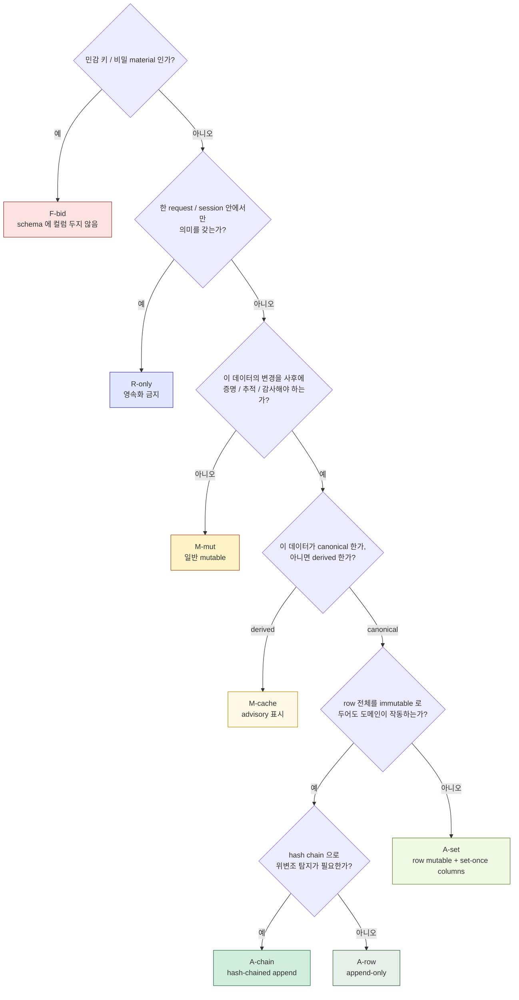

# 01. Principles & Discipline
> Persistence layer 의 운영 규율 — 모든 도메인이 따르는 cross-cutting 원칙

이 문서는 모든 도메인 파일이 가정하는 **persistence 운영 invariant** 와 그 **DB-level enforcement** 방식을 정의합니다. 도메인별 테이블 설계 (02-12) 는 본 문서의 원칙을 그대로 적용합니다.

---

## 1. 7 가지 storage class (mutability profile)

모든 컬럼 / 테이블 / 데이터는 다음 7 개 class 중 하나입니다. Schema 설계 시 각 컬럼이 어느 class 인지 **반드시 명시**.

| Class | 정의 | 강제 방식 |
|-------|------|---------|
| **M-mut** Mutable | 시간에 따라 변경 가능. 변경 이력은 별도 audit table | application-level + audit trigger |
| **M-cache** Derived cache | canonical 로부터 재계산 가능. advisory 표시 | application-level + 정기 reconciliation |
| **A-row** Append-only row | row 자체 변경 / 삭제 금지 | trigger `prevent_mutation_*` |
| **A-set** Set-once column | row 는 mutable 하지만 특정 컬럼은 NULL → 1회 INSERT 후 변경 불가 | trigger `prevent_set_once_mutation_*` + CHECK |
| **A-chain** Hash-chained append | A-row + `prev_hash` / `hash` 컬럼 + 연속성 trigger | trigger `enforce_hash_chain_*` |
| **R-only** Runtime-only | 영속화 자체 금지 — 메모리 / IPC / TEE 안에서만 | schema 에 컬럼 없음 (column absence) |
| **F-bid** Forbidden | 어떤 storage 에도 plaintext 금지 (private key, mnemonic 등) | schema 에 컬럼 없음 + lint + 외부 감사 |

각 도메인 파일의 테이블 정의에서 컬럼마다 위 7 class 중 하나가 명시됩니다.

### 1.1 Storage class decision tree



---

## 2. Append-only 의 DB-level 강제

### 2.1 왜 application-level enforcement 만으로 부족한가

application code 는 evolve. 어떤 시점에 누군가가:

```python
ledger_entry.amount = corrected_amount
db.commit()
```

같은 코드를 추가하면 audit chain 이 즉시 깨진다. 단 한 줄로.

institutional-grade audit 는 **이 한 줄을 DB 가 거절해야** 의미가 있다. 즉:

> append-only 는 **schema 의 속성** 이지 application 의 약속이 아니다.

### 2.2 PostgreSQL 의 enforcement 방식

#### 2.2.1 UPDATE / DELETE trigger

```sql
-- (예시 — 실제 schema 는 도메인별 파일 참조)
CREATE OR REPLACE FUNCTION prevent_mutation_on_ledger_entries()
RETURNS TRIGGER AS $$
BEGIN
  RAISE EXCEPTION 'ledger_entries is append-only (table % row id %)',
    TG_TABLE_NAME, OLD.id
    USING ERRCODE = 'check_violation';
END;
$$ LANGUAGE plpgsql;

CREATE TRIGGER ledger_entries_no_update
  BEFORE UPDATE OR DELETE ON ledger_entries
  FOR EACH ROW EXECUTE FUNCTION prevent_mutation_on_ledger_entries();
```

`A-row` class 의 모든 테이블에 동일 패턴의 trigger 부착. 운영자 계정에서 SQL 직접 실행해도 거절.

#### 2.2.2 Set-once column trigger

```sql
-- approval_decisions.auth_approver_sig 는 NULL → 1회 INSERT 후 변경 불가
CREATE OR REPLACE FUNCTION prevent_set_once_mutation_on_approval_decisions()
RETURNS TRIGGER AS $$
BEGIN
  IF OLD.auth_approver_sig IS NOT NULL
     AND NEW.auth_approver_sig IS DISTINCT FROM OLD.auth_approver_sig THEN
    RAISE EXCEPTION 'auth_approver_sig is set-once on approval_decisions';
  END IF;
  IF OLD.auth_approver_pubkey IS NOT NULL
     AND NEW.auth_approver_pubkey IS DISTINCT FROM OLD.auth_approver_pubkey THEN
    RAISE EXCEPTION 'auth_approver_pubkey is set-once on approval_decisions';
  END IF;
  RETURN NEW;
END;
$$ LANGUAGE plpgsql;
```

#### 2.2.3 Hash chain 연속성 trigger

```sql
-- audit_events.prev_hash 는 직전 row 의 hash 와 일치해야 함
CREATE OR REPLACE FUNCTION enforce_hash_chain_on_audit_events()
RETURNS TRIGGER AS $$
DECLARE
  expected_prev_hash BYTEA;
BEGIN
  SELECT hash INTO expected_prev_hash
    FROM audit_events
   WHERE account_partition = NEW.account_partition
     AND seq = NEW.seq - 1;

  IF NEW.seq = 1 THEN
    IF NEW.prev_hash IS NOT NULL THEN
      RAISE EXCEPTION 'first event of partition must have NULL prev_hash';
    END IF;
  ELSE
    IF expected_prev_hash IS NULL THEN
      RAISE EXCEPTION 'previous event missing for seq %', NEW.seq;
    END IF;
    IF NEW.prev_hash IS DISTINCT FROM expected_prev_hash THEN
      RAISE EXCEPTION 'hash chain broken at seq %', NEW.seq;
    END IF;
  END IF;
  RETURN NEW;
END;
$$ LANGUAGE plpgsql;
```

### 2.3 정정의 유일한 경로 = reversing entry

**`A-row` 테이블의 잘못된 row 를 고치는 방법** 은 단 하나:

1. 잘못된 row 는 **그대로 둔다**.
2. 새 reversing row 를 insert (반대 부호 amount + `reverses_entry_id` FK + 정정 사유).
3. balance 는 SUM 이므로 자동 net-zero.
4. audit 시 두 row 모두 보임 — 사실의 일부.

자세한 reversal pattern 은 [03-ledger-settlement.md](03-ledger-settlement.md) 의 §reversal-entry model 참고.

---

## 3. Set-once column 의 정식 catalog

다음 컬럼들은 **NULL 또는 INSERT-only**. 한 번 non-NULL 로 set 되면 변경 불가.

| 테이블 | 컬럼 | 의미 |
|--------|------|------|
| `approval_decisions` | `auth_approver_sig` | 정책 엔진의 승인 서명 |
| `approval_decisions` | `auth_approver_pubkey` | 승인 서명에 사용된 public key |
| `approval_decisions` | `verdict` | Allow / Held / Deny — 한 번 결정되면 변경 불가 |
| `approval_decisions` | `decided_at` | timestamp |
| `signing_events` | `tx_hash` | chain 의 transaction hash |
| `signing_events` | `signed_payload_hash` | 서명된 payload 의 hash |
| `signing_events` | `enclave_signature` | execution 서명 |
| `signing_events` | `mrenclave_at_signing` | 서명 당시 MRENCLAVE |
| `transactions` | `tx_hash` | chain tx hash |
| `transactions` | `chain_nonce` | tx nonce |
| `transactions` | `raw_payload_hash` | raw tx 의 hash |
| `transactions` | `signed_at` | 서명 완료 시각 |
| `confirmations` | `block_height` | confirmation 시점의 블록 높이 |
| `confirmations` | `block_hash` | block hash |
| `confirmations` | `finalized_at` | finality 도달 시각 |
| `ledger_entries` | 모든 컬럼 | row 자체가 append-only |
| `audit_events` | 모든 컬럼 | row 자체가 append-only + hash chain |
| `recovery_events` | 모든 컬럼 | append-only |
| `policy_change_log` | 모든 컬럼 | append-only |
| `chain_events` | `tx_hash`, `block_height`, `observed_at` | external chain 의 fact 의 mirror |
| `address_first_use` | `address_id`, `first_used_at` | insert-only |
| `initiator_nonce_seen` | 모든 컬럼 | append-only idempotency table |

### 3.1 왜 mutable 하면 안 되는가

- **`tx_hash` mutable** — chain tx 의 identity 가 바뀌면 cross-DB binding (audit ↔ chain) 깨짐. 누구의 tx 였는지 추적 불가.
- **`auth_approver_sig` mutable** — 사후에 누가 승인했는지 재서명 가능 → audit defense 무력화.
- **`verdict` mutable** — Deny 였던 결정을 Allow 로 사후 변경 가능 → 정책 엔진의 의미 무력화.
- **`mrenclave_at_signing` mutable** — 어느 enclave image 가 서명했는지 변조 가능 → TEE attestation 의 의미 무력화.
- **`block_height` mutable** — finality 시점을 사후에 옮길 수 있음 → reorg 정정의 의미 무력화.

각 set-once 컬럼은 **사후 변조 시 무엇이 깨지는지** 가 명확해야 함. 명확하지 않으면 그 컬럼은 set-once 가 아닐 수 있음 (잘못 분류된 case).

---

## 4. Runtime-only 의 금지 catalog

다음 데이터는 **어떤 DB / 파일 / Redis / cache 에도 영속화 금지**. 영속화 시도 자체가 architecture violation.

| Runtime-only data | 어디에 존재해야 하나 |
|-------------------|--------------------|
| MPC partial signature | 메모리 — 서명 완료 후 zeroize |
| 서명 ceremony 의 reconstructed key | 메모리 — 사용 직후 zeroize |
| HSM PKCS#11 session handle | session 안에서만; close 시 무효 |
| TEE enclave 의 ephemeral RSA keypair (provisioning 용) | enclave 내부; 1회 사용 후 폐기 |
| DCAP attestation 의 quote 자체 | session — verify 후 결과 (pubkey) 만 저장 |
| Policy engine 의 pre-computed `EvaluationContext` | 요청 처리 중에만; cache 금지 |
| Reconciliation session 의 중간 계산 dataframe | session 내부 메모리 |
| Mempool watch state (broadcast service) | service 메모리; restart 시 chain 으로부터 재구성 |
| Inter-service IPC session token | TLS session; replay 금지 |

### 4.1 영속화 prohibition 의 enforcement

- **Schema 에 컬럼이 없도록 strict review** — runtime-only data 를 위한 컬럼이 schema 에 생기면 review 거절.
- **Log 에도 금지** — `logger.debug(mpc_partial_sig)` 같은 코드는 lint rule 로 차단.
- **Redis / cache 에도 금지** — application 의 cache key naming convention 으로 검출 가능.
- **Backup 에도 금지** — backup 시점에 메모리 dump 가 포함되지 않도록 backup 절차에 명시.

---

## 5. Forbidden storage 의 금지 catalog

다음은 **어떤 형태든 plaintext 로 저장 금지**. encrypted 라도 plaintext 경유 / unwrap 가능한 곳에 두면 안 됨.

| Forbidden | 정상 위치 |
|-----------|---------|
| Private key (plaintext) | HSM 내부 또는 TEE sealed blob |
| Mnemonic / seed phrase | 운영자 brain / 종이 (HSM PED) |
| Reconstructed key | 메모리 (ceremony 중) → zeroize |
| Raw MPC share (plaintext) | 각 MPC node 의 secure storage (HSM 권장) |
| HSM PIN / activation password | 운영자 brain / hardware token (YubiKey 등) |
| TEE sealing key | hardware-bound — 외부 노출 0 |
| DCAP attestation private key | hardware attestation infrastructure |
| Master KEK plaintext | HSM 내부에서만 — provisioning 시 RSA-OAEP wrap |
| Customer 의 raw PII (regulatory) | 별도 KYC system + 적절한 격리 |
| API key plaintext (응답 후) | 응답 1회 노출; DB 에는 hash 만 |

### 5.1 발견 시 절차

[Source: corpus R7 + R10 anti-patterns]

만약 forbidden data 가 schema / log / backup 에 발견되면:

1. **즉시 quarantine** — 해당 storage 의 access 즉시 차단
2. **Incident command 발동** — 노출 영향 평가 (어떤 키 / 어떤 wallet / 어떤 자금)
3. **Key rotation** — 노출된 키와 연관된 모든 키 rotate (ceremony)
4. **Audit report** — full disclosure
5. **Root-cause** — schema review 강화, lint rule 추가, code review 절차 강화

이는 가장 high-severity incident.

---

## 6. Reversal-entry pattern (정정의 유일한 합법적 방법)

### 6.1 패턴 정의

`A-row` 테이블 (ledger_entries, audit_events 등) 에서 row 가 잘못된 경우:

```
원본 row (절대 수정 / 삭제 안 함):
  ledger_entries (id=42, account=A, amount=+100, ref=W-123)

reversing row (정정의 evidence):
  ledger_entries (id=43, account=A, amount=-100, ref=W-123-reversal,
                  reverses_entry_id=42, reason='operator-confirmed-error',
                  authorized_by=operator-X, reversal_ceremony_id=R-456)

net effect on balance: 0
audit chain: 둘 다 보존 — 무엇이 잘못됐고 어떻게 정정됐는지 명시
```

### 6.2 Reversal row 의 필수 컬럼

`A-row` 테이블에 reversal capability 가 있다면 다음 컬럼이 schema 에 포함:

| 컬럼 | 의미 |
|------|------|
| `reverses_entry_id` | 정정 대상 row 의 PK (NOT NULL — reversal row 의 식별자) |
| `reversal_reason` | 사람이 읽을 수 있는 사유 코드 (enum 또는 free text) |
| `reversal_authorized_by` | 정정 권한자 (운영자 ID) — set-once |
| `reversal_ceremony_id` | 정정 ceremony 의 외부 evidence reference (회의록 등) |
| `reversal_audit_event_id` | 정정 자체의 AuditEvent FK |

원본 row 의 `reverses_entry_id` 는 NULL — 자기는 원본이지 reversal 이 아님.

### 6.3 자동 reversal 금지

- **사람이 결정** — 어떤 row 가 잘못됐는지, 왜 잘못됐는지, 누가 정정하는지 모두 manual.
- **system 이 자동 reversal 발행 금지** — reconciliation Service 가 mismatch 를 발견해도 INVESTIGATING state 에 두고 사람이 reversal authorization.

자세한 ledger reversal 은 [03-ledger-settlement.md](03-ledger-settlement.md) §reversal 참고.

---

## 7. Event ordering 보장

### 7.1 Sequence 보장의 종류

| Sequence guarantee | 어디서 필요 |
|--------------------|-----------|
| **Per-account total order** | `ledger_entries` 의 한 계정 entry 순서; balance 계산에 critical |
| **Per-aggregate total order** | `withdrawal_events` 의 한 withdrawal 의 lifecycle events |
| **Global total order** | `audit_events` — hash chain 의 전제 (per-partition global order) |
| **Causal order** | approval_decisions 가 approval_request 보다 늦게 created |
| **Wall-clock order (advisory)** | timestamp 기반 — synchronization 보장 안 됨, 참고용 |

### 7.2 PostgreSQL 의 enforcement

- **Per-account / per-aggregate ordering**: `seq BIGSERIAL` 컬럼 (per partition / per account) + UNIQUE (partition_key, seq)
- **Global ordering**: hash chain 의 `prev_hash` 가 cryptographically 강제 — 정확한 sequence 위반 시 chain 깨짐
- **Causal order**: FK + `created_at` (advisory) — application 책임

```sql
-- 예: per-account ledger_entries 의 ordering
CREATE TABLE ledger_entries (
  id BIGSERIAL PRIMARY KEY,
  account_id BIGINT NOT NULL REFERENCES ledger_accounts(id),
  seq BIGINT NOT NULL,  -- per-account sequence
  prev_hash BYTEA,
  hash BYTEA NOT NULL,
  ...
  UNIQUE (account_id, seq)
);
```

`seq` 는 application 이 INSERT 시 명시 (concurrent INSERT 의 race 회피 위해 row-lock + last_seq fetch).

---

## 8. Optimistic locking / versioning

### 8.1 사용 위치

`M-mut` class 의 테이블에서, concurrent write race 를 회피해야 할 때:

| 테이블 | Version column | 사용 시점 |
|--------|----------------|---------|
| `ledger_accounts.balance_cached` | `version BIGINT` | balance update 시 (단, balance 는 derived 라 cache update 가 lazy) |
| `withdrawals.state_cached` | `version BIGINT` | state 진행 시 |
| `approval_requests.state` | `version BIGINT` | state 진행 시 |
| `wallets.metadata` | `version BIGINT` | metadata edit 시 |
| `policy_rules` | `version BIGINT` | hot reload 의 race 회피 |

### 8.2 패턴

```sql
-- application code (pseudocode):
SELECT state, version FROM approval_requests WHERE id = $1;
-- ... business logic ...
UPDATE approval_requests
   SET state = 'EVALUATING', version = version + 1
 WHERE id = $1 AND version = $current_version;
-- if 0 rows updated, retry from SELECT
```

또는 PostgreSQL `xmin` 시스템 컬럼 활용 가능. version 컬럼이 명시적이라 추적 쉬움.

### 8.3 Sticky terminal 의 추가 강제

state machine 의 terminal state 는 단방향이므로 optimistic locking 외에 **state transition CHECK** 도 추가:

```sql
CREATE OR REPLACE FUNCTION enforce_approval_state_transition()
RETURNS TRIGGER AS $$
BEGIN
  IF OLD.state IN ('AUTO_APPROVED', 'DENIED', 'EXPIRED', 'CANCELLED')
     AND NEW.state IS DISTINCT FROM OLD.state THEN
    RAISE EXCEPTION 'approval_request % already in terminal state %', OLD.id, OLD.state;
  END IF;
  RETURN NEW;
END;
$$ LANGUAGE plpgsql;
```

---

## 9. Idempotency enforcement

### 9.1 패턴

외부에서 들어오는 모든 요청은 idempotency key 를 가져야 함. DB-level UNIQUE 로 중복 방지.

| 테이블 | Idempotency key | 의미 |
|--------|----------------|------|
| `initiator_nonce_seen` | `(initiator_pubkey, nonce)` | 모든 자금 이동 요청의 dedup |
| `withdrawals` | `reference_id` (UNIQUE) | 외부 caller 가 제공한 idempotency key |
| `internal_transfers` | `reference_id` (UNIQUE) | 같은 |
| `approval_requests` | `payload_hash` (advisory UNIQUE) | 같은 payload 의 중복 요청 검출 |
| `broadcast_attempts` | `(transaction_id, attempt_seq)` | 같은 tx 의 attempt 순서 |
| `chain_events` | `(chain_id, tx_hash, log_index)` | chain event 의 unique identification |

```sql
CREATE TABLE initiator_nonce_seen (
  initiator_pubkey BYTEA NOT NULL,
  nonce BIGINT NOT NULL,
  seen_at TIMESTAMPTZ NOT NULL DEFAULT NOW(),
  request_id UUID NOT NULL,
  PRIMARY KEY (initiator_pubkey, nonce)
);
```

중복 INSERT 시 PostgreSQL 이 거절 (`unique_violation`) → application 이 catch 하여 기존 row 의 `request_id` 반환 (same response).

---

## 10. Hash chain 의 운영 invariant

### 10.1 Layered chain 의 위치

| Chain | 위치 | Granularity |
|-------|------|-------------|
| `ledger_entries` 의 chain | per `account_id` | 한 계정 내 entries 의 순서 + 위변조 탐지 |
| `audit_events` 의 chain | per `account_partition` | 감사 단위 별 (계정 + 도메인 partition) |
| `audit_checkpoints` 의 chain | per `account_partition` | checkpoint 끼리 chain |

### 10.2 Hash 계산

```
entry.hash = SHA-256(
  entry.prev_hash
  ‖ entry.id_bytes
  ‖ entry.canonical_payload_bytes
  ‖ entry.created_at_bytes
)
```

- `canonical_payload_bytes` 는 row 의 의미 있는 모든 필드를 deterministic 순서로 직렬화 (CBOR 권장 — DB native JSON 의 key 순서 비결정성 회피).
- `prev_hash` 가 직전 row 의 `hash` 와 일치해야 chain 연속.
- 첫 row 의 `prev_hash` 는 NULL (또는 zero hash).

### 10.3 TEE-signed checkpoint

주기적 (예: 1 hour 또는 100 entries 마다) 으로 enclave 가 chain head 에 서명:

```sql
CREATE TABLE audit_checkpoints (
  id BIGSERIAL PRIMARY KEY,
  account_partition TEXT NOT NULL,
  last_seq BIGINT NOT NULL,
  chain_head_hash BYTEA NOT NULL,
  enclave_signature BYTEA NOT NULL,
  mrenclave BYTEA NOT NULL,
  signed_at TIMESTAMPTZ NOT NULL,
  ...
  UNIQUE (account_partition, last_seq)
);
```

자세한 evidence chain physical schema 는 [10-audit-evidence-integrity.md](10-audit-evidence-integrity.md) 참고.

---

## 11. Logical deletion 금지 정책

### 11.1 원칙

`A-row` / `A-chain` / `A-set` 테이블에서 logical deletion (예: `deleted_at` 컬럼) 도 **금지**.

이유:
- "deleted" row 도 evidence — 어떤 row 가 무효화됐는지 영구 기록.
- `deleted_at` 컬럼이 mutable 이면 사후에 "다시 살아남" — 정정 의도가 추적 불가.
- Reversal entry 가 logical deletion 의 합법적 대체 — 새 row 가 원본을 "무효화" 하는 명시적 evidence.

### 11.2 `M-mut` 테이블의 deletion

`M-mut` 테이블 (wallets, customers, vaults, policy_rules 등) 도 일반적으로 **soft delete 권장** — `status = 'archived'` enum 으로 처리, 실제 DELETE 는 retention 정책에 따른 archival 시점에만.

```sql
CREATE TYPE wallet_status AS ENUM ('active', 'frozen', 'archived');

ALTER TABLE wallets
  ADD COLUMN status wallet_status NOT NULL DEFAULT 'active';
```

DELETE 가 정말 필요한 case (regulatory 요청 등) 는 별도 ceremony.

---

## 12. Operational invariants enforceable at DB layer (catalog)

다음 invariant 들은 schema / trigger / constraint 로 DB 가 강제. application 의 약속이 아니라 storage 의 속성.

| # | Invariant | 강제 방식 |
|---|-----------|---------|
| 1 | `A-row` 테이블의 UPDATE / DELETE 금지 | trigger |
| 2 | `A-set` 컬럼의 NULL → non-NULL 1회 전환만 허용 | trigger |
| 3 | `A-chain` 의 `prev_hash` 가 직전 row `hash` 와 일치 | trigger |
| 4 | State machine 의 sticky terminal | trigger + CHECK |
| 5 | Idempotency key UNIQUE | UNIQUE constraint |
| 6 | Orphan FK 금지 | FK NOT NULL + ON DELETE RESTRICT |
| 7 | Optimistic locking version 검증 | application UPDATE 시 WHERE version = $old |
| 8 | Per-account sequence UNIQUE | UNIQUE (account_id, seq) |
| 9 | Per-aggregate sequence 의 연속성 | application 책임 + trigger 검증 (옵션) |
| 10 | `chain_events` 의 (chain_id, tx_hash, log_index) UNIQUE | UNIQUE constraint |
| 11 | Reversal entry 의 `reverses_entry_id` 필수 (자신이 reversal 이면) | CHECK 또는 partial index |
| 12 | Hash chain checkpoint 의 `mrenclave` 일관성 | application 책임 + 외부 attestation 검증 |
| 13 | `policy_decisions` 의 `verdict` 변경 불가 | trigger |
| 14 | Forbidden 컬럼 부재 | schema review 시 lint |
| 15 | Runtime-only data 의 schema 부재 | 같은 |

이 15 개 invariant 중 1-13 은 **PostgreSQL native** 로 강제 가능. 14-15 는 schema 단계의 review process 에 의존.

---

## 13. Audit-reviewable schema 의 의미

institutional audit (SOC2, ISMS, KCMVP, 외부 감사관) 의 관점에서 schema 가 audit-reviewable 하려면:

1. **모든 mutable 컬럼은 audit trail 동반** — 변경 시점 / 변경자 / 이전 값 추적 가능
2. **모든 append-only 테이블은 DB-level enforcement** — application code 가 아니라 schema 가 보장
3. **Hash chain integrity 가 외부 검증 가능** — DCAP attestation + signed checkpoint
4. **Cross-DB binding 이 evidence chain 으로 입증** — `request_id`, `tx_hash`, `chain_evidence_ref` 의 trace
5. **Set-once 컬럼이 명시되어 있음** — 어떤 컬럼이 set-once 인지 schema document 에 명시
6. **Runtime-only / forbidden 영역의 schema 부재가 검증됨** — schema diff 만으로 확인 가능
7. **State machine 의 sticky terminal 이 DB 레벨 강제** — 사후 verdict 변경 불가

이 7 개 기준이 충족되면 schema 자체가 audit defense 의 일부가 됨.

---

## 14. 다음 읽을 글

- 첫 도메인: [02-wallet-topology.md](02-wallet-topology.md)
- 가장 복잡한 도메인: [03-ledger-settlement.md](03-ledger-settlement.md)
- Cross-cutting (indexing / retention / hot-cold): [14-cross-cutting-concerns.md](14-cross-cutting-concerns.md)
- DB split 의 근거: [15-db-split-and-postgresql.md](15-db-split-and-postgresql.md)
