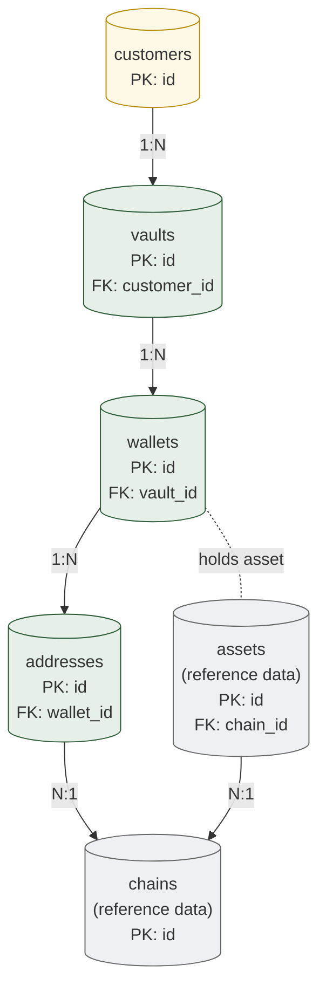

# 02. Wallet Topology
> Customer → Vault → Wallet → Address 의 4-layer 식별 / 격리 persistence

이 도메인은 자금을 담는 **container hierarchy** 를 영속화합니다. 자금 자체는 [03-ledger-settlement.md](03-ledger-settlement.md) 에서, chain-side 주소는 [07-deposit-observation.md](07-deposit-observation.md) 의 chain event 와 연결됩니다.

**Owning DB**: `walletdb`
**Owning service**: Wallet Service (write authority 독점)
**Read-only consumers**: Ledger Service, Approval Service, Reconciliation Service, Provider Mapping Service, Audit Service

---

## 1. PK/FK dependency graph



*Figure 3. Wallet topology PK/FK dependency — 1:N hierarchy + chain/asset reference.*

---

## 2. `customers`

### 2.1 책임

- 자금의 ultimate beneficial owner (institutional 또는 individual 의 representation).
- KYC 결과의 **현재 상태** 보유. KYC 의 변경 이력은 별도 audit trail (audit_events).
- Regulatory reporting / sanctions screening 의 기준 entity.

| 속성 | 값 |
|------|-----|
| Storage class | `M-mut` (current state) + audit trail in `audit_events` |
| Source of truth | `customers` row + audit_events 의 history |
| Mutation authority | Wallet Service (자체 admin endpoint) + KYC integration service |
| Read access | Approval Service, Compliance Service, Reconciliation Service, Audit Service |
| Logical deletion | 금지 — `status='archived'` 로 soft (regulatory retention 의무) |
| Partitioning | N/A (보통 ≤ 수십만 row) |

### 2.2 Schema 제안

| 컬럼 | 타입 | NULL | Class | 의미 |
|------|------|------|-------|------|
| `id` | UUID | NOT NULL | PK | customer identifier — institution 의 stable identifier (vendor migration 후에도 유지) |
| `customer_type` | enum | NOT NULL | `M-mut` | `'institutional'`, `'individual'` |
| `display_name` | TEXT | NOT NULL | `M-mut` | 운영 식별용 (대외 노출 X) |
| `kyc_status` | enum | NOT NULL | `M-mut` | `'pending'`, `'active'`, `'expired'`, `'suspended'`, `'revoked'` |
| `kyc_tier` | enum | NULL | `M-mut` | `'tier1'`, `'tier2'`, `'tier3'` (institution-specific) |
| `jurisdiction` | TEXT | NOT NULL | `M-mut` | ISO 3166-1 alpha-2 (예: `'KR'`, `'US'`); 다른 jurisdiction 으로 변경 시 audit |
| `created_at` | TIMESTAMPTZ | NOT NULL | `A-set` | INSERT 시점 — 변경 불가 |
| `archived_at` | TIMESTAMPTZ | NULL | `A-set` | soft delete; NULL → non-NULL 1회 |
| `status` | enum | NOT NULL | `M-mut` | `'active'`, `'frozen'`, `'archived'` |
| `version` | BIGINT | NOT NULL | `M-mut` | optimistic locking |

PII / sensitive 정보는 별도 KYC system 에 — 본 테이블에는 reference 만 (자세한 PII handling 은 본 reference 의 scope 밖).

### 2.3 핵심 invariant

- `customer_type` 변경은 charter-level event (institution 운영 정책 차원의 결정) — 거의 발생 안 됨. 변경 시 audit trail + manual approval.
- `kyc_status` 변경은 KYC integration service 만이 가능.
- `archived_at` 은 `NULL → 값` 으로 1 회 전환. 다시 `NULL` 로 되돌리기 금지.
- `id` 는 institution 의 stable identifier — vendor 가 바뀌어도 같은 customer 의 ID 는 유지 (vendor migration compatibility 의 anchor).

### 2.4 Indexing

| Index | 목적 |
|-------|------|
| `customers_pkey (id)` | PK |
| `idx_customers_jurisdiction` | regulatory reporting per-jurisdiction |
| `idx_customers_status` | active 만 골라내는 운영 query |
| `idx_customers_kyc_status` | KYC 만료 / 갱신 대상 추적 |

### 2.5 Query pattern

| Query | 사용 service |
|-------|------------|
| `SELECT * FROM customers WHERE id = ?` | 일반 lookup |
| `SELECT * FROM customers WHERE status = 'active' AND kyc_status = 'active'` | approval gate (compliance check) |
| `SELECT id, jurisdiction FROM customers WHERE archived_at IS NULL` | regulatory reporting batch |

### 2.6 PM 리스크 (재확인)

- "Customer = User" 의 conflation — User 는 system user (operator); Customer 는 KYC 의 대상. 다른 entity.
- Institutional vs Individual ambiguous — 처음에 정의 안 하면 후속 KYC scope 가 무너짐. enum 으로 명시.

---

## 3. `vaults`

### 3.1 책임

- Customer 의 자금을 묶는 **회계 / 정책 단위** — 한 customer 가 N vault 보유 가능 (omnibus, segregated, sub-account 등).
- Policy reference 의 owner — vault 별 다른 정책 적용 가능.
- Wallet 의 grouping 단위.

| 속성 | 값 |
|------|-----|
| Storage class | `M-mut` + audit trail |
| Source of truth | `vaults` row |
| Mutation authority | Wallet Service |
| Read access | Approval Service, Ledger Service, Reconciliation Service, Audit Service |
| Logical deletion | 금지 — `status='archived'` (자금이 모두 비어 있는 vault 만 archive 가능) |
| Partitioning | N/A |

### 3.2 Schema 제안

| 컬럼 | 타입 | NULL | Class | 의미 |
|------|------|------|-------|------|
| `id` | UUID | NOT NULL | PK | vault identifier |
| `customer_id` | UUID | NOT NULL | `A-set` | FK customers.id — vault 의 owner 는 변경 불가 |
| `vault_type` | enum | NOT NULL | `A-set` | `'segregated'`, `'omnibus'`, `'house'` — 일단 결정되면 변경 불가 |
| `policy_id` | UUID | NULL | `M-mut` | 이 vault 의 active 정책 reference (NULL 이면 default 정책) |
| `display_name` | TEXT | NOT NULL | `M-mut` | 운영 식별용 |
| `created_at` | TIMESTAMPTZ | NOT NULL | `A-set` | |
| `archived_at` | TIMESTAMPTZ | NULL | `A-set` | |
| `status` | enum | NOT NULL | `M-mut` | `'active'`, `'frozen'`, `'archived'` |
| `version` | BIGINT | NOT NULL | `M-mut` | optimistic locking |

### 3.3 핵심 invariant

- `customer_id` 는 **set-once** — vault 가 customer 간 이전되지 않음. 이전이 필요하면 새 vault 생성 + 자금 이동 (internal_transfer) + 기존 vault archive.
- `vault_type` 은 **set-once** — segregated vault 가 omnibus 로 사후 변경되면 회계 의미 파괴.
- `archived_at IS NOT NULL` 인 vault 는 자금이 모두 0 이어야 함 — application-level + reconciliation 검증.
- 한 customer 의 vault 개수는 application 정책 (예: max 100).

### 3.4 Indexing

| Index | 목적 |
|-------|------|
| `vaults_pkey (id)` | PK |
| `idx_vaults_customer (customer_id, status)` | customer 별 active vault 조회 |
| `idx_vaults_policy (policy_id)` | 한 정책에 묶인 vault 조회 (정책 변경 영향 분석) |

### 3.5 Query pattern

| Query | 사용 service |
|-------|------------|
| `SELECT * FROM vaults WHERE customer_id = ? AND status = 'active'` | customer 의 active vault 목록 |
| `SELECT id FROM vaults WHERE policy_id = ?` | 정책 변경 영향 분석 |

### 3.6 PM 리스크

- **Vault ≠ Wallet** — Vault 는 회계 / 정책 단위, Wallet 은 chain-specific 단위. 합치면 chain 별 다른 정책 적용이 불가능해짐.
- **Vault 이전 금지** — `customer_id` set-once. 이전 시도는 회계 무결성 파괴 가능성 — application 도 거절해야 함.

---

## 4. `wallets`

### 4.1 책임

- Chain-specific 자금 단위 — 한 vault 안에 N wallet (chain 별, asset 별, role 별).
- 주소 발급의 owner — wallet 이 가진 주소들로 자금 수령.
- Wallet type 의 명시 (user / omnibus / gas / cold / settlement).
- Ledger account 와의 1:N 관계 (per-asset ledger account).

| 속성 | 값 |
|------|-----|
| Storage class | `M-mut` + audit trail |
| Source of truth | `wallets` row |
| Mutation authority | Wallet Service |
| Read access | Ledger Service, Approval Service, Signing Service, Chain Adapter, Reconciliation Service, Provider Mapping Service, Audit Service |
| Logical deletion | 금지 — `status='archived'` (자금 0 + 활성 ledger account 0) |
| Partitioning | N/A |

### 4.2 Wallet type 의 정의

다음은 **closed enum** (확장은 schema 변경 + governance):

| Type | 역할 |
|------|------|
| `user` | per-customer / per-wallet 수신 wallet — 일반적으로 가장 많음 |
| `omnibus` | tenant 별 1 개; 사용자 wallet 의 자금이 sweep 되는 hot wallet; 출금의 source |
| `gas` | tenant 별 1 개 (chain 별); chain fee 의 source — native asset (SOL / ETH 등) 만 |
| `cold` | offline storage; long-term reserve; 일반 운영 중 출금 안 함 |
| `settlement` | counterparty 와 정산 전용 wallet (옵션) |

자세한 wallet type 패턴 은 [reference-architecture/aggregates.md](../reference-architecture/aggregates.md) 의 §2.3 참고.

### 4.3 Schema 제안

| 컬럼 | 타입 | NULL | Class | 의미 |
|------|------|------|-------|------|
| `id` | UUID | NOT NULL | PK | wallet identifier |
| `vault_id` | UUID | NOT NULL | `A-set` | FK vaults.id — set-once |
| `chain_id` | TEXT | NOT NULL | `A-set` | FK chains.id — chain 은 set-once |
| `wallet_type` | enum | NOT NULL | `A-set` | `'user'`, `'omnibus'`, `'gas'`, `'cold'`, `'settlement'` — set-once |
| `display_name` | TEXT | NOT NULL | `M-mut` | 운영 식별 |
| `derivation_path` | TEXT | NULL | `A-set` | HD wallet 의 path (해당 chain 이 지원할 경우) |
| `derivation_root_id` | TEXT | NULL | `A-set` | 어느 root key (HSM key id) 에서 파생됐는지 |
| `metadata` | JSONB | NOT NULL | `M-mut` | flexible metadata (tags, customer labels 등) |
| `created_at` | TIMESTAMPTZ | NOT NULL | `A-set` | |
| `archived_at` | TIMESTAMPTZ | NULL | `A-set` | |
| `status` | enum | NOT NULL | `M-mut` | `'active'`, `'frozen'`, `'archived'` |
| `version` | BIGINT | NOT NULL | `M-mut` | optimistic locking |

### 4.4 핵심 invariant

- `vault_id`, `chain_id`, `wallet_type`, `derivation_path`, `derivation_root_id` 는 모두 **set-once** — wallet 의 identity 의 핵심.
- Tenant (= vault parent) 마다 **`wallet_type='omnibus'` 가 정확히 1 개**, **`wallet_type='gas'` 가 chain 별 1 개** — application-level + DB-level partial UNIQUE index 로 강제:
  ```sql
  CREATE UNIQUE INDEX uniq_omnibus_per_vault
    ON wallets (vault_id, chain_id)
    WHERE wallet_type = 'omnibus' AND status != 'archived';
  
  CREATE UNIQUE INDEX uniq_gas_per_vault_chain
    ON wallets (vault_id, chain_id)
    WHERE wallet_type = 'gas' AND status != 'archived';
  ```
- Omnibus / gas wallet 은 **시스템이 tenant bootstrap 시 생성** — SDK 의 wallet 생성 API 는 `user` type 만 허용 (application-level check).
- `archived_at IS NOT NULL` 인 wallet 의 모든 ledger account 잔액은 0 이어야 함.

### 4.5 Indexing

| Index | 목적 |
|-------|------|
| `wallets_pkey (id)` | PK |
| `idx_wallets_vault (vault_id, status)` | vault 의 active wallet 목록 |
| `idx_wallets_chain (chain_id, wallet_type)` | chain 별 / type 별 운영 query |
| `uniq_omnibus_per_vault` | omnibus 단일 제약 |
| `uniq_gas_per_vault_chain` | gas 단일 제약 |

### 4.6 Query pattern

| Query | 사용 service |
|-------|------------|
| `SELECT * FROM wallets WHERE vault_id = ? AND status = 'active'` | vault 의 active wallet 목록 |
| `SELECT id FROM wallets WHERE vault_id = ? AND wallet_type = 'omnibus' AND chain_id = ?` | 해당 chain 의 omnibus lookup |
| `SELECT id FROM wallets WHERE vault_id = ? AND wallet_type = 'gas' AND chain_id = ?` | gas wallet lookup (fee 차감 대상) |

---

## 5. `addresses`

### 5.1 책임

- Chain 상의 string identifier — 한 wallet 이 시간에 따라 N address 보유 (rotation, UTXO).
- 입금 매칭의 anchor — `chain_events.to_address` 와 join.
- Address 의 archive (rotation 후 inactive 화) 표현.

| 속성 | 값 |
|------|-----|
| Storage class | `M-mut` (status 만 변경 가능) + identifier 자체는 `A-set` |
| Source of truth | `addresses` row |
| Mutation authority | Wallet Service + Chain Adapter (rotation 시) |
| Read access | Chain Adapter (입금 매칭), Approval Service, Audit Service, Reconciliation Service |
| Logical deletion | 금지 — `status='archived'`; 이력 보존 |
| Partitioning | N/A 또는 chain_id 별 (chain 별로 매우 다른 cardinality) |

### 5.2 Schema 제안

| 컬럼 | 타입 | NULL | Class | 의미 |
|------|------|------|-------|------|
| `id` | UUID | NOT NULL | PK | address row identifier |
| `wallet_id` | UUID | NOT NULL | `A-set` | FK wallets.id — address 가 다른 wallet 으로 이전 금지 |
| `chain_id` | TEXT | NOT NULL | `A-set` | FK chains.id — wallet 의 chain 과 일치해야 함 (CHECK) |
| `value` | TEXT | NOT NULL | `A-set` | address string (chain native format) — set-once |
| `derivation_index` | BIGINT | NULL | `A-set` | HD wallet 의 index (해당 시) |
| `script_template` | TEXT | NULL | `A-set` | Bitcoin script 또는 contract address scheme (해당 시) |
| `first_seen_at` | TIMESTAMPTZ | NOT NULL | `A-set` | 최초 발급 시각 |
| `last_active_at` | TIMESTAMPTZ | NULL | `M-mut` | 최근 chain event 관찰 시각 (advisory) |
| `archived_at` | TIMESTAMPTZ | NULL | `A-set` | rotation / deprecation 시각 |
| `status` | enum | NOT NULL | `M-mut` | `'active'`, `'archived'` |
| `version` | BIGINT | NOT NULL | `M-mut` | |

### 5.3 핵심 invariant

- `value` (address string) 는 **chain 별 UNIQUE** — 동일 address 가 두 wallet 에 동시 매핑되면 입금 attribution 깨짐:
  ```sql
  CREATE UNIQUE INDEX uniq_address_value_per_chain
    ON addresses (chain_id, value);
  ```
- `chain_id` 가 `wallets.chain_id` 와 일치해야 함 — DB-level CHECK 또는 trigger 로 강제:
  ```sql
  CREATE OR REPLACE FUNCTION enforce_address_chain_match()
  RETURNS TRIGGER AS $$
  DECLARE wallet_chain TEXT;
  BEGIN
    SELECT chain_id INTO wallet_chain FROM wallets WHERE id = NEW.wallet_id;
    IF wallet_chain IS DISTINCT FROM NEW.chain_id THEN
      RAISE EXCEPTION 'address chain_id (%) does not match wallet chain_id (%)',
        NEW.chain_id, wallet_chain;
    END IF;
    RETURN NEW;
  END;
  $$ LANGUAGE plpgsql;
  ```
- `archived_at IS NOT NULL` 인 address 도 schema 에 남음 — 과거 입금 매칭에 필요.

### 5.4 Indexing

| Index | 목적 |
|-------|------|
| `addresses_pkey (id)` | PK |
| `uniq_address_value_per_chain (chain_id, value)` | 입금 매칭 (chain event lookup) |
| `idx_addresses_wallet (wallet_id, status)` | wallet 의 active address 목록 |
| `idx_addresses_active (chain_id) WHERE status = 'active'` | active address 만 (chain adapter 의 polling 대상) |

### 5.5 Query pattern

| Query | 사용 service |
|-------|------------|
| `SELECT wallet_id FROM addresses WHERE chain_id = ? AND value = ?` | chain event → wallet 매칭 (deposit observation) |
| `SELECT value FROM addresses WHERE wallet_id = ? AND status = 'active'` | wallet 의 활성 입금 주소 |
| `SELECT value FROM addresses WHERE chain_id = ? AND status = 'active'` | chain adapter polling 대상 주소 목록 |

### 5.6 Address rotation 정책

Chain 마다 rotation 의 의미 다름:

| Chain | Rotation 권장 |
|-------|--------------|
| Bitcoin / UTXO chains | 매 입금마다 새 address (privacy + UTXO 관리) — `addresses` 가 많아짐 |
| Ethereum / account chains | 일반적으로 같은 address 유지; 정책상 rotation 가능 |
| Solana | 일반적으로 same address; per-token-account 발급은 별도 abstraction |

각 chain 별 정책은 application 의 wallet creation logic 에서 결정. DB schema 는 두 패턴 모두 지원 (1:1 또는 1:N).

---

## 6. `chains` 와 `assets` (reference data)

### 6.1 `chains`

| 컬럼 | 타입 | Class | 의미 |
|------|------|-------|------|
| `id` | TEXT | PK | chain identifier (예: `'bitcoin-mainnet'`, `'ethereum-mainnet'`, `'solana-mainnet'`) |
| `display_name` | TEXT | `M-mut` | |
| `address_format` | enum | `A-set` | `'bitcoin-bech32'`, `'evm-hex'`, `'solana-base58'`, ... |
| `finality_threshold` | INT | `M-mut` | N confirmations (chain protocol 변경 시 update) |
| `finality_threshold_updated_at` | TIMESTAMPTZ | `M-mut` | update 추적 |
| `native_asset_id` | TEXT | `A-set` | FK assets.id — fee asset |
| `fee_model` | enum | `M-mut` | `'fixed'`, `'gas-based'`, `'fee-rate'` |
| `status` | enum | `M-mut` | `'active'`, `'paused'`, `'halted'` |

### 6.2 `assets`

| 컬럼 | 타입 | Class | 의미 |
|------|------|-------|------|
| `id` | TEXT | PK | asset identifier — **반드시 (chain, contract_or_native) tuple 의 직렬화**. 예: `'ethereum-mainnet:usdc'`, `'solana-mainnet:native'` |
| `chain_id` | TEXT | `A-set` | FK chains.id |
| `contract_address` | TEXT | `A-set` | NULL = native asset; non-NULL = chain 의 contract / mint address |
| `symbol` | TEXT | `M-mut` | display 용; 같은 symbol 이 multi-chain 일 수 있음 (예: USDC) |
| `decimals` | INT | `A-set` | asset 의 단위 (Bitcoin 8, Ethereum 18, ...) — set-once (asset 의 정체성) |
| `display_name` | TEXT | `M-mut` | |
| `status` | enum | `M-mut` | `'active'`, `'deprecated'` |

**핵심 invariant**:
- `asset_id` 는 **(chain, contract) 의 tuple** — 동일 symbol 이 multi-chain 에서도 다른 asset.
- `decimals` 는 set-once — 잘못된 decimals 로 등록하면 자금 1조배 mismatch 발생 가능.
- `contract_address` 는 **chain 별 UNIQUE** (native 는 chain 별 1개):
  ```sql
  CREATE UNIQUE INDEX uniq_native_asset_per_chain
    ON assets (chain_id) WHERE contract_address IS NULL;
  
  CREATE UNIQUE INDEX uniq_contract_per_chain
    ON assets (chain_id, contract_address) WHERE contract_address IS NOT NULL;
  ```

### 6.3 Partitioning / archival

`chains`, `assets` 는 reference data — 일반적으로 < 1만 row, partition 불필요.
변경은 governance event (R5 C2-C3) — schema 자체는 stable.

---

## 7. Cross-domain references (FK ownership)

`wallets`, `addresses` 가 다른 domain 의 테이블에서 참조되는 방식:

| 참조 source | 참조 column | 참조 target | 방향성 |
|------------|------------|------------|------|
| `ledger_accounts.wallet_id` | wallet_id | `wallets.id` | Ledger 가 Wallet 참조 |
| `withdrawals.source_wallet_id` | source_wallet_id | `wallets.id` | Withdrawal 이 Wallet 참조 |
| `deposit_observations.matched_wallet_id` | matched_wallet_id | `wallets.id` | Deposit 이 Wallet 참조 |
| `chain_events.matched_address_id` | matched_address_id | `addresses.id` (NULL 가능) | Chain event 가 Address 참조 (매칭된 경우) |
| `provider_external_references.internal_wallet_id` | internal_wallet_id | `wallets.id` | Provider mapping |

핵심: `walletdb` 가 다른 DB 의 참조 대상이 됨 — cross-DB FK 는 DB engine 으로 강제 불가 (PostgreSQL 의 FK 는 same-DB 만). 대안:

- **Application-level integrity**: 참조 시 lookup + 검증
- **Periodic reconciliation**: `ledger_accounts.wallet_id` 가 `wallets.id` 에 존재하는지 정기 확인
- **Orphan alert**: 존재하지 않는 wallet_id 발견 시 alert (drift signal)

자세한 cross-DB 정합성은 [15-db-split-and-postgresql.md](15-db-split-and-postgresql.md) §multi-DB-consistency 참고.

---

## 8. 4-DB split 안에서의 위치

```
walletdb           : 본 도메인 (이 문서)
ledgerdb           : ledger_accounts.wallet_id 로 참조
chaindb            : chain_events.matched_address_id 로 참조
approverdb         : approval_requests 의 payload 안에 wallet_id (FK 아님 — JSON 안의 reference)
auditdb            : audit_events 의 payload 안에 wallet_id
providerdb         : provider_external_references.internal_wallet_id
```

`walletdb` 는 다른 DB 의 **참조 대상** 이지만 다른 DB 를 참조하지 않음 — Wallet Topology 가 의존성의 root.

---

## 9. Retention & archival

| Aggregate | Retention 권장 |
|-----------|---------------|
| `customers` | 영구 보존 (regulatory minimum + safety margin) |
| `vaults` | 영구 보존 |
| `wallets` | 영구 보존 |
| `addresses` | 영구 보존 (과거 chain event 매칭에 필요) |
| `chains` / `assets` | 영구 보존 (reference data) |

archival 의 의미는 row 삭제가 아니라 `status='archived'` 변경 + 운영 대상에서 제외. row 자체는 DB 에 남아 historical query 지원.

---

## 10. Operational considerations

### 10.1 Tenant bootstrap

새 customer / vault 생성 시:

1. `customers` INSERT
2. `vaults` INSERT (customer_id FK)
3. **시스템 자동**: 각 chain 별 `omnibus` wallet + `gas` wallet INSERT
4. (옵션) 각 chain 별 `cold` wallet INSERT — institution 의 자금 정책에 따라

이 부트스트랩은 **단일 transaction 으로 처리** 권장 — 중간 실패 시 일관성 깨짐.

### 10.2 User wallet 생성 (SDK)

```
client.wallets().create(vault_id, chain_id) →
  Wallet Service:
    1. vault 의 customer KYC 상태 확인 (active)
    2. wallets row INSERT (wallet_type='user')
    3. Chain Adapter 에 address 발급 요청
    4. addresses row INSERT
    5. ledger_accounts row INSERT (per-asset 로 lazy 또는 eager — 정책)
    6. AuditEvent 발행
```

이 5-6 step 은 atomicity 가 critical — single transaction.

### 10.3 Wallet freeze (regulatory / incident)

```
UPDATE wallets SET status = 'frozen', version = version + 1
 WHERE id = ? AND version = ?
```

freeze 된 wallet 에서의 모든 outgoing 자금 이동은 application 의 approval 단계에서 차단 (정책 rule).

---

## 11. Anti-patterns

| Anti-pattern | 왜 안 좋은가 |
|--------------|-------------|
| `customers.kyc_status` 를 mutable 로 두고 history 없음 | 누가 / 언제 / 왜 status 바뀌었는지 추적 불가 |
| `wallets.wallet_type` 을 mutable | user wallet 이 사후에 omnibus 로 바뀌면 회계 깨짐 |
| `addresses.value` 를 mutable | 입금 이력의 chain event 매칭이 깨짐 |
| `customer_id` 를 mutable on vaults | vault 의 ownership 이 바뀌면 자금 attribution 무너짐 |
| Address 의 hard delete | rotation 후 archive 된 주소로의 historical 입금 attribute 불가 |
| `wallet_type` 으로 free-form string | typo 로 인한 정책 우회 (예: `'Omnibus'` vs `'omnibus'`) — 반드시 closed enum |
| Omnibus 가 vault 당 N 개 | 회계 model 무너짐 — partial UNIQUE index 로 강제 |

---

## 12. 다음 읽을 글

- 자금 자체의 영속화 → [03-ledger-settlement.md](03-ledger-settlement.md)
- Chain event 의 wallet 매칭 → [07-deposit-observation.md](07-deposit-observation.md)
- Vendor 의 외부 wallet 과의 mapping → [12-provider-mapping.md](12-provider-mapping.md)
- 추상 layer 의 wallet aggregate → [reference-architecture/aggregates.md](../reference-architecture/aggregates.md) §2
