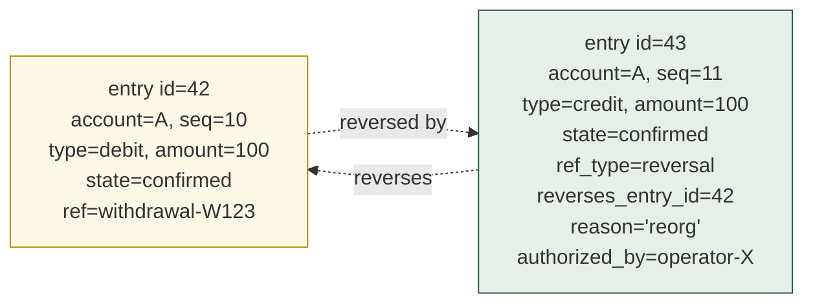

# 03. Ledger & Settlement
> 자금의 source of truth — `ledger_entries` 의 append-only 영속화

이 도메인은 **자금의 canonical 위치** 를 영속화합니다. balance 는 derived (cache); entries 가 진실. 모든 정정은 reversal entry. Internal transfer 와 External (withdrawal) 의 ledger 패턴이 다릅니다.

**Owning DB**: `ledgerdb`
**Owning service**: Ledger Service (write authority 독점)
**Read-only consumers**: Reconciliation Service, Audit Service, Wallet Service (잔액 조회), Approval Service (pre-evaluation balance)

---

## 1. 책임의 범위

| Ledger Service 가 하는 것 | Ledger Service 가 하지 않는 것 |
|-------------------------|-----------------------------|
| `ledger_entries` 의 INSERT (append-only) | chain 서명 (Signing Service 담당) |
| `ledger_accounts` 의 balance cache update | 정책 결정 (Policy Engine 담당) |
| Internal transfer 의 atomic 2-row INSERT | external chain broadcast (Broadcast Service 담당) |
| Withdrawal 의 ledger 동반 (pending → confirmed → reversal) | tx 구성 (Chain Adapter 담당) |
| Reversal entry 발행 (manual 권한자 결정에 따라) | reorg 감지 (Chain Adapter 담당) |
| 잔액 query 응답 | reconciliation 정정 자동 수행 (사람이 결정) |

---

## 2. PK/FK dependency

```mermaid
graph TB
  WALLET[("wallets<br/>(walletdb)")]
  LA[("ledger_accounts<br/>PK: id<br/>FK: wallet_id, asset_id")]
  LE[("ledger_entries<br/>PK: id<br/>FK: account_id<br/>append-only")]
  INT[("internal_transfers<br/>PK: id<br/>FK: src_account_id, dst_account_id")]
  WD[("withdrawals<br/>(this DB)")]
  DEP[("deposit_observations<br/>(this DB)")]
  TX[("transactions<br/>(chaindb)")]

  WALLET -.cross-DB ref.-> LA
  LA -->|1:N| LE
  INT -->|atomic 2-row.- LE
  WD -.creates entries.- LE
  DEP -.creates entries.- LE
  WD -.references.- TX

  classDef external fill:#eef0f3,stroke:#666
  classDef own fill:#e6f0e8,stroke:#2a5a36
  classDef chain fill:#fef9e7,stroke:#b58a00
  class WALLET,TX external
  class LA,LE,INT,WD,DEP own
```

*Figure 4. Ledger 도메인 PK/FK — 모든 자금 변동의 entries 는 단일 테이블에 집중, 정정은 reversal row.*

---

## 3. `ledger_accounts`

### 3.1 책임

- Wallet 의 per-asset 잔액 추적 단위 — 1 wallet × 1 asset = 1 ledger account
- Balance 의 cached view (canonical 은 entries 의 SUM)
- Optimistic locking 의 anchor

| 속성 | 값 |
|------|-----|
| Storage class | `M-cache` (balance_cached) + `M-mut` (status) |
| Source of truth | `ledger_entries` 의 SUM (balance_cached 는 advisory) |
| Mutation authority | Ledger Service 만 |
| Read access | Wallet Service, Approval Service, Reconciliation Service |
| Logical deletion | 금지 — `status='archived'` (balance = 0 일 때만 가능) |
| Partitioning | N/A 또는 wallet_id hash (large institution) |

### 3.2 Schema 제안

| 컬럼 | 타입 | NULL | Class | 의미 |
|------|------|------|-------|------|
| `id` | UUID | NOT NULL | PK | account identifier |
| `wallet_id` | UUID | NOT NULL | `A-set` | cross-DB ref: walletdb.wallets.id |
| `asset_id` | TEXT | NOT NULL | `A-set` | cross-DB ref: walletdb.assets.id |
| `balance_available` | NUMERIC(38,0) | NOT NULL | `M-cache` | 가용 잔액 (pending reserve 제외) — entries SUM 의 cached view |
| `balance_pending` | NUMERIC(38,0) | NOT NULL | `M-cache` | reserved (pending debit) — entries 의 pending SUM |
| `balance_total` | NUMERIC(38,0) | NOT NULL | `M-cache` | available + pending (derived 의 derived; 일부 query 편의용) |
| `last_entry_seq` | BIGINT | NOT NULL | `M-mut` | 마지막 적용 entry 의 seq (재계산 base) |
| `created_at` | TIMESTAMPTZ | NOT NULL | `A-set` | |
| `archived_at` | TIMESTAMPTZ | NULL | `A-set` | balance = 0 시점에만 set 가능 |
| `status` | enum | NOT NULL | `M-mut` | `'active'`, `'frozen'`, `'archived'` |
| `version` | BIGINT | NOT NULL | `M-mut` | optimistic locking |

NUMERIC(38, 0): 정수만 (smallest unit — wei / lamports / satoshi). 절대 `FLOAT` 사용 금지 (자금 계산에서 floating-point error 는 institutional grade 에서 fatal).

### 3.3 핵심 invariant

- `(wallet_id, asset_id)` UNIQUE:
  ```sql
  CREATE UNIQUE INDEX uniq_ledger_account_wallet_asset
    ON ledger_accounts (wallet_id, asset_id);
  ```
- `balance_available >= 0` — DB-level CHECK (음수 잔액 금지; overdraft 는 architecture violation).
  ```sql
  ALTER TABLE ledger_accounts
    ADD CONSTRAINT chk_balance_available_nonnegative
    CHECK (balance_available >= 0);
  ```
- `balance_pending >= 0` — pending 의 음수 의미 없음.
- `balance_total = balance_available + balance_pending` — application 책임 + 정기 reconciliation.
- `balance_cached` 와 entries 의 SUM 이 불일치하면 mismatch — reconciliation 의 발견 대상.

### 3.4 Balance 의 canonical 재계산

application 이 절대 balance 를 잃거나 변조해도, 다음 query 로 canonical 재계산 가능:

```sql
-- balance_available 의 canonical
SELECT COALESCE(SUM(
  CASE
    WHEN entry_type = 'credit' AND state = 'confirmed' THEN amount
    WHEN entry_type = 'debit' AND state = 'confirmed' THEN -amount
    ELSE 0
  END
), 0) AS canonical_balance_available
FROM ledger_entries
WHERE account_id = ? AND reversed_by_entry_id IS NULL;

-- balance_pending 의 canonical
SELECT COALESCE(SUM(amount), 0)
FROM ledger_entries
WHERE account_id = ?
  AND entry_type = 'debit'
  AND state = 'pending'
  AND reversed_by_entry_id IS NULL;
```

정기 reconciliation 이 이 query 와 `ledger_accounts.balance_*` 를 비교 — mismatch 시 reconciliation session 의 finding.

### 3.5 Indexing

| Index | 목적 |
|-------|------|
| `ledger_accounts_pkey (id)` | PK |
| `uniq_ledger_account_wallet_asset (wallet_id, asset_id)` | wallet/asset lookup |
| `idx_ledger_accounts_wallet (wallet_id) WHERE status = 'active'` | wallet 의 active account 목록 |

---

## 4. `ledger_entries`

### 4.1 책임

- 자금의 **canonical event log** — 모든 자금 변동의 atom
- `A-row` (strict append-only) + `A-chain` (per-account hash chain)
- Reversal 의 anchor (자기 row 가 reversal 인지, 자기가 reversal 당했는지)

| 속성 | 값 |
|------|-----|
| Storage class | `A-row` + `A-chain` (per-account) |
| Source of truth | row 자체 (canonical) |
| Mutation authority | Ledger Service 의 INSERT 만 — UPDATE / DELETE 절대 금지 |
| Read access | Wallet Service, Reconciliation Service, Audit Service, Approval Service |
| Logical deletion | 절대 금지 (reversal entry 가 유일한 정정) |
| Partitioning | per-month 또는 per-quarter (시간 기반) — 큰 institution 에 필요 |

### 4.2 Schema 제안

| 컬럼 | 타입 | NULL | Class | 의미 |
|------|------|------|-------|------|
| `id` | UUID | NOT NULL | PK + `A-set` | entry identifier |
| `account_id` | UUID | NOT NULL | `A-set` | FK ledger_accounts.id |
| `seq` | BIGINT | NOT NULL | `A-set` | per-account sequence (hash chain 의 ordering) |
| `entry_type` | enum | NOT NULL | `A-set` | `'credit'`, `'debit'` |
| `amount` | NUMERIC(38,0) | NOT NULL | `A-set` | 항상 양수 (entry_type 으로 부호 표현) |
| `state` | enum | NOT NULL | `A-set` | `'pending'`, `'confirmed'`, `'reversed'` — set-once at insert |
| `ref_type` | enum | NOT NULL | `A-set` | `'deposit'`, `'withdrawal'`, `'internal_transfer'`, `'sweep'`, `'reversal'`, `'fee'` |
| `ref_id` | UUID | NOT NULL | `A-set` | 자기를 만든 aggregate 의 ID (withdrawal_id, deposit_id, internal_transfer_id, ...) |
| `reverses_entry_id` | UUID | NULL | `A-set` | 본 row 가 reversal 이라면, 대상 entry id; 아니면 NULL |
| `reversed_by_entry_id` | UUID | NULL | `A-set`  | 본 row 가 reversal 당했다면 (사후 update 가 아니라, INSERT 시점에 정할 수 없음) — **이 컬럼은 별도 처리** (§4.5) |
| `reversal_reason` | enum | NULL | `A-set` | reversal 일 때만 — `'reorg'`, `'compliance'`, `'operator-error'`, `'manual-correction'` |
| `reversal_ceremony_id` | UUID | NULL | `A-set` | reversal 의 외부 evidence reference |
| `reversal_authorized_by` | UUID | NULL | `A-set` | reversal 권한자 (operator ID) |
| `metadata` | JSONB | NOT NULL | `A-set` | 추가 정보 (chain tx_hash, counterparty, memo 등) |
| `prev_hash` | BYTEA | NULL | `A-set` | per-account hash chain |
| `hash` | BYTEA | NOT NULL | `A-set` | row 의 hash |
| `created_at` | TIMESTAMPTZ | NOT NULL | `A-set` | |
| `created_by_service` | TEXT | NOT NULL | `A-set` | 어느 service 가 발행했는지 (audit) |

### 4.3 `reversed_by_entry_id` 의 처리 (특수 case)

원본 row 는 자기가 사후에 reversal 당했음을 모름. 하지만 query 편의를 위해 reversal lookup 이 필요.

**옵션 A — 컬럼을 별도 view 에 두기** (권장):

```sql
CREATE VIEW v_ledger_entries_with_reversal AS
SELECT
  e.*,
  r.id AS reversed_by_entry_id,
  r.created_at AS reversed_at,
  r.reversal_reason
FROM ledger_entries e
LEFT JOIN ledger_entries r ON r.reverses_entry_id = e.id;
```

원본 테이블은 strict append-only 유지. view 가 derived view.

**옵션 B — 컬럼을 두되, INSERT 시점이 아닌 별도 mechanism** (덜 권장): 별도 `ledger_entry_reversals` 테이블에 (original_id, reversal_id) 매핑.

**권장**: 옵션 A. 원본 `ledger_entries` 의 schema 가 strictly append-only.

### 4.4 핵심 invariant

#### 4.4.1 Append-only

```sql
CREATE OR REPLACE FUNCTION prevent_mutation_on_ledger_entries()
RETURNS TRIGGER AS $$
BEGIN
  RAISE EXCEPTION 'ledger_entries is append-only; use reversal entry to correct';
END;
$$ LANGUAGE plpgsql;

CREATE TRIGGER ledger_entries_no_update
  BEFORE UPDATE OR DELETE ON ledger_entries
  FOR EACH ROW EXECUTE FUNCTION prevent_mutation_on_ledger_entries();
```

#### 4.4.2 Per-account sequence + UNIQUE

```sql
CREATE UNIQUE INDEX uniq_ledger_entry_seq
  ON ledger_entries (account_id, seq);
```

application 이 INSERT 시 last_seq + 1 을 명시. concurrent INSERT 의 race 는 row-level lock 또는 advisory lock 으로 회피.

#### 4.4.3 Hash chain

```sql
CREATE OR REPLACE FUNCTION enforce_ledger_hash_chain()
RETURNS TRIGGER AS $$
DECLARE expected_prev BYTEA;
BEGIN
  IF NEW.seq = 1 THEN
    IF NEW.prev_hash IS NOT NULL THEN
      RAISE EXCEPTION 'first entry of account % must have NULL prev_hash', NEW.account_id;
    END IF;
  ELSE
    SELECT hash INTO expected_prev
      FROM ledger_entries
     WHERE account_id = NEW.account_id AND seq = NEW.seq - 1;
    IF expected_prev IS NULL THEN
      RAISE EXCEPTION 'previous entry missing for account % seq %', NEW.account_id, NEW.seq;
    END IF;
    IF NEW.prev_hash IS DISTINCT FROM expected_prev THEN
      RAISE EXCEPTION 'hash chain broken at account % seq %', NEW.account_id, NEW.seq;
    END IF;
  END IF;
  RETURN NEW;
END;
$$ LANGUAGE plpgsql;

CREATE TRIGGER ledger_entries_hash_chain
  BEFORE INSERT ON ledger_entries
  FOR EACH ROW EXECUTE FUNCTION enforce_ledger_hash_chain();
```

`hash` 계산은 application 책임:
```
hash = SHA-256(
  prev_hash ‖ id ‖ account_id ‖ seq ‖ entry_type ‖ amount
       ‖ state ‖ ref_type ‖ ref_id ‖ reverses_entry_id ‖ created_at
)
```

#### 4.4.4 Reversal entry 의 정합성

```sql
-- reversal entry 는 reverses_entry_id 필수
ALTER TABLE ledger_entries
  ADD CONSTRAINT chk_reversal_consistency
  CHECK (
    (ref_type = 'reversal' AND reverses_entry_id IS NOT NULL
       AND reversal_reason IS NOT NULL AND reversal_authorized_by IS NOT NULL)
    OR
    (ref_type != 'reversal' AND reverses_entry_id IS NULL
       AND reversal_reason IS NULL)
  );
```

#### 4.4.5 Amount 의 부호

```sql
-- amount 는 항상 양수 — entry_type 으로 부호 표현
ALTER TABLE ledger_entries
  ADD CONSTRAINT chk_amount_positive CHECK (amount > 0);
```

balance 계산 시 entry_type 으로 +/- 결정.

### 4.5 Reversal-entry model (전체 그림)



*Figure 5. Reversal-entry model — 원본 row 보존 + 새 reversal row 가 net-zero 효과. 둘 다 audit chain 에 남음.*

#### 4.5.1 Reversal 의 정당한 case 분류

| Reason | Trigger | 권한자 |
|--------|---------|--------|
| `reorg` | Chain reorganization 으로 confirmed 였던 자금이 사라짐 | Operator 결정 (manual review) |
| `compliance` | AML / sanctions 의 사후 발견으로 자금 회수 | Compliance team + governance ceremony |
| `operator-error` | 운영자가 잘못된 amount / destination 으로 처리 | Operator + supervisor approval |
| `manual-correction` | reconciliation 에서 발견된 mismatch 의 정정 | Reconciliation engineer + audit |

각 reason 마다 외부 evidence (회의록, 결정 doc 등) 가 `reversal_ceremony_id` 로 참조됨.

#### 4.5.2 자동 reversal 금지

- Application 이 자동으로 reversal 발행 금지.
- Reconciliation Service 가 mismatch 발견해도 INVESTIGATING state 에 두고 **사람이 reversal 결정**.
- Reversal 발행은 audit-trail-rich event — 사후 검증 가능.

### 4.6 Indexing

| Index | 목적 |
|-------|------|
| `ledger_entries_pkey (id)` | PK |
| `uniq_ledger_entry_seq (account_id, seq)` | per-account sequence + lookup |
| `idx_ledger_entries_ref (ref_type, ref_id)` | aggregate (withdrawal, deposit 등) 로부터 entries 역추적 |
| `idx_ledger_entries_state (account_id, state) WHERE state IN ('pending', 'confirmed')` | balance 계산 query 가속 |
| `idx_ledger_entries_reverses (reverses_entry_id) WHERE reverses_entry_id IS NOT NULL` | reversal lookup |
| `idx_ledger_entries_created_at (created_at)` | 시간 범위 query (reconciliation, audit) |

### 4.7 Partitioning

큰 institution (수억 entries) 에서는 **monthly partitioning** 권장:

```sql
CREATE TABLE ledger_entries (
  -- ...
) PARTITION BY RANGE (created_at);

CREATE TABLE ledger_entries_2026_05 PARTITION OF ledger_entries
  FOR VALUES FROM ('2026-05-01') TO ('2026-06-01');

CREATE TABLE ledger_entries_2026_06 PARTITION OF ledger_entries
  FOR VALUES FROM ('2026-06-01') TO ('2026-07-01');
```

- 오래된 partition 은 read-only 로 전환 (cold storage tier).
- Hash chain 은 per-account 이므로 partition 가로질러도 유효 (partition pruning 시 chain replay 어렵지 않음).
- VACUUM / autovacuum 이 partition 별로 작동 — append-only 라 hot partition 만 vacuum.

자세한 partition / archival 전략은 [14-cross-cutting-concerns.md](14-cross-cutting-concerns.md) §retention 참고.

---

## 5. `internal_transfers`

### 5.1 책임

- 같은 tenant 의 두 ledger_account 간 자금 이동의 aggregate
- Chain 없는 atomic settlement
- 2-key signing + enclave receipt 의 evidence anchor

| 속성 | 값 |
|------|-----|
| Storage class | `M-mut` (state 만) + 대부분 `A-set` |
| Source of truth | row 자체 |
| Mutation authority | Ledger Service |
| Read access | Audit Service, Reconciliation Service |
| Logical deletion | 금지 |
| Partitioning | per-month 가능 (큰 volume) |

### 5.2 Schema 제안

| 컬럼 | 타입 | NULL | Class | 의미 |
|------|------|------|-------|------|
| `id` | UUID | NOT NULL | PK | |
| `reference_id` | TEXT | NOT NULL | `A-set` | idempotency key (외부 caller 제공) |
| `src_account_id` | UUID | NOT NULL | `A-set` | FK ledger_accounts.id |
| `dst_account_id` | UUID | NOT NULL | `A-set` | FK ledger_accounts.id |
| `asset_id` | TEXT | NOT NULL | `A-set` | src/dst asset 와 일치 (CHECK) |
| `amount` | NUMERIC(38,0) | NOT NULL | `A-set` | |
| `state` | enum | NOT NULL | `M-mut` | `'requested'`, `'approved'`, `'signed'`, `'settled'`, `'rejected'`, `'failed'` |
| `approval_request_id` | UUID | NULL | `A-set` | FK approverdb.approval_requests.id (cross-DB) |
| `signing_request_id` | UUID | NULL | `A-set` | FK auditdb.signing_requests.id (cross-DB) |
| `enclave_receipt_id` | UUID | NULL | `A-set` | FK auditdb.signing_events.id (cross-DB) |
| `src_debit_entry_id` | UUID | NULL | `A-set` | FK ledger_entries.id (src 의 debit) |
| `dst_credit_entry_id` | UUID | NULL | `A-set` | FK ledger_entries.id (dst 의 credit) |
| `requested_at` | TIMESTAMPTZ | NOT NULL | `A-set` | |
| `settled_at` | TIMESTAMPTZ | NULL | `A-set` | state='settled' 도달 시점 |
| `version` | BIGINT | NOT NULL | `M-mut` | |

### 5.3 핵심 invariant

- `reference_id` UNIQUE — idempotency.
- `src_account_id != dst_account_id` — self-transfer 금지 (CHECK).
- `src` 와 `dst` 의 `asset_id` 일치 — cross-asset internal transfer 는 별도 (swap / conversion) 도메인.
- State machine sticky:
  ```
  requested → approved → signed → settled (terminal)
           ↘ rejected (terminal)
           ↘ failed (terminal)
  ```
- `settled` 상태 도달 시:
  - `src_debit_entry_id` 와 `dst_credit_entry_id` 가 모두 set
  - 두 entry 의 `state = 'confirmed'`
  - **단일 transaction 안에서 INSERT** (atomic debit + credit)

### 5.4 Atomic settlement 의 패턴

```sql
BEGIN;

  -- 1. internal_transfers 의 state 진행
  UPDATE internal_transfers
     SET state = 'settled', settled_at = NOW(), version = version + 1
   WHERE id = $1 AND version = $current_version;

  -- 2. ledger_entries 2 row INSERT (debit + credit)
  INSERT INTO ledger_entries (
    id, account_id, seq, entry_type, amount, state,
    ref_type, ref_id, prev_hash, hash, created_at, ...
  ) VALUES
    ($debit_id, $src_account, $src_next_seq, 'debit', $amount, 'confirmed',
     'internal_transfer', $transfer_id, $src_prev_hash, $src_new_hash, NOW(), ...),
    ($credit_id, $dst_account, $dst_next_seq, 'credit', $amount, 'confirmed',
     'internal_transfer', $transfer_id, $dst_prev_hash, $dst_new_hash, NOW(), ...);

  -- 3. balance cache update (advisory)
  UPDATE ledger_accounts
     SET balance_available = balance_available - $amount,
         last_entry_seq = $src_next_seq,
         version = version + 1
   WHERE id = $src_account AND version = $src_version;

  UPDATE ledger_accounts
     SET balance_available = balance_available + $amount,
         last_entry_seq = $dst_next_seq,
         version = version + 1
   WHERE id = $dst_account AND version = $dst_version;

  -- 4. internal_transfers 의 entry id 연결
  UPDATE internal_transfers
     SET src_debit_entry_id = $debit_id,
         dst_credit_entry_id = $credit_id
   WHERE id = $transfer_id;

  -- 5. audit event 발행
  INSERT INTO audit_events (...) VALUES (...);

COMMIT;
```

**전체가 single transaction** — 하나라도 실패하면 모두 rollback. PostgreSQL 의 transactional integrity 가 atomic settlement 의 backbone.

---

## 6. `withdrawals` (placeholder — 자세한 schema 는 §08)

External withdrawal 의 aggregate 는 본 도메인의 일부이지만 lifecycle 이 복잡해서 별도 파일에서 다룸:

- 8개 lifecycle state
- 4 개 cross-DB 참조 (approval, signing, transaction, ledger)
- 4 종류 의 ledger entry 발행 패턴 (pending, confirmed, reversal, fee)

자세한 schema 는 [08-withdrawal-lifecycle.md](08-withdrawal-lifecycle.md) 참고.

본 도메인은 withdrawal 의 ledger 영향 만 명시 (§7).

---

## 7. Internal vs External — ledger entry pattern 의 차이

### 7.1 Internal transfer 의 ledger pattern

```
internal_transfer state=settled (atomic) →
  src_account: ledger_entry (debit, confirmed)
  dst_account: ledger_entry (credit, confirmed)

evidence (Layer 1): enclave_receipt_id 가 두 entry 의 metadata 에 binding
chain tx: 없음
finality: 즉시
reorg risk: 없음
```

### 7.2 External withdrawal 의 ledger pattern

```
withdrawal state=approved →
  src_account: ledger_entry (debit, pending)  -- 가용 잔액 reserve

withdrawal state=confirmed (chain N confirmations) →
  src_account: ledger_entry (credit, confirmed)  -- pending reversal
  src_account: ledger_entry (debit, confirmed)   -- 실제 출금 확정

또는 (옵션 B — pending 을 그대로 confirmed 로 state 변환 — 단 ledger_entries 는 append-only 라
  새 row 가 필요. 따라서 옵션 A 가 표준):

withdrawal state=rejected/failed →
  src_account: ledger_entry (credit, confirmed)  -- pending reversal (잔액 복원)

withdrawal state=reorged →
  src_account: ledger_entry (credit, confirmed)  -- confirmed_debit reversal
  -- manual review 후 재처리 또는 정정 entry 추가
```

### 7.3 Comparison

```mermaid
graph TB
  subgraph INT["Internal Transfer"]
    I_START["state=requested"]
    I_APPROVED["state=approved"]
    I_SETTLE["state=settled<br/>(atomic transaction)"]
    I_LEDGER["ledger_entries:<br/>+ src debit (confirmed)<br/>+ dst credit (confirmed)"]
    I_START --> I_APPROVED --> I_SETTLE --> I_LEDGER
  end

  subgraph EXT["External Withdrawal"]
    E_START["state=requested"]
    E_APPROVED["state=approved"]
    E_RESERVE["ledger_entries:<br/>+ debit (pending)<br/>= 잔액 reserve"]
    E_BROADCAST["state=broadcasting"]
    E_CONFIRMED["state=confirmed<br/>(N confirmations)"]
    E_RESOLVE["ledger_entries:<br/>+ credit (pending reversal)<br/>+ debit (confirmed)"]
    E_START --> E_APPROVED --> E_RESERVE --> E_BROADCAST --> E_CONFIRMED --> E_RESOLVE
  end

  classDef intnl fill:#eaf2fc,stroke:#2858a4
  classDef extnl fill:#fef9e7,stroke:#b58a00
  class I_START,I_APPROVED,I_SETTLE,I_LEDGER intnl
  class E_START,E_APPROVED,E_RESERVE,E_BROADCAST,E_CONFIRMED,E_RESOLVE extnl
```



*Figure 6. Internal vs External settlement persistence — 같은 ledger_entries 테이블, 다른 pattern.*

### 7.4 ledger_entries 의 pattern 별 행 수

한 자금 이동의 ledger row 개수:

| 시나리오 | row 개수 |
|---------|----------|
| Internal transfer (성공) | 2 (debit + credit) |
| External withdrawal (성공) | 2 (pending debit + pending reversal credit + confirmed debit) = **3 행** |
| External withdrawal (rejected) | 2 (pending debit + pending reversal credit) |
| External withdrawal (reorg) | 3+ (위 3 행 + reorg 후 confirmed debit reversal) |
| Deposit (성공) | 1 (credit, confirmed after N confirmations) |
| Sweep (성공) | 3 (withdrawal 과 동일 — 3-key ceremony 거치므로) |

큰 institution 의 entries 성장률: 일 평균 자금 이동 N건 × 평균 2-3 row = N × 2.5 row/day. 1년 후 ~ 1억 row 예상 시 partitioning 필수.

---

## 8. Reconciliation 의 ledger 쿼리

자세한 reconciliation query 는 [09-reconciliation-consistency.md](09-reconciliation-consistency.md) 참고. 본 도메인에서 알려야 할 것:

### 8.1 Account balance 의 canonical reconciliation

```sql
-- 모든 active account 의 cached balance 와 canonical balance 비교
WITH canonical AS (
  SELECT
    le.account_id,
    SUM(CASE
      WHEN le.entry_type = 'credit' AND le.state = 'confirmed' THEN le.amount
      WHEN le.entry_type = 'debit' AND le.state = 'confirmed' THEN -le.amount
      ELSE 0
    END) AS canonical_avail
  FROM ledger_entries le
  LEFT JOIN ledger_entries r ON r.reverses_entry_id = le.id
  WHERE r.id IS NULL  -- not reversed
  GROUP BY le.account_id
)
SELECT
  la.id,
  la.balance_available AS cached_avail,
  c.canonical_avail,
  la.balance_available - c.canonical_avail AS mismatch
FROM ledger_accounts la
JOIN canonical c ON c.account_id = la.id
WHERE la.balance_available != c.canonical_avail;
```

이 query 의 결과가 0 row 여야 정합성. 1 row 라도 발견되면 reconciliation finding.

### 8.2 Withdrawal lifecycle 의 ledger 발자취

```sql
SELECT
  w.id AS withdrawal_id,
  w.state AS withdrawal_state,
  array_agg(le.id ORDER BY le.seq) AS ledger_entry_ids,
  array_agg(le.entry_type ORDER BY le.seq) AS entry_types,
  array_agg(le.state ORDER BY le.seq) AS entry_states
FROM withdrawals w
LEFT JOIN ledger_entries le
  ON le.ref_type = 'withdrawal' AND le.ref_id = w.id
WHERE w.id = ?
GROUP BY w.id, w.state;
```

withdrawal 의 state 와 ledger entries 의 패턴이 일치해야 함 (§7 의 패턴).

---

## 9. Operational considerations

### 9.1 Concurrent INSERT 의 sequence race

같은 account 에 동시에 두 entry INSERT 시:

- **권장**: 각 INSERT 가 row-level lock 또는 advisory lock 으로 `ledger_accounts.last_entry_seq` 를 read + increment
- 또는: `SELECT FOR UPDATE` 로 ledger_accounts row lock + last_seq 가져옴 + INSERT + UPDATE balance

```sql
BEGIN;
  SELECT last_entry_seq INTO @last_seq
    FROM ledger_accounts WHERE id = $1 FOR UPDATE;
  -- ... compute hash ...
  INSERT INTO ledger_entries (..., seq, ...) VALUES (..., @last_seq + 1, ...);
  UPDATE ledger_accounts
     SET last_entry_seq = @last_seq + 1, balance_available = ..., version = version + 1
   WHERE id = $1;
COMMIT;
```

- Application 의 retry: PostgreSQL 의 serialization failure (`40001`) 시 재시도.

### 9.2 Long-running reconciliation query

큰 ledger 에서 §8.1 같은 query 는 무거움. 권장:

- **Read replica** 에서 실행 (production write traffic 영향 없게)
- **Per-account 또는 per-month 단위로 분할 실행**
- **결과 캐싱** (정기 reconciliation session 에 attach)

### 9.3 Backup / DR

- `ledger_entries` 는 institution 의 가장 critical 데이터 — **synchronous replication** 권장 (RPO ≈ 0)
- Backup 의 검증: 정기적 hash chain replay
- DR 시: cross-DC sync 가 의무 (audit defense 위해)

자세한 내용은 [15-db-split-and-postgresql.md](15-db-split-and-postgresql.md) §replication 참고.

---

## 10. Anti-patterns

| Anti-pattern | 왜 안 좋은가 |
|--------------|-------------|
| `ledger_accounts.balance_available` 을 canonical 로 취급 | application bug 또는 race 로 cache 가 손상되면 사후 재계산 불가 |
| `ledger_entries` 의 row 를 UPDATE | audit chain 영구 손상 |
| 잘못된 entry 를 DELETE | 같은 |
| Reversal 없이 "수정" — 새 entry 만 INSERT (원본 그대로) | 자금이 두 번 처리됨 (또는 안 됨) — net effect 결정 불가 |
| `amount` 를 FLOAT 또는 DOUBLE | floating-point error — wei 단위에서 1 wei 손실 발생 가능 |
| balance 의 음수 허용 | overdraft = architecture violation |
| Hash chain 의 `prev_hash` 검증 누락 | 사후 변조 탐지 불가 |
| Concurrent INSERT 의 race 회피 안 함 | duplicate sequence → hash chain 깨짐 |
| `reverses_entry_id` 의 FK 누락 | reversal row 가 존재하지 않는 entry 를 가리킴 — audit unreviewable |

---

## 11. 다음 읽을 글

- Withdrawal 의 lifecycle (cross-domain 통합) → [08-withdrawal-lifecycle.md](08-withdrawal-lifecycle.md)
- 정정의 cross-truth-domain 검증 → [09-reconciliation-consistency.md](09-reconciliation-consistency.md)
- ledger event 의 audit event 와의 binding → [10-audit-evidence-integrity.md](10-audit-evidence-integrity.md)
- 추상 layer → [reference-architecture/state-machines.md](../reference-architecture/state-machines.md) §3 (signing) + §4 (withdrawal)
