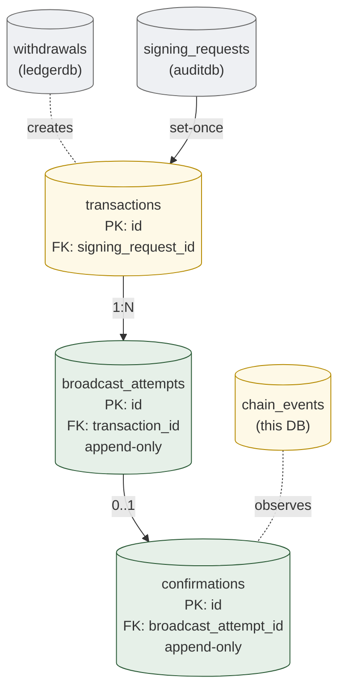
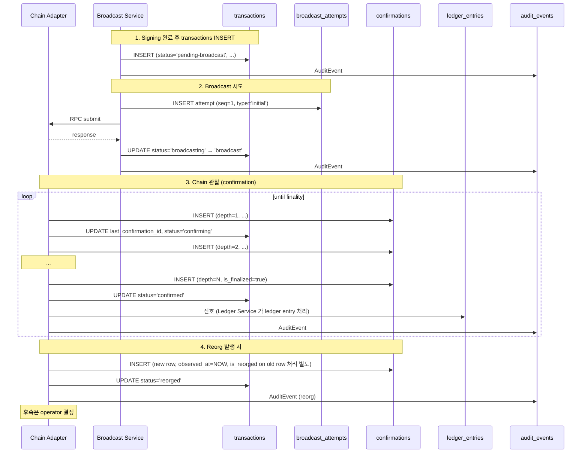

# 04. Transaction Orchestration
> Chain 상의 transaction 의 영속화 — broadcast / confirmation 의 retry-safe model

이 도메인은 **chain 의 사실** 을 mirror 합니다. `transactions` 는 우리가 만든 raw tx, `broadcast_attempts` 는 그 tx 의 chain 제출 시도 history, `confirmations` 는 chain 의 finality 도달 evidence.

**Owning DB**: `chaindb`
**Owning service**: Chain Adapter, Broadcast Service (write authority)
**Read-only consumers**: Audit Service, Reconciliation Service, Ledger Service, Withdrawal Service

---

## 1. 책임의 범위

| 본 도메인이 담당 | 본 도메인이 담당하지 않음 |
|----------------|------------------------|
| Raw transaction payload 영속화 (`transactions`) | 서명 (Signing Service / TEE) |
| Broadcast attempt 의 history (`broadcast_attempts`) | 정책 결정 (Approval Service) |
| Chain confirmation 의 mirror (`confirmations`) | ledger 변경 (Ledger Service — confirmation event 를 받아 처리) |
| Reorg 발견 / 표현 | Reorg 후 자금 처리 결정 (Operator) |
| Mempool 상태 추적 (runtime-only — DB 안 들어감) | tx replacement 결정 (Operator) |
| Tx fee model 적용 | Gas wallet 의 잔액 (Ledger Service) |

핵심 framing: **chain 의 fact 가 canonical**. 본 도메인의 모든 데이터는 chain 의 mirror — internal canonical 이 아님.

---

## 2. PK/FK dependency



*Figure 7. Transaction orchestration PK/FK — `transactions` 는 set-once after signing, `broadcast_attempts` / `confirmations` 는 append-only.*

---

## 3. `transactions`

### 3.1 책임

- 서명된 raw transaction 의 영속화 — chain 에 제출 가능한 형태
- Withdrawal / sweep / internal-with-chain-touch 의 chain-side representation
- Set-once after signing — 서명 완료 후 변경 불가

| 속성 | 값 |
|------|-----|
| Storage class | `A-set` (대부분 컬럼이 set-once) + `M-mut` (status 만) |
| Source of truth | row 자체 (signed payload) |
| Mutation authority | Signing Service 가 signing 완료 시점에 INSERT; Broadcast Service 가 status update |
| Read access | Broadcast Service, Audit Service, Reconciliation Service |
| Logical deletion | 금지 — `status='abandoned'` 로 soft (서명됐지만 broadcast 안 함) |
| Partitioning | per-month 권장 |

### 3.2 Schema 제안

| 컬럼 | 타입 | NULL | Class | 의미 |
|------|------|------|-------|------|
| `id` | UUID | NOT NULL | PK | tx identifier (internal) |
| `signing_request_id` | UUID | NOT NULL | `A-set` | cross-DB ref: auditdb.signing_requests.id |
| `withdrawal_id` | UUID | NULL | `A-set` | cross-DB ref: ledgerdb.withdrawals.id (없으면 sweep / 다른 source) |
| `source_aggregate_type` | enum | NOT NULL | `A-set` | `'withdrawal'`, `'sweep'`, `'unsafe-send'` |
| `source_aggregate_id` | UUID | NOT NULL | `A-set` | source aggregate 의 ID |
| `chain_id` | TEXT | NOT NULL | `A-set` | which chain |
| `source_wallet_id` | UUID | NOT NULL | `A-set` | cross-DB ref: walletdb.wallets.id |
| `source_address` | TEXT | NOT NULL | `A-set` | from address (chain string) |
| `destination_address` | TEXT | NOT NULL | `A-set` | to address |
| `asset_id` | TEXT | NOT NULL | `A-set` | which asset |
| `amount` | NUMERIC(38,0) | NOT NULL | `A-set` | smallest unit |
| `fee_amount` | NUMERIC(38,0) | NOT NULL | `A-set` | chain fee (paid in native asset) |
| `chain_nonce` | BIGINT | NULL | `A-set` | account-based chain (Ethereum 등) — set-once |
| `raw_payload` | BYTEA | NOT NULL | `A-set` | signed raw tx bytes |
| `raw_payload_hash` | BYTEA | NOT NULL | `A-set` | SHA-256 of raw_payload (signing 시점 binding) |
| `tx_hash` | BYTEA | NOT NULL | `A-set` | chain 의 tx hash (chain 마다 다른 계산법) |
| `signed_at` | TIMESTAMPTZ | NOT NULL | `A-set` | TEE 가 서명 완료한 시점 |
| `status` | enum | NOT NULL | `M-mut` | `'pending-broadcast'`, `'broadcasting'`, `'broadcast'`, `'confirming'`, `'confirmed'`, `'failed'`, `'abandoned'`, `'reorged'` |
| `last_attempt_id` | UUID | NULL | `M-mut` | 최근 broadcast attempt FK (advisory — query 가속) |
| `last_confirmation_id` | UUID | NULL | `M-mut` | 최근 confirmation FK (advisory) |
| `created_at` | TIMESTAMPTZ | NOT NULL | `A-set` | INSERT 시점 |
| `version` | BIGINT | NOT NULL | `M-mut` | optimistic locking |

### 3.3 핵심 invariant

#### 3.3.1 Set-once columns

`signing_request_id`, `chain_id`, `source_*`, `destination_address`, `asset_id`, `amount`, `fee_amount`, `chain_nonce`, `raw_payload`, `raw_payload_hash`, `tx_hash`, `signed_at` — 모두 INSERT 후 변경 불가:

```sql
CREATE OR REPLACE FUNCTION prevent_set_once_on_transactions()
RETURNS TRIGGER AS $$
DECLARE
  set_once_cols TEXT[] := ARRAY[
    'signing_request_id', 'chain_id', 'source_wallet_id', 'source_address',
    'destination_address', 'asset_id', 'amount', 'fee_amount', 'chain_nonce',
    'raw_payload', 'raw_payload_hash', 'tx_hash', 'signed_at'
  ];
  col TEXT;
BEGIN
  FOREACH col IN ARRAY set_once_cols LOOP
    -- (생략 — application 또는 fine-grained trigger 로 각 컬럼 검사)
    NULL;
  END LOOP;
  RETURN NEW;
END;
$$ LANGUAGE plpgsql;
```

실제 구현은 컬럼별 trigger 가 더 깔끔.

#### 3.3.2 `(chain_id, tx_hash)` UNIQUE

```sql
CREATE UNIQUE INDEX uniq_chain_tx_hash
  ON transactions (chain_id, tx_hash);
```

같은 chain 의 같은 tx_hash 가 두 row 에 존재하면 cross-DB binding 깨짐 (audit, reconciliation).

#### 3.3.3 `(chain_id, source_address, chain_nonce)` UNIQUE (account-based chain)

Ethereum 같이 nonce-based chain 에서 같은 source + 같은 nonce 의 두 tx 는 chain 이 거절. DB-level 에서도 invariant:

```sql
CREATE UNIQUE INDEX uniq_chain_source_nonce
  ON transactions (chain_id, source_address, chain_nonce)
  WHERE chain_nonce IS NOT NULL;
```

UTXO chain (Bitcoin 등) 은 nonce 가 없으므로 NULL — partial index.

#### 3.3.4 raw_payload_hash 의 binding

`raw_payload_hash = SHA-256(raw_payload)` — application 책임. 검증:

```sql
ALTER TABLE transactions
  ADD CONSTRAINT chk_raw_payload_hash_format
  CHECK (octet_length(raw_payload_hash) = 32);  -- SHA-256 = 32 bytes
```

(application 이 hash 를 잘못 계산하는 case 는 CHECK 로 잡지 못함 — review 의 책임)

### 3.4 State machine

```mermaid
graph TB
  PB["pending-broadcast"]
  BC["broadcasting"]
  B["broadcast"]
  CONFIRMING["confirming"]
  CONFIRMED["confirmed ★"]
  FAILED["failed ★"]
  ABANDONED["abandoned ★"]
  REORGED["reorged ★"]

  PB --> BC --> B --> CONFIRMING
  CONFIRMING -->|N confirmations| CONFIRMED
  CONFIRMING -->|reorg| REORGED
  BC -.broadcast failure.-> FAILED
  B -.mempool eviction + manual.-> ABANDONED
  PB -.operator decides not to broadcast.-> ABANDONED
  REORGED -->|operator decides retry| PB
  REORGED -->|operator decides accept.-> CONFIRMED

  classDef intermediate fill:#fef9e7,stroke:#b58a00
  classDef pass fill:#e6f0e8,stroke:#2a5a36
  classDef fail fill:#fdeaea,stroke:#a44
  class PB,BC,B,CONFIRMING intermediate
  class CONFIRMED pass
  class FAILED,ABANDONED,REORGED fail
```

★ = terminal state (단, REORGED 는 manual 결정으로 다시 PB 진입 가능 — 단방향 sticky 아님)

#### 3.4.1 Sticky transition 강제

대부분의 transition 은 단방향이지만 REORGED 는 예외:

```sql
CREATE OR REPLACE FUNCTION enforce_transaction_state_transition()
RETURNS TRIGGER AS $$
BEGIN
  -- terminal states (FAILED, ABANDONED, CONFIRMED) 에서 변경 불가
  IF OLD.status IN ('failed', 'abandoned', 'confirmed')
     AND NEW.status IS DISTINCT FROM OLD.status THEN
    RAISE EXCEPTION 'tx % already in terminal state %', OLD.id, OLD.status;
  END IF;
  -- reorged 는 다시 pending-broadcast 로 갈 수 있음 (operator 결정)
  RETURN NEW;
END;
$$ LANGUAGE plpgsql;
```

### 3.5 Indexing

| Index | 목적 |
|-------|------|
| `transactions_pkey (id)` | PK |
| `uniq_chain_tx_hash (chain_id, tx_hash)` | chain event lookup |
| `uniq_chain_source_nonce` | nonce-based chain UNIQUE |
| `idx_transactions_signing_request (signing_request_id)` | signing → tx |
| `idx_transactions_withdrawal (withdrawal_id) WHERE withdrawal_id IS NOT NULL` | withdrawal → tx |
| `idx_transactions_status (status) WHERE status IN ('broadcasting', 'broadcast', 'confirming')` | active broadcast 추적 |
| `idx_transactions_chain_status (chain_id, status)` | chain 별 운영 query |

### 3.6 Partitioning

월 단위 partition 권장 (큰 institution):

```sql
CREATE TABLE transactions (...) PARTITION BY RANGE (created_at);
CREATE TABLE transactions_2026_05 PARTITION OF transactions
  FOR VALUES FROM ('2026-05-01') TO ('2026-06-01');
```

오래된 partition 은 read-only 로 전환 가능 (chain history 는 chain 자체에 있음 — 우리의 mirror 는 archival 가능).

---

## 4. `broadcast_attempts`

### 4.1 책임

- 같은 transaction 을 chain 에 제출한 시도의 history
- Retry / replacement (RBF, fee bump) 의 full evidence
- Append-only — 시도 자체는 변경 불가

| 속성 | 값 |
|------|-----|
| Storage class | `A-row` (strict append-only) |
| Source of truth | row 자체 |
| Mutation authority | Broadcast Service 의 INSERT 만 |
| Read access | Audit Service, Reconciliation Service, Chain Adapter, Operator Console |
| Logical deletion | 금지 |
| Partitioning | per-month |

### 4.2 Schema 제안

| 컬럼 | 타입 | NULL | Class | 의미 |
|------|------|------|-------|------|
| `id` | UUID | NOT NULL | PK | attempt identifier |
| `transaction_id` | UUID | NOT NULL | `A-set` | FK transactions.id |
| `attempt_seq` | INT | NOT NULL | `A-set` | per-tx sequence (1, 2, 3, ...) |
| `attempt_type` | enum | NOT NULL | `A-set` | `'initial'`, `'retry'`, `'replacement'` (RBF), `'manual-resubmit'` |
| `replaces_attempt_id` | UUID | NULL | `A-set` | replacement 의 경우 직전 attempt FK |
| `rpc_endpoint_id` | TEXT | NULL | `A-set` | 어느 RPC node 에 제출했는지 |
| `submitted_at` | TIMESTAMPTZ | NOT NULL | `A-set` | submit 시각 |
| `result_type` | enum | NOT NULL | `A-set` | `'accepted-mempool'`, `'rejected'`, `'rpc-error'`, `'unknown'`, `'mempool-eviction'` |
| `result_message` | TEXT | NULL | `A-set` | RPC 응답 / error message |
| `chain_response_payload` | JSONB | NULL | `A-set` | RPC 응답 raw |
| `chain_nonce_at_submit` | BIGINT | NULL | `A-set` | submit 시점의 nonce (account-based chain) |
| `fee_at_submit` | NUMERIC(38,0) | NOT NULL | `A-set` | submit 시점의 fee (replacement 시 변경됨) |
| `audit_event_id` | UUID | NULL | `A-set` | cross-DB ref: auditdb.audit_events.id |
| `created_at` | TIMESTAMPTZ | NOT NULL | `A-set` | DB INSERT 시각 (= submitted_at 와 거의 같음) |

### 4.3 핵심 invariant

#### 4.3.1 Append-only

```sql
CREATE TRIGGER broadcast_attempts_no_mutation
  BEFORE UPDATE OR DELETE ON broadcast_attempts
  FOR EACH ROW EXECUTE FUNCTION prevent_mutation_generic();
```

#### 4.3.2 `(transaction_id, attempt_seq)` UNIQUE

```sql
CREATE UNIQUE INDEX uniq_tx_attempt_seq
  ON broadcast_attempts (transaction_id, attempt_seq);
```

같은 tx 의 같은 seq 가 두 row 면 history 모호.

#### 4.3.3 replaces_attempt_id 의 정합성

```sql
-- replacement 면 replaces_attempt_id 가 같은 transaction_id 의 attempt 이어야 함
CREATE OR REPLACE FUNCTION enforce_replacement_consistency()
RETURNS TRIGGER AS $$
DECLARE replaced_tx UUID;
BEGIN
  IF NEW.attempt_type = 'replacement' THEN
    IF NEW.replaces_attempt_id IS NULL THEN
      RAISE EXCEPTION 'replacement attempt must specify replaces_attempt_id';
    END IF;
    SELECT transaction_id INTO replaced_tx FROM broadcast_attempts
     WHERE id = NEW.replaces_attempt_id;
    IF replaced_tx IS DISTINCT FROM NEW.transaction_id THEN
      RAISE EXCEPTION 'replacement attempt must reference same transaction_id';
    END IF;
  END IF;
  RETURN NEW;
END;
$$ LANGUAGE plpgsql;
```

#### 4.3.4 attempt_seq 의 monotonic

application 책임: INSERT 시 `MAX(attempt_seq) + 1`.

### 4.4 Retry-safe persistence model

```
Broadcast Service 의 retry loop:

1. tx 의 status = 'pending-broadcast' 인 row 찾음
2. broadcast_attempts INSERT (attempt_type='initial' 또는 'retry')
3. RPC submit
4. 응답 결과로 result_type, result_message INSERT 보강
5. 성공 시 transactions.status = 'broadcasting' → 'broadcast' update
6. 실패 시 retry policy 에 따라 다시 attempt INSERT (새 row)

핵심: 같은 attempt row 를 UPDATE 하지 않음. 매 시도는 새 row.
```

#### 4.4.1 RBF / fee bump 패턴

```
Operator 가 fee bump 결정 →
  새 broadcast_attempt row INSERT:
    attempt_type='replacement'
    replaces_attempt_id=이전_attempt_id
    fee_at_submit=새_fee (> 이전 fee)
```

같은 `tx_hash` 일 수도 있고 다를 수도 있음 (chain 별 — Bitcoin RBF 는 새 tx_hash, Ethereum fee bump 는 같은 nonce 다른 tx_hash). 본 도메인은 양쪽 패턴을 attempt row 로만 표현.

### 4.5 Indexing

| Index | 목적 |
|-------|------|
| `broadcast_attempts_pkey (id)` | PK |
| `uniq_tx_attempt_seq` | sequence UNIQUE |
| `idx_broadcast_attempts_tx (transaction_id, attempt_seq DESC)` | tx 의 최신 attempt 찾기 |
| `idx_broadcast_attempts_result (result_type, submitted_at) WHERE result_type != 'accepted-mempool'` | failure 분석 query |

---

## 5. `confirmations`

### 5.1 책임

- Chain 의 finality 도달 evidence
- 각 broadcast attempt 의 최종 confirmation 상태
- Block depth / reorg 추적

| 속성 | 값 |
|------|-----|
| Storage class | `A-row` |
| Source of truth | chain 자체 (이건 mirror) |
| Mutation authority | Chain Adapter 의 INSERT 만 |
| Read access | Audit Service, Ledger Service, Reconciliation Service |
| Logical deletion | 금지 |
| Partitioning | per-month |

### 5.2 Schema 제안

| 컬럼 | 타입 | NULL | Class | 의미 |
|------|------|------|-------|------|
| `id` | UUID | NOT NULL | PK | confirmation row identifier |
| `broadcast_attempt_id` | UUID | NOT NULL | `A-set` | FK broadcast_attempts.id |
| `transaction_id` | UUID | NOT NULL | `A-set` | FK transactions.id (denormalized for query) |
| `chain_id` | TEXT | NOT NULL | `A-set` | |
| `tx_hash` | BYTEA | NOT NULL | `A-set` | chain 에서 본 tx_hash (transactions.tx_hash 와 일치해야) |
| `block_height` | BIGINT | NOT NULL | `A-set` | 해당 tx 가 포함된 블록 높이 |
| `block_hash` | BYTEA | NOT NULL | `A-set` | block hash |
| `confirmation_depth` | INT | NOT NULL | `A-set` | observed depth (1 = just included, N = N blocks deep) |
| `is_finalized` | BOOLEAN | NOT NULL | `A-set` | depth >= chain.finality_threshold |
| `is_reorged` | BOOLEAN | NOT NULL | `A-set` | 본 row 가 reorg 로 invalid 됐는지 (별도 confirmation row 가 newer view) |
| `superseded_by_id` | UUID | NULL | `A-set` | reorg 시 새 confirmation row 의 id |
| `observed_at` | TIMESTAMPTZ | NOT NULL | `A-set` | DB 가 chain 으로부터 관찰한 시점 |
| `finalized_at` | TIMESTAMPTZ | NULL | `A-set` | is_finalized=true 가 된 시점 |
| `chain_evidence_ref` | TEXT | NOT NULL | `A-set` | block explorer URL 또는 chain proof ref (auditor 검증용) |
| `audit_event_id` | UUID | NULL | `A-set` | cross-DB ref |

### 5.3 핵심 invariant

#### 5.3.1 Append-only

```sql
CREATE TRIGGER confirmations_no_mutation
  BEFORE UPDATE OR DELETE ON confirmations
  FOR EACH ROW EXECUTE FUNCTION prevent_mutation_generic();
```

#### 5.3.2 `tx_hash` 의 일관성

```sql
ALTER TABLE confirmations
  ADD CONSTRAINT chk_tx_hash_matches_transaction
  CHECK (
    -- application 책임 — DB-level cross-table CHECK 은 generally 불가
    -- 대신 trigger 또는 정기 reconciliation 으로 검증
    octet_length(tx_hash) > 0
  );
```

cross-table 검증은 trigger:

```sql
CREATE OR REPLACE FUNCTION enforce_confirmation_tx_hash()
RETURNS TRIGGER AS $$
DECLARE expected_hash BYTEA;
BEGIN
  SELECT tx_hash INTO expected_hash FROM transactions WHERE id = NEW.transaction_id;
  IF expected_hash IS DISTINCT FROM NEW.tx_hash THEN
    RAISE EXCEPTION 'confirmation tx_hash does not match transactions.tx_hash';
  END IF;
  RETURN NEW;
END;
$$ LANGUAGE plpgsql;
```

#### 5.3.3 Reorg 표현

reorg 발생 시 새 confirmation row INSERT 하고 **이전 row 의 `is_reorged` 를 UPDATE 하면 안 됨** (append-only). 대안:

- 새 row INSERT: `is_reorged=false`, `superseded_by_id=NULL`
- 이전 row 는 그대로 — application query 가 "latest confirmation per tx" 로 조회

또는 **별도 reorg_events 테이블** 로 관리. 본 reference 는 confirmation row 자체의 multiple 발행으로 표현 (`is_finalized` 가 마지막에 true 인 row 가 canonical view).

```sql
-- latest valid confirmation per tx
SELECT DISTINCT ON (transaction_id)
  *
FROM confirmations
WHERE NOT is_reorged
ORDER BY transaction_id, observed_at DESC;
```

### 5.4 Indexing

| Index | 목적 |
|-------|------|
| `confirmations_pkey (id)` | PK |
| `idx_confirmations_tx (transaction_id, observed_at DESC)` | tx 의 최신 confirmation |
| `idx_confirmations_attempt (broadcast_attempt_id)` | attempt → confirmation |
| `idx_confirmations_finalized (chain_id, finalized_at) WHERE is_finalized` | finalized tx 의 finality 시점 query |
| `idx_confirmations_block (chain_id, block_height)` | block 단위 조회 (reorg 영향 분석) |

---

## 6. State synchronization across tables



### 6.1 Cross-table consistency

- `transactions.status` 와 가장 최근 confirmation 의 `is_finalized` 가 일치해야 함 — reconciliation 의 검사 대상.
- `transactions.last_confirmation_id` 는 advisory cache — 실제 canonical 은 latest confirmation row.

---

## 7. Retry-safe persistence model

### 7.1 Idempotency 의 layer

| Layer | Idempotency key | 효과 |
|-------|----------------|------|
| Caller → API | `withdrawals.reference_id` | 같은 withdrawal 요청 중복 차단 |
| Application → Signing | `signing_requests.payload_hash` | 같은 payload 의 중복 서명 회피 |
| Signing → Chain | `transactions (chain_id, tx_hash) UNIQUE` | 같은 chain tx 의 duplicate row 차단 |
| Broadcast → RPC | `(chain_id, source_address, chain_nonce) UNIQUE` | 같은 nonce 의 중복 broadcast 차단 |
| Adapter → confirmations | `(chain_id, tx_hash, block_height)` 의 latest row 우선 | reorg 시 새 row INSERT 가 latest |

### 7.2 Retry 정책

| Retry type | 빈도 | 처리 |
|-----------|------|------|
| **RPC transient error** | 즉시 (exponential backoff) | 같은 attempt 의 result_type update 가 아니라 새 attempt row INSERT |
| **Mempool eviction** | 정책에 따라 manual or automatic | operator 가 RBF / replacement 결정 |
| **Reorg** | chain 관찰 결과 자동 | confirmation row INSERT, transactions.status update; operator 가 후속 결정 |
| **Stuck (no confirmation)** | N 시간 후 alert | operator 가 fee bump 또는 abandon 결정 |

---

## 8. Reconciliation 의 chain 도메인 query

자세한 reconciliation 은 [09-reconciliation-consistency.md](09-reconciliation-consistency.md). 본 도메인이 reconciliation 에 제공하는 query:

```sql
-- 모든 confirmed tx 와 ledger 의 confirmed_debit 의 정합성
SELECT
  t.id, t.tx_hash, t.amount, t.status,
  COUNT(le.id) AS related_ledger_entries
FROM transactions t
LEFT JOIN ledger_entries le ON le.ref_type = 'withdrawal' AND le.ref_id = t.withdrawal_id
WHERE t.status = 'confirmed'
GROUP BY t.id;
-- 각 confirmed tx 마다 ledger 에 entries 가 있어야 — count = 0 면 mismatch
```

```sql
-- 같은 chain_nonce 의 중복 (있으면 안 됨)
SELECT chain_id, source_address, chain_nonce, COUNT(*) AS dup_count
FROM transactions
WHERE chain_nonce IS NOT NULL AND status NOT IN ('failed', 'abandoned')
GROUP BY chain_id, source_address, chain_nonce
HAVING COUNT(*) > 1;
-- 결과 0 row 여야 정합성
```

---

## 9. Operational considerations

### 9.1 RPC endpoint failure

- `broadcast_attempts.rpc_endpoint_id` 로 어느 endpoint 가 실패 많은지 추적
- 정기 query: per-endpoint failure rate
- Multi-endpoint 권장 (single point of failure 회피)

### 9.2 Mempool watch (runtime-only)

각 broadcast 후 mempool 추적은 **runtime memory** 에서 (`R-only`). DB 에 영속화 금지. 이유:
- Mempool 상태는 RPC node 마다 다름 — canonical 아님
- Chain 으로부터 재구성 가능
- 사고 시 service restart 로 chain query 로 재시작

### 9.3 raw_payload 의 크기

- Bitcoin tx: 250B - 수십KB
- Ethereum tx: ~ 1KB
- Solana tx: ~ 1.2KB

`BYTEA` 컬럼은 적당. PostgreSQL 의 TOAST 가 큰 row 자동 처리.

### 9.4 archival

- 6 개월 이상 된 `transactions` partition 은 read-only 로 전환 가능
- 1 년 이상은 cold storage tier (S3 등) 로 archive 검토 — 단 audit defense 위해 영구 retention 권장
- `broadcast_attempts` / `confirmations` 도 같음

---

## 10. Anti-patterns

| Anti-pattern | 왜 안 좋은가 |
|--------------|-------------|
| `transactions.raw_payload` 를 UPDATE | 서명된 payload 가 사후에 바뀜 — TEE 의 의미 무력화 |
| `tx_hash` 를 mutable | chain ↔ DB binding 깨짐 |
| `broadcast_attempts` 의 같은 attempt row 를 UPDATE | retry history 손상 |
| `confirmations` 의 reorg 처리 시 이전 row UPDATE | append-only 위반 |
| RPC failure 시 attempt INSERT 안 하고 in-memory retry only | 시도 evidence 누락 |
| `chain_nonce` 를 mutable | nonce-based chain 의 ordering 깨짐 |
| `transactions` 의 status 만 보고 confirmation 의 latest row 무시 | reorg 후 잘못된 finality 판단 가능 |
| `transactions` 와 `broadcast_attempts` 의 partition mismatch | 시간 기반 query 의 partition pruning 실패 |
| `confirmations.block_height` 를 mutable | finality 시점 변조 가능 |
| `raw_payload` 외에 plaintext 키 / mnemonic 동봉 | forbidden storage 침투 |

---

## 11. 다음 읽을 글

- 서명 결과의 source → [06-signing-execution.md](06-signing-execution.md)
- ledger entries 와의 연결 → [03-ledger-settlement.md](03-ledger-settlement.md) §7
- Withdrawal 전체 lifecycle → [08-withdrawal-lifecycle.md](08-withdrawal-lifecycle.md)
- Reconciliation 의 cross-domain 검증 → [09-reconciliation-consistency.md](09-reconciliation-consistency.md)
