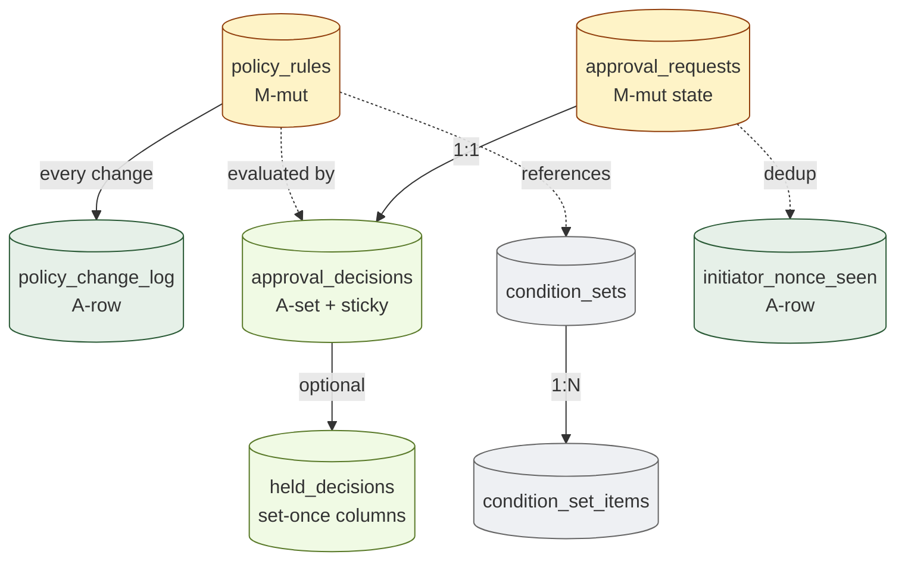
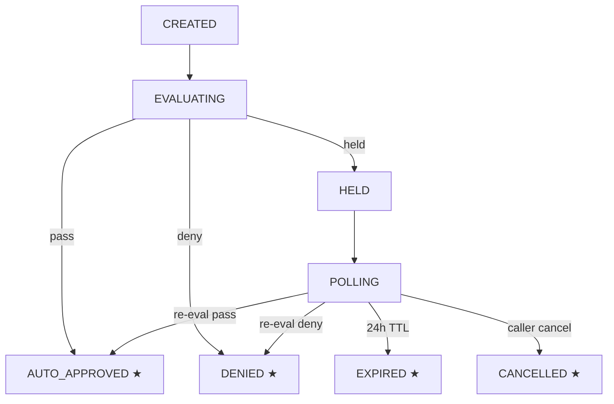

# 05. Approval & Governance
> Policy 결정의 영속화 — state machine + set-once + hot reload

이 도메인은 자금 이동 요청의 **정책 결정 evidence** 를 영속화합니다. `approval_requests` 는 mutable state machine, `approval_decisions` 는 set-once + sticky terminal, `policy_rules` 는 hot-reload 가능한 mutable 정책 + 별도 change_log.

**Owning DB**: `approverdb`
**Owning service**: Approval Service, Policy Engine (write authority)
**Read-only consumers**: Audit Service, Reconciliation Service, Operator Console

---

## 1. 책임의 범위

| 본 도메인이 담당 | 본 도메인이 담당하지 않음 |
|----------------|------------------------|
| Approval state machine 영속화 | 서명 (Signing Service) |
| Policy rule evaluation 결과 (`approval_decisions`) | 잔액 조회 (사전 계산 받음 — Ledger Service 가 evaluation context 제공) |
| Policy rule definition + change log | 자금 이동 자체 (Ledger / Broadcast) |
| Held decision queue + 24h TTL | chain 관찰 (Chain Adapter) |
| Idempotency dedup (`initiator_nonce_seen`) | recovery ceremony (Recovery Service) |
| Condition set (whitelist / blacklist 등) | KYC system (외부) |

---

## 2. PK/FK dependency



---

## 3. `policy_rules`

### 3.1 책임

- 현재 active 정책 정의 — closed 10-type taxonomy + extension (`expression`)
- Hot reload — application restart 없이 변경 가능
- 모든 변경은 `policy_change_log` 에 동시 기록

| 속성 | 값 |
|------|-----|
| Storage class | `M-mut` (admin-mutable) + 변경 시 change log 자동 INSERT |
| Source of truth | row 자체 (current state); historical 은 change_log |
| Mutation authority | Compliance Admin (별도 인증 + governance event) |
| Read access | Policy Engine (hot-reload), Audit, Operator Console |
| Logical deletion | 금지 — `status='archived'` |
| Partitioning | N/A (보통 ≤ 수천 rule) |

### 3.2 Rule type taxonomy (closed)

| `rule_type` | Priority 범위 (권장) | 의미 | Config schema 키 |
|-------------|--------------------|------|-----------------|
| `global_halt` | 10-19 | Kill-switch | `{message}` |
| `address_list` | 20-39 | Whitelist / blacklist | `{condition_set_id, mode}` |
| `time_window` | 20-39 | 영업시간 제한 | `{start_hour, end_hour, timezone, days_of_week}` |
| `per_tx_amount_limit` | 40-59 | 건당 amount 상한 | `{max_amount}` |
| `daily_withdrawal_limit` | 40-59 | 일일 누적 상한 | `{max_daily_amount}` |
| `velocity_limit` | 40-59 | 일일 건수 제한 | `{max_count_per_day}` |
| `velocity_window` | 60-79 | sliding window | `{window_seconds, max_count, max_amount}` |
| `address_cooldown` | 60-79 | 신규 주소 cooling | `{threshold_amount, cooldown_seconds}` |
| `approval_tier` | 80-99 | 구간별 수동 승인 | `{min_amount, max_amount, approval_mode}` |
| `expression` | 100+ | 커스텀 DSL | `{action, conditions: [...]}` |

### 3.3 Schema 제안

| 컬럼 | 타입 | NULL | Class | 의미 |
|------|------|------|-------|------|
| `id` | UUID | NOT NULL | PK | rule identifier |
| `tenant_id` | UUID | NOT NULL | `A-set` | rule 의 scope (per-tenant) |
| `rule_type` | enum | NOT NULL | `A-set` | 위 10 type — set-once (rule 의 정체성) |
| `flow_type` | enum | NOT NULL | `A-set` | `'withdrawal'`, `'internal_transfer'`, `'deposit'`, `'sweep'` |
| `mint` | TEXT | NULL | `M-mut` | 적용 asset (`*` = all assets) |
| `priority` | INT | NOT NULL | `M-mut` | evaluation order |
| `config` | JSONB | NOT NULL | `M-mut` | rule-type-specific config (위 §3.2) |
| `active` | BOOLEAN | NOT NULL | `M-mut` | 활성 여부 |
| `description` | TEXT | NULL | `M-mut` | 운영자 메모 |
| `created_at` | TIMESTAMPTZ | NOT NULL | `A-set` | INSERT 시각 |
| `created_by` | UUID | NOT NULL | `A-set` | 최초 등록자 |
| `updated_at` | TIMESTAMPTZ | NOT NULL | `M-mut` | 최종 수정 시각 |
| `updated_by` | UUID | NOT NULL | `M-mut` | 최종 수정자 |
| `status` | enum | NOT NULL | `M-mut` | `'active'`, `'archived'` |
| `version` | BIGINT | NOT NULL | `M-mut` | optimistic locking |

### 3.4 핵심 invariant

#### 3.4.1 모든 변경은 change log 동반

```sql
CREATE OR REPLACE FUNCTION log_policy_rule_change()
RETURNS TRIGGER AS $$
DECLARE
  change_type TEXT;
  old_data JSONB;
  new_data JSONB;
BEGIN
  IF TG_OP = 'INSERT' THEN
    change_type := 'CREATE';
    old_data := NULL;
    new_data := to_jsonb(NEW);
  ELSIF TG_OP = 'UPDATE' THEN
    change_type := 'UPDATE';
    old_data := to_jsonb(OLD);
    new_data := to_jsonb(NEW);
  ELSIF TG_OP = 'DELETE' THEN
    change_type := 'DELETE';
    old_data := to_jsonb(OLD);
    new_data := NULL;
  END IF;

  INSERT INTO policy_change_log (
    id, rule_id, change_type, old_data, new_data,
    changed_by, changed_at
  ) VALUES (
    gen_random_uuid(), COALESCE(NEW.id, OLD.id), change_type,
    old_data, new_data, current_setting('app.current_user_id')::UUID, NOW()
  );
  RETURN COALESCE(NEW, OLD);
END;
$$ LANGUAGE plpgsql;

CREATE TRIGGER policy_rules_change_log
  AFTER INSERT OR UPDATE OR DELETE ON policy_rules
  FOR EACH ROW EXECUTE FUNCTION log_policy_rule_change();
```

`current_setting('app.current_user_id')` 는 application 이 각 connection 마다 `SET LOCAL app.current_user_id = ...` 로 설정.

#### 3.4.2 DELETE 금지 (soft delete)

application 이 DELETE 호출 시 거절 또는 status='archived' 로 변환:

```sql
CREATE OR REPLACE FUNCTION prevent_policy_rules_hard_delete()
RETURNS TRIGGER AS $$
BEGIN
  RAISE EXCEPTION 'policy_rules hard delete forbidden; use status=archived';
END;
$$ LANGUAGE plpgsql;

CREATE TRIGGER policy_rules_no_delete
  BEFORE DELETE ON policy_rules
  FOR EACH ROW EXECUTE FUNCTION prevent_policy_rules_hard_delete();
```

#### 3.4.3 Config 의 schema 검증

application-level 또는 JSON Schema 검증 (PostgreSQL native 한계로 trigger 에서 type-specific 검증). 예:

```sql
-- approval_tier 의 config 검증 (예시)
ALTER TABLE policy_rules
  ADD CONSTRAINT chk_approval_tier_config
  CHECK (
    rule_type != 'approval_tier' OR (
      config ? 'min_amount' AND config ? 'max_amount' AND config ? 'approval_mode'
    )
  );
```

### 3.5 Hot reload mechanism

```
Application 의 Policy Engine 시작 시:
  1. policy_rules 의 active 한 모든 row 를 메모리 로드 (ArcSwap 또는 RWLock)
  2. policy_change_log 의 last_change_id 기록

Loader task (background):
  loop:
    sleep N seconds (예: 1s)
    SELECT * FROM policy_change_log WHERE id > $last_change_id
    if any change:
      reload policy_rules (atomic swap)
      $last_change_id = max(new ids)
```

핵심: 메모리 안의 rule set 이 atomic 으로 교체 — request 가 평가 중간에 rule 이 바뀌어 일부는 old / 일부는 new 적용되는 race 없음.

### 3.6 Indexing

| Index | 목적 |
|-------|------|
| `policy_rules_pkey (id)` | PK |
| `idx_policy_rules_tenant_active (tenant_id, flow_type, priority) WHERE active AND status = 'active'` | Policy Engine 의 hot reload query |
| `idx_policy_rules_updated (updated_at)` | change tracking |

---

## 4. `policy_change_log`

### 4.1 책임

- `policy_rules` 의 모든 변경 history — append-only
- Audit defense — 누가 / 언제 / 무엇을 / 왜 변경했는지

| 속성 | 값 |
|------|-----|
| Storage class | `A-row` |
| Source of truth | row 자체 |
| Mutation authority | trigger 가 자동 INSERT (application 직접 INSERT 금지) |
| Read access | Audit, Compliance Console |
| Logical deletion | 절대 금지 |
| Partitioning | per-year 권장 |

### 4.2 Schema 제안

| 컬럼 | 타입 | NULL | Class | 의미 |
|------|------|------|-------|------|
| `id` | UUID | NOT NULL | PK | log entry id |
| `rule_id` | UUID | NOT NULL | `A-set` | 변경 대상 rule (rule 이 DELETE 되어도 log 는 남음) |
| `change_type` | enum | NOT NULL | `A-set` | `'CREATE'`, `'UPDATE'`, `'DELETE'` |
| `old_data` | JSONB | NULL | `A-set` | 변경 전 row (CREATE 면 NULL) |
| `new_data` | JSONB | NULL | `A-set` | 변경 후 row (DELETE 면 NULL) |
| `changed_by` | UUID | NOT NULL | `A-set` | 변경자 user id |
| `changed_at` | TIMESTAMPTZ | NOT NULL | `A-set` | 변경 시각 |
| `change_reason` | TEXT | NULL | `A-set` | application 이 제공 가능한 reason note |
| `audit_event_id` | UUID | NULL | `A-set` | cross-DB ref: auditdb.audit_events.id |

### 4.3 Indexing

| Index | 목적 |
|-------|------|
| `policy_change_log_pkey (id)` | PK |
| `idx_pcl_rule (rule_id, changed_at DESC)` | 한 rule 의 변경 history |
| `idx_pcl_changed_by (changed_by, changed_at)` | 운영자 별 변경 활동 audit |
| `idx_pcl_changed_at (changed_at)` | 시간 범위 query |

---

## 5. `approval_requests`

### 5.1 책임

- 자금 이동 요청의 governance state machine
- Withdrawal / Internal Transfer / Sweep 모두 본 테이블 거침
- Sticky terminal 강제 (state 단방향)

| 속성 | 값 |
|------|-----|
| Storage class | `M-mut` (state 진행) + state machine sticky terminal |
| Source of truth | row 자체 |
| Mutation authority | Approval Service |
| Read access | Audit, Reconciliation, Operator Console |
| Logical deletion | 금지 — terminal state 도달 후 row 보존 |
| Partitioning | per-month |

### 5.2 State machine



*Figure 8. Approval state machine — ★ terminal (DB-level sticky enforcement).*

### 5.3 Schema 제안

| 컬럼 | 타입 | NULL | Class | 의미 |
|------|------|------|-------|------|
| `id` | UUID | NOT NULL | PK | request id |
| `tenant_id` | UUID | NOT NULL | `A-set` | |
| `flow_type` | enum | NOT NULL | `A-set` | `'withdrawal'`, `'internal_transfer'`, `'sweep'`, `'unsafe-send'` |
| `source_aggregate_type` | enum | NOT NULL | `A-set` | request 를 만든 aggregate type |
| `source_aggregate_id` | UUID | NOT NULL | `A-set` | source aggregate id |
| `initiator_pubkey` | BYTEA | NOT NULL | `A-set` | 개시 키의 public key (서명자) |
| `initiator_signature` | BYTEA | NOT NULL | `A-set` | 개시 서명 (payload over) |
| `nonce` | BIGINT | NOT NULL | `A-set` | initiator 의 nonce |
| `payload_hash` | BYTEA | NOT NULL | `A-set` | 요청 payload 의 hash (set-once) |
| `payload` | JSONB | NOT NULL | `A-set` | 요청 내용 (source/dest/amount/asset 등) |
| `evaluation_context` | JSONB | NULL | `A-set` | coordinator 가 사전계산한 context (balance, daily total 등) — set-once at evaluation |
| `state` | enum | NOT NULL | `M-mut` | 위 state machine |
| `state_updated_at` | TIMESTAMPTZ | NOT NULL | `M-mut` | 최근 state 진행 시각 |
| `held_at` | TIMESTAMPTZ | NULL | `A-set` | HELD 진입 시각 (TTL 계산 base) |
| `expires_at` | TIMESTAMPTZ | NULL | `A-set` | held_at + 24h (HELD 시 자동 계산) |
| `created_at` | TIMESTAMPTZ | NOT NULL | `A-set` | |
| `created_by` | UUID | NOT NULL | `A-set` | API 호출자 / 자동화 system |
| `version` | BIGINT | NOT NULL | `M-mut` | |

### 5.4 핵심 invariant

#### 5.4.1 `(initiator_pubkey, nonce)` 의 idempotency

`initiator_nonce_seen` 테이블에 INSERT — DB UNIQUE constraint 가 중복 차단:

```sql
CREATE TABLE initiator_nonce_seen (
  initiator_pubkey BYTEA NOT NULL,
  nonce BIGINT NOT NULL,
  seen_at TIMESTAMPTZ NOT NULL DEFAULT NOW(),
  approval_request_id UUID NOT NULL,
  PRIMARY KEY (initiator_pubkey, nonce)
);
```

Application 의 INSERT 시도:
- 성공 → 새 request 진행
- `unique_violation` → 기존 request_id 응답 (idempotent)

#### 5.4.2 Sticky terminal

```sql
CREATE OR REPLACE FUNCTION enforce_approval_request_state_transition()
RETURNS TRIGGER AS $$
BEGIN
  -- terminal 에서 변경 시도 거절
  IF OLD.state IN ('AUTO_APPROVED', 'DENIED', 'EXPIRED', 'CANCELLED')
     AND NEW.state IS DISTINCT FROM OLD.state THEN
    RAISE EXCEPTION 'approval_request % already in terminal state %', OLD.id, OLD.state;
  END IF;

  -- 합법적 transition 만 허용
  IF NOT (
    (OLD.state = 'CREATED'  AND NEW.state = 'EVALUATING') OR
    (OLD.state = 'EVALUATING' AND NEW.state IN ('AUTO_APPROVED', 'DENIED', 'HELD')) OR
    (OLD.state = 'HELD' AND NEW.state = 'POLLING') OR
    (OLD.state = 'POLLING' AND NEW.state IN ('AUTO_APPROVED', 'DENIED', 'EXPIRED', 'CANCELLED')) OR
    (OLD.state = 'POLLING' AND NEW.state = 'POLLING') OR  -- 같은 state re-eval
    (OLD.state = NEW.state)
  ) THEN
    RAISE EXCEPTION 'invalid state transition: % → %', OLD.state, NEW.state;
  END IF;

  RETURN NEW;
END;
$$ LANGUAGE plpgsql;

CREATE TRIGGER approval_requests_state_check
  BEFORE UPDATE OF state ON approval_requests
  FOR EACH ROW EXECUTE FUNCTION enforce_approval_request_state_transition();
```

#### 5.4.3 `payload_hash` 의 set-once

`payload` 자체는 JSONB 라 mutability 검증이 어려움. `payload_hash` 가 set-once 면 `payload` 변경 시 hash 와 mismatch — application 이 검증.

### 5.5 Indexing

| Index | 목적 |
|-------|------|
| `approval_requests_pkey (id)` | PK |
| `idx_approval_requests_state (state, state_updated_at)` | active request query |
| `idx_approval_requests_aggregate (source_aggregate_type, source_aggregate_id)` | aggregate → request lookup |
| `idx_approval_requests_held_expires (expires_at) WHERE state IN ('HELD', 'POLLING')` | TTL 만료 대상 query |
| `idx_approval_requests_initiator (initiator_pubkey, nonce)` | idempotency query |

---

## 6. `approval_decisions`

### 6.1 책임

- Policy engine 이 내린 verdict 의 evidence — set-once + sticky
- Approver 의 cryptographic 서명 보존
- audit defense 의 anchor

| 속성 | 값 |
|------|-----|
| Storage class | `A-row` + `A-set` (모든 컬럼 set-once) |
| Source of truth | row 자체 |
| Mutation authority | Policy Engine 의 INSERT 만 — UPDATE / DELETE 절대 금지 |
| Read access | Audit, Signing Service (verdict 검증), Reconciliation, Operator |
| Logical deletion | 절대 금지 |
| Partitioning | per-month |

### 6.2 Schema 제안

| 컬럼 | 타입 | NULL | Class | 의미 |
|------|------|------|-------|------|
| `id` | UUID | NOT NULL | PK |  |
| `approval_request_id` | UUID | NOT NULL | `A-set` | FK approval_requests.id |
| `verdict` | enum | NOT NULL | `A-set` | `'AUTO_APPROVE'`, `'HELD'`, `'DENY'` |
| `triggered_rules` | JSONB | NOT NULL | `A-set` | 매치된 rule 의 id + reason 배열 |
| `evaluation_context_snapshot` | JSONB | NOT NULL | `A-set` | 평가 시점의 evaluation_context 복사본 |
| `rule_snapshot_hash` | BYTEA | NOT NULL | `A-set` | 평가 시점의 rule set 의 hash (어떤 rule set 으로 평가했는지) |
| `auth_approver_sig` | BYTEA | NOT NULL | `A-set` | 승인 키의 co-signature |
| `auth_approver_pubkey` | BYTEA | NOT NULL | `A-set` | 승인 키 public key |
| `decided_at` | TIMESTAMPTZ | NOT NULL | `A-set` | |
| `decision_seq` | BIGINT | NOT NULL | `A-set` | per-request sequence (재평가 시 새 row INSERT — sequence 증가) |
| `audit_event_id` | UUID | NULL | `A-set` | cross-DB ref |

### 6.3 핵심 invariant

#### 6.3.1 Append-only — row 자체

```sql
CREATE TRIGGER approval_decisions_no_mutation
  BEFORE UPDATE OR DELETE ON approval_decisions
  FOR EACH ROW EXECUTE FUNCTION prevent_mutation_generic();
```

#### 6.3.2 `(approval_request_id, decision_seq)` UNIQUE

한 request 가 여러 번 평가될 수 있음 (HELD → POLLING → AUTO_APPROVE 의 경우). 각 평가는 새 decision row:

```sql
CREATE UNIQUE INDEX uniq_approval_decision_seq
  ON approval_decisions (approval_request_id, decision_seq);
```

#### 6.3.3 Verdict 의 monotonicity (sticky)

같은 request 의 decision sequence 가 진행하다가 terminal verdict (`AUTO_APPROVE` or `DENY`) 도달 후 다른 verdict 가 INSERT 되면 거절:

```sql
CREATE OR REPLACE FUNCTION enforce_decision_monotonicity()
RETURNS TRIGGER AS $$
DECLARE prior_terminal TEXT;
BEGIN
  -- 같은 request 에 이미 AUTO_APPROVE 또는 DENY 의 decision 이 있으면 새 INSERT 거절
  SELECT verdict INTO prior_terminal
    FROM approval_decisions
   WHERE approval_request_id = NEW.approval_request_id
     AND verdict IN ('AUTO_APPROVE', 'DENY')
   LIMIT 1;
  IF prior_terminal IS NOT NULL THEN
    RAISE EXCEPTION 'approval_request % already has terminal decision %',
      NEW.approval_request_id, prior_terminal;
  END IF;
  RETURN NEW;
END;
$$ LANGUAGE plpgsql;

CREATE TRIGGER approval_decisions_monotonicity
  BEFORE INSERT ON approval_decisions
  FOR EACH ROW EXECUTE FUNCTION enforce_decision_monotonicity();
```

### 6.4 왜 모든 컬럼이 set-once 인가

- `verdict` mutable → 사후에 Deny 를 Allow 로 변경 가능 = policy engine 무력화
- `auth_approver_sig` mutable → 사후 재서명 = 누가 승인했는지 불명
- `triggered_rules` mutable → 어떤 rule 로 결정했는지 변조 가능 = audit defense 약화
- `rule_snapshot_hash` mutable → "당시 rule 이 이랬다" 의 evidence 변조 가능
- `evaluation_context_snapshot` mutable → 사전계산 데이터 변조 가능

각 mutable 가능성이 **audit defense 의 어느 부분** 을 깨는지 명확하므로 모두 set-once.

### 6.5 Indexing

| Index | 목적 |
|-------|------|
| `approval_decisions_pkey (id)` | PK |
| `uniq_approval_decision_seq (approval_request_id, decision_seq)` | sequence UNIQUE |
| `idx_approval_decisions_request (approval_request_id, decided_at DESC)` | request 의 최신 decision |
| `idx_approval_decisions_verdict (verdict, decided_at)` | verdict 별 query (audit reporting) |

---

## 7. `held_decisions`

### 7.1 책임

- HELD verdict 의 detail — 어떤 rule 이 HELD 발화했는지, 어떻게 resolve 가능한지
- Polling loop 의 metadata 저장

| 속성 | 값 |
|------|-----|
| Storage class | `A-row` + set-once columns + 일부 `M-cache` (last_poll_at) |
| Source of truth | row 자체 |
| Mutation authority | Approval Service |
| Read access | Audit, Operator Console |
| Logical deletion | 금지 |
| Partitioning | per-month |

### 7.2 Schema 제안

| 컬럼 | 타입 | NULL | Class | 의미 |
|------|------|------|-------|------|
| `id` | UUID | NOT NULL | PK | |
| `approval_request_id` | UUID | NOT NULL | `A-set` | FK approval_requests.id |
| `approval_decision_id` | UUID | NOT NULL | `A-set` | FK approval_decisions.id (HELD verdict 의 decision) |
| `held_rule_id` | UUID | NOT NULL | `A-set` | 어떤 rule 이 HELD 발화 |
| `held_reason` | TEXT | NOT NULL | `A-set` | rule 이 제공한 reason ("requires single-operator approval" 등) |
| `held_at` | TIMESTAMPTZ | NOT NULL | `A-set` | HELD 진입 시각 |
| `expires_at` | TIMESTAMPTZ | NOT NULL | `A-set` | held_at + 24h |
| `last_poll_at` | TIMESTAMPTZ | NULL | `M-cache` | 최근 polling 시각 (advisory) |
| `poll_count` | INT | NOT NULL | `M-cache` | 누적 polling 횟수 (advisory) |
| `resolved_at` | TIMESTAMPTZ | NULL | `A-set` | terminal verdict 도달 시 set |
| `resolved_by_decision_id` | UUID | NULL | `A-set` | 최종 terminal decision (AUTO_APPROVE / DENY / EXPIRED) FK |

### 7.3 핵심 invariant

- `resolved_at`, `resolved_by_decision_id` 는 NULL → 1회 set (set-once columns):

```sql
CREATE TRIGGER held_decisions_resolved_set_once
  BEFORE UPDATE ON held_decisions
  FOR EACH ROW
  WHEN (OLD.resolved_at IS NOT NULL AND NEW.resolved_at IS DISTINCT FROM OLD.resolved_at)
  EXECUTE FUNCTION raise_set_once_violation('resolved_at');
```

### 7.4 24h TTL 처리

Application 의 periodic job (coordinator):

```sql
-- expires_at 지난 unresolved held_decisions 를 찾음
SELECT * FROM held_decisions
WHERE resolved_at IS NULL AND expires_at < NOW();

-- 각 row 에 대해:
--   1. 새 approval_decisions row INSERT (verdict='DENY', triggered_rule='expired')
--   2. approval_requests.state = 'EXPIRED' update
--   3. held_decisions.resolved_at = NOW(), resolved_by_decision_id = new decision id
--   4. audit event 발행
```

자동화: hourly batch + alert if backlog 큼.

---

## 8. `condition_sets` & `condition_set_items`

### 8.1 책임

- `address_list` / `expression` rule 이 참조하는 주소 / value 묶음
- Whitelist (VASP allowlist 등) / blacklist (sanctions list 등) 의 영속화

### 8.2 Schema 제안

`condition_sets`:

| 컬럼 | 타입 | NULL | Class |
|------|------|------|-------|
| `id` | UUID | NOT NULL | PK |
| `name` | TEXT | NOT NULL | `M-mut` |
| `set_type` | enum | NOT NULL | `A-set` | `'whitelist'`, `'blacklist'`, `'sanctions'`, `'vasp'` |
| `description` | TEXT | NULL | `M-mut` |
| `status` | enum | NOT NULL | `M-mut` | `'active'`, `'archived'` |
| `created_at` / `updated_at` | TIMESTAMPTZ | NOT NULL | mixed |

`condition_set_items`:

| 컬럼 | 타입 | NULL | Class |
|------|------|------|-------|
| `id` | UUID | NOT NULL | PK |
| `condition_set_id` | UUID | NOT NULL | `A-set` |
| `value` | TEXT | NOT NULL | `A-set` |
| `label` | TEXT | NULL | `M-mut` |
| `added_at` | TIMESTAMPTZ | NOT NULL | `A-set` |
| `added_by` | UUID | NOT NULL | `A-set` |
| `removed_at` | TIMESTAMPTZ | NULL | `A-set` (soft remove) |
| `removed_by` | UUID | NULL | `A-set` |

### 8.3 핵심 invariant

- `condition_set_items.value` 는 set-once.
- Item 의 add/remove 는 `policy_change_log` 와 별도 audit (또는 동일 mechanism 으로 통합).
- Active item lookup:
  ```sql
  CREATE INDEX idx_csi_active
    ON condition_set_items (condition_set_id, value)
    WHERE removed_at IS NULL;
  ```

---

## 9. `initiator_nonce_seen`

### 9.1 책임

- 모든 자금 이동 요청의 idempotency dedup
- `(initiator_pubkey, nonce)` UNIQUE — 같은 키의 nonce 재사용 차단

### 9.2 Schema (재게시)

```sql
CREATE TABLE initiator_nonce_seen (
  initiator_pubkey BYTEA NOT NULL,
  nonce BIGINT NOT NULL,
  seen_at TIMESTAMPTZ NOT NULL DEFAULT NOW(),
  approval_request_id UUID NOT NULL,
  PRIMARY KEY (initiator_pubkey, nonce)
);
```

`A-row` (append-only).

### 9.3 운영

- Application 의 모든 새 request 시도가 본 테이블에 INSERT 먼저.
- `unique_violation` 시 기존 `approval_request_id` 응답 — idempotent.
- 매우 빠른 growth — partitioning 또는 정기 archival 필요 (예: 1년 이상은 cold storage).

---

## 10. Cross-DB references

| 외부 reference | 어디서 사용 |
|---------------|------------|
| `approval_requests.source_aggregate_id` → ledgerdb.withdrawals.id (또는 internal_transfers.id) | 어떤 자금 이동의 approval 인지 |
| `approval_decisions.audit_event_id` → auditdb.audit_events.id | audit binding |
| `held_decisions.held_rule_id` → policy_rules.id (same DB) | held 발화한 rule |

approverdb 와 다른 DB 간 FK 는 DB-level 강제 불가. application + reconciliation 으로 검증.

---

## 11. Reconciliation 의 approval 도메인 query

```sql
-- terminal verdict 가 있어야 하는데 없는 request (오래된 EVALUATING)
SELECT id, state, created_at FROM approval_requests
WHERE state = 'EVALUATING' AND created_at < NOW() - INTERVAL '5 minutes';
-- 결과 비어 있어야 — Policy Engine fail 의 evidence

-- HELD 인데 held_decisions row 없음
SELECT ar.id FROM approval_requests ar
WHERE ar.state IN ('HELD', 'POLLING')
  AND NOT EXISTS (
    SELECT 1 FROM held_decisions hd
     WHERE hd.approval_request_id = ar.id AND hd.resolved_at IS NULL
  );
-- 결과 비어 있어야 — state machine 정합성

-- DENY 인데 후속 SigningRequest 가 존재 (있으면 안 됨)
SELECT ad.id FROM approval_decisions ad
JOIN ledgerdb.signing_requests sr ON sr.approval_request_id = ad.approval_request_id
WHERE ad.verdict = 'DENY';
-- 결과 비어 있어야 — DENY 후 signing 진행 = catastrophic
```

---

## 12. Anti-patterns

| Anti-pattern | 왜 안 좋은가 |
|--------------|-------------|
| `approval_decisions.verdict` 를 UPDATE | 사후 verdict 변경 = policy engine 무력화 |
| `auth_approver_sig` 를 mutable | 사후 재서명 가능 |
| State machine 의 backward transition 허용 | sticky terminal 의 의미 무력화 |
| `initiator_nonce_seen` 의 DELETE 허용 | nonce reuse → replay 공격 |
| `policy_rules` 의 변경에 change_log 없음 | governance audit 무력화 |
| `held_decisions.resolved_at` 의 mutable | 사후 resolved 시각 변조 |
| Console 에 "approve" 버튼 추가 (정책 우회) | governance separation 무력화 |
| HELD 의 자동 resolve (정책 무시 + 자동 allow) | architectural violation — 정책 자체 수정 ceremony 필요 |
| Decision sequence 의 race (concurrent INSERT) 처리 안 함 | duplicate decision sequence |

---

## 13. 다음 읽을 글

- Signing & Execution → [06-signing-execution.md](06-signing-execution.md)
- Withdrawal lifecycle 통합 → [08-withdrawal-lifecycle.md](08-withdrawal-lifecycle.md)
- Audit / Evidence Integrity → [10-audit-evidence-integrity.md](10-audit-evidence-integrity.md)
- 추상 layer → [reference-architecture/state-machines.md](../reference-architecture/state-machines.md) §2
