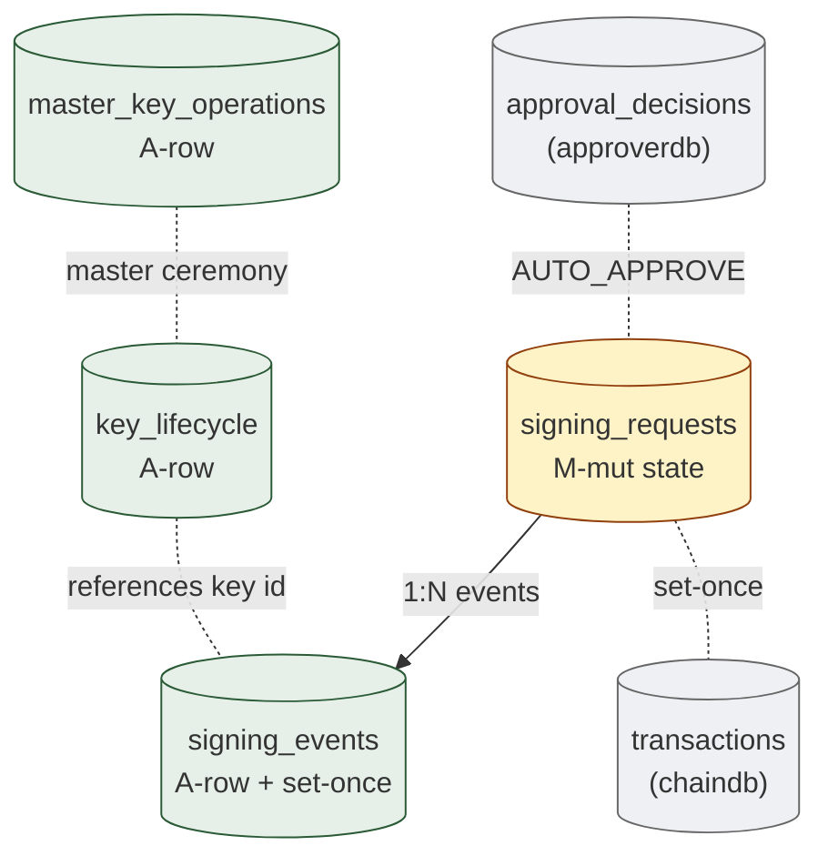

# 06. Signing & Execution Boundary
> 서명 ceremony 의 영속화 — runtime-only / forbidden 의 경계가 가장 명확한 도메인

이 도메인은 가장 strict 한 storage discipline 를 가집니다. 키 material 은 **forbidden** — DB 에 들어가지 않음. 서명 process 의 **결과 (receipt) 만** 영속화. Partial signature / session context 는 **runtime-only**.

**Owning DB**: `auditdb` (signing 결과의 evidence)
**Owning service**: Signing Service, Recovery Service (key lifecycle)
**Read-only consumers**: Audit, Reconciliation, Broadcast Service, Operator Console

---

## 1. 책임의 범위

| 본 도메인이 담당 | 본 도메인이 절대 담당하지 않음 |
|----------------|---------------------------|
| Signing request 의 lifecycle 영속화 | private key plaintext 저장 (forbidden) |
| Signing event (각 키의 서명 결과) 영속화 | mnemonic / seed phrase 저장 (forbidden) |
| Key lifecycle event (생성 / 활성화 / 회전 / 폐기) | MPC partial signature 저장 (runtime-only) |
| Master key operations (provisioning, TOFU pin) | HSM PIN / activation password 저장 (forbidden) |
| MRENCLAVE binding (어느 enclave image 가 서명했는지) | TEE sealing key 노출 (forbidden) |
| DCAP attestation 결과의 verification artifact | reconstructed key 의 영속화 (runtime-only) |

---

## 2. PK/FK dependency



---

## 3. `signing_requests`

### 3.1 책임

- 서명 ceremony 의 orchestration entity
- 3-key 또는 MPC variant 의 state machine 영속화
- ApprovalDecision (AUTO_APPROVE) 와 Transaction (signed result) 사이의 bridge

| 속성 | 값 |
|------|-----|
| Storage class | `M-mut` (state) + `A-set` (대부분 다른 컬럼) |
| Source of truth | row 자체 |
| Mutation authority | Signing Service |
| Read access | Audit, Reconciliation, Operator |
| Logical deletion | 금지 |
| Partitioning | per-month |

### 3.2 State machine

```
CREATED → INITIATOR_SIGNED → APPROVER_CO_SIGNED → ENCLAVE_VERIFIED →
EXECUTOR_SIGNED → KEY_ZEROIZED → READY_TO_BROADCAST ★

각 단계 → FAILED ★ 가능 (HSM down, attestation fail, sign fail)
```

state 진행은 strict sequential — 단계 건너뛰기 금지.

### 3.3 Schema 제안

| 컬럼 | 타입 | NULL | Class | 의미 |
|------|------|------|-------|------|
| `id` | UUID | NOT NULL | PK | |
| `approval_request_id` | UUID | NOT NULL | `A-set` | cross-DB ref: approverdb.approval_requests.id |
| `approval_decision_id` | UUID | NOT NULL | `A-set` | cross-DB ref: approverdb.approval_decisions.id (verdict=AUTO_APPROVE) |
| `tenant_id` | UUID | NOT NULL | `A-set` | tenant scope |
| `flow_type` | enum | NOT NULL | `A-set` | `'withdrawal'`, `'internal_transfer'`, `'sweep'`, `'unsafe-send'` |
| `chain_id` | TEXT | NOT NULL | `A-set` | which chain |
| `payload_to_sign` | BYTEA | NOT NULL | `A-set` | 서명 대상 raw payload (canonical) |
| `payload_hash` | BYTEA | NOT NULL | `A-set` | SHA-256(payload_to_sign) — set-once |
| `state` | enum | NOT NULL | `M-mut` | 위 state machine |
| `state_updated_at` | TIMESTAMPTZ | NOT NULL | `M-mut` |  |
| `initiator_key_id` | TEXT | NOT NULL | `A-set` | which key (HSM partition id 또는 MPC share id) — 키 material 아닌 식별자만 |
| `approver_key_id` | TEXT | NOT NULL | `A-set` | 같은 — 식별자 |
| `executor_key_id` | TEXT | NOT NULL | `A-set` | 같은 — 식별자 (TEE-sealed) |
| `mrenclave_required` | BYTEA | NOT NULL | `A-set` | 어느 enclave image 가 서명해야 하는지 — set-once |
| `started_at` | TIMESTAMPTZ | NOT NULL | `A-set` | CREATED 시점 |
| `completed_at` | TIMESTAMPTZ | NULL | `A-set` | READY_TO_BROADCAST 또는 FAILED 도달 시점 |
| `failure_reason` | TEXT | NULL | `A-set` | FAILED 시 reason |
| `version` | BIGINT | NOT NULL | `M-mut` | |

**중요**: `*_key_id` 는 키의 **식별자만** — 실제 키 material 은 HSM / TEE 안. DB 에는 어느 키를 사용했는지의 reference 만.

### 3.4 핵심 invariant

#### 3.4.1 State machine sticky

```sql
CREATE OR REPLACE FUNCTION enforce_signing_request_state()
RETURNS TRIGGER AS $$
BEGIN
  IF OLD.state IN ('READY_TO_BROADCAST', 'FAILED')
     AND NEW.state IS DISTINCT FROM OLD.state THEN
    RAISE EXCEPTION 'signing_request % already in terminal state %', OLD.id, OLD.state;
  END IF;
  -- 합법 transition 만 — 단계 건너뛰기 금지
  IF NOT (
    NEW.state = OLD.state OR
    (OLD.state = 'CREATED' AND NEW.state IN ('INITIATOR_SIGNED', 'FAILED')) OR
    (OLD.state = 'INITIATOR_SIGNED' AND NEW.state IN ('APPROVER_CO_SIGNED', 'FAILED')) OR
    (OLD.state = 'APPROVER_CO_SIGNED' AND NEW.state IN ('ENCLAVE_VERIFIED', 'FAILED')) OR
    (OLD.state = 'ENCLAVE_VERIFIED' AND NEW.state IN ('EXECUTOR_SIGNED', 'FAILED')) OR
    (OLD.state = 'EXECUTOR_SIGNED' AND NEW.state IN ('KEY_ZEROIZED', 'FAILED')) OR
    (OLD.state = 'KEY_ZEROIZED' AND NEW.state = 'READY_TO_BROADCAST')
  ) THEN
    RAISE EXCEPTION 'invalid state transition: % → %', OLD.state, NEW.state;
  END IF;
  RETURN NEW;
END;
$$ LANGUAGE plpgsql;
```

#### 3.4.2 `(approval_decision_id)` UNIQUE

한 ApprovalDecision (AUTO_APPROVE) 은 정확히 1 SigningRequest 를 생성:

```sql
CREATE UNIQUE INDEX uniq_signing_request_per_decision
  ON signing_requests (approval_decision_id);
```

재시도 (이전 SR 이 FAILED) 시 새 SR 생성 — 새 approval_decision 동반 (또는 같은 decision_id 재사용은 schema 정책 결정; 본 reference 는 1:1 권장).

### 3.5 Indexing

| Index | 목적 |
|-------|------|
| `signing_requests_pkey (id)` | PK |
| `uniq_signing_request_per_decision (approval_decision_id)` | 1:1 |
| `idx_signing_requests_state (state, state_updated_at)` | active SR query |
| `idx_signing_requests_approval (approval_request_id)` | request → SR lookup |

---

## 4. `signing_events`

### 4.1 책임

- 각 키 (개시 / 승인 / 실행) 의 서명 event 의 evidence — append-only + set-once
- TEE 가 발행한 receipt 의 영속화
- Audit chain 의 Layer 1 evidence 의 일부

| 속성 | 값 |
|------|-----|
| Storage class | `A-row` + `A-set` (모든 컬럼 set-once after insert) |
| Source of truth | row 자체 |
| Mutation authority | Signing Service 의 INSERT 만 — UPDATE / DELETE 절대 금지 |
| Read access | Audit, Reconciliation, External Auditor (verifying party) |
| Logical deletion | 절대 금지 |
| Partitioning | per-month |

### 4.2 Schema 제안

| 컬럼 | 타입 | NULL | Class | 의미 |
|------|------|------|-------|------|
| `id` | UUID | NOT NULL | PK | |
| `signing_request_id` | UUID | NOT NULL | `A-set` | FK signing_requests.id |
| `key_role` | enum | NOT NULL | `A-set` | `'initiator'`, `'approver'`, `'executor'` |
| `key_id` | TEXT | NOT NULL | `A-set` | 사용된 키의 식별자 (HSM partition / MPC share / TEE sealed) |
| `signature` | BYTEA | NOT NULL | `A-set` | 서명 자체 (Ed25519 또는 chain-native) |
| `signed_payload_hash` | BYTEA | NOT NULL | `A-set` | SHA-256(서명 대상 payload) |
| `chain_id` | TEXT | NOT NULL | `A-set` | |
| `tx_hash` | BYTEA | NULL | `A-set` | executor role 일 때만 — chain tx hash |
| `signed_at` | TIMESTAMPTZ | NOT NULL | `A-set` | 서명 완료 시각 |
| `mrenclave_at_signing` | BYTEA | NULL | `A-set` | executor role 일 때 — 어느 enclave image 가 서명했는지 |
| `dcap_attestation_id` | UUID | NULL | `A-set` | DCAP verification artifact reference (executor 일 때) |
| `enclave_pubkey` | BYTEA | NULL | `A-set` | enclave 의 verification pubkey (executor) |
| `approver_decision_rationale` | BYTEA | NULL | `A-set` | approver role 일 때 — CBOR-encoded PolicyDecision (cross-DB binding) |
| `prev_hash` | BYTEA | NULL | `A-set` | per-(partition) hash chain |
| `hash` | BYTEA | NOT NULL | `A-set` | this row 의 hash |
| `seq` | BIGINT | NOT NULL | `A-set` | per-partition sequence |
| `partition_key` | TEXT | NOT NULL | `A-set` | hash chain 의 partition (예: tenant_id) |
| `audit_event_id` | UUID | NULL | `A-set` | cross-binding to audit_events |
| `created_at` | TIMESTAMPTZ | NOT NULL | `A-set` | DB INSERT 시각 (= signed_at 와 거의 같음) |

### 4.3 핵심 invariant

#### 4.3.1 Append-only

```sql
CREATE TRIGGER signing_events_no_mutation
  BEFORE UPDATE OR DELETE ON signing_events
  FOR EACH ROW EXECUTE FUNCTION prevent_mutation_generic();
```

#### 4.3.2 Hash chain per partition

```sql
CREATE UNIQUE INDEX uniq_signing_event_seq
  ON signing_events (partition_key, seq);

-- hash chain enforcement trigger (§01 의 audit chain trigger 패턴 동일)
CREATE TRIGGER signing_events_hash_chain
  BEFORE INSERT ON signing_events
  FOR EACH ROW EXECUTE FUNCTION enforce_hash_chain_generic('signing_events');
```

#### 4.3.3 Role 별 invariant

```sql
-- executor role 은 mrenclave + dcap_attestation 필수
ALTER TABLE signing_events
  ADD CONSTRAINT chk_executor_attestation
  CHECK (
    key_role != 'executor' OR (
      mrenclave_at_signing IS NOT NULL AND
      dcap_attestation_id IS NOT NULL AND
      enclave_pubkey IS NOT NULL
    )
  );

-- approver role 은 approver_decision_rationale (CBOR) 필수
ALTER TABLE signing_events
  ADD CONSTRAINT chk_approver_rationale
  CHECK (
    key_role != 'approver' OR approver_decision_rationale IS NOT NULL
  );

-- executor 만 tx_hash 가짐
ALTER TABLE signing_events
  ADD CONSTRAINT chk_tx_hash_only_executor
  CHECK (
    (key_role = 'executor' AND tx_hash IS NOT NULL) OR
    (key_role IN ('initiator', 'approver') AND tx_hash IS NULL)
  );
```

#### 4.3.4 `(signing_request_id, key_role)` UNIQUE

한 SigningRequest 안에서 각 role 은 1 event만:

```sql
CREATE UNIQUE INDEX uniq_signing_event_request_role
  ON signing_events (signing_request_id, key_role);
```

### 4.4 Cross-DB binding

`signing_events.approver_decision_rationale` 컬럼은 **CBOR-encoded `PolicyDecision`** 를 보유. 이는 approverdb 의 `approval_decisions` 와 cross-DB tamper-evident binding 의 anchor:

- Auditor 가 approverdb 의 approval_decisions row 를 가져옴
- 같은 결정을 CBOR encode
- signing_events.approver_decision_rationale 와 비교
- 두 DB 의 변조가 일관되어야 통과 — single-DB tampering 시 불일치 발견

자세한 cross-DB evidence chain 은 [10-audit-evidence-integrity.md](10-audit-evidence-integrity.md) 참고.

### 4.5 Indexing

| Index | 목적 |
|-------|------|
| `signing_events_pkey (id)` | PK |
| `uniq_signing_event_request_role (signing_request_id, key_role)` | role UNIQUE |
| `uniq_signing_event_seq (partition_key, seq)` | hash chain ordering |
| `idx_signing_events_tx_hash (chain_id, tx_hash) WHERE tx_hash IS NOT NULL` | tx → signing event lookup |
| `idx_signing_events_mrenclave (mrenclave_at_signing) WHERE mrenclave_at_signing IS NOT NULL` | MRENCLAVE 별 audit (image rotation 추적) |
| `idx_signing_events_signed_at (signed_at)` | 시간 범위 query |

---

## 5. `key_lifecycle`

### 5.1 책임

- 모든 키의 lifecycle event 의 evidence — 생성 / 활성화 / 회전 / 비활성화 / 폐기
- 키 material 자체는 절대 없음 — event 의 metadata 만

| 속성 | 값 |
|------|-----|
| Storage class | `A-row` |
| Source of truth | row 자체 |
| Mutation authority | Signing Service / Recovery Service |
| Read access | Audit, External Auditor, Operator Console |
| Logical deletion | 절대 금지 |
| Partitioning | per-year (volume 낮음) |

### 5.2 Schema 제안

| 컬럼 | 타입 | NULL | Class | 의미 |
|------|------|------|-------|------|
| `id` | UUID | NOT NULL | PK | |
| `key_id` | TEXT | NOT NULL | `A-set` | 키 식별자 (HSM partition id, MPC share id, TEE sealed blob id) |
| `key_role` | enum | NOT NULL | `A-set` | `'initiator'`, `'approver'`, `'executor'`, `'master'` |
| `event_type` | enum | NOT NULL | `A-set` | `'GENERATED'`, `'ACTIVATED'`, `'ROTATED'`, `'DEACTIVATED'`, `'REVOKED'`, `'SEALED_TO_ENCLAVE'`, `'UNSEALED'` |
| `tenant_id` | UUID | NULL | `A-set` | tenant scope (NULL = global key) |
| `chain_id` | TEXT | NULL | `A-set` | chain-specific 키 (예: chain 별 다른 derivation) |
| `key_storage_type` | enum | NOT NULL | `A-set` | `'hsm-partition'`, `'tee-sealed'`, `'mpc-share'`, `'paper'` |
| `key_storage_ref` | TEXT | NOT NULL | `A-set` | storage 위치 식별자 (HSM serial 등) — 키 material 아님 |
| `pubkey` | BYTEA | NULL | `A-set` | 공개키 (verification 용; private 은 절대 없음) |
| `algorithm` | enum | NOT NULL | `A-set` | `'Ed25519'`, `'secp256k1'`, `'ECDSA-P256'` |
| `derivation_path` | TEXT | NULL | `A-set` | HD wallet path (해당 시) |
| `derived_from_key_id` | TEXT | NULL | `A-set` | parent key (HD derivation) |
| `mrenclave_binding` | BYTEA | NULL | `A-set` | TEE-sealed 키의 MRENCLAVE |
| `event_at` | TIMESTAMPTZ | NOT NULL | `A-set` | event 발생 시각 |
| `performed_by_quorum_id` | UUID | NULL | `A-set` | recovery_events / ceremony 참조 |
| `audit_event_id` | UUID | NULL | `A-set` | cross-binding |
| `seq` | BIGINT | NOT NULL | `A-set` | global sequence (또는 per-key sequence) |
| `prev_hash` | BYTEA | NULL | `A-set` | hash chain |
| `hash` | BYTEA | NOT NULL | `A-set` | |

### 5.3 핵심 invariant

#### 5.3.1 Append-only

```sql
CREATE TRIGGER key_lifecycle_no_mutation
  BEFORE UPDATE OR DELETE ON key_lifecycle
  FOR EACH ROW EXECUTE FUNCTION prevent_mutation_generic();
```

#### 5.3.2 키 material 부재 검증

DB schema 자체에 `private_key`, `seed`, `mnemonic`, `key_share` 같은 컬럼이 **없도록** schema review 강제. CI lint:

```bash
# schema-lint.sh (예시)
forbidden_patterns=(
  'private_key' 'privatekey' 'priv_key' 'seed' 'mnemonic'
  'secret_key' 'key_share' 'partial_signature' 'sealing_key'
)
for pat in "${forbidden_patterns[@]}"; do
  if grep -i "$pat" schema/*.sql; then
    echo "FORBIDDEN column pattern '$pat' in schema"
    exit 1
  fi
done
```

#### 5.3.3 Event 순서의 정합성

같은 key 의 event 순서 — application 책임:

```
GENERATED → ACTIVATED → (rotation / deactivation / revocation)
SEALED_TO_ENCLAVE 는 GENERATED 후 한 번만
UNSEALED 은 SEALED_TO_ENCLAVE 후 가능
```

### 5.4 Indexing

| Index | 목적 |
|-------|------|
| `key_lifecycle_pkey (id)` | PK |
| `idx_key_lifecycle_key_event (key_id, event_at)` | per-key history |
| `idx_key_lifecycle_event_type (event_type, event_at)` | event type 별 audit |
| `idx_key_lifecycle_mrenclave (mrenclave_binding)` | MRENCLAVE 추적 |

---

## 6. `master_key_operations`

### 6.1 책임

- Master KEK provisioning 의 ceremony evidence
- TOFU (Trust on First Use) pin record
- Config signing 의 evidence

이는 특별히 high-stakes 한 event — 별도 테이블 분리 권장.

### 6.2 Schema 제안

| 컬럼 | 타입 | NULL | Class | 의미 |
|------|------|------|-------|------|
| `id` | UUID | NOT NULL | PK | |
| `operation_type` | enum | NOT NULL | `A-set` | `'MASTER_KEY_GENERATION'`, `'RSA_OAEP_WRAP_TO_ENCLAVE'`, `'TOFU_PIN_RECORD'`, `'CONFIG_SIGNING'`, `'MASTER_KEY_ROTATION'` |
| `master_key_id` | TEXT | NOT NULL | `A-set` | master key identifier |
| `quorum_ceremony_id` | UUID | NOT NULL | `A-set` | recovery_events ceremony 참조 |
| `participants` | JSONB | NOT NULL | `A-set` | m-of-n 운영자 list (operator IDs, 키 material 아님) |
| `enclave_target_pubkey` | BYTEA | NULL | `A-set` | RSA-OAEP wrap 의 대상 enclave 의 one-time RSA pubkey |
| `wrapped_payload_hash` | BYTEA | NULL | `A-set` | wrapped master key 의 hash (검증용; payload 자체는 enclave 외부 노출 안 됨) |
| `mrenclave_target` | BYTEA | NULL | `A-set` | sealing 대상 MRENCLAVE |
| `tofu_first_pubkey` | BYTEA | NULL | `A-set` | TOFU pin 의 처음 본 pubkey |
| `tofu_pinned_at` | TIMESTAMPTZ | NULL | `A-set` | TOFU pin 시각 |
| `operation_signature` | BYTEA | NOT NULL | `A-set` | 운영자 quorum 의 서명 (multi-sig 또는 sequential signatures) |
| `external_evidence_ref` | TEXT | NOT NULL | `A-set` | 회의록 / 외부 system 의 reference (URL or document id) |
| `performed_at` | TIMESTAMPTZ | NOT NULL | `A-set` | |
| `audit_event_id` | UUID | NULL | `A-set` | cross-binding |

### 6.3 핵심 invariant

#### 6.3.1 Append-only

```sql
CREATE TRIGGER master_key_operations_no_mutation
  BEFORE UPDATE OR DELETE ON master_key_operations
  FOR EACH ROW EXECUTE FUNCTION prevent_mutation_generic();
```

#### 6.3.2 TOFU pin 의 UNIQUE

같은 master_key_id 에 TOFU pin 은 한 번만:

```sql
CREATE UNIQUE INDEX uniq_tofu_pin_per_key
  ON master_key_operations (master_key_id)
  WHERE operation_type = 'TOFU_PIN_RECORD';
```

TOFU pin 변경 = ceremony level event (수십 년에 한 번; charter-class operation).

#### 6.3.3 Quorum participants 의 schema

`participants` JSONB 의 schema (application 검증):
```json
{
  "quorum_threshold": "4-of-7",
  "members": [
    {"operator_id": "uuid", "role": "approver", "signed_at": "iso8601"},
    ...
  ]
}
```

m 명의 서명이 모두 포함되어야 valid.

### 6.4 Indexing

| Index | 목적 |
|-------|------|
| `master_key_operations_pkey (id)` | PK |
| `idx_mko_master_key (master_key_id, performed_at)` | per-key ceremony history |
| `idx_mko_operation_type (operation_type, performed_at)` | type 별 audit |
| `uniq_tofu_pin_per_key` | TOFU UNIQUE |

---

## 7. Forbidden storage — 명시적 catalog

본 도메인은 다음을 **schema 에 두지 않음** (lint 로 검증):

| Forbidden | 어디에 존재 |
|-----------|------------|
| Private key (HSM-held) | HSM 내부 (PKCS#11 session 으로만 접근) |
| Private key (TEE-sealed) | sealed blob (disk file) — MRENCLAVE 에 봉인 |
| Mnemonic / seed | 운영자 brain / 종이 (HSM PED) |
| Reconstructed key | 메모리 — ceremony 후 zeroize |
| Raw MPC share (plaintext) | 각 MPC node 의 HSM-equivalent secure storage |
| HSM PIN / activation password | hardware token (YubiKey 등) / 운영자 brain |
| TEE sealing key | hardware-bound — 외부 노출 0 |
| DCAP attestation private key | hardware attestation infrastructure |
| Master KEK plaintext | HSM 내부에서만 |

본 도메인 testifies (`signing_events`, `key_lifecycle`, `master_key_operations`) the **result** of operations involving these keys, never the keys themselves.

---

## 8. Runtime-only — 영속화 금지

| Runtime data | 어디에 존재 |
|-------------|------------|
| MPC partial signature | application memory; 서명 완료 후 zeroize |
| Reconstructed key (ceremony 중) | memory; ceremony 후 zeroize |
| HSM PKCS#11 session handle | session-bound; close 시 무효 |
| TEE enclave 의 ephemeral RSA keypair (provisioning) | enclave 내부; 1회 사용 후 폐기 |
| DCAP attestation quote 자체 | session memory; verify 후 결과 (pubkey) 만 저장 |
| Signing context (in-flight payload) | application memory; 서명 완료 후 폐기 |

이들이 **schema 에 컬럼이 생기면 review 거절**. 검증은 schema-lint + code review.

---

## 9. Cross-DB references

| 외부 reference | 어디서 사용 |
|---------------|------------|
| `signing_requests.approval_request_id` → approverdb.approval_requests.id | 어떤 approval 의 후속인지 |
| `signing_requests.approval_decision_id` → approverdb.approval_decisions.id | verdict source |
| `signing_events.tx_hash` → chaindb.transactions.tx_hash | chain tx binding |
| `signing_events.audit_event_id` → audit_events.id (same DB) | audit binding |
| `key_lifecycle.performed_by_quorum_id` → recovery_events.ceremony_id (same DB) | ceremony reference |

auditdb 안의 cross-table 은 FK 가능. 다른 DB 와는 application + reconciliation.

---

## 10. Reconciliation 의 signing 도메인 query

```sql
-- 모든 READY_TO_BROADCAST 한 SR 에 3개 signing_events 존재해야 함
SELECT sr.id, COUNT(se.id) AS event_count
FROM signing_requests sr
LEFT JOIN signing_events se ON se.signing_request_id = sr.id
WHERE sr.state = 'READY_TO_BROADCAST'
GROUP BY sr.id
HAVING COUNT(se.id) < 3;
-- 결과 비어 있어야

-- MRENCLAVE 변경 추적 (어느 시점에 어떤 image 가 활성)
SELECT
  DATE(signed_at) AS day,
  mrenclave_at_signing,
  COUNT(*) AS sign_count
FROM signing_events
WHERE key_role = 'executor'
GROUP BY DATE(signed_at), mrenclave_at_signing
ORDER BY day DESC;
-- MRENCLAVE rotation event 의 자취

-- DENY 였는데 후속 SigningRequest 있음 (있으면 안 됨)
SELECT sr.id FROM signing_requests sr
JOIN approverdb.approval_decisions ad ON ad.id = sr.approval_decision_id
WHERE ad.verdict = 'DENY';
-- 결과 비어 있어야 — 있으면 catastrophic 사고
```

---

## 11. External auditor 의 verification

외부 감사관이 본 도메인 데이터로 verification 수행:

1. **DCAP attestation 으로 enclave pubkey 확보** (chain 외부 attestation infrastructure)
2. **`signing_events` 의 row 조회** (read-only)
3. **각 row 의 `signature` 검증**: payload_hash 와 enclave_pubkey 로 signature 검증
4. **`mrenclave_at_signing` 비교**: registered MRENCLAVE list 와 일치 확인
5. **`approver_decision_rationale` (CBOR) 의 디코딩**: approverdb 의 approval_decisions 와 cross-DB 일관성 검증
6. **hash chain replay**: `signing_events` 의 prev_hash 연속성 검증

이 5 단계가 audit-reviewable schema 의 핵심.

---

## 12. Operational considerations

### 12.1 Signing service 의 in-flight context

- 서명 중인 SigningRequest 의 in-memory context 는 runtime-only.
- Service restart 시 in-flight SR 은 어떻게 처리하나? — schema 에 `state` 가 중간 단계 (예: `INITIATOR_SIGNED`) 로 남아 있으면 application 이 진단:
  - HSM 에 partial signing 결과 있나? → 그대로 재진행
  - 없나? → SR 을 FAILED 처리 후 새 SR 생성 (approval_decision 재사용 또는 새 approval)

### 12.2 MRENCLAVE rotation

- enclave image 가 update 되면 새 MRENCLAVE.
- 새 image deployment 전 `master_key_operations.RSA_OAEP_WRAP_TO_ENCLAVE` ceremony 로 sealed blob 재생성.
- 기존 sealed blob 은 폐기 (운영자 quorum 결정).
- 모든 변경은 `key_lifecycle.SEALED_TO_ENCLAVE` event 영속화.

### 12.3 Backup / DR

- `signing_events` 는 institution 의 audit defense 의 일부 — **synchronous replication 필수**.
- Sealed blob (TEE-side) 의 backup: 별도 file system + integrity check (sealed blob 자체는 MRENCLAVE 에 봉인되어 있어 노출 위험 낮음).
- HSM backup: HSM vendor 의 ceremony (Thales SafeNet Backup, Utimaco backup 등).

---

## 13. Anti-patterns

| Anti-pattern | 왜 안 좋은가 |
|--------------|-------------|
| `private_key` / `seed` / `mnemonic` 컬럼이 schema 에 존재 | forbidden storage 위반 |
| MPC partial signature 를 DB 또는 Redis 에 저장 | runtime-only 위반 |
| `signing_events.signature` 를 UPDATE | 사후 서명 변조 가능 |
| `mrenclave_at_signing` mutable | 어느 image 가 서명했는지 변조 가능 |
| `approver_decision_rationale` 누락 | cross-DB binding 깨짐 — audit defense 약화 |
| 키 material 을 log 에 출력 | 노출 incident |
| HSM session handle 을 DB 에 저장 | session 만료 후 stale data |
| Sealed blob 을 plaintext DB column 으로 | TEE binding 의 의미 무력화 |
| TOFU pin 의 UNIQUE 제약 누락 | 키 ownership 모호 |
| `key_lifecycle` 의 DELETE 허용 | 키 history 손상 — audit unreviewable |

---

## 14. 다음 읽을 글

- Approval & Governance (이 도메인이 받아오는 verdict) → [05-approval-governance.md](05-approval-governance.md)
- Chain submit (signing 의 후속) → [04-transaction-orchestration.md](04-transaction-orchestration.md)
- Audit chain (signing_events 의 binding) → [10-audit-evidence-integrity.md](10-audit-evidence-integrity.md)
- Recovery ceremony (key lifecycle 의 source) → [11-recovery-ceremony.md](11-recovery-ceremony.md)
