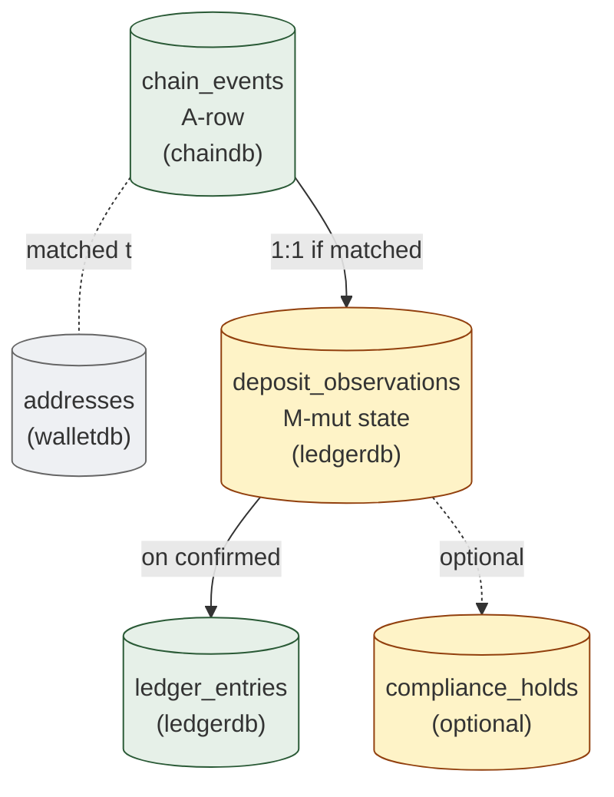

# 07. Deposit Observation
> Chain 의 fact 를 internal ledger 로 controlled recognition

이 도메인은 외부 → custody 의 자금 이동의 영속화. 서명 ceremony 없음 — observation path. Chain event 의 mirror → finality threshold + compliance gate → ledger entry 생성.

**Owning DB**: `chaindb` (chain events) + `ledgerdb` (deposit_observations)
**Owning service**: Chain Adapter (chain event), Deposit Service (recognition)
**Read-only consumers**: Ledger Service, Compliance Service, Reconciliation Service, Audit Service

---

## 1. 책임의 범위

| 본 도메인이 담당 | 본 도메인이 담당하지 않음 |
|----------------|------------------------|
| Chain event ingestion (`chain_events`) | 서명 (deposit 은 서명 ceremony 없음) |
| Address matching (chain event → wallet) | KYC 자체 (KYC system 외부) |
| Finality threshold 도달 추적 | Sweep 의 서명 (Withdrawal lifecycle 거침) |
| Compliance hold lifecycle | AML / sanctions 의 결정 (Compliance Service) |
| Reorg 발견 + handling | reorg 후 자금 처리 결정 (Operator) |
| Ledger entry 발행 (CREDIT) | balance cache update (Ledger Service) |

---

## 2. PK/FK dependency



---

## 3. `chain_events`

### 3.1 책임

- Chain RPC 또는 indexer 로부터 관찰한 chain event 의 mirror
- Append-only — chain 의 fact 자체는 immutable
- Address matching 의 input

| 속성 | 값 |
|------|-----|
| Storage class | `A-row` |
| Source of truth | chain 자체 (이건 mirror) |
| Mutation authority | Chain Adapter |
| Read access | Deposit Service, Reconciliation Service, Audit |
| Logical deletion | 절대 금지 |
| Partitioning | per-month + per-chain (높은 volume) |

### 3.2 Event 의 종류

| `event_type` | 의미 |
|--------------|------|
| `deposit_incoming` | 우리 wallet 으로의 incoming 자금 |
| `withdrawal_confirmed` | 우리가 발행한 tx 의 chain confirmation |
| `sweep_confirmed` | 우리 sweep tx 의 confirmation |
| `internal_movement` | chain 상 우리 wallet 간 이동 (드물지만 가능) |
| `unknown_outgoing` | source 가 우리 wallet 이지만 internal record 없음 — incident |
| `dust` | minimal-amount transfer (정책상 무시 또는 별도 처리) |

### 3.3 Schema 제안

| 컬럼 | 타입 | NULL | Class | 의미 |
|------|------|------|-------|------|
| `id` | UUID | NOT NULL | PK | event row id |
| `chain_id` | TEXT | NOT NULL | `A-set` | |
| `tx_hash` | BYTEA | NOT NULL | `A-set` | chain tx hash |
| `log_index` | INT | NULL | `A-set` | EVM logs 의 index (해당 시) — 같은 tx 안의 multi-event 구분 |
| `event_type` | enum | NOT NULL | `A-set` | 위 §3.2 |
| `from_address` | TEXT | NULL | `A-set` | source (incoming 의 경우 외부) |
| `to_address` | TEXT | NOT NULL | `A-set` | destination |
| `asset_id` | TEXT | NOT NULL | `A-set` | (chain, contract) tuple |
| `amount` | NUMERIC(38,0) | NOT NULL | `A-set` | smallest unit |
| `block_height` | BIGINT | NOT NULL | `A-set` | |
| `block_hash` | BYTEA | NOT NULL | `A-set` | |
| `block_timestamp` | TIMESTAMPTZ | NOT NULL | `A-set` | chain 의 block time |
| `confirmation_depth` | INT | NOT NULL | `A-set` | 관찰 시점의 depth (관찰 후 chain 진행으로 증가하지만 본 row 의 값은 set-once) |
| `is_finalized` | BOOLEAN | NOT NULL | `A-set` | observe 시점의 finality |
| `is_reorged` | BOOLEAN | NOT NULL | `A-set` | 본 row 가 reorg 됐는지 (별도 new row 가 finalized view) |
| `superseded_by_id` | UUID | NULL | `A-set` | reorg 후 새 row 의 id |
| `matched_address_id` | UUID | NULL | `A-set` | walletdb.addresses.id (매칭된 경우) |
| `matched_wallet_id` | UUID | NULL | `A-set` | walletdb.wallets.id (매칭된 경우) |
| `raw_event_payload` | JSONB | NOT NULL | `A-set` | chain 의 raw event (RPC 응답) |
| `observed_at` | TIMESTAMPTZ | NOT NULL | `A-set` | Adapter 가 본 시점 |
| `created_at` | TIMESTAMPTZ | NOT NULL | `A-set` | DB INSERT 시점 (보통 observed_at 와 같음) |

### 3.4 핵심 invariant

#### 3.4.1 Append-only

```sql
CREATE TRIGGER chain_events_no_mutation
  BEFORE UPDATE OR DELETE ON chain_events
  FOR EACH ROW EXECUTE FUNCTION prevent_mutation_generic();
```

#### 3.4.2 `(chain_id, tx_hash, log_index)` UNIQUE

같은 chain event 가 두 row 면 double-counting:

```sql
CREATE UNIQUE INDEX uniq_chain_event
  ON chain_events (chain_id, tx_hash, COALESCE(log_index, -1));
```

NULL 처리: `COALESCE(log_index, -1)` 로 NULL-safe.

#### 3.4.3 Reorg 표현

reorg 발견 시 새 row INSERT (다른 block_hash + 같은 tx_hash 가능). **이전 row 의 `is_reorged` UPDATE 금지** (append-only 위반). 대신 별도 `chain_event_reorg_supersession` 테이블 또는 application query 가 latest row 우선.

권장: application query 가 latest-by-observed-at 우선:

```sql
SELECT DISTINCT ON (chain_id, tx_hash, COALESCE(log_index, -1))
  *
FROM chain_events
ORDER BY chain_id, tx_hash, COALESCE(log_index, -1), observed_at DESC;
```

이 view 의 `is_finalized = true` 가 canonical.

### 3.5 Indexing

| Index | 목적 |
|-------|------|
| `chain_events_pkey (id)` | PK |
| `uniq_chain_event (chain_id, tx_hash, log_index)` | dedup |
| `idx_chain_events_to_address (chain_id, to_address, observed_at DESC)` | address → events lookup |
| `idx_chain_events_matched_wallet (matched_wallet_id, observed_at DESC) WHERE matched_wallet_id IS NOT NULL` | wallet → deposits |
| `idx_chain_events_unmatched (chain_id, observed_at) WHERE matched_address_id IS NULL` | unmatched events 대상 |
| `idx_chain_events_event_type (event_type, observed_at)` | event type 별 query |
| `idx_chain_events_block (chain_id, block_height)` | block 단위 query (reorg 영향 분석) |

### 3.6 Partitioning

큰 institution / 활성 chain 에서:

```sql
CREATE TABLE chain_events (...) PARTITION BY LIST (chain_id);
-- chain 별 partition
CREATE TABLE chain_events_eth PARTITION OF chain_events FOR VALUES IN ('ethereum-mainnet');
CREATE TABLE chain_events_btc PARTITION OF chain_events FOR VALUES IN ('bitcoin-mainnet');
-- 그 안에서 다시 time-range
```

또는 단순히 per-month + chain-id index.

---

## 4. `deposit_observations`

### 4.1 책임

- Chain event → wallet 매칭된 deposit 의 lifecycle 영속화
- Finality threshold 도달 + compliance check 통과 시 ledger entry 발행
- Reorg / compliance hold 처리

| 속성 | 값 |
|------|-----|
| Storage class | `M-mut` (state) + `A-set` (대부분 다른 컬럼) |
| Source of truth | row 자체 |
| Mutation authority | Deposit Service |
| Read access | Wallet Service, Compliance Service, Audit, Reconciliation |
| Logical deletion | 금지 |
| Partitioning | per-month |

### 4.2 State machine

```
CHAIN_EVENT_RECEIVED → ADDRESS_MATCHED → CONFIRMING →
PENDING_DEPOSIT → COMPLIANCE_CHECK →
   ├─ pass → CONFIRMED_DEPOSIT ★
   └─ hold → HELD → 
      ├─ manual release → CONFIRMED_DEPOSIT ★
      └─ reject → REJECTED ★

또는: CONFIRMING -.reorg.-> REORGED → REJECTED ★
```

### 4.3 Schema 제안

| 컬럼 | 타입 | NULL | Class | 의미 |
|------|------|------|-------|------|
| `id` | UUID | NOT NULL | PK | |
| `chain_event_id` | UUID | NOT NULL | `A-set` | cross-DB ref: chaindb.chain_events.id |
| `chain_id` | TEXT | NOT NULL | `A-set` | denormalized |
| `tx_hash` | BYTEA | NOT NULL | `A-set` | denormalized for query |
| `matched_address_id` | UUID | NOT NULL | `A-set` | cross-DB ref: walletdb.addresses.id |
| `matched_wallet_id` | UUID | NOT NULL | `A-set` | denormalized |
| `matched_account_id` | UUID | NOT NULL | `A-set` | ledger_accounts.id (asset 별) |
| `from_address` | TEXT | NULL | `A-set` | source (외부) |
| `asset_id` | TEXT | NOT NULL | `A-set` | |
| `amount` | NUMERIC(38,0) | NOT NULL | `A-set` | |
| `state` | enum | NOT NULL | `M-mut` | 위 state machine |
| `state_updated_at` | TIMESTAMPTZ | NOT NULL | `M-mut` | |
| `confirmation_target` | INT | NOT NULL | `A-set` | chain 의 finality threshold (관찰 시점에 lock) |
| `current_confirmation_depth` | INT | NOT NULL | `M-cache` | 최근 관찰된 depth (advisory) |
| `confirmed_at` | TIMESTAMPTZ | NULL | `A-set` | PENDING_DEPOSIT 진입 시각 |
| `compliance_check_started_at` | TIMESTAMPTZ | NULL | `A-set` | |
| `compliance_check_result` | enum | NULL | `A-set` | `'pass'`, `'hold'`, `'reject'` |
| `compliance_held_reason` | TEXT | NULL | `A-set` | hold 사유 |
| `compliance_resolved_at` | TIMESTAMPTZ | NULL | `A-set` | set-once |
| `compliance_resolved_by` | UUID | NULL | `A-set` | resolver operator |
| `ledger_entry_id` | UUID | NULL | `A-set` | confirmed 시 발행된 ledger_entries.id |
| `reorged_at` | TIMESTAMPTZ | NULL | `A-set` | reorg 발견 시각 |
| `created_at` | TIMESTAMPTZ | NOT NULL | `A-set` | |
| `version` | BIGINT | NOT NULL | `M-mut` | |

### 4.4 핵심 invariant

#### 4.4.1 State machine sticky

terminal: `CONFIRMED_DEPOSIT`, `REJECTED`.

```sql
CREATE OR REPLACE FUNCTION enforce_deposit_observation_state()
RETURNS TRIGGER AS $$
BEGIN
  IF OLD.state IN ('CONFIRMED_DEPOSIT', 'REJECTED')
     AND NEW.state IS DISTINCT FROM OLD.state THEN
    RAISE EXCEPTION 'deposit_observation % already terminal %', OLD.id, OLD.state;
  END IF;
  RETURN NEW;
END;
$$ LANGUAGE plpgsql;
```

#### 4.4.2 `(chain_event_id)` UNIQUE

한 chain event 는 1 deposit_observation 만:

```sql
CREATE UNIQUE INDEX uniq_deposit_per_event
  ON deposit_observations (chain_event_id);
```

#### 4.4.3 Set-once columns

`ledger_entry_id`, `confirmed_at`, `compliance_resolved_at` 등 — NULL → 1회 set:

```sql
CREATE TRIGGER deposit_observations_set_once
  BEFORE UPDATE ON deposit_observations
  FOR EACH ROW EXECUTE FUNCTION enforce_set_once_columns(
    ARRAY['ledger_entry_id', 'confirmed_at',
          'compliance_resolved_at', 'compliance_resolved_by',
          'reorged_at']
  );
```

### 4.5 Finality threshold 처리

```
Chain Adapter 가 chain_events 에 새 row INSERT 후:

if deposit_observation.state == 'CONFIRMING':
  current_depth = (현재 chain head height) - chain_event.block_height
  
  if current_depth >= deposit_observation.confirmation_target:
    if not reorged:
      state = 'PENDING_DEPOSIT'
      confirmed_at = NOW()
  else if current chain head 의 block_hash != recorded block_hash:
    # reorg 의심
    state = 'REORGED'
    reorged_at = NOW()
```

`confirmation_target` 은 chain config 의 finality_threshold 를 deposit 발생 시점에 snapshot — 사후 chain config 변경에 무관.

### 4.6 Compliance check 통합

```
PENDING_DEPOSIT → Compliance Service 가 자동 check:
  - from_address 가 sanctions / blacklist 에 있는가?
  - amount 가 KYC tier 의 한계를 넘는가?
  - VASP / Travel Rule 정보 필요한가?
  
결과:
  pass → CONFIRMED_DEPOSIT (ledger_entry CREDIT 발행)
  hold → HELD (운영자 manual review)
  reject → REJECTED (legal hold; 자금 reversal 또는 freeze)
```

자세한 compliance 결정 의 영속화는 별도 (본 도메인은 결과만 기록).

### 4.7 Reorg 처리

```
chain_events 에 새 row INSERT 시 같은 (chain_id, tx_hash, log_index) 의 이전 row 와 block_hash 다름:
  Application 이 reorg 감지:
    1. 이전 chain_event 의 superseded_by_id 를 (개념상 — append-only 라 별도 mapping table)
    2. deposit_observation 의 state = 'REORGED'
    3. 만약 이미 CONFIRMED_DEPOSIT 였다면:
       - ledger_entries 에 reversal entry 발행 (CREDIT 의 reversal = DEBIT)
       - operator alert
       - manual review 후 처리 결정
```

### 4.8 Indexing

| Index | 목적 |
|-------|------|
| `deposit_observations_pkey (id)` | PK |
| `uniq_deposit_per_event (chain_event_id)` | 1:1 |
| `idx_deposit_observations_state (state, state_updated_at) WHERE state IN ('CONFIRMING', 'PENDING_DEPOSIT', 'COMPLIANCE_CHECK', 'HELD')` | active deposit query |
| `idx_deposit_observations_wallet (matched_wallet_id, created_at DESC)` | wallet 별 deposit history |
| `idx_deposit_observations_confirming (chain_id, confirmation_target, current_confirmation_depth) WHERE state = 'CONFIRMING'` | finality 도달 후보 |
| `idx_deposit_observations_held (state, compliance_check_started_at) WHERE state = 'HELD'` | compliance review backlog |

---

## 5. `compliance_holds` (optional)

deposit 외에도 withdrawal / internal transfer 의 compliance hold 가 발생 가능. 본 도메인은 deposit 의 hold 만 다루지만 별도 `compliance_holds` 테이블로 통합 가능:

| 컬럼 | 타입 | Class | 의미 |
|------|------|-------|------|
| `id` | UUID | PK | |
| `subject_aggregate_type` | enum | `A-set` | `'deposit_observation'`, `'withdrawal'`, `'internal_transfer'` |
| `subject_aggregate_id` | UUID | `A-set` | |
| `hold_reason` | enum | `A-set` | `'aml'`, `'sanctions'`, `'kyc_tier'`, `'travel_rule'`, `'manual'` |
| `held_at` | TIMESTAMPTZ | `A-set` | |
| `held_by` | UUID | `A-set` | (system 또는 operator) |
| `resolution` | enum | `A-set` (set-once) | `'released'`, `'rejected'`, `'expired'` |
| `resolved_at` | TIMESTAMPTZ | `A-set` (set-once) | |
| `resolved_by` | UUID | `A-set` (set-once) | |
| `resolution_evidence_ref` | TEXT | `A-set` (set-once) | 회의록 / 외부 system 결정 의 reference |

본 reference 는 deposit 내부의 hold 만 inline 처리하지만, multi-aggregate 통합을 위해 별도 테이블 권장.

---

## 6. Cross-DB references

| 외부 reference | 어디서 사용 |
|---------------|------------|
| `deposit_observations.chain_event_id` → chaindb.chain_events.id | source chain event |
| `deposit_observations.matched_address_id` → walletdb.addresses.id | matched address |
| `deposit_observations.matched_wallet_id` → walletdb.wallets.id | matched wallet |
| `deposit_observations.matched_account_id` → ledgerdb.ledger_accounts.id (same DB!) | account for credit |
| `deposit_observations.ledger_entry_id` → ledgerdb.ledger_entries.id (same DB!) | credit entry |

대부분 cross-DB. application 책임으로 정합성 유지.

---

## 7. Reconciliation 의 deposit 도메인 query

```sql
-- 모든 PENDING_DEPOSIT 가 compliance check 시작했어야
SELECT id, state, confirmed_at FROM deposit_observations
WHERE state = 'PENDING_DEPOSIT'
  AND confirmed_at < NOW() - INTERVAL '10 minutes'
  AND compliance_check_started_at IS NULL;
-- 결과 비어 있어야 — Compliance Service fail signal

-- 모든 CONFIRMED_DEPOSIT 가 ledger_entry 가져야
SELECT id, state, ledger_entry_id FROM deposit_observations
WHERE state = 'CONFIRMED_DEPOSIT' AND ledger_entry_id IS NULL;
-- 결과 비어 있어야

-- Unmatched chain events 가 너무 많으면 alert
SELECT chain_id, COUNT(*) AS unmatched
FROM chain_events
WHERE matched_address_id IS NULL
  AND event_type = 'deposit_incoming'
  AND observed_at > NOW() - INTERVAL '1 hour'
GROUP BY chain_id
HAVING COUNT(*) > 100;
-- threshold 의 임의값 — institution 마다 다름; 큰 spike 는 attack / 잘못된 자금 incoming 가능성

-- Reorged 후 처리 안 된 deposit (REORGED 상태로 N 시간 머무름)
SELECT id, reorged_at FROM deposit_observations
WHERE state = 'REORGED' AND reorged_at < NOW() - INTERVAL '2 hours';
-- 운영자 alert
```

---

## 8. Operational considerations

### 8.1 Chain Adapter 의 polling vs subscription

- **Polling** (예: 매 N 초 RPC `eth_getLogs`): retry-safe, idempotent. INSERT 시 UNIQUE constraint 가 dedup.
- **Subscription** (WebSocket): 실시간성 좋음; 연결 끊기면 gap 발생 가능 — polling 으로 backfill.

본 reference 는 polling 기반 권장 (단순성 + 실패 복구).

### 8.2 큰 시간 윈도우의 backfill

Adapter 재시작 또는 신규 chain 추가 시 historical events 의 backfill:

```
last_processed_block = SELECT MAX(block_height) FROM chain_events WHERE chain_id = ?
for block in (last_processed_block + 1, current_chain_head):
  events = rpc.get_logs(block_range)
  insert events into chain_events (with UNIQUE constraint dedup)
```

### 8.3 Sweep 의 후속 처리

deposit 이 CONFIRMED_DEPOSIT 되면 자금이 user wallet 에 있음. 대부분 institution 은 **자동 sweep** (user wallet → omnibus wallet) — sweep 은 chain transaction 이라 **Withdrawal lifecycle 거침**:

```
deposit confirmed → 
  Sweep Service 가 새 Withdrawal 생성 (source = user wallet, destination = omnibus address):
  - Approval Request (정책 통과)
  - 3-key Signing
  - Chain broadcast
  - Confirmation
  - Ledger: user wallet DEBIT + omnibus wallet CREDIT
```

Sweep 은 본 도메인의 책임 아님 — Withdrawal lifecycle (`08-withdrawal-lifecycle.md`) 참고.

### 8.4 Dust handling

매우 작은 amount 의 incoming (fee 보다 작은 transfer) — 처리 정책:
- 무시 (chain_events 에 기록하되 deposit_observation 생성 안 함)
- 별도 collection wallet 으로 sweep (chain fee 절감)
- institution 정책에 따라 결정

---

## 9. Anti-patterns

| Anti-pattern | 왜 안 좋은가 |
|--------------|-------------|
| Chain event 감지 즉시 ledger CREDIT | reorg 시 자금 두 번 계산 가능 |
| `chain_events` 의 row UPDATE | append-only 위반 |
| Reorg 시 이전 chain_events row 의 `is_reorged` UPDATE | 같음 |
| Finality threshold 무시 | 1 confirmation 에서 ledger 반영 → reorg risk |
| Compliance check 없이 CONFIRMED_DEPOSIT | AML / sanctions 노출 |
| `(chain_id, tx_hash, log_index)` 의 UNIQUE 누락 | duplicate INSERT 시 double-credit |
| Sweep 을 deposit 의 일부로 처리 | 자금 이동의 ceremony 무력화 |
| Unmatched chain events 의 monitoring 없음 | 잘못된 incoming 또는 잘못된 wallet mapping 미감지 |
| `confirmation_target` mutable | 사후 finality 기준 변경 |
| Backfill 시 UNIQUE constraint 의존 안 함 | duplicate INSERT 시 race |

---

## 10. 다음 읽을 글

- 자금이 ledger 에 들어가는 곳 → [03-ledger-settlement.md](03-ledger-settlement.md)
- Sweep 이 거치는 withdrawal lifecycle → [08-withdrawal-lifecycle.md](08-withdrawal-lifecycle.md)
- Compliance hold 의 통합 model → [05-approval-governance.md](05-approval-governance.md)
- Reconciliation 의 cross-domain query → [09-reconciliation-consistency.md](09-reconciliation-consistency.md)
