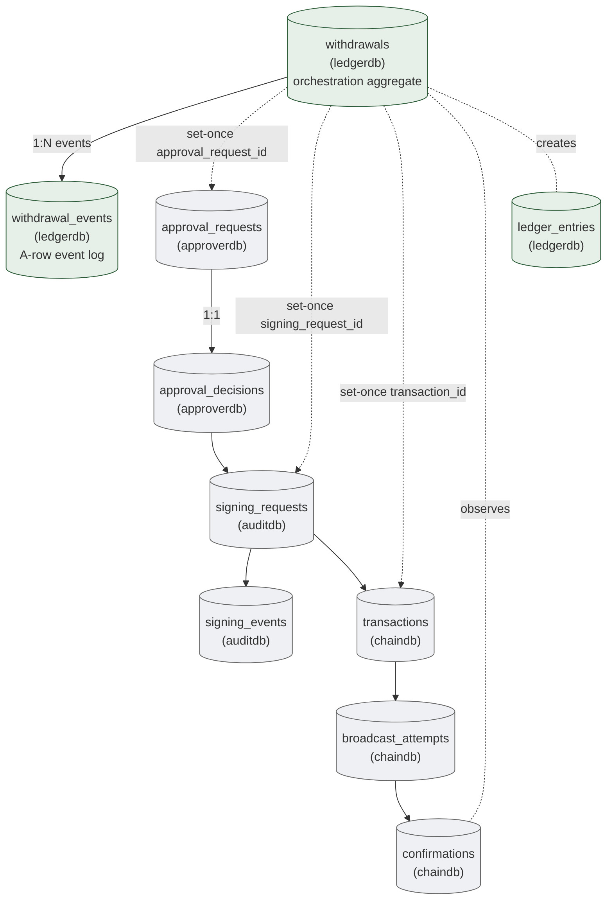
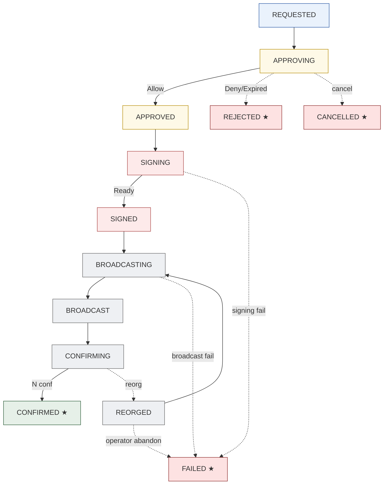
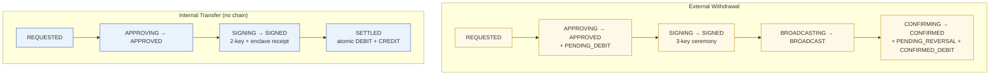

# 08. Withdrawal Lifecycle
> Approval + Signing + Broadcast + Confirmation + Ledger 의 통합 cascade

이 도메인은 5개 도메인을 cross-cutting 하는 **integrated lifecycle aggregate**. `withdrawals` 테이블 자체는 ledgerdb 에 있지만, lifecycle 의 단계마다 다른 DB 의 aggregate 를 참조.

**Owning DB**: `ledgerdb` (withdrawals, withdrawal_events)
**Owning service**: Withdrawal Service (orchestration)
**Cross-domain refs**: approverdb / auditdb / chaindb 의 4 개 도메인

---

## 1. 책임의 범위

| 본 도메인이 담당 | 본 도메인이 담당하지 않음 |
|----------------|------------------------|
| Withdrawal 의 end-to-end state machine | 정책 결정 (Approval) |
| Withdrawal lifecycle event log (`withdrawal_events`) | 서명 ceremony (Signing) |
| Cross-domain reference 의 정합성 (approval / signing / transaction / ledger) | chain broadcast (Broadcast) |
| Internal vs External 의 분기 | reconciliation (Reconciliation) |
| Pending → Confirmed → Reorged 의 ledger 동반 | audit chain (Audit) |

---

## 2. Cross-domain dependency



*Figure 9. Withdrawal lifecycle 의 cross-domain reference — 단일 transaction lifecycle 이 5 개 도메인을 거침.*

---

## 3. `withdrawals`

### 3.1 책임

- Withdrawal 의 orchestration aggregate
- End-to-end state machine
- 5 개 도메인에 걸친 lifecycle 의 single source of orchestration state

| 속성 | 값 |
|------|-----|
| Storage class | `M-mut` (state) + `A-set` (대부분 다른 컬럼) |
| Source of truth | row 자체 (orchestration view) |
| Mutation authority | Withdrawal Service |
| Read access | Audit, Reconciliation, Wallet Service, Operator Console |
| Logical deletion | 금지 |
| Partitioning | per-month |

### 3.2 State machine (end-to-end)



terminal: `CONFIRMED`, `REJECTED`, `FAILED`, `CANCELLED`. (REORGED 는 manual decision 으로 BROADCASTING 또는 FAILED 로 분기.)

### 3.3 Schema 제안

| 컬럼 | 타입 | NULL | Class | 의미 |
|------|------|------|-------|------|
| `id` | UUID | NOT NULL | PK | |
| `tenant_id` | UUID | NOT NULL | `A-set` | |
| `reference_id` | TEXT | NOT NULL | `A-set` | UNIQUE — caller 의 idempotency key |
| `flow_type` | enum | NOT NULL | `A-set` | `'external'`, `'internal'`, `'sweep'`, `'unsafe-send'` |
| `source_wallet_id` | UUID | NOT NULL | `A-set` | walletdb.wallets.id |
| `source_account_id` | UUID | NOT NULL | `A-set` | ledger_accounts.id (asset 별) |
| `destination_type` | enum | NOT NULL | `A-set` | `'external_address'`, `'internal_wallet'`, `'internal_account'` |
| `destination_address` | TEXT | NULL | `A-set` | external 일 때 |
| `destination_wallet_id` | UUID | NULL | `A-set` | internal 일 때 |
| `destination_account_id` | UUID | NULL | `A-set` | internal_transfer 일 때 |
| `asset_id` | TEXT | NOT NULL | `A-set` | |
| `amount` | NUMERIC(38,0) | NOT NULL | `A-set` | |
| `fee_estimate` | NUMERIC(38,0) | NULL | `A-set` | 예상 fee (broadcast 시점에 set) |
| `fee_actual` | NUMERIC(38,0) | NULL | `A-set` | 실제 fee (confirmation 시점) |
| `state` | enum | NOT NULL | `M-mut` | 위 state machine |
| `state_updated_at` | TIMESTAMPTZ | NOT NULL | `M-mut` | |
| `approval_request_id` | UUID | NULL | `A-set` | cross-DB ref (set when APPROVING 진입) |
| `approval_decision_id` | UUID | NULL | `A-set` | set when APPROVED |
| `signing_request_id` | UUID | NULL | `A-set` | set when SIGNING |
| `transaction_id` | UUID | NULL | `A-set` | set when SIGNED |
| `pending_ledger_entry_id` | UUID | NULL | `A-set` | set when APPROVED (pending debit) |
| `confirmed_ledger_entry_id` | UUID | NULL | `A-set` | set when CONFIRMED |
| `reversal_ledger_entry_id` | UUID | NULL | `A-set` | set when REJECTED/FAILED (pending reversal) |
| `failure_reason` | TEXT | NULL | `A-set` | terminal failure 시 reason |
| `created_at` | TIMESTAMPTZ | NOT NULL | `A-set` | |
| `created_by` | UUID | NOT NULL | `A-set` | API caller / system |
| `completed_at` | TIMESTAMPTZ | NULL | `A-set` | terminal 도달 시 |
| `version` | BIGINT | NOT NULL | `M-mut` | |

### 3.4 핵심 invariant

#### 3.4.1 `reference_id` UNIQUE (idempotency)

```sql
CREATE UNIQUE INDEX uniq_withdrawal_reference_id
  ON withdrawals (reference_id);
```

같은 reference_id 의 두 번째 요청은 기존 withdrawal_id 응답 (idempotent).

#### 3.4.2 State 의 sticky terminal

```sql
CREATE OR REPLACE FUNCTION enforce_withdrawal_state()
RETURNS TRIGGER AS $$
BEGIN
  IF OLD.state IN ('CONFIRMED', 'REJECTED', 'FAILED', 'CANCELLED')
     AND NEW.state IS DISTINCT FROM OLD.state THEN
    RAISE EXCEPTION 'withdrawal % already terminal %', OLD.id, OLD.state;
  END IF;
  RETURN NEW;
END;
$$ LANGUAGE plpgsql;
```

(REORGED 는 sticky 아님 — operator decision 으로 BROADCASTING 으로 복귀 가능.)

#### 3.4.3 Cross-domain reference 의 set-once

```sql
CREATE TRIGGER withdrawals_cross_ref_set_once
  BEFORE UPDATE ON withdrawals
  FOR EACH ROW EXECUTE FUNCTION enforce_set_once_columns(
    ARRAY['approval_request_id', 'approval_decision_id',
          'signing_request_id', 'transaction_id',
          'pending_ledger_entry_id', 'confirmed_ledger_entry_id',
          'reversal_ledger_entry_id']
  );
```

각 reference 는 한 번 set 되면 변경 불가 — withdrawal lifecycle 의 evidence chain.

#### 3.4.4 Destination 의 mutually exclusive

```sql
ALTER TABLE withdrawals
  ADD CONSTRAINT chk_destination_exclusive
  CHECK (
    (destination_type = 'external_address' AND destination_address IS NOT NULL
       AND destination_wallet_id IS NULL AND destination_account_id IS NULL)
    OR
    (destination_type = 'internal_wallet' AND destination_wallet_id IS NOT NULL
       AND destination_address IS NULL AND destination_account_id IS NULL)
    OR
    (destination_type = 'internal_account' AND destination_account_id IS NOT NULL
       AND destination_address IS NULL AND destination_wallet_id IS NULL)
  );
```

### 3.5 Indexing

| Index | 목적 |
|-------|------|
| `withdrawals_pkey (id)` | PK |
| `uniq_withdrawal_reference_id (reference_id)` | idempotency |
| `idx_withdrawals_state (state, state_updated_at)` | active withdrawal query |
| `idx_withdrawals_source (source_wallet_id, created_at DESC)` | wallet 별 withdrawal history |
| `idx_withdrawals_completed (tenant_id, completed_at DESC) WHERE completed_at IS NOT NULL` | reporting |
| `idx_withdrawals_approval (approval_request_id) WHERE approval_request_id IS NOT NULL` | cross-DB lookup |
| `idx_withdrawals_transaction (transaction_id) WHERE transaction_id IS NOT NULL` | cross-DB lookup |

---

## 4. `withdrawal_events`

### 4.1 책임

- Withdrawal 의 모든 state transition 의 evidence — append-only event log
- Lifecycle 의 forensic record

| 속성 | 값 |
|------|-----|
| Storage class | `A-row` |
| Source of truth | row 자체 |
| Mutation authority | Withdrawal Service 의 INSERT 만 |
| Read access | Audit, Reconciliation, Operator |
| Logical deletion | 절대 금지 |
| Partitioning | per-month |

### 4.2 Schema 제안

| 컬럼 | 타입 | NULL | Class | 의미 |
|------|------|------|-------|------|
| `id` | UUID | NOT NULL | PK | |
| `withdrawal_id` | UUID | NOT NULL | `A-set` | FK withdrawals.id |
| `event_seq` | INT | NOT NULL | `A-set` | per-withdrawal sequence |
| `event_type` | enum | NOT NULL | `A-set` | `'created'`, `'approval_requested'`, `'approved'`, `'rejected'`, `'signing_started'`, `'signed'`, `'broadcast_attempted'`, `'broadcast_succeeded'`, `'confirmation_received'`, `'finalized'`, `'reorg_detected'`, `'failed'`, `'cancelled'` |
| `from_state` | enum | NULL | `A-set` | event 전 state |
| `to_state` | enum | NOT NULL | `A-set` | event 후 state |
| `event_payload` | JSONB | NOT NULL | `A-set` | event-specific data (transaction_id, signature, error 등) |
| `triggered_by` | UUID | NULL | `A-set` | operator / system service |
| `audit_event_id` | UUID | NULL | `A-set` | cross-DB ref: auditdb.audit_events.id |
| `created_at` | TIMESTAMPTZ | NOT NULL | `A-set` | |

### 4.3 핵심 invariant

```sql
CREATE TRIGGER withdrawal_events_no_mutation
  BEFORE UPDATE OR DELETE ON withdrawal_events
  FOR EACH ROW EXECUTE FUNCTION prevent_mutation_generic();

CREATE UNIQUE INDEX uniq_withdrawal_event_seq
  ON withdrawal_events (withdrawal_id, event_seq);
```

### 4.4 Indexing

| Index | 목적 |
|-------|------|
| `withdrawal_events_pkey (id)` | PK |
| `uniq_withdrawal_event_seq` | sequence |
| `idx_withdrawal_events_wd (withdrawal_id, event_seq)` | withdrawal 의 lifecycle replay |
| `idx_withdrawal_events_type (event_type, created_at)` | type 별 audit query |

---

## 5. Lifecycle 의 ledger 동반

각 state transition 마다 ledger 가 어떻게 변하는지:

| Withdrawal state | Ledger entry 발생 | 비고 |
|------------------|-------------------|------|
| REQUESTED → APPROVING | (없음) | 잔액 변화 없음 |
| APPROVING → APPROVED | `+ PENDING_DEBIT` entry | 가용 잔액 reserve; `pending_ledger_entry_id` set |
| APPROVED → SIGNING / SIGNED | (없음) | pending 유지 |
| SIGNED → BROADCASTING / BROADCAST | (없음) | pending 유지 |
| BROADCAST → CONFIRMING | (없음) | pending 유지 |
| CONFIRMING → CONFIRMED | `+ PENDING_REVERSAL_CREDIT` + `+ CONFIRMED_DEBIT` | 2 row INSERT: pending reversal + actual confirmed; `confirmed_ledger_entry_id` set |
| APPROVING → REJECTED | (없음 — 아직 pending entry 발행 전) | 또는 APPROVED 후 REJECTED 면 reversal |
| APPROVED → REJECTED (드물지만 가능 — system fail 등) | `+ PENDING_REVERSAL_CREDIT` | `reversal_ledger_entry_id` set |
| SIGNING / SIGNED / BROADCASTING / BROADCAST → FAILED | `+ PENDING_REVERSAL_CREDIT` | reversal entry |
| CONFIRMING → REORGED | `+ CONFIRMED_REVERSAL_CREDIT` (이미 CONFIRMED 였다면) | reorg 의 ledger 정정 (manual review 필요) |

### 5.1 Atomic transaction patterns

각 state transition 의 atomic transaction:

```sql
-- APPROVING → APPROVED + pending debit
BEGIN;
  -- 1. withdrawal state update
  UPDATE withdrawals
     SET state = 'APPROVED', state_updated_at = NOW(),
         pending_ledger_entry_id = $new_entry_id,
         version = version + 1
   WHERE id = $1 AND state = 'APPROVING' AND version = $current_version;

  -- 2. ledger_entries pending debit INSERT
  INSERT INTO ledger_entries (..., entry_type, amount, state, ref_type, ref_id, ...)
  VALUES ($new_entry_id, ..., 'debit', $amount, 'pending', 'withdrawal', $1, ...);

  -- 3. balance cache update
  UPDATE ledger_accounts
     SET balance_available = balance_available - $amount,
         balance_pending = balance_pending + $amount,
         version = version + 1
   WHERE id = $source_account AND version = $account_version;

  -- 4. withdrawal_events INSERT
  INSERT INTO withdrawal_events (...) VALUES ('approved', ...);

  -- 5. audit_event INSERT (or async via outbox)
  -- ...
COMMIT;
```

### 5.2 CONFIRMING → CONFIRMED 의 2-row INSERT

```sql
BEGIN;
  -- 1. confirmed reversal of pending + confirmed debit
  INSERT INTO ledger_entries (id, account_id, seq, entry_type, amount, state,
                              ref_type, ref_id, reverses_entry_id, ...)
  VALUES
    ($reversal_id, $account, $next_seq,     'credit', $amount, 'confirmed',
     'reversal', $withdrawal_id, $pending_entry_id, ...),
    ($confirmed_id, $account, $next_seq + 1, 'debit',  $amount, 'confirmed',
     'withdrawal', $withdrawal_id, NULL, ...);

  -- 2. balance cache
  UPDATE ledger_accounts
     SET balance_pending = balance_pending - $amount,
         -- balance_available 은 이미 reserve 됐으므로 변경 없음
         version = version + 1
   WHERE id = $account;

  -- 3. withdrawal state + confirmed_ledger_entry_id
  UPDATE withdrawals
     SET state = 'CONFIRMED', confirmed_ledger_entry_id = $confirmed_id,
         completed_at = NOW(), version = version + 1
   WHERE id = $1;

  -- 4. event log
  INSERT INTO withdrawal_events (...) VALUES ('finalized', ...);
COMMIT;
```

---

## 6. Internal vs External lifecycle 의 차이



### 6.1 차이 정리

| 측면 | External | Internal |
|------|---------|----------|
| Signing keys | 3-key (개시 + 승인 + 실행) | 2-key + enclave verify_and_authorize receipt |
| Chain transaction | 있음 (`transaction_id` set) | 없음 (`transaction_id` NULL) |
| Confirmation | chain 의 N confirmations | enclave receipt + ledger commit 즉시 |
| Ledger entry 의 개수 | 3 row (pending + reversal + confirmed) | 2 row (atomic debit + credit) |
| Reorg risk | 있음 | 없음 |
| Compliance scope | AML / sanctions / Travel Rule | 주로 internal limit |
| Reconciliation domains | Ledger ↔ Chain ↔ Audit ↔ Counterparty | Ledger ↔ Audit |

### 6.2 Schema 의 처리

본 `withdrawals` 테이블은 양쪽 case 모두 처리:
- External: `flow_type='external'`, `destination_address` set, `transaction_id` set
- Internal: `flow_type='internal'`, `destination_account_id` set, `transaction_id` NULL

state machine 의 일부 state 는 internal 에서 skip:
- internal: REQUESTED → APPROVING → APPROVED → SIGNING → SIGNED → **SETTLED** ★
- external: REQUESTED → ... → CONFIRMING → **CONFIRMED** ★

internal 의 SETTLED 와 external 의 CONFIRMED 는 다른 state name — schema 의 `state` enum 에 양쪽 다 포함, application 이 flow_type 에 따라 분기:

```sql
CREATE TYPE withdrawal_state AS ENUM (
  'REQUESTED', 'APPROVING', 'APPROVED', 'SIGNING', 'SIGNED',
  'BROADCASTING', 'BROADCAST', 'CONFIRMING', 'CONFIRMED',  -- external only
  'SETTLED',  -- internal only
  'REJECTED', 'FAILED', 'CANCELLED', 'REORGED'
);
```

또는 별도 `internal_transfers` 테이블 (§03 §5) 로 분리 — institution 의 선택. 본 reference 는 통합된 `withdrawals` 권장 (lifecycle 공통점이 많음).

---

## 7. Cross-domain 정합성 검증

### 7.1 다음이 모두 set 되어야 CONFIRMED 가능

```sql
ALTER TABLE withdrawals
  ADD CONSTRAINT chk_confirmed_completeness
  CHECK (
    state != 'CONFIRMED' OR (
      approval_request_id IS NOT NULL AND
      approval_decision_id IS NOT NULL AND
      signing_request_id IS NOT NULL AND
      (flow_type = 'internal' OR transaction_id IS NOT NULL) AND
      pending_ledger_entry_id IS NOT NULL AND
      confirmed_ledger_entry_id IS NOT NULL AND
      completed_at IS NOT NULL
    )
  );
```

DB-level CHECK 으로 state 와 reference 의 정합성 강제.

### 7.2 Reconciliation 의 cross-DB query

```sql
-- 모든 CONFIRMED withdrawal 의 cross-DB reference 가 valid 한지
SELECT w.id, w.approval_request_id, ar.id IS NOT NULL AS has_approval
FROM withdrawals w
LEFT JOIN approverdb.approval_requests ar ON ar.id = w.approval_request_id
WHERE w.state = 'CONFIRMED' AND ar.id IS NULL;
-- 결과 비어 있어야

-- 같은 검사를 다른 DB 에도
-- (signing_requests, transactions, ledger_entries 등)

-- CONFIRMED 한 external withdrawal 의 transaction 이 chain 에서 finalized 인가
SELECT w.id, w.transaction_id, t.status, c.is_finalized
FROM withdrawals w
JOIN chaindb.transactions t ON t.id = w.transaction_id
LEFT JOIN chaindb.confirmations c ON c.transaction_id = t.id
WHERE w.state = 'CONFIRMED'
  AND w.flow_type IN ('external', 'sweep')
  AND (t.status != 'confirmed' OR c.is_finalized IS NOT TRUE);
-- 결과 비어 있어야
```

---

## 8. Reorg 처리

### 8.1 Reorg detection

Chain Adapter 가 confirmations 에 새 row INSERT 시 같은 transaction_id 의 이전 confirmation 의 block_hash 와 다름 → reorg.

### 8.2 Withdrawal lifecycle 의 처리

```
withdrawal 이 CONFIRMED 였는데 reorg 발견:
  1. withdrawal.state = 'REORGED' (single transition)
  2. withdrawal_events INSERT: event_type='reorg_detected'
  3. ledger_entries 에 reversal entry INSERT:
     - confirmed_debit 의 reversal (credit, confirmed)
  4. operator alert
  5. operator decision:
     a. retry: state = 'BROADCASTING' (또는 새 transaction_id 생성)
     b. abandon: state = 'FAILED', reversal_ledger_entry_id = (위에서 INSERT 된 reversal)
```

### 8.3 Reorg 후 retry 의 처리

- 같은 `withdrawal.id` 유지
- 새 `transaction_id` (또는 기존 transaction 의 새 broadcast attempt)
- `confirmed_ledger_entry_id` 는 reversed 됐지만 record 는 보존 (audit chain)
- 새 confirmed 시 새 `confirmed_ledger_entry_id` (set-once 컬럼이 이미 set 되어 있어서 — 별도 처리 필요)

**옵션 A**: `confirmed_ledger_entry_id` 를 한 번 reset 허용 (REORGED 상태에서만):

```sql
-- 이 case 는 set-once 의 예외 — REORGED 처리에 한정
-- 또는 별도 ledger entry 와 별도 컬럼 (예: confirmed_ledger_entry_id_v2) — 복잡함
```

**옵션 B**: REORGED 후 새 withdrawal 생성 (이전 withdrawal 은 FAILED). 단순함:

```
이전 withdrawal: state = 'FAILED', failure_reason = 'reorged'
새 withdrawal: 같은 source/destination, 새 reference_id (예: orig_ref_id + '-retry-1')
```

본 reference 는 **옵션 B 권장** — 단순하고 audit chain 명확.

---

## 9. Indexing summary

| Index | 목적 |
|-------|------|
| (위 §3.5 의 모든 index) | |
| (위 §4.4 의 모든 index) | |

Withdrawal 은 가장 자주 조회되는 aggregate — index 가 중요.

---

## 10. Reconciliation 의 withdrawal 도메인 query

```sql
-- 잔액 reserve 가 ledger entries 의 pending sum 과 일치
SELECT
  la.id,
  la.balance_pending AS cached,
  COALESCE(SUM(le.amount), 0) AS canonical_pending
FROM ledger_accounts la
LEFT JOIN ledger_entries le ON le.account_id = la.id
  AND le.entry_type = 'debit' AND le.state = 'pending'
  AND NOT EXISTS (SELECT 1 FROM ledger_entries r WHERE r.reverses_entry_id = le.id)
GROUP BY la.id, la.balance_pending
HAVING la.balance_pending != COALESCE(SUM(le.amount), 0);
-- 결과 비어 있어야

-- BROADCAST 후 N 시간 confirmation 없는 withdrawal (stuck tx)
SELECT id, transaction_id, state, state_updated_at
FROM withdrawals
WHERE state IN ('BROADCAST', 'CONFIRMING')
  AND state_updated_at < NOW() - INTERVAL '6 hours';
-- 결과 0 이면 정상; 있으면 operator review

-- 모든 lifecycle stage 의 평균 소요 시간
SELECT
  flow_type,
  AVG(EXTRACT(EPOCH FROM (
    (SELECT MIN(created_at) FROM withdrawal_events WHERE withdrawal_id = w.id AND event_type = 'approved')
    - w.created_at
  ))) AS avg_seconds_to_approve,
  AVG(EXTRACT(EPOCH FROM (
    (SELECT MIN(created_at) FROM withdrawal_events WHERE withdrawal_id = w.id AND event_type = 'finalized')
    - w.created_at
  ))) AS avg_seconds_total
FROM withdrawals w
WHERE w.state = 'CONFIRMED' AND w.created_at > NOW() - INTERVAL '30 days'
GROUP BY flow_type;
-- 운영 metric
```

---

## 11. Operational considerations

### 11.1 Long-running withdrawals (chain congestion)

- BROADCAST 후 confirmation 까지 chain 별 다름: Bitcoin 10-60 분, Ethereum 1-5 분, Solana 초 단위.
- 6 시간 이상 stuck 시 alert.
- Fee bump (RBF) 또는 abandon 결정은 operator.

### 11.2 Concurrent withdrawals (same source)

- 같은 source wallet 에서 동시 withdrawal — race 우려:
  - APPROVING 단계에서 balance check 의 sequencing 이 critical
  - PENDING_DEBIT 발행 시 row-level lock 또는 advisory lock
  - 또는 optimistic locking + retry

### 11.3 Partial confirmation

- N confirmations 미달인 상태에서 chain reorg → CONFIRMING 유지, 새 block_hash 의 confirmation 으로 진행
- N confirmations 도달 직전에 reorg → 가장 위험한 case; institution 의 finality_threshold 가 reorg-safe 한지 검증

### 11.4 Backup / DR

- `withdrawals`, `withdrawal_events` 는 institution 의 가장 critical 데이터 — synchronous replication.
- Cross-DC: ledgerdb 의 sync replication 필수.

---

## 12. Anti-patterns

| Anti-pattern | 왜 안 좋은가 |
|--------------|-------------|
| `state` 의 backward transition | 사고 발생 |
| `reference_id` UNIQUE 누락 | 중복 withdrawal 발행 |
| Cross-domain reference 의 set-once 누락 | 사후 다른 approval 로 binding 변조 가능 |
| PENDING_DEBIT 의 reversal 없이 REJECTED 처리 | 자금 reserve 영구 손실 |
| CONFIRMING 에서 1 confirmation 으로 CONFIRMED 처리 | reorg risk |
| Reorg 후 withdrawal 재사용 (같은 ID) + 새 transaction_id | set-once 위반 |
| `withdrawal_events` 의 row UPDATE | lifecycle history 손상 |
| Internal transfer 도 3-key ceremony 요구 | 불필요한 운영 부담 (single-tenant 안의 이동) |
| External 의 sweep 을 deposit lifecycle 로 처리 | sweep 은 chain tx 이므로 withdrawal lifecycle 필수 |
| Withdrawal state 와 ledger entry pattern 의 cross-check 누락 | 자금 mismatch (예: CONFIRMED 인데 entries 없음) |

---

## 13. 다음 읽을 글

- Ledger 의 자세한 entries pattern → [03-ledger-settlement.md](03-ledger-settlement.md) §7
- Approval domain → [05-approval-governance.md](05-approval-governance.md)
- Signing domain → [06-signing-execution.md](06-signing-execution.md)
- Transaction / Confirmation → [04-transaction-orchestration.md](04-transaction-orchestration.md)
- Reconciliation → [09-reconciliation-consistency.md](09-reconciliation-consistency.md)
