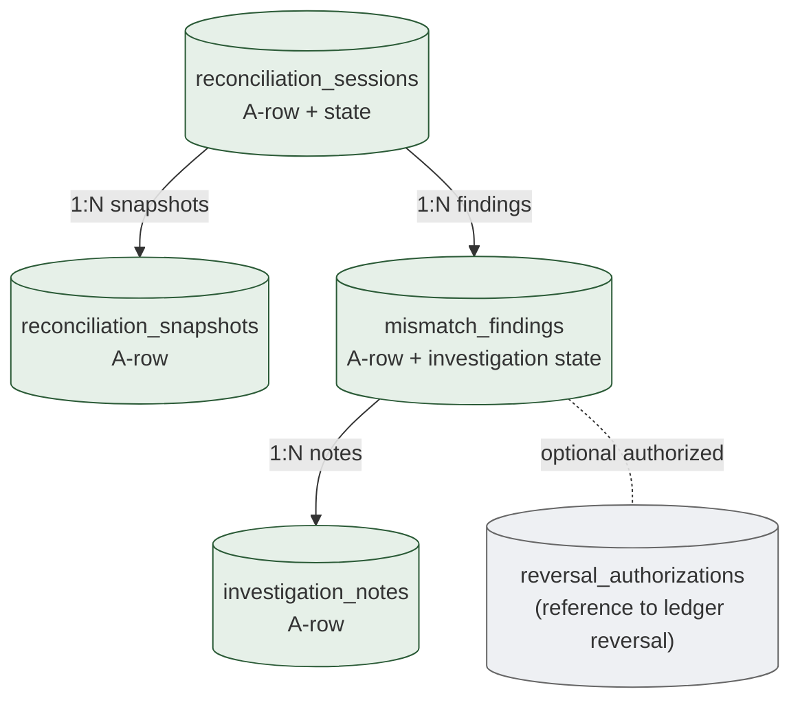
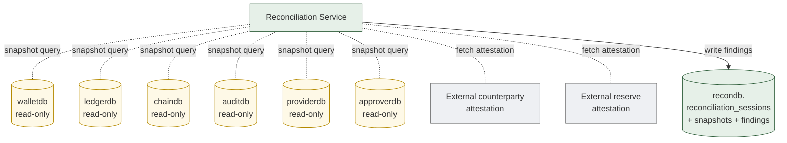

# 09. Reconciliation & Consistency
> Truth-domain cross-check 의 영속화 — session / snapshot / mismatch finding

이 도메인은 자금 자체를 다루지 않습니다. **여러 truth domain 간 정합성 검증** 의 결과를 영속화. Reconciliation Service 는 모든 다른 도메인에 **read-only** 접근.

**Owning DB**: `recondb`
**Owning service**: Reconciliation Service (write authority)
**Read-only consumers**: Audit, Operator Console, Incident Command, External Auditor

---

## 1. 책임의 범위

| 본 도메인이 담당 | 본 도메인이 담당하지 않음 |
|----------------|------------------------|
| Reconciliation session 의 lifecycle | 자금 정정 (Ledger Service via reversal entry) |
| Mismatch 발견 + 분류 + 추적 | mismatch 의 자동 정정 (사람 결정) |
| Snapshot 의 reference (cross-truth-domain) | snapshot 자체의 정합성 (각 도메인) |
| Investigation evidence | incident command (Operator) |
| Periodic reconciliation 의 metric | live monitoring (Operations Service) |

핵심 framing: **Reconciliation Service 는 자금 이동 권한이 없습니다**. 발견 + 보고 + investigation evidence 만.

---

## 2. PK/FK dependency



*Figure 10. Reconciliation 도메인 — read-only across all other domains, write only within recondb.*

---

## 3. `reconciliation_sessions`

### 3.1 책임

- 한 reconciliation 실행의 single aggregate
- 어떤 truth domain 들을 cross-check 했는지, verdict 가 무엇인지

| 속성 | 값 |
|------|-----|
| Storage class | `A-row` + `M-mut` (state during session) |
| Source of truth | row 자체 |
| Mutation authority | Reconciliation Service |
| Read access | Audit, Operator |
| Logical deletion | 절대 금지 |
| Partitioning | per-year |

### 3.2 Session 의 trigger 종류

| Trigger | 빈도 |
|---------|------|
| `scheduled-continuous` | 60s ~ 5min |
| `scheduled-hourly` | hourly checkpoint |
| `scheduled-daily` | daily counterparty / reserve |
| `event-driven-withdrawal` | confirmed withdrawal 후 즉시 |
| `event-driven-deposit` | confirmed deposit 후 |
| `manual` | operator 또는 audit 요청 |
| `incident` | 사고 조사 |
| `migration` | provider migration 등 |

### 3.3 Schema 제안

| 컬럼 | 타입 | NULL | Class | 의미 |
|------|------|------|-------|------|
| `id` | UUID | NOT NULL | PK | |
| `trigger_type` | enum | NOT NULL | `A-set` | 위 §3.2 |
| `trigger_ref` | TEXT | NULL | `A-set` | event-driven 시 어떤 event 가 trigger (withdrawal_id 등) |
| `scope_domains` | TEXT[] | NOT NULL | `A-set` | 어떤 truth domain 비교 (예: ARRAY['ledger', 'chain', 'audit']) |
| `scope_filter` | JSONB | NULL | `A-set` | 추가 filter (예: tenant_id, chain_id, time_range) |
| `state` | enum | NOT NULL | `M-mut` | `'triggered'`, `'snapshotting'`, `'computing'`, `'consistent'`, `'mismatch'`, `'investigating'`, `'resolved'`, `'escalated'` |
| `state_updated_at` | TIMESTAMPTZ | NOT NULL | `M-mut` | |
| `started_at` | TIMESTAMPTZ | NOT NULL | `A-set` | |
| `completed_at` | TIMESTAMPTZ | NULL | `A-set` | terminal state 도달 |
| `triggered_by` | UUID | NULL | `A-set` | (system or operator) |
| `verdict_summary` | TEXT | NULL | `A-set` | summary message |
| `total_rows_checked` | BIGINT | NULL | `M-mut` | metric |
| `mismatch_count` | INT | NOT NULL | `M-mut` | found mismatch count (denormalized from mismatch_findings) |
| `audit_event_id` | UUID | NULL | `A-set` | cross-DB ref |

### 3.4 State machine

```
triggered → snapshotting → computing →
  ├─ consistent ★
  └─ mismatch → investigating →
                ├─ resolved ★ (reversal entry 발행됨)
                └─ escalated ★ (incident command)
```

terminal: `consistent`, `resolved`, `escalated`.

### 3.5 핵심 invariant

```sql
CREATE OR REPLACE FUNCTION enforce_reconciliation_state()
RETURNS TRIGGER AS $$
BEGIN
  IF OLD.state IN ('consistent', 'resolved', 'escalated')
     AND NEW.state IS DISTINCT FROM OLD.state THEN
    RAISE EXCEPTION 'reconciliation_session % already terminal %', OLD.id, OLD.state;
  END IF;
  RETURN NEW;
END;
$$ LANGUAGE plpgsql;
```

`completed_at` 은 terminal 도달 시 set-once.

### 3.6 Indexing

| Index | 목적 |
|-------|------|
| `reconciliation_sessions_pkey (id)` | PK |
| `idx_reconciliation_sessions_state (state, started_at DESC)` | active session query |
| `idx_reconciliation_sessions_trigger (trigger_type, started_at DESC)` | trigger 별 history |
| `idx_reconciliation_sessions_mismatch (started_at DESC) WHERE mismatch_count > 0` | mismatch session 만 |

---

## 4. `reconciliation_snapshots`

### 4.1 책임

- Session 이 사용한 각 truth domain 의 snapshot reference
- 사후에 같은 시점의 state 를 재현 가능하게 하는 evidence

### 4.2 Schema 제안

| 컬럼 | 타입 | NULL | Class | 의미 |
|------|------|------|-------|------|
| `id` | UUID | NOT NULL | PK | |
| `session_id` | UUID | NOT NULL | `A-set` | FK reconciliation_sessions.id |
| `domain` | enum | NOT NULL | `A-set` | `'ledger'`, `'chain'`, `'audit'`, `'counterparty'`, `'reserve'`, `'provider'` |
| `snapshot_method` | enum | NOT NULL | `A-set` | `'point-in-time-query'`, `'last_id_cursor'`, `'block_height_anchor'`, `'attestation_reference'` |
| `snapshot_anchor` | JSONB | NOT NULL | `A-set` | snapshot 의 정확한 위치 (예: `{"last_ledger_entry_id": "uuid", "block_height": 12345678}`) |
| `snapshot_query_hash` | BYTEA | NULL | `A-set` | snapshot query 의 결과를 hash (재현성 검증) |
| `snapshot_taken_at` | TIMESTAMPTZ | NOT NULL | `A-set` | |
| `total_value_observed` | NUMERIC(38,0) | NULL | `A-set` | (해당 시) 합계 값 (예: total balance 합) |
| `metadata` | JSONB | NULL | `A-set` | 추가 정보 |

### 4.3 핵심 invariant

- Append-only.
- `(session_id, domain)` UNIQUE — 한 session 안에서 한 domain 의 snapshot 은 1 개:
  ```sql
  CREATE UNIQUE INDEX uniq_session_domain
    ON reconciliation_snapshots (session_id, domain);
  ```

### 4.4 Snapshot 의 재현 가능성

`snapshot_anchor` 의 의미:

- `ledger` domain: `{"last_ledger_entry_id": "uuid", "last_seq_per_account": {...}}` — 같은 entries 를 query 하면 같은 결과
- `chain` domain: `{"chain_id": "...", "block_height": N, "block_hash": "..."}`  — block anchor
- `audit` domain: `{"last_audit_event_id": "uuid", "checkpoint_id": "uuid"}` — chain head
- `counterparty` domain: `{"attestation_ref": "url", "attestation_hash": "..."}` — external attestation

사후 같은 anchor 로 query 시 같은 결과여야 — institution audit defense 의 일부.

---

## 5. `mismatch_findings`

### 5.1 책임

- Reconciliation session 이 발견한 inconsistency 의 individual record
- Investigation 의 anchor

| 속성 | 값 |
|------|-----|
| Storage class | `A-row` + `M-mut` (investigation_state, resolution) |
| Source of truth | row 자체 |
| Mutation authority | Reconciliation Service (INSERT) + Operator (investigation update) |
| Read access | Audit, Incident Command |
| Logical deletion | 금지 |
| Partitioning | per-year |

### 5.2 Schema 제안

| 컬럼 | 타입 | NULL | Class | 의미 |
|------|------|------|-------|------|
| `id` | UUID | NOT NULL | PK | |
| `session_id` | UUID | NOT NULL | `A-set` | FK reconciliation_sessions.id |
| `finding_type` | enum | NOT NULL | `A-set` | `'ledger-gt-chain'`, `'chain-gt-ledger'`, `'audit-chain-broken'`, `'orphan-entry'`, `'duplicate-entry'`, `'missing-settlement'`, `'counterparty-mismatch'`, `'provider-mismatch'`, `'state-inconsistent'` |
| `severity` | enum | NOT NULL | `A-set` | `'info'`, `'warning'`, `'critical'` |
| `domain_a` | enum | NOT NULL | `A-set` | 비교한 첫 domain |
| `domain_b` | enum | NOT NULL | `A-set` | 비교한 둘째 domain |
| `value_a` | TEXT | NULL | `A-set` | domain A 의 observed value (denormalized for query) |
| `value_b` | TEXT | NULL | `A-set` | domain B 의 observed value |
| `delta` | TEXT | NULL | `A-set` | 차이 (NUMERIC 또는 description) |
| `subject_aggregate_type` | TEXT | NULL | `A-set` | finding 의 대상 aggregate (예: `'ledger_account'`, `'transaction'`) |
| `subject_aggregate_id` | TEXT | NULL | `A-set` | 대상 ID |
| `description` | TEXT | NOT NULL | `A-set` | human-readable description |
| `evidence_refs` | JSONB | NOT NULL | `A-set` | 관련 row IDs / external refs |
| `investigation_state` | enum | NOT NULL | `M-mut` | `'open'`, `'in-progress'`, `'resolved'`, `'escalated'`, `'false-positive'` |
| `assigned_to` | UUID | NULL | `M-mut` | investigating operator |
| `assigned_at` | TIMESTAMPTZ | NULL | `M-mut` | |
| `resolution_type` | enum | NULL | `A-set` | `'reversal-entry-issued'`, `'data-correction'` (드물게; rarely 가능), `'no-action-needed'`, `'escalated-to-incident'` |
| `resolution_evidence_ref` | TEXT | NULL | `A-set` | 정정 evidence reference (예: reversal entry ID, incident report URL) |
| `resolved_at` | TIMESTAMPTZ | NULL | `A-set` | set-once |
| `resolved_by` | UUID | NULL | `A-set` | set-once |
| `created_at` | TIMESTAMPTZ | NOT NULL | `A-set` | |
| `audit_event_id` | UUID | NULL | `A-set` | cross-DB ref |

### 5.3 핵심 invariant

- `resolved_at`, `resolved_by`, `resolution_type`, `resolution_evidence_ref` 모두 set-once.
- `investigation_state` 의 sticky terminal (`resolved`, `false-positive`).
- Critical severity 의 finding 은 별도 alert pipeline 으로 즉시 incident command 통보.

### 5.4 Indexing

| Index | 목적 |
|-------|------|
| `mismatch_findings_pkey (id)` | PK |
| `idx_mf_session (session_id)` | session 별 findings |
| `idx_mf_open (investigation_state, severity, created_at) WHERE investigation_state IN ('open', 'in-progress')` | active investigation |
| `idx_mf_critical (created_at DESC) WHERE severity = 'critical'` | critical alert query |
| `idx_mf_subject (subject_aggregate_type, subject_aggregate_id)` | aggregate 별 finding history |

---

## 6. `investigation_notes`

### 6.1 책임

- Mismatch finding 의 investigation 과정 의 append-only note log
- Operator 의 분석 / 결정 evidence

### 6.2 Schema 제안

| 컬럼 | 타입 | Class | 의미 |
|------|------|-------|------|
| `id` | UUID | PK | |
| `finding_id` | UUID | `A-set` | FK mismatch_findings.id |
| `note_seq` | INT | `A-set` | per-finding sequence |
| `note_type` | enum | `A-set` | `'observation'`, `'hypothesis'`, `'evidence-pointer'`, `'decision'`, `'external-ref'` |
| `note_text` | TEXT | `A-set` | content |
| `evidence_refs` | JSONB | `A-set` | row IDs, log files, external URLs |
| `author_id` | UUID | `A-set` | |
| `created_at` | TIMESTAMPTZ | `A-set` | |

Append-only. `(finding_id, note_seq)` UNIQUE.

---

## 7. Reconciliation query topology



*Figure 11. Reconciliation query topology — read-only fan-in, write to recondb only.*

### 7.1 핵심 query patterns

각 truth domain 쌍 별 검증 query — 자세한 SQL 은 각 도메인 파일 §reconciliation 절. 본 도메인의 책임은 그 결과를 reconciliation_sessions + findings 에 영속화.

| Pair | Query | Domain 파일 |
|------|-------|-----------|
| Ledger ↔ Chain | confirmed withdrawal 의 ledger entries + transactions + confirmations | §03 §8, §04 §8, §08 §7 |
| Ledger ↔ Audit | ledger_entries 의 hash chain + audit_events 의 binding | §10 |
| Audit chain ↔ TEE checkpoint | hash chain replay + checkpoint signature | §10 |
| Withdrawal state ↔ approval/signing/transaction | cross-DB completeness | §08 §7 |
| Provider state ↔ internal | provider_event_log 의 normalization | §12 |
| Counterparty attestation ↔ ledger | 외부 attestation + internal omnibus | §11 |

---

## 8. Periodic reconciliation의 cadence

| Cadence | 수행 | Trigger |
|---------|------|---------|
| Continuous (real-time, structural) | foreign-key 등 DB-level invariant | DB engine 자체 |
| 60s ~ 5 min | Ledger ↔ Chain | scheduled |
| Hourly | Audit hash chain checkpoint replay (sample) | scheduled |
| Daily | Counterparty / reserve attestation | scheduled |
| Weekly / Monthly | Provider state full diff | scheduled |
| Event-driven | confirmed withdrawal / deposit 후 즉시 | event listener |
| Manual / incident | 사고 조사 / migration 등 | API or operator |

### 8.1 Scheduled cadence 의 영속화

각 scheduled run 은 `reconciliation_sessions` 의 1 row + per-domain snapshots + per-finding row.

- 일평균 sessions: 60s cadence 면 일 1,440 + hourly 24 + daily 1 + event-driven N → 큰 volume
- Per-year partitioning + 정기 archival 필요

---

## 9. Mismatch finding 의 classification

### 9.1 Severity 결정 기준

| `finding_type` | Severity (기본) | 이유 |
|---------------|----------------|------|
| `ledger-gt-chain` (internal credit 가 chain 에 없음) | **critical** | 가짜 자금 위협 |
| `chain-gt-ledger` (chain 에 자금 있는데 ledger 반영 안 됨) | warning | deposit miss / 처리 지연 가능 |
| `audit-chain-broken` (hash chain 의 prev_hash 불일치) | **critical** | 가장 high-severity — 사후 변조 의심 |
| `orphan-entry` (ledger_entry 인데 action 없음) | **critical** | 가짜 entry 위협 |
| `duplicate-entry` (같은 idempotency key 의 두 row) | warning | application bug 의심 |
| `missing-settlement` (CONFIRMED withdrawal 인데 entries 없음) | **critical** | 자금 missing |
| `counterparty-mismatch` | warning ~ critical (delta 크기에 따라) | external attestation 과의 차이 |
| `provider-mismatch` | warning | provider 의 lag 또는 normalization bug |
| `state-inconsistent` (예: DENIED 인데 후속 signing 존재) | **critical** | governance 무력화 |

각 finding 의 severity 는 institution 의 정책으로 조정 가능.

### 9.2 Critical finding 의 escalation

```
mismatch_finding INSERT with severity='critical' →
  trigger or application logic:
    1. alert pipeline (PagerDuty 등) 즉시 통보
    2. reconciliation_session.state = 'escalated' (자동)
    3. incident command 의 별도 evidence trail
```

---

## 10. 정정 의 책임 분리

핵심 invariant: **Reconciliation Service 는 자금 정정 권한 없음**. 정정은:

| 정정 방법 | 책임 service |
|----------|------------|
| Reversal ledger entry 발행 | Ledger Service (operator 의 reversal_authorization 후) |
| Audit chain 의 정정 — 불가능 (silent rewrite 금지) | (영구 broken 으로 두고 forensic 보존) |
| Schema 변경 (잘못된 컬럼) | DBA + governance ceremony |
| Provider event re-normalization | Provider Mapping Service (operator 결정 후) |
| Counterparty attestation reissue | external party 와 협조 |

Reconciliation Service 는 **발견 + investigation + escalation** 만. 정정 자체는 다른 service 의 권한.

---

## 11. External auditor 의 reconciliation review

외부 감사관이 본 도메인의 데이터로 verification:

1. **Sessions 의 cadence 검증** — 약속된 주기로 reconciliation 수행됐는가
2. **Snapshot 의 재현 가능성** — `snapshot_anchor` 로 같은 query 실행 시 같은 결과
3. **Findings 의 distribution** — 어떤 mismatch 가 발견되고 어떻게 처리됐는가
4. **Resolution evidence** — 모든 resolved finding 이 reversal entry 또는 documented reason 동반
5. **Open findings** — 미해결 finding 의 backlog 분석

audit-reviewable schema 의 일부.

---

## 12. Operational considerations

### 12.1 Read-only access 의 운영

- Reconciliation Service 는 각 DB 의 read-only credentials.
- DB 별 read replica 사용 권장 — production write traffic 영향 없음.
- 큰 query (full ledger scan 등) 는 off-peak 시간 또는 dedicated replica.

### 12.2 Mismatch 의 false positive

- Snapshot 시점 차이 (eventual consistency) 로 false mismatch 가능.
- Re-query 권장: critical mismatch 발견 시 N 분 후 같은 anchor 로 re-query — 여전히 mismatch 면 finding 등록.
- `false-positive` resolution type 으로 마감 가능 (audit trail 보존).

### 12.3 큰 volume 의 session

- 일 수천 session 의 경우 storage growth 큼.
- 매우 작은 session (consistent verdict) 은 metadata 만 보존, snapshot detail 은 sample 만.
- Critical mismatch 의 session 은 full detail 보존.

---

## 13. Anti-patterns

| Anti-pattern | 왜 안 좋은가 |
|--------------|-------------|
| Reconciliation Service 에 write 권한 부여 (자금 정정) | 권한 분리 위반 |
| Mismatch 자동 정정 | 사람 결정 없음 = audit defense 약화 |
| Snapshot 의 anchor 없이 결과만 영속화 | 사후 재현 불가 |
| Critical finding 의 alert 없음 | 시간 지연 시 incident 확대 |
| Investigation notes 의 mutable | 분석 history 손상 |
| Reconciliation cadence 누락 | 자금 mismatch 의 long-term lag |
| False positive 의 silent dismiss | audit trail 누락 |
| `reconciliation_sessions` 의 row UPDATE 후 결과 변경 | session evidence 손상 |
| Read-only access 누락 (write 권한 부여) | architectural violation |

---

## 14. 다음 읽을 글

- 각 truth domain 의 reconciliation query → 각 도메인 파일 §reconciliation 절
- Audit chain 의 자세한 영속화 → [10-audit-evidence-integrity.md](10-audit-evidence-integrity.md)
- 정정의 ledger reversal → [03-ledger-settlement.md](03-ledger-settlement.md) §6
- 운영 모니터링과의 통합 → [13-operational-monitoring.md](13-operational-monitoring.md)
