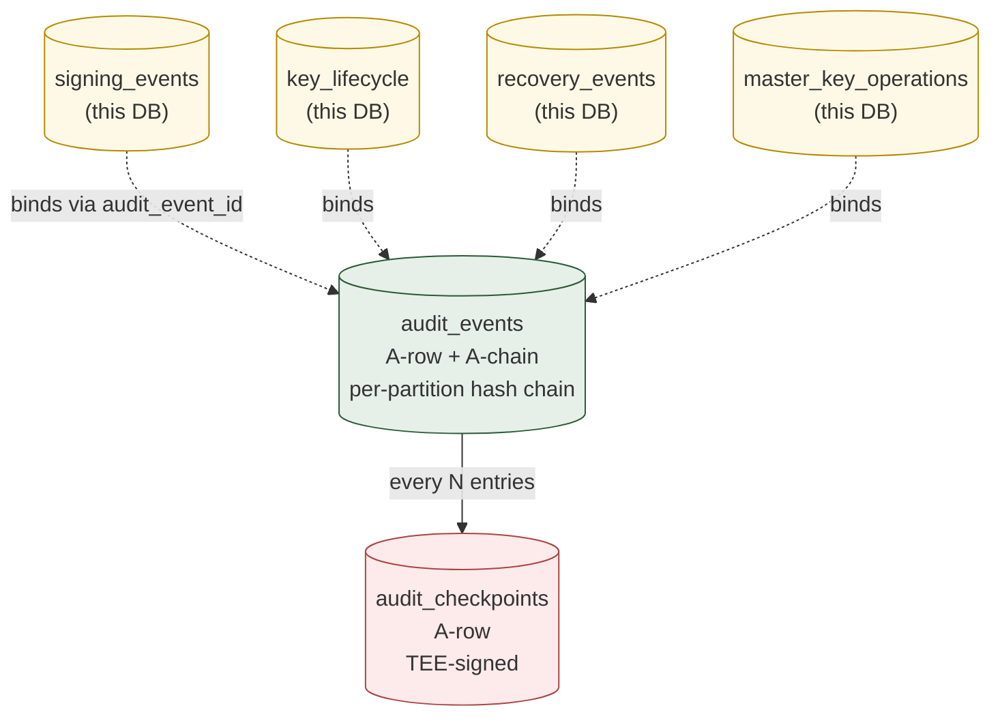
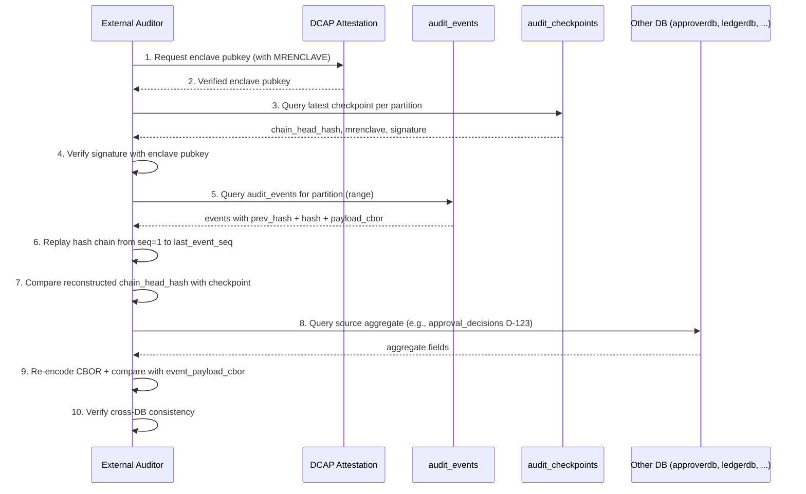
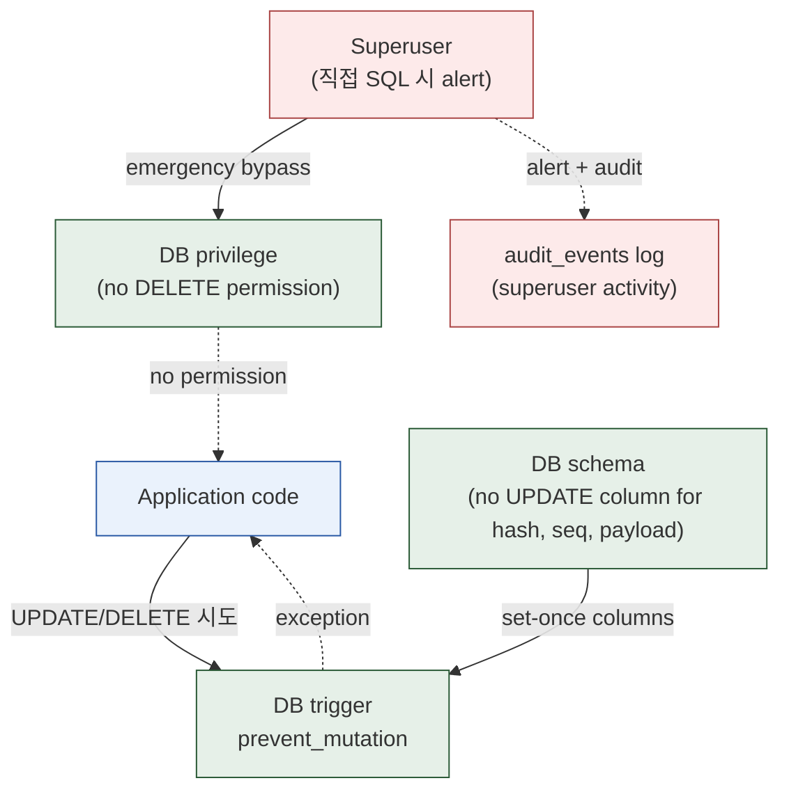

# 10. Audit & Evidence Integrity
> Hash chain + TEE-signed checkpoint 의 영속화 — 사후 변조 탐지의 최후 보루

이 도메인은 institutional custody 의 **audit defense backbone**. 모든 다른 도메인의 evidence event 가 본 도메인의 `audit_events` 에 hash-chained 로 영속화. 외부 auditor 가 cryptographic 으로 검증 가능.

**Owning DB**: `auditdb`
**Owning service**: Audit / Evidence Service (write authority; 모든 다른 service 는 audit event 발행 만)
**Read-only consumers**: External Auditor, Reconciliation Service, Operator Console, Incident Command

---

## 1. 책임의 범위

| 본 도메인이 담당 | 본 도메인이 담당하지 않음 |
|----------------|------------------------|
| Append-only hash-chained audit event log | 자금 결정 (정책 / 서명) |
| TEE-signed checkpoint 의 영속화 | DCAP attestation infrastructure (별도) |
| Cross-DB binding 의 anchor (CBOR) | reversal entry 발행 (Ledger) |
| MRENCLAVE rotation 의 추적 | enclave image distribution (Recovery Service) |
| External auditor 의 verification interface | reconciliation 의 정정 결정 (Reconciliation) |

---

## 2. PK/FK dependency + evidence chain



*Figure 12. Evidence chain physical schema — hash chain (audit_events) + periodic TEE checkpoints (audit_checkpoints).*

---

## 3. `audit_events`

### 3.1 책임

- 모든 도메인의 audit-worthy event 의 영속화
- Per-partition hash chain (cryptographic 위변조 탐지)
- Cross-DB binding 의 anchor (CBOR-encoded source aggregate)

| 속성 | 값 |
|------|-----|
| Storage class | `A-row` + `A-chain` (per-partition) |
| Source of truth | row 자체 |
| Mutation authority | Audit Service 의 INSERT 만 — UPDATE / DELETE 절대 금지 |
| Read access | External Auditor, Reconciliation, Operator |
| Logical deletion | **절대 금지** — DB 의 가장 strict 한 invariant |
| Partitioning | per-month + per-partition_key |

### 3.2 Partition 의 의미

Hash chain 은 **per-partition** 으로 운영. partition 의 선택:

| Partition strategy | 장점 | 단점 |
|-------------------|------|------|
| `tenant_id` | tenant 별 audit isolation; 적당한 크기 | tenant 작으면 short chains |
| `(tenant_id, domain)` | 더 세분화; per-domain audit | 매우 많은 partition |
| `account_id` (ledger 와 동일) | ledger entries 와 1:1 align | account 매우 많음 |
| Global | 단일 chain — 가장 단순 | 매우 빠른 growth, hot row |

**권장**: `tenant_id` partition (적당한 trade-off).

### 3.3 Event 의 종류

| `event_type` | 발생 domain |
|--------------|------------|
| `customer.kyc_status_changed` | Wallet Topology |
| `vault.created` / `vault.archived` | Wallet Topology |
| `wallet.created` / `wallet.frozen` / `wallet.archived` | Wallet Topology |
| `address.issued` / `address.archived` | Wallet Topology |
| `ledger.entry_inserted` | Ledger |
| `ledger.reversal_issued` | Ledger |
| `internal_transfer.settled` | Ledger |
| `withdrawal.requested` / `.approved` / `.signed` / `.broadcast` / `.confirmed` / `.failed` / `.reorged` | Withdrawal lifecycle |
| `approval.evaluated` (verdict + rules) | Approval |
| `policy.rule_changed` | Approval |
| `signing.executed` | Signing |
| `key.lifecycle_event` | Signing |
| `master_key.ceremony_executed` | Signing |
| `deposit.observed` / `.confirmed` / `.held` / `.rejected` | Deposit |
| `chain.reorg_detected` | Deposit / Withdrawal |
| `reconciliation.session_completed` (with verdict) | Reconciliation |
| `reconciliation.mismatch_found` | Reconciliation |
| `recovery.ceremony_step` | Recovery |
| `provider.event_ingested` | Provider Mapping |
| `incident.opened` / `.resolved` | Operational |

각 event 의 payload schema 는 event_type 별 정의.

### 3.4 Schema 제안

| 컬럼 | 타입 | NULL | Class | 의미 |
|------|------|------|-------|------|
| `id` | UUID | NOT NULL | PK | event row id |
| `partition_key` | TEXT | NOT NULL | `A-set` | 보통 tenant_id 또는 `'global'` |
| `seq` | BIGINT | NOT NULL | `A-set` | per-partition sequence |
| `event_type` | TEXT | NOT NULL | `A-set` | 위 §3.3 |
| `event_domain` | enum | NOT NULL | `A-set` | `'wallet'`, `'ledger'`, `'approval'`, ..., `'recovery'` |
| `source_aggregate_type` | TEXT | NOT NULL | `A-set` | 발생 aggregate 의 type |
| `source_aggregate_id` | UUID | NOT NULL | `A-set` | aggregate ID |
| `source_db` | TEXT | NOT NULL | `A-set` | which DB 의 aggregate (`'walletdb'`, `'ledgerdb'`, ...) |
| `event_payload_cbor` | BYTEA | NOT NULL | `A-set` | CBOR-encoded canonical payload — cross-DB binding 의 핵심 |
| `event_payload_json` | JSONB | NULL | `A-set` | 같은 payload 의 JSON view (query 편의; CBOR 가 canonical) |
| `event_payload_hash` | BYTEA | NOT NULL | `A-set` | SHA-256(event_payload_cbor) |
| `prev_hash` | BYTEA | NULL | `A-set` | 직전 entry 의 hash (per-partition chain) |
| `hash` | BYTEA | NOT NULL | `A-set` | this row 의 hash |
| `triggered_by_user_id` | UUID | NULL | `A-set` | event 의 actor (system 이면 NULL) |
| `triggered_by_service` | TEXT | NOT NULL | `A-set` | 발행한 service |
| `request_id` | UUID | NULL | `A-set` | cross-DB binding — 같은 request 의 multi-event correlation |
| `event_at` | TIMESTAMPTZ | NOT NULL | `A-set` | event 발생 시각 (source 의 시각) |
| `created_at` | TIMESTAMPTZ | NOT NULL | `A-set` | DB INSERT 시각 (보통 event_at 와 같거나 직후) |

### 3.5 핵심 invariant

#### 3.5.1 Append-only — 가장 strict

```sql
CREATE OR REPLACE FUNCTION prevent_mutation_on_audit_events()
RETURNS TRIGGER AS $$
BEGIN
  RAISE EXCEPTION 'audit_events is strictly append-only — DELETE/UPDATE forbidden'
    USING ERRCODE = 'check_violation';
END;
$$ LANGUAGE plpgsql;

CREATE TRIGGER audit_events_no_mutation
  BEFORE UPDATE OR DELETE ON audit_events
  FOR EACH ROW EXECUTE FUNCTION prevent_mutation_on_audit_events();
```

운영자 superuser 도 이 trigger 를 우회하지 못하도록 — superuser 의 직접 SQL 사용 자체가 alertable event.

#### 3.5.2 Per-partition hash chain

```sql
CREATE UNIQUE INDEX uniq_audit_event_seq
  ON audit_events (partition_key, seq);

CREATE OR REPLACE FUNCTION enforce_audit_hash_chain()
RETURNS TRIGGER AS $$
DECLARE expected_prev BYTEA;
BEGIN
  IF NEW.seq = 1 THEN
    IF NEW.prev_hash IS NOT NULL THEN
      RAISE EXCEPTION 'first event of partition % must have NULL prev_hash', NEW.partition_key;
    END IF;
  ELSE
    SELECT hash INTO expected_prev
      FROM audit_events
     WHERE partition_key = NEW.partition_key AND seq = NEW.seq - 1;
    IF expected_prev IS NULL THEN
      RAISE EXCEPTION 'previous event missing for partition % seq %', NEW.partition_key, NEW.seq;
    END IF;
    IF NEW.prev_hash IS DISTINCT FROM expected_prev THEN
      RAISE EXCEPTION 'audit hash chain broken at partition % seq %', NEW.partition_key, NEW.seq;
    END IF;
  END IF;
  RETURN NEW;
END;
$$ LANGUAGE plpgsql;

CREATE TRIGGER audit_events_hash_chain
  BEFORE INSERT ON audit_events
  FOR EACH ROW EXECUTE FUNCTION enforce_audit_hash_chain();
```

#### 3.5.3 Hash 계산 (application 책임)

```
hash = SHA-256(
  prev_hash (32 bytes, NULL → 32 zero bytes)
  ‖ partition_key.encode('utf-8')
  ‖ seq.to_bytes(8, 'big')
  ‖ event_type.encode('utf-8')
  ‖ source_aggregate_type.encode('utf-8')
  ‖ source_aggregate_id.bytes
  ‖ event_payload_hash  -- already SHA-256 of CBOR
  ‖ event_at.timestamp_micros.to_bytes(8, 'big')
)
```

deterministic — 같은 event 가 같은 hash 를 생성.

#### 3.5.4 CBOR payload 의 deterministic encoding

`event_payload_cbor` 는 **canonical CBOR** (RFC 8949 §4.2) — key 순서 / 정수 표현 등이 deterministic. JSON 의 key 순서 비결정성을 회피.

application 의 CBOR 라이브러리 선택 시 canonical encoding 확인 필요.

### 3.6 Concurrent INSERT 의 sequence race 회피

같은 partition 에 동시 INSERT 시 race 위험:

```sql
-- partition 별 last_seq 를 별도 테이블에 (또는 advisory lock 사용)
CREATE TABLE audit_partition_state (
  partition_key TEXT PRIMARY KEY,
  last_seq BIGINT NOT NULL,
  last_hash BYTEA NOT NULL,
  updated_at TIMESTAMPTZ NOT NULL
);

-- application 의 INSERT 절차:
BEGIN;
  SELECT last_seq, last_hash INTO @prev_seq, @prev_hash
    FROM audit_partition_state
   WHERE partition_key = $1 FOR UPDATE;
  
  -- compute new hash
  @new_seq = @prev_seq + 1;
  @new_hash = SHA-256(...);

  INSERT INTO audit_events (partition_key, seq, prev_hash, hash, ...)
  VALUES ($1, @new_seq, @prev_hash, @new_hash, ...);

  UPDATE audit_partition_state
     SET last_seq = @new_seq, last_hash = @new_hash, updated_at = NOW()
   WHERE partition_key = $1;
COMMIT;
```

`audit_partition_state` 는 ledger 의 `last_entry_seq` 와 유사 — derived (entries 에서 재계산 가능) 이지만 lock 의 anchor.

### 3.7 Indexing

| Index | 목적 |
|-------|------|
| `audit_events_pkey (id)` | PK |
| `uniq_audit_event_seq (partition_key, seq)` | hash chain ordering |
| `idx_audit_events_source (source_aggregate_type, source_aggregate_id)` | aggregate → events lookup |
| `idx_audit_events_type_time (event_type, event_at)` | event type 별 time-range query |
| `idx_audit_events_request (request_id) WHERE request_id IS NOT NULL` | request correlation (cross-DB) |
| `idx_audit_events_event_at (event_at)` | global time-range query (audit reporting) |
| `idx_audit_events_domain (event_domain, event_at)` | domain 별 audit query |

### 3.8 Partitioning (PostgreSQL native)

`tenant_id` 기반 + time:

```sql
CREATE TABLE audit_events (...) PARTITION BY LIST (partition_key);
CREATE TABLE audit_events_tenant_acme PARTITION OF audit_events FOR VALUES IN ('tenant-acme-uuid');
-- 그 안에서 time partitioning
```

또는 단순히 per-month:

```sql
CREATE TABLE audit_events (...) PARTITION BY RANGE (created_at);
```

institution scale 에 따라 선택. 본 reference 는 single-tenant 기준 monthly time partition 권장.

---

## 4. `audit_checkpoints`

### 4.1 책임

- 주기적 enclave-signed checkpoint — chain head 의 cryptographic anchor
- MRENCLAVE 기록 — 어느 enclave image 가 서명했는지
- External auditor 의 verification anchor

| 속성 | 값 |
|------|-----|
| Storage class | `A-row` + `A-set` (모든 컬럼) |
| Source of truth | row 자체 (TEE-signed) |
| Mutation authority | Audit Service 의 INSERT 만 |
| Read access | External Auditor, Reconciliation, Operator |
| Logical deletion | 절대 금지 |
| Partitioning | per-year (volume 낮음) |

### 4.2 Schema 제안

| 컬럼 | 타입 | NULL | Class | 의미 |
|------|------|------|-------|------|
| `id` | UUID | NOT NULL | PK | |
| `partition_key` | TEXT | NOT NULL | `A-set` | audit_events 의 partition |
| `last_event_seq` | BIGINT | NOT NULL | `A-set` | 본 checkpoint 가 cover 하는 마지막 event seq |
| `chain_head_hash` | BYTEA | NOT NULL | `A-set` | seq=last_event_seq 의 `hash` 와 일치 |
| `event_count` | BIGINT | NOT NULL | `A-set` | partition 의 총 event 수 (last_event_seq 까지) |
| `enclave_signature` | BYTEA | NOT NULL | `A-set` | enclave 가 서명한 (chain_head_hash ‖ partition_key ‖ last_event_seq ‖ signed_at) |
| `mrenclave` | BYTEA | NOT NULL | `A-set` | 서명한 enclave image 의 MRENCLAVE |
| `enclave_pubkey` | BYTEA | NOT NULL | `A-set` | enclave 의 verification pubkey (DCAP-attested) |
| `dcap_quote_ref` | UUID | NULL | `A-set` | DCAP attestation verification artifact reference |
| `signed_at` | TIMESTAMPTZ | NOT NULL | `A-set` | 서명 시각 |
| `checkpoint_seq` | BIGINT | NOT NULL | `A-set` | per-partition checkpoint sequence |

### 4.3 핵심 invariant

#### 4.3.1 Append-only

```sql
CREATE TRIGGER audit_checkpoints_no_mutation
  BEFORE UPDATE OR DELETE ON audit_checkpoints
  FOR EACH ROW EXECUTE FUNCTION prevent_mutation_generic();
```

#### 4.3.2 `(partition_key, checkpoint_seq)` UNIQUE

```sql
CREATE UNIQUE INDEX uniq_checkpoint_seq
  ON audit_checkpoints (partition_key, checkpoint_seq);
```

#### 4.3.3 `(partition_key, last_event_seq)` UNIQUE

같은 chain head 에 두 checkpoint 가 있으면 multiple signed checkpoints — 사후 attestation 시 어느 것이 canonical 인지 모호. 따라서:

```sql
CREATE UNIQUE INDEX uniq_checkpoint_event_seq
  ON audit_checkpoints (partition_key, last_event_seq);
```

#### 4.3.4 Signature 검증 (application 책임)

application 이 INSERT 전:

```python
# pseudo-code
chain_head_event = SELECT hash FROM audit_events
                   WHERE partition_key = $partition AND seq = $last_event_seq
assert chain_head_event == new_checkpoint.chain_head_hash

# enclave signature 검증
message = chain_head_hash ‖ partition_key ‖ last_event_seq ‖ signed_at
assert enclave_pubkey.verify(message, enclave_signature)

# MRENCLAVE 가 registered list 안에 있는지
assert mrenclave IN current_active_mrenclave_set
```

### 4.4 Checkpoint cadence

| Trigger | 주기 |
|---------|------|
| Time-based | 1 hour |
| Count-based | 100 audit_events |
| Whichever first | 위 두 중 먼저 발화 |

application 의 periodic task:

```python
for partition_key in active_partitions:
  last_checkpoint = SELECT MAX(last_event_seq) FROM audit_checkpoints
                    WHERE partition_key = $partition
  current_head = SELECT MAX(seq) FROM audit_events WHERE partition_key = $partition
  
  if (current_head - last_checkpoint) >= 100 OR \
     (now - last_checkpoint.signed_at) >= 1 hour:
    # call enclave to sign checkpoint
    signature = enclave.sign(...)
    INSERT INTO audit_checkpoints (...)
```

### 4.5 Indexing

| Index | 목적 |
|-------|------|
| `audit_checkpoints_pkey (id)` | PK |
| `uniq_checkpoint_seq` | sequence UNIQUE |
| `uniq_checkpoint_event_seq` | event-seq UNIQUE |
| `idx_audit_checkpoints_partition_recent (partition_key, signed_at DESC)` | 최신 checkpoint lookup |
| `idx_audit_checkpoints_mrenclave (mrenclave)` | MRENCLAVE rotation 추적 |

---

## 5. Cross-DB binding

### 5.1 `event_payload_cbor` 의 역할

다른 도메인의 aggregate 의 사실을 CBOR encode 해서 본 테이블에 보존 — single-DB tampering 만으로는 두 DB 모두 변조 불가능.

#### 5.1.1 예: approval_decision 의 binding

```
approverdb.approval_decisions row:
  id = D-123
  verdict = AUTO_APPROVE
  auth_approver_sig = 0xABCD...
  decided_at = 2026-05-20T10:30:00Z

auditdb.audit_events row:
  event_type = 'approval.evaluated'
  source_aggregate_type = 'approval_decision'
  source_aggregate_id = 'D-123'
  source_db = 'approverdb'
  event_payload_cbor = CBOR({
    'id': 'D-123',
    'verdict': 'AUTO_APPROVE',
    'auth_approver_sig': bytes('0xABCD...'),
    'decided_at': '2026-05-20T10:30:00Z',
    ...
  })
```

외부 감사관:
1. approverdb 의 D-123 조회
2. 같은 fields 로 CBOR encode
3. auditdb 의 해당 audit_event 의 `event_payload_cbor` 와 byte-equal 검증
4. 두 DB 가 일치하면 → cross-DB 일관성 확인

`event_payload_hash` 만으로 quick check 가능; full CBOR 은 detail 검증.

### 5.2 어떤 aggregate 가 CBOR-binding 의 대상인가

high-stakes events:

- `approval_decisions` (verdict + sig)
- `signing_events` (signature + MRENCLAVE)
- `master_key_operations` (ceremony evidence)
- `ledger_entries` (자금 이동)
- `recovery_events` (key lifecycle 의 ceremony step)
- `transactions` (chain submit 의 raw_payload_hash)
- `policy_change_log` (정책 변경)

본 audit_events 의 payload 가 cross-DB tamper detection 의 anchor.

---

## 6. External auditor verification flow



*Figure 13. External auditor verification — DCAP + checkpoint + chain replay + cross-DB binding.*

각 단계의 의미:

1. DCAP infrastructure 가 enclave pubkey 의 authentic 검증
2. 검증된 pubkey 확보
3. Checkpoint table 에서 anchor 확보
4. Checkpoint 의 cryptographic signature 검증
5. Audit events 의 range 가져옴
6. Hash chain 의 connectedness 검증 (prev_hash 가 직전 hash 와 일치)
7. Reconstructed head 와 checkpoint 의 head 비교
8. Cross-DB 의 source aggregate 가져옴
9. CBOR re-encode + byte 비교
10. Cross-DB binding 의 일관성 확인

이 10 단계가 audit-reviewable schema 의 backbone.

---

## 7. Append-only enforcement 의 전체 그림



*Figure 14. Append-only enforcement — multi-layered defense.*

### 7.1 4-layer defense

1. **Application code review**: UPDATE/DELETE 시도 자체가 schema-lint / code-lint 로 거절
2. **DB trigger**: application 이 우회해도 trigger 가 거절
3. **DB privilege**: write user 에게 UPDATE/DELETE permission 자체 없음
4. **Superuser audit**: emergency 시 superuser bypass 가능하지만 모든 superuser 활동이 별도 audit (operator 가 직접 SQL 실행 시 alert)

institutional audit 는 4 layer 모두 검증.

---

## 8. Retention 정책

| Aggregate | Retention |
|-----------|-----------|
| `audit_events` | **영구** — regulatory 의무 + audit defense 의 long-term anchor |
| `audit_checkpoints` | **영구** |
| `signing_events`, `key_lifecycle`, `master_key_operations` | **영구** |
| `recovery_events` | **영구** |

archival 정책:
- Hot tier (최근 1-2 년): primary DB, fast query
- Warm tier (2-7 년): partition detach + same DB 의 read-only slow disk
- Cold tier (7년+): off-site backup + WORM (write-once-read-many) storage

자세한 hot/cold tier 는 [14-cross-cutting-concerns.md](14-cross-cutting-concerns.md) 참고.

---

## 9. Reconciliation 의 audit 도메인 query

```sql
-- 모든 partition 의 hash chain 의 무결성 검증 (sample)
WITH chain_check AS (
  SELECT
    partition_key,
    seq,
    prev_hash,
    LAG(hash) OVER (PARTITION BY partition_key ORDER BY seq) AS expected_prev
  FROM audit_events
)
SELECT partition_key, seq
FROM chain_check
WHERE seq > 1 AND prev_hash IS DISTINCT FROM expected_prev;
-- 결과 비어 있어야 — 있으면 hash chain broken (사후 변조 의심)

-- Checkpoint 의 last_event_seq 가 실제 chain head 와 일치하는가
SELECT
  ac.partition_key,
  ac.last_event_seq,
  ae.hash AS event_hash,
  ac.chain_head_hash
FROM audit_checkpoints ac
JOIN audit_events ae ON ae.partition_key = ac.partition_key AND ae.seq = ac.last_event_seq
WHERE ac.chain_head_hash IS DISTINCT FROM ae.hash;
-- 결과 비어 있어야

-- MRENCLAVE rotation 의 시각 추적
SELECT mrenclave, MIN(signed_at) AS first_seen, MAX(signed_at) AS last_seen, COUNT(*)
FROM audit_checkpoints
GROUP BY mrenclave
ORDER BY first_seen DESC;
-- enclave image rotation event 의 evidence
```

---

## 10. Operational considerations

### 10.1 Audit event volume

큰 institution:
- 일 평균 audit events: 10K - 1M (transaction volume + state machine events)
- 1년 후: ~ 1억 - 1조 row
- partition + index 가 critical

### 10.2 Synchronous write

audit event 의 INSERT 는 source service 의 critical path 에 포함:
- Withdrawal lifecycle 의 각 step 이 audit_event 발행
- INSERT 실패 시 source operation 도 fail (transaction rollback)

**대안**: outbox pattern — source service 가 자기 DB 에 outbox row INSERT (transaction), 별도 worker 가 audit DB 로 replicate. eventual consistency.

본 reference 는 outbox 권장 — audit DB 의 가용성 이슈가 production 의 critical path 막지 않음. 단, replication lag 추적 + alert.

### 10.3 Hash 계산의 CPU cost

큰 volume 일 때 SHA-256 계산이 누적. 권장:
- HSM 또는 hardware crypto accelerator 활용
- 또는 CPU 의 SHA-NI extension

institution scale 에 따라 dedicated audit service node.

### 10.4 Cross-DC replication

audit_events 는 **synchronous replication 필수** — 단 1 row 손실도 audit defense 약화.

PostgreSQL streaming replication 의 synchronous mode:
```
synchronous_commit = remote_apply
synchronous_standby_names = 'ANY 2 (standby1, standby2, standby3)'
```

---

## 11. Anti-patterns

| Anti-pattern | 왜 안 좋은가 |
|--------------|-------------|
| `audit_events` UPDATE 또는 DELETE 시도 | 가장 high-severity violation |
| Hash chain 의 `prev_hash` 검증 누락 | 사후 변조 탐지 불가 |
| TEE 없는 checkpoint (단순 SHA-256 만) | 운영자가 hash 재계산 가능 — checkpoint 의 의미 무력화 |
| MRENCLAVE 누락 또는 mutable | 어느 image 가 서명했는지 변조 가능 |
| Single hash chain (partition 없음) | 매우 큰 chain, 검증 비용 폭증 |
| Sync write 만 + outbox 없음 | audit DB 장애 = production 의 critical path 멈춤 |
| Async write 만 + lag monitoring 없음 | audit lag 누적 시 사고 발생 후 evidence 없음 |
| CBOR canonical encoding 안 함 | re-encode 시 byte mismatch (audit reviewer 가 false positive) |
| Superuser 의 직접 SQL 사용에 audit 없음 | trigger 우회 가능 — backdoor |
| Checkpoint cadence 가 너무 길음 (예: 1 일) | reorg 또는 사고 발견 시 evidence 의 finality 늦음 |

---

## 12. 다음 읽을 글

- Signing events (이 도메인의 입력 중 일부) → [06-signing-execution.md](06-signing-execution.md)
- Recovery ceremony → [11-recovery-ceremony.md](11-recovery-ceremony.md)
- 모든 도메인의 reconciliation → [09-reconciliation-consistency.md](09-reconciliation-consistency.md)
- DB split 의 audit DB 위치 → [15-db-split-and-postgresql.md](15-db-split-and-postgresql.md)
