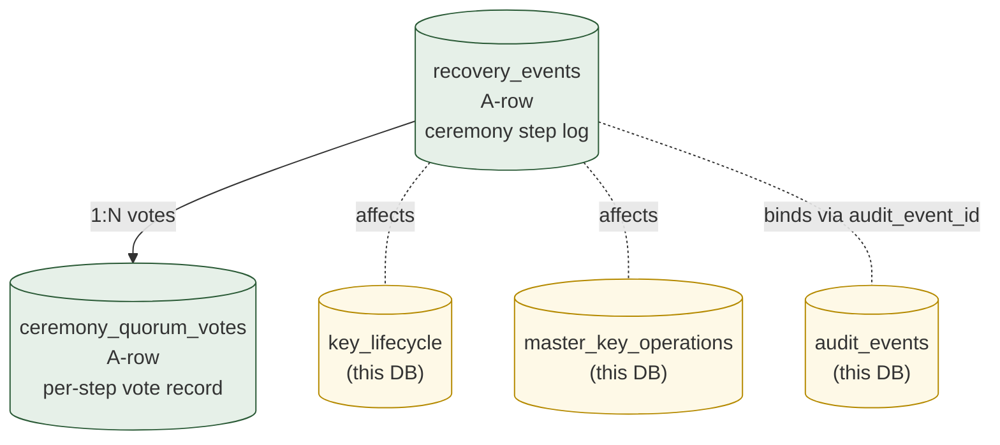
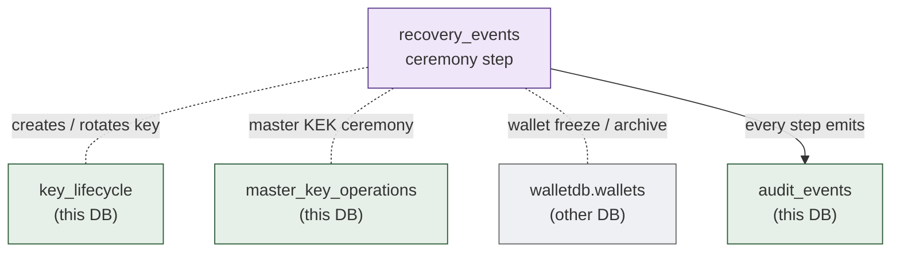

# 11. Recovery & Ceremony
> 키 / vault / cluster 의 복구 ceremony 의 영속화 — m-of-n quorum + 외부 evidence

이 도메인은 자금 자체를 다루지 않습니다. **ceremony 의 evidence** 만 영속화. 모든 step 은 m-of-n 사람의 결정이 동반. Append-only.

**Owning DB**: `auditdb` (recovery 의 evidence 는 audit chain 의 일부)
**Owning service**: Recovery Governance Service (write authority)
**Read-only consumers**: External Auditor, Compliance, Operator Console, Audit

---

## 1. 책임의 범위

| 본 도메인이 담당 | 본 도메인이 담당하지 않음 |
|----------------|------------------------|
| Recovery ceremony 의 step-by-step event log | runtime signing (Signing Service) |
| Quorum participant 의 vote record | KYC 자체 (KYC system) |
| External evidence reference (회의록 등) | 자금 정정 (Ledger via reversal) |
| Key lifecycle event 의 ceremony anchor | TEE attestation 자체 (DCAP infrastructure) |
| Master key operations 의 ceremony evidence | enclave image distribution |

---

## 2. PK/FK dependency



---

## 3. Recovery 의 종류

| Recovery 종류 | Trigger | Ceremony depth |
|--------------|---------|---------------|
| `key_rotation_initiator` | 정기 (분기) 또는 incident | 운영자 quorum + HSM ceremony |
| `key_rotation_approver` | 정기 또는 incident | 같음 |
| `key_rotation_executor` | TEE image rotation | quorum + MRENCLAVE 재봉인 |
| `vault_restore` | data corruption | quorum + DB restore + integrity check |
| `operator_transition` | 운영자 교체 | charter-class governance + HSM PED rotation |
| `cross_dc_failover` | DC 장애 | quorum + 다른 DC 활성화 ceremony |
| `disaster_recovery` | 전체 cluster 손실 | quorum + 외부 backup site activation |
| `tee_enclave_rotation` | MRENCLAVE 변경 (security update) | master_key_operations.RSA_OAEP_WRAP ceremony |
| `master_key_ceremony` | 처음 provisioning 또는 master rotation | charter-class — 가장 high-stakes |

---

## 4. `recovery_events`

### 4.1 책임

- Ceremony 의 각 step 의 evidence (append-only)
- Step 별 quorum decision + external evidence reference

| 속성 | 값 |
|------|-----|
| Storage class | `A-row` |
| Source of truth | row 자체 |
| Mutation authority | Recovery Governance Service 의 INSERT 만 |
| Read access | External Auditor, Audit, Operator |
| Logical deletion | 절대 금지 |
| Partitioning | per-year (volume 낮음) |

### 4.2 Ceremony 의 state machine 영속화

reference-architecture 의 ceremony state machine (PROPOSED → QUORUM_GATHERING → QUORUM_READY → PRE_VERIFICATION → EXECUTING → POST_VERIFICATION → COMPLETED/ABORTED/FAILED) 의 각 transition 이 row 1 개.

각 ceremony 는 **여러 row 의 시퀀스**:
- `ceremony_id` 가 공통 → 한 ceremony 의 step 들을 묶음
- `step_seq` per-ceremony — 순서 명시
- `step_type` 으로 어떤 step 인지

### 4.3 Schema 제안

| 컬럼 | 타입 | NULL | Class | 의미 |
|------|------|------|-------|------|
| `id` | UUID | NOT NULL | PK | event row id |
| `ceremony_id` | UUID | NOT NULL | `A-set` | 같은 ceremony 의 step 들이 공유 |
| `ceremony_type` | enum | NOT NULL | `A-set` | 위 §3 |
| `step_seq` | INT | NOT NULL | `A-set` | per-ceremony sequence |
| `step_type` | enum | NOT NULL | `A-set` | `'proposed'`, `'quorum_gathering_opened'`, `'quorum_member_voted'`, `'quorum_threshold_reached'`, `'pre_verification_started'`, `'pre_verification_passed'`, `'pre_verification_failed'`, `'execution_started'`, `'execution_step'`, `'execution_completed'`, `'post_verification_started'`, `'post_verification_passed'`, `'post_verification_failed'`, `'rollback_started'`, `'rollback_completed'`, `'ceremony_completed'`, `'ceremony_aborted'`, `'ceremony_failed'` |
| `step_description` | TEXT | NOT NULL | `A-set` | human-readable |
| `tenant_scope` | UUID | NULL | `A-set` | 영향 받는 tenant (NULL = global) |
| `affected_key_ids` | TEXT[] | NULL | `A-set` | 영향 받는 키 식별자 |
| `affected_aggregate_refs` | JSONB | NULL | `A-set` | 영향 받는 aggregate IDs |
| `external_evidence_ref` | TEXT | NULL | `A-set` | 회의록 / 외부 system 결정 의 URL or doc id |
| `internal_artifact_refs` | JSONB | NULL | `A-set` | 관련 row IDs (key_lifecycle, master_key_operations 등) |
| `step_outcome` | enum | NULL | `A-set` | `'success'`, `'failure'`, `'aborted'` |
| `step_payload` | JSONB | NOT NULL | `A-set` | step-specific data |
| `performed_by` | UUID | NULL | `A-set` | 수행 운영자 (system step 면 NULL) |
| `event_at` | TIMESTAMPTZ | NOT NULL | `A-set` | step 발생 시각 |
| `audit_event_id` | UUID | NULL | `A-set` | cross-binding to audit_events |
| `created_at` | TIMESTAMPTZ | NOT NULL | `A-set` | DB INSERT 시각 |

### 4.4 핵심 invariant

#### 4.4.1 Append-only

```sql
CREATE TRIGGER recovery_events_no_mutation
  BEFORE UPDATE OR DELETE ON recovery_events
  FOR EACH ROW EXECUTE FUNCTION prevent_mutation_generic();
```

#### 4.4.2 `(ceremony_id, step_seq)` UNIQUE

```sql
CREATE UNIQUE INDEX uniq_ceremony_step
  ON recovery_events (ceremony_id, step_seq);
```

#### 4.4.3 Ceremony 의 first row 는 `step_type = 'proposed'`

```sql
-- application 책임 — DB-level enforce 어려움
-- application 검증 또는 first-row trigger:

CREATE OR REPLACE FUNCTION enforce_ceremony_first_step()
RETURNS TRIGGER AS $$
BEGIN
  IF NEW.step_seq = 1 AND NEW.step_type != 'proposed' THEN
    RAISE EXCEPTION 'first step of ceremony % must be proposed', NEW.ceremony_id;
  END IF;
  RETURN NEW;
END;
$$ LANGUAGE plpgsql;
```

#### 4.4.4 Terminal step 후 추가 step 금지

ceremony 의 마지막 row 는 `'ceremony_completed'`, `'ceremony_aborted'`, `'ceremony_failed'` 중 하나:

```sql
-- 같은 ceremony_id 에 terminal step 이 있는지 확인
CREATE OR REPLACE FUNCTION enforce_ceremony_terminal()
RETURNS TRIGGER AS $$
DECLARE has_terminal BOOLEAN;
BEGIN
  SELECT EXISTS (
    SELECT 1 FROM recovery_events
    WHERE ceremony_id = NEW.ceremony_id
      AND step_type IN ('ceremony_completed', 'ceremony_aborted', 'ceremony_failed')
  ) INTO has_terminal;
  
  IF has_terminal THEN
    RAISE EXCEPTION 'ceremony % already terminal — no further steps', NEW.ceremony_id;
  END IF;
  
  RETURN NEW;
END;
$$ LANGUAGE plpgsql;

CREATE TRIGGER recovery_events_terminal_check
  BEFORE INSERT ON recovery_events
  FOR EACH ROW EXECUTE FUNCTION enforce_ceremony_terminal();
```

### 4.5 Indexing

| Index | 목적 |
|-------|------|
| `recovery_events_pkey (id)` | PK |
| `uniq_ceremony_step (ceremony_id, step_seq)` | sequence |
| `idx_recovery_events_ceremony (ceremony_id, step_seq)` | ceremony 의 lifecycle replay |
| `idx_recovery_events_type (ceremony_type, event_at)` | type 별 history |
| `idx_recovery_events_key (affected_key_ids)` | GIN index for array — 특정 키의 ceremony history |

---

## 5. `ceremony_quorum_votes`

### 5.1 책임

- Ceremony 의 quorum step 에서 각 member 의 vote record
- m-of-n 의 명시적 evidence

| 속성 | 값 |
|------|-----|
| Storage class | `A-row` |
| Source of truth | row 자체 |
| Mutation authority | Recovery Governance Service |
| Read access | External Auditor, Audit, Operator |
| Logical deletion | 절대 금지 |
| Partitioning | per-year |

### 5.2 Schema 제안

| 컬럼 | 타입 | NULL | Class | 의미 |
|------|------|------|-------|------|
| `id` | UUID | NOT NULL | PK | |
| `ceremony_id` | UUID | NOT NULL | `A-set` | FK recovery_events.ceremony_id (denormalized) |
| `recovery_event_id` | UUID | NULL | `A-set` | 어느 step 의 vote인지 (보통 `quorum_member_voted` step) |
| `quorum_group` | enum | NOT NULL | `A-set` | `'initiator_key_quorum'`, `'approver_key_quorum'`, `'executor_key_quorum'`, `'charter_council'`, `'recovery_committee'` |
| `quorum_threshold` | TEXT | NOT NULL | `A-set` | `'3-of-5'` 등 (string form) |
| `voter_id` | UUID | NOT NULL | `A-set` | 운영자 user id |
| `voter_role` | TEXT | NOT NULL | `A-set` | role at time of vote |
| `vote` | enum | NOT NULL | `A-set` | `'approve'`, `'reject'`, `'abstain'` |
| `vote_signature` | BYTEA | NOT NULL | `A-set` | voter 의 서명 (cryptographic; YubiKey / HSM-bound) |
| `vote_pubkey` | BYTEA | NOT NULL | `A-set` | voter 의 verification pubkey |
| `voted_at` | TIMESTAMPTZ | NOT NULL | `A-set` | |
| `external_acknowledgment` | TEXT | NULL | `A-set` | 외부 system 의 vote evidence (별도 시스템 결정 시) |

### 5.3 핵심 invariant

#### 5.3.1 Append-only

```sql
CREATE TRIGGER ceremony_quorum_votes_no_mutation
  BEFORE UPDATE OR DELETE ON ceremony_quorum_votes
  FOR EACH ROW EXECUTE FUNCTION prevent_mutation_generic();
```

#### 5.3.2 `(ceremony_id, voter_id, quorum_group)` UNIQUE

같은 ceremony 의 같은 quorum 에서 한 voter 는 1 vote:

```sql
CREATE UNIQUE INDEX uniq_voter_per_ceremony_quorum
  ON ceremony_quorum_votes (ceremony_id, voter_id, quorum_group);
```

#### 5.3.3 Signature 검증 (application 책임)

```python
# pseudo:
message = ceremony_id ‖ quorum_group ‖ vote ‖ voted_at
assert vote_pubkey.verify(message, vote_signature)
```

INSERT 전 검증 — 잘못된 signature 면 거절.

### 5.4 Quorum threshold 도달의 evidence

ceremony 의 `step_type = 'quorum_threshold_reached'` row 의 `step_payload` 에:

```json
{
  "quorum_group": "executor_key_quorum",
  "threshold": "4-of-7",
  "votes_received": 5,
  "votes_approve": 4,
  "votes_reject": 1,
  "vote_ids": ["uuid1", "uuid2", "uuid3", "uuid4", "uuid5"]
}
```

이 row 의 INSERT 는 자동 — application 이 ceremony_quorum_votes 의 approve count 가 threshold 도달 시 발행.

### 5.5 Indexing

| Index | 목적 |
|-------|------|
| `ceremony_quorum_votes_pkey (id)` | PK |
| `uniq_voter_per_ceremony_quorum` | 1 vote per voter |
| `idx_quorum_votes_ceremony (ceremony_id, voted_at)` | ceremony 의 vote timeline |
| `idx_quorum_votes_voter (voter_id, voted_at)` | per-voter audit |

---

## 6. Ceremony 의 cross-domain effects

ceremony 의 각 step 은 다른 aggregate 에 영향:



각 ceremony step 의 effect:

| Ceremony step | 다른 aggregate 의 변화 |
|---------------|---------------------|
| `key_rotation_initiator` execution | `key_lifecycle` INSERT (ROTATED + new ACTIVATED) |
| `master_key_ceremony` execution | `master_key_operations` INSERT (RSA_OAEP_WRAP, TOFU_PIN) |
| `vault_restore` execution | DB restore from backup (cross-DB ceremony) |
| `operator_transition` execution | operator 의 권한 row update (별도 user/role tables) + `policy_rules` 변경 |
| `cross_dc_failover` execution | active DC 변경 — application config 변경 (별도 mechanism) |

본 도메인의 recovery_events 는 이 모든 변경의 **단일 evidence anchor**.

---

## 7. Master key ceremony 의 specific 영속화

가장 high-stakes ceremony — `master_key_ceremony` type:

### 7.1 Ceremony 의 step sequence (예시)

```
1. proposed (operator initiates with ceremony plan)
2. quorum_gathering_opened (recovery committee notified)
3. quorum_member_voted (각 member 의 vote — ceremony_quorum_votes INSERT)
4. ... (more votes)
5. quorum_threshold_reached (4-of-7 approve)
6. pre_verification_started (HSM 상태 / TEE attestation 검증)
7. pre_verification_passed
8. execution_started
9. execution_step (HSM 에서 master key 생성)
10. execution_step (RSA-OAEP wrap to enclave's one-time pubkey) — master_key_operations INSERT
11. execution_step (enclave decrypt + seal to MRENCLAVE) — key_lifecycle INSERT (SEALED_TO_ENCLAVE)
12. execution_step (TOFU pin record) — master_key_operations INSERT (TOFU_PIN_RECORD)
13. execution_completed
14. post_verification_started (서명 test, attestation 검증)
15. post_verification_passed
16. ceremony_completed
```

각 step 은 recovery_events 의 1 row. 동시에 다른 도메인 (key_lifecycle, master_key_operations) 도 INSERT.

### 7.2 Master key rotation 의 sensitivity

- 가장 high-stakes ceremony — 잘못되면 전체 자금 접근 불가
- Multi-day ceremony 가능 (참여자 schedule + cooling-off)
- 외부 evidence (회의록, 별도 시스템 결정) 필수
- DCAP attestation 의 sample sign + verify 가 post-verification 의 일부

자세한 master key operations 의 schema 는 [06-signing-execution.md](06-signing-execution.md) §6 참고.

---

## 8. Cross-DC failover ceremony 의 영속화

### 8.1 Failover 의 step sequence

```
1. proposed (DC1 outage detected — automated incident detection + manual confirmation)
2. quorum_gathering_opened
3. ... votes ...
4. quorum_threshold_reached
5. pre_verification_started (DC2 의 상태 확인 — DB sync lag, HSM cluster, TEE infrastructure)
6. pre_verification_passed (or _failed → abort)
7. execution_started
8. execution_step (DNS / load balancer 변경 — DC2 활성화)
9. execution_step (DC2 의 HSM cluster 활성화)
10. execution_step (DC2 의 enclave provisioning 확인)
11. execution_step (application 의 leader election 강제 — DC2 leader 로)
12. execution_completed
13. post_verification_started (sample transaction test — DC2 에서 모든 도메인 작동 확인)
14. post_verification_passed
15. ceremony_completed
```

각 step 의 외부 effect (DNS 변경 등) 는 외부 system 의 evidence (DNS provider 의 변경 log) 가 `external_evidence_ref` 에.

### 8.2 Rollback 처리

post_verification_failed 시:

```
... post_verification_failed
16. rollback_started
17. rollback_step (DC1 로 traffic 복귀)
18. rollback_completed
19. ceremony_aborted
```

rollback 자체도 evidence chain — append-only row.

---

## 9. External evidence reference 의 의미

`external_evidence_ref` 컬럼은 **DB 외부의 evidence** 를 가리킴:

| External evidence 종류 | 예 |
|---------------------|-----|
| 회의록 (meeting minutes) | 회사 wiki / document store URL |
| 별도 시스템의 결정 record | Jira ticket / 의결 system row |
| 종이 ceremony 문서 | scanning + secure store URL |
| 외부 attestation report | regulator / auditor 의 issued document |
| 외부 service 의 ack | DNS provider 의 audit log URL |
| 영상 녹화 (ceremony) | secure video storage URL |

이 evidence 는 **DB 외부에 stable URL 또는 ID** 로 영속화 — DB 의 audit defense 가 외부 evidence 의 정합성에 의존하지 않음 (DB 가 충분히 자기 증명 가능). 단 external evidence 는 **보강 layer**.

---

## 10. Audit chain 과의 binding

recovery_events 와 ceremony_quorum_votes 의 모든 row 는 audit_events 와 binding:

```sql
-- recovery_events INSERT 시 audit_event 도 INSERT (application transaction)
BEGIN;
  INSERT INTO recovery_events (..., audit_event_id) VALUES (..., $audit_id);
  INSERT INTO audit_events (id, event_type, source_aggregate_type, source_aggregate_id, event_payload_cbor, ...)
  VALUES ($audit_id, 'recovery.ceremony_step', 'recovery_event', $re_id, $cbor, ...);
COMMIT;
```

또는 trigger 로 자동:

```sql
CREATE OR REPLACE FUNCTION emit_audit_event_for_recovery()
RETURNS TRIGGER AS $$
BEGIN
  INSERT INTO audit_events (...)
  VALUES (...);
  RETURN NEW;
END;
$$ LANGUAGE plpgsql;
```

본 reference 는 application 책임 권장 (transaction control 명확).

---

## 11. External auditor verification

외부 감사관이 본 도메인을 verify:

1. **Ceremony 의 step sequence 검증**: `recovery_events` 의 step_seq 의 연속성
2. **Quorum 의 threshold 검증**: `ceremony_quorum_votes` 의 approve count >= threshold
3. **Voter 의 signature 검증**: `vote_signature` 가 `vote_pubkey` 로 verifiable
4. **외부 evidence cross-check**: `external_evidence_ref` 의 URL 의 document 가 ceremony 와 일치
5. **Audit chain binding**: `audit_event_id` 가 audit_events 의 row 로 traceable
6. **MRENCLAVE consistency**: enclave-involved ceremony 의 MRENCLAVE 가 registered list 에 일치

이 6 단계가 ceremony evidence 의 audit-reviewable backbone.

---

## 12. Retention 정책

- `recovery_events`, `ceremony_quorum_votes` 모두 **영구 보존**
- Master key ceremony 의 evidence 는 institution 의 lifetime 동안 보존 권장
- archival tier 이동 가능 (warm → cold) 하지만 deletion 절대 금지

---

## 13. Reconciliation 의 recovery 도메인 query

```sql
-- 모든 ceremony 가 terminal 도달했는가
SELECT ceremony_id, MAX(step_seq), MAX(step_type)
FROM recovery_events
GROUP BY ceremony_id
HAVING MAX(step_type) NOT IN ('ceremony_completed', 'ceremony_aborted', 'ceremony_failed')
   AND MAX(event_at) < NOW() - INTERVAL '24 hours';
-- 결과 비어 있어야 — 24 시간 이상 진행 중 ceremony 는 incident

-- Quorum threshold 도달이 quorum_votes 와 일치
SELECT
  re.ceremony_id,
  re.step_payload->>'votes_approve' AS step_recorded_approve,
  (SELECT COUNT(*) FROM ceremony_quorum_votes
   WHERE ceremony_id = re.ceremony_id AND vote = 'approve') AS actual_approve
FROM recovery_events re
WHERE re.step_type = 'quorum_threshold_reached'
  AND (re.step_payload->>'votes_approve')::INT != (
    SELECT COUNT(*) FROM ceremony_quorum_votes
    WHERE ceremony_id = re.ceremony_id AND vote = 'approve'
  );
-- 결과 비어 있어야

-- 모든 voter signature 가 valid 한지 (application 의 정기 batch verify)
-- DB query 로는 검증 불가 — application 의 정기 task
```

---

## 14. Operational considerations

### 14.1 Multi-day ceremony 의 handling

- Master key ceremony 같은 multi-day event 의 quorum 모집 phase 는 일 단위
- application 의 ceremony coordinator service 가 state 추적 (in-flight ceremony 의 cache + DB query)
- ceremony 가 멈춰 있을 때 alert (예: quorum_gathering 이 72 시간 이상)

### 14.2 Operator 의 인증 mechanism

quorum vote 의 signature 는 **operator 의 secure device** 가 발행:

| Mechanism | 의미 |
|-----------|------|
| YubiKey (FIDO2) | 가장 common; PIN + tap |
| HSM PED (Pin Entry Device) | HSM 의 운영자 인증 |
| 별도 hardware token | institution 의 custom |
| Smart card | regulatory 요구사항 |

application 이 signature 검증 — DB 는 signature byte sequence 만 보관.

### 14.3 Backup / DR

- recovery_events 와 ceremony_quorum_votes 는 **synchronous replication 필수**
- Multi-DC: cross-DC sync 가 의무
- Backup 의 integrity 자체가 ceremony evidence — backup 손상 시 sample restore + verify

---

## 15. Anti-patterns

| Anti-pattern | 왜 안 좋은가 |
|--------------|-------------|
| `recovery_events` UPDATE 또는 DELETE | ceremony history 손상 — audit unreviewable |
| Quorum vote 의 signature 검증 누락 | 위조 vote 가능 |
| `external_evidence_ref` 없는 ceremony | 외부 audit 시 cross-check 불가 |
| Same voter 의 multiple votes | UNIQUE constraint 누락 |
| Automated ceremony execution (사람 결정 없음) | architectural violation — ceremony 의 의미 무력화 |
| Ceremony 의 terminal step 후 추가 step 허용 | timeline 모호 |
| Master key ceremony 의 cooling-off 누락 | impulsive ceremony 위험 |
| `ceremony_quorum_votes.vote_signature` 의 mutable | 사후 vote 변조 가능 |
| Ceremony step 의 sequence 비연속 (gap) | partial evidence — audit defense 약화 |

---

## 16. 다음 읽을 글

- Master key ceremony 의 세부 → [06-signing-execution.md](06-signing-execution.md) §6
- Audit chain binding → [10-audit-evidence-integrity.md](10-audit-evidence-integrity.md)
- Key lifecycle event → [06-signing-execution.md](06-signing-execution.md) §5
- Cross-DC failover 의 DB 측면 → [15-db-split-and-postgresql.md](15-db-split-and-postgresql.md)
