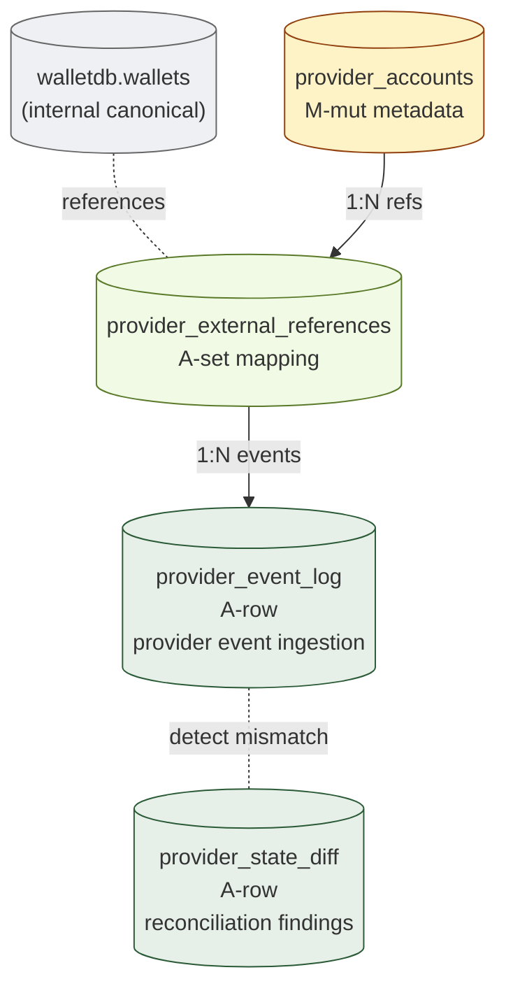

# 12. Provider Mapping
> External vendor (Fireblocks / NodeInfra / 등) 의 state 와 internal canonical 의 분리

이 도메인은 **internal canonical model 이 source of truth**, provider 는 external reference 임을 영속화합니다. `provider_status ≠ internal canonical state` 가 핵심 invariant.

**Owning DB**: `providerdb`
**Owning service**: Provider Mapping Service (write authority)
**Read-only consumers**: Reconciliation Service, Audit Service, Operator Console

---

## 1. 책임의 범위

| 본 도메인이 담당 | 본 도메인이 담당하지 않음 |
|----------------|------------------------|
| Provider 의 account / wallet 의 ID 매핑 | internal canonical state (다른 도메인) |
| Provider event 의 normalization + ingestion | 자금 결정 (Approval) |
| Provider 와 internal 의 state diff 추적 | 정정 (Ledger via reversal — operator 결정 후) |
| Provider 의 API call audit | provider 의 internal state 자체 (vendor 책임) |
| Vendor migration 의 state 보존 | provider 의 SLA 유지 (vendor 책임) |

---

## 2. PK/FK dependency



*Figure 15. Provider mapping architecture — internal canonical 과 provider state 의 격리.*

---

## 3. Provider-neutral 의 의미

### 3.1 왜 provider 가 canonical 이 될 수 없는가

이론적으로 가능한 선택지:

| 옵션 | 의미 | 문제 |
|------|------|------|
| **Option A: Provider 가 canonical** | provider 의 state = internal state | vendor lock-in; vendor migration 시 ground-up rewrite; vendor 장애 = production 멈춤; audit defense 가 vendor 의 SOC2 에 종속 |
| **Option B: Internal 만 canonical + provider 없음** | 완전 Direct-build | 운영 부담 ↑; vendor 의 흡수 효과 없음 |
| **Option C: Internal canonical + provider as external reference** | provider 가 mapping target | vendor lock-in 회피; migration 가능; reconciliation 으로 정합성 추적 |

본 reference 는 **Option C 권장**. provider 가 다른 vendor 로 바뀌어도 internal canonical model 은 stable.

### 3.2 4 가지 분리 원칙

| 원칙 | 의미 |
|------|------|
| **ID 분리** | internal `wallets.id` ≠ provider 의 ID. mapping 은 별도 테이블 (`provider_external_references`) |
| **State 분리** | internal `withdrawal.state` ≠ provider 의 status. 같은 의미라도 별도 enum |
| **Event 분리** | provider 의 webhook payload → normalize → internal event. raw payload 도 보존 (audit) |
| **Authority 분리** | internal 결정이 source of truth — provider 가 다른 verdict 보내도 internal 이 우선 (단, mismatch 는 reconciliation finding) |

---

## 4. `provider_accounts`

### 4.1 책임

- Provider 측의 account / workspace / tenant 의 ID 보존
- Provider 와의 connection metadata
- Multiple provider 동시 지원 가능

| 속성 | 값 |
|------|-----|
| Storage class | `M-mut` (metadata) + `A-set` (ID) |
| Source of truth | row 자체 (mapping 정보의 internal anchor) |
| Mutation authority | Provider Mapping Service |
| Read access | Reconciliation, Audit, Operator |
| Logical deletion | 금지 — `status='archived'` |
| Partitioning | N/A |

### 4.2 Schema 제안

| 컬럼 | 타입 | NULL | Class | 의미 |
|------|------|------|-------|------|
| `id` | UUID | NOT NULL | PK | internal id |
| `provider_id` | TEXT | NOT NULL | `A-set` | `'fireblocks'`, `'nodeinfra'`, `'cobo'`, ... |
| `provider_account_external_id` | TEXT | NOT NULL | `A-set` | provider 측 ID (workspace ID 등) — set-once |
| `internal_tenant_id` | UUID | NOT NULL | `A-set` | internal tenant 와의 매핑 |
| `display_name` | TEXT | NOT NULL | `M-mut` | |
| `api_credential_ref` | TEXT | NOT NULL | `A-set` | secret manager 의 reference (실제 credential 은 DB 에 없음) |
| `api_base_url` | TEXT | NOT NULL | `M-mut` | provider API endpoint |
| `webhook_secret_ref` | TEXT | NULL | `A-set` | webhook signature verification 의 secret reference |
| `enabled_features` | JSONB | NOT NULL | `M-mut` | provider 의 활용 features (예: `["signing", "policy", "audit"]`) |
| `status` | enum | NOT NULL | `M-mut` | `'active'`, `'degraded'`, `'paused'`, `'archived'` |
| `created_at` | TIMESTAMPTZ | NOT NULL | `A-set` | |
| `version` | BIGINT | NOT NULL | `M-mut` | |

### 4.3 핵심 invariant

- `(provider_id, provider_account_external_id)` UNIQUE — 같은 provider 의 같은 external ID 가 두 row 면 mapping 모호
- `api_credential_ref` 는 **secret manager 의 reference** — 실제 credential 은 DB 에 없음 (forbidden storage)
- `provider_account_external_id` 는 set-once — vendor 측 ID 가 사후에 바뀌면 mapping 손상

### 4.4 Indexing

| Index | 목적 |
|-------|------|
| `provider_accounts_pkey (id)` | PK |
| `uniq_provider_external (provider_id, provider_account_external_id)` | mapping UNIQUE |
| `idx_provider_accounts_tenant (internal_tenant_id, status)` | tenant 별 활성 provider |

---

## 5. `provider_external_references`

### 5.1 책임

- Internal aggregate (wallet, withdrawal, key 등) 와 provider 측 ID 의 매핑
- Multi-provider 환경에서 같은 internal aggregate 가 여러 provider 에 매핑 가능

| 속성 | 값 |
|------|-----|
| Storage class | `A-set` (대부분 set-once after mapping) + `M-mut` (status) |
| Source of truth | row 자체 (mapping 정보의 source) |
| Mutation authority | Provider Mapping Service |
| Read access | Reconciliation, Audit, Operator |
| Logical deletion | 금지 — `status='inactive'` |
| Partitioning | N/A |

### 5.2 Schema 제안

| 컬럼 | 타입 | NULL | Class | 의미 |
|------|------|------|-------|------|
| `id` | UUID | NOT NULL | PK | |
| `provider_account_id` | UUID | NOT NULL | `A-set` | FK provider_accounts.id |
| `internal_aggregate_type` | enum | NOT NULL | `A-set` | `'wallet'`, `'address'`, `'withdrawal'`, `'approval_request'`, `'key'`, ... |
| `internal_aggregate_id` | UUID | NOT NULL | `A-set` | internal aggregate 의 ID |
| `internal_db` | TEXT | NOT NULL | `A-set` | 해당 aggregate 가 있는 DB (`'walletdb'`, `'ledgerdb'`, ...) |
| `provider_external_id` | TEXT | NOT NULL | `A-set` | provider 측 ID (wallet ID, transaction ID 등) — set-once |
| `provider_external_metadata` | JSONB | NULL | `M-mut` | provider 측 extra metadata (provider 가 변경 가능한 부분) |
| `mapping_method` | enum | NOT NULL | `A-set` | `'on_demand_creation'` (우리가 internal 먼저 → provider 에 생성 요청), `'imported'` (provider 의 기존 entity 를 internal 로 import), `'discovered'` (provider event 로 발견) |
| `mapping_created_at` | TIMESTAMPTZ | NOT NULL | `A-set` | |
| `last_synced_at` | TIMESTAMPTZ | NULL | `M-mut` | 최근 provider 와 sync 한 시각 (advisory) |
| `last_known_provider_status` | TEXT | NULL | `M-mut` | provider 의 마지막 관찰된 status (advisory — internal canonical 아님) |
| `status` | enum | NOT NULL | `M-mut` | `'active'`, `'inactive'`, `'failed-to-create'` |
| `version` | BIGINT | NOT NULL | `M-mut` | |

### 5.3 핵심 invariant

#### 5.3.1 UNIQUE 매핑

```sql
-- 같은 internal aggregate 는 같은 provider account 에 1 mapping
CREATE UNIQUE INDEX uniq_internal_to_provider
  ON provider_external_references (provider_account_id, internal_aggregate_type, internal_aggregate_id);

-- 같은 provider 의 같은 external ID 는 1 internal aggregate
CREATE UNIQUE INDEX uniq_provider_to_internal
  ON provider_external_references (provider_account_id, internal_aggregate_type, provider_external_id);
```

이 두 UNIQUE 가 양방향 매핑의 단일성을 강제.

#### 5.3.2 `provider_external_id` set-once

```sql
CREATE TRIGGER per_external_id_set_once
  BEFORE UPDATE ON provider_external_references
  FOR EACH ROW
  WHEN (OLD.provider_external_id IS DISTINCT FROM NEW.provider_external_id)
  EXECUTE FUNCTION raise_set_once_violation('provider_external_id');
```

provider 측의 ID 가 사후에 바뀌면 mapping 손상 — vendor 가 ID 정책 바꿔도 우리 mapping 은 stable.

#### 5.3.3 Provider canonical 금지

`last_known_provider_status` 는 advisory — 절대 internal state 의 canonical 이 아님:

```sql
-- 어떤 reconciliation 도 last_known_provider_status 를 진실로 가정하지 않음
-- 그 컬럼은 reconciliation 의 input (mismatch detection 용)
```

### 5.4 Indexing

| Index | 목적 |
|-------|------|
| `provider_external_references_pkey (id)` | PK |
| `uniq_internal_to_provider` | UNIQUE |
| `uniq_provider_to_internal` | UNIQUE |
| `idx_per_active (provider_account_id, status)` | active mapping 조회 |
| `idx_per_aggregate (internal_aggregate_type, internal_aggregate_id)` | aggregate → provider lookup |

---

## 6. `provider_event_log`

### 6.1 책임

- Provider 에서 들어온 raw event 의 mirror (append-only)
- Normalization 결과 보존
- Webhook 검증 evidence

| 속성 | 값 |
|------|-----|
| Storage class | `A-row` |
| Source of truth | row 자체 (event 수신 fact) |
| Mutation authority | Provider Mapping Service |
| Read access | Reconciliation, Audit, Operator |
| Logical deletion | 금지 |
| Partitioning | per-month |

### 6.2 Schema 제안

| 컬럼 | 타입 | NULL | Class | 의미 |
|------|------|------|-------|------|
| `id` | UUID | NOT NULL | PK | |
| `provider_account_id` | UUID | NOT NULL | `A-set` | FK provider_accounts.id |
| `provider_event_external_id` | TEXT | NOT NULL | `A-set` | provider 가 부여한 event ID (UNIQUE per provider) |
| `event_source` | enum | NOT NULL | `A-set` | `'webhook'`, `'polling'`, `'admin-sync'` |
| `event_type_raw` | TEXT | NOT NULL | `A-set` | provider 의 event type string |
| `event_type_normalized` | enum | NOT NULL | `A-set` | internal 분류 (`'transaction_confirmed'`, `'approval_changed'`, `'wallet_created'`, ...) |
| `raw_payload` | JSONB | NOT NULL | `A-set` | provider 의 raw event payload |
| `normalized_payload` | JSONB | NULL | `A-set` | internal 분류된 payload |
| `webhook_signature` | BYTEA | NULL | `A-set` | webhook 의 signature (검증 evidence) |
| `signature_verified` | BOOLEAN | NOT NULL | `A-set` | signature verification 결과 |
| `mapped_internal_aggregate_type` | TEXT | NULL | `A-set` | normalize 후 internal aggregate 매핑 결과 |
| `mapped_internal_aggregate_id` | UUID | NULL | `A-set` | |
| `mapping_status` | enum | NOT NULL | `A-set` | `'mapped'`, `'unmapped'`, `'mapping-failed'` |
| `received_at` | TIMESTAMPTZ | NOT NULL | `A-set` | event 수신 시각 |
| `provider_event_at` | TIMESTAMPTZ | NULL | `A-set` | provider 가 event 발생 시각 (raw 에서 추출) |
| `processed_at` | TIMESTAMPTZ | NULL | `A-set` | normalization 완료 시각 |
| `audit_event_id` | UUID | NULL | `A-set` | cross-DB ref: auditdb.audit_events.id |

### 6.3 핵심 invariant

#### 6.3.1 Append-only

```sql
CREATE TRIGGER provider_event_log_no_mutation
  BEFORE UPDATE OR DELETE ON provider_event_log
  FOR EACH ROW EXECUTE FUNCTION prevent_mutation_generic();
```

#### 6.3.2 `(provider_account_id, provider_event_external_id)` UNIQUE

```sql
CREATE UNIQUE INDEX uniq_provider_event
  ON provider_event_log (provider_account_id, provider_event_external_id);
```

같은 provider event 의 duplicate 차단 — webhook retry 시 idempotency.

#### 6.3.3 Signature verification

`signature_verified = false` 인 event 는 application 이 거절. DB 에는 evidence 만:

```sql
-- 적어도 signature_verified 가 명시되어야
ALTER TABLE provider_event_log
  ADD CONSTRAINT chk_signature_required CHECK (
    -- webhook 은 signature 필수, polling 은 NULL 가능
    (event_source = 'webhook' AND webhook_signature IS NOT NULL) OR
    (event_source IN ('polling', 'admin-sync'))
  );
```

### 6.4 Webhook ingestion flow

```
Provider webhook → endpoint:
  1. signature verify (provider_accounts.webhook_secret_ref 로)
  2. INSERT provider_event_log (raw_payload, webhook_signature, signature_verified)
  3. (signature_verified = false 면 reject + alert)
  4. normalize → normalized_payload
  5. UPDATE provider_event_log (normalized_payload, processed_at, mapping_status)
  6. dispatch internal handler:
     - transaction_confirmed → check vs internal withdrawal state
     - mismatch 발견 → provider_state_diff INSERT
  7. audit_event INSERT
```

### 6.5 Indexing

| Index | 목적 |
|-------|------|
| `provider_event_log_pkey (id)` | PK |
| `uniq_provider_event` | dedup |
| `idx_pel_received (received_at DESC)` | recent events |
| `idx_pel_aggregate (mapped_internal_aggregate_type, mapped_internal_aggregate_id)` | aggregate → events |
| `idx_pel_failed (mapping_status, received_at) WHERE mapping_status = 'mapping-failed'` | failure investigation |

---

## 7. `provider_state_diff` (mismatch tracking)

### 7.1 책임

- Provider 와 internal canonical 의 mismatch detection 결과
- reconciliation 의 finding 의 일부지만 provider-specific 라 별도 테이블

| 속성 | 값 |
|------|-----|
| Storage class | `A-row` + `M-mut` (resolution state) |
| Source of truth | row 자체 |
| Mutation authority | Provider Mapping Service (detection) + Operator (resolution) |
| Read access | Reconciliation, Audit, Operator |
| Logical deletion | 금지 |
| Partitioning | per-month |

### 7.2 Schema 제안

| 컬럼 | 타입 | NULL | Class | 의미 |
|------|------|------|-------|------|
| `id` | UUID | NOT NULL | PK | |
| `provider_account_id` | UUID | NOT NULL | `A-set` | |
| `mapping_id` | UUID | NULL | `A-set` | FK provider_external_references.id (있을 때) |
| `internal_aggregate_type` | TEXT | NOT NULL | `A-set` | |
| `internal_aggregate_id` | UUID | NULL | `A-set` | |
| `provider_external_id` | TEXT | NULL | `A-set` | |
| `diff_type` | enum | NOT NULL | `A-set` | `'state-mismatch'`, `'missing-on-provider'`, `'missing-on-internal'`, `'value-mismatch'`, `'orphan-provider-entity'` |
| `internal_value` | JSONB | NULL | `A-set` | internal observed value |
| `provider_value` | JSONB | NULL | `A-set` | provider observed value |
| `diff_description` | TEXT | NOT NULL | `A-set` | |
| `severity` | enum | NOT NULL | `A-set` | `'info'`, `'warning'`, `'critical'` |
| `detected_at` | TIMESTAMPTZ | NOT NULL | `A-set` | |
| `resolution_state` | enum | NOT NULL | `M-mut` | `'open'`, `'investigating'`, `'resolved'`, `'accepted-as-provider-lag'`, `'escalated'` |
| `resolved_at` | TIMESTAMPTZ | NULL | `A-set` | set-once |
| `resolution_evidence_ref` | TEXT | NULL | `A-set` | resolution evidence |
| `audit_event_id` | UUID | NULL | `A-set` | |

### 7.3 핵심 invariant

- 같은 diff 의 중복 INSERT 회피:
  ```sql
  CREATE UNIQUE INDEX uniq_open_diff
    ON provider_state_diff (provider_account_id, internal_aggregate_id, diff_type)
    WHERE resolution_state IN ('open', 'investigating');
  ```
  (active diff 는 unique; resolved 는 여러 row 가능)

- Critical severity 의 diff 는 immediate alert.

### 7.4 Resolution outcomes

| Resolution | 의미 |
|-----------|------|
| `resolved` | 정정 후 일치 — reversal entry 또는 provider 측 정정 |
| `accepted-as-provider-lag` | provider 측 eventual consistency lag 으로 간주 — N 분 후 자연 해소 확인 |
| `escalated` | incident command 로 escalation |

`resolved-internal-canonical` — internal 이 옳고 provider 가 틀린 case 가 default 가정 (Option C 의 의미).

---

## 8. Provider migration 시 schema 의 역할

### 8.1 Migration scenario

institution 이 Provider A (Fireblocks) → Provider B (Self-built) → Provider C (NodeInfra) 로 migration 시:

```
T1: Provider A 만 사용
T2: Migration plan — Provider B 도 추가 (dual mode)
T3: Dual operation 중 — 양쪽에 provider_external_references
T4: Provider A 의 wind-down — Provider A 의 mappings status='inactive'
T5: Provider B 만 사용
T6: Provider C 추가 ...
```

### 8.2 Internal canonical 의 stability

각 migration step 에서 **internal aggregate 의 ID 는 변경 없음**:
- `walletdb.wallets.id` 는 stable
- `provider_external_references` 의 row 가 새 provider 의 ID 로 추가
- Old provider 의 row 는 status='inactive' (deletion 금지)

이것이 vendor migration compatibility 의 schema-level 근거. 자세한 architectural framing 은 [reference-architecture/](../reference-architecture/) 의 §16 (Fireblocks Migration Compatibility) 참고.

### 8.3 Multi-provider 의 reconciliation

dual mode 동안 reconciliation 의 input:

```
For each internal aggregate:
  - provider_external_references 의 active mappings 조회
  - 각 provider 의 last_known_status / provider_event_log 의 latest
  - 모든 provider 가 internal canonical 과 일치 확인
  - 한 provider 가 diff 면 provider_state_diff INSERT (해당 provider 만)
```

여러 provider 간 conflict — internal canonical 이 source of truth.

---

## 9. Provider 의 API call audit

provider API 호출 자체도 audit-worthy:

| Audit event | provider event_log 와의 관계 |
|-------------|--------------------------|
| `provider.api_called` | application 의 outbound call — separate event log (또는 logging system) |
| `provider.event_received` | provider_event_log INSERT 시 동시 audit_event 발행 |
| `provider.signature_verification_failed` | webhook 의 signature 위조 시도 — critical alert |
| `provider.mapping_created` | provider_external_references INSERT 시 |
| `provider.mapping_failed` | provider 가 expected ID 발급 안 함 — alert |

audit chain (audit_events) 의 `event_domain = 'provider'` 에 모두 영속화.

---

## 10. Provider API credential 의 storage

### 10.1 절대 금지

```
DB schema 에 다음 절대 금지:
  - API key plaintext
  - API secret plaintext
  - Webhook secret plaintext
  - HMAC key plaintext
```

### 10.2 권장 patterns

- **Secret Manager (외부)**: HashiCorp Vault / AWS Secrets Manager / etc. DB schema 의 `api_credential_ref` 는 secret manager 의 path 만.
- **HSM**: institution 의 HSM 에 API credential 보관 (PKCS#11 로 접근).
- **TEE**: TEE 안에서 unseal — application 의 일반 memory 에 길게 머무르지 않음.

DB schema 자체에는 reference 만 — schema lint 가 plaintext credential 패턴 차단.

---

## 11. Reconciliation 의 provider 도메인 query

```sql
-- 모든 internal active wallet 이 active provider mapping 갖고 있는가 (dual mode 시)
SELECT w.id FROM walletdb.wallets w
LEFT JOIN provider_external_references per
  ON per.internal_aggregate_type = 'wallet'
  AND per.internal_aggregate_id = w.id
  AND per.status = 'active'
WHERE w.status = 'active' AND per.id IS NULL;
-- 결과 = 매핑 누락된 wallet (single-provider mode 면 정상; dual mode 면 alert)

-- Provider event 의 mapping fail rate
SELECT
  provider_id,
  COUNT(*) FILTER (WHERE mapping_status = 'mapping-failed') * 100.0 / COUNT(*) AS fail_pct,
  COUNT(*) AS total
FROM provider_event_log pel
JOIN provider_accounts pa ON pa.id = pel.provider_account_id
WHERE pel.received_at > NOW() - INTERVAL '1 day'
GROUP BY provider_id
HAVING COUNT(*) FILTER (WHERE mapping_status = 'mapping-failed') > 10;
-- mapping logic bug 또는 vendor 의 schema change

-- 미해결 critical diff
SELECT id, internal_aggregate_id, diff_type, severity, detected_at
FROM provider_state_diff
WHERE severity = 'critical' AND resolution_state IN ('open', 'investigating')
  AND detected_at < NOW() - INTERVAL '1 hour';
-- critical diff 가 N 분 이상 unresolved — incident command 통보
```

---

## 12. Operational considerations

### 12.1 Provider 의 eventual consistency

대부분 provider 는 eventual consistency:
- 우리가 withdrawal 요청 → provider 가 처리 중 → status 변경 까지 N 분 lag
- 그 동안 internal state 와 provider state 가 다름 — normal
- diff 가 critical 한지 vs lag 인지 application 의 결정:
  - lag < N 분 (provider 의 SLA): accept-as-provider-lag
  - lag > N 분 또는 다른 종류의 diff: critical

### 12.2 Provider 장애 대응

- Provider 의 API down: provider_event_log 의 polling task 실패 — `provider_accounts.status = 'degraded'`
- 일정 시간 후 escalation
- Operator 결정으로 dual-mode → single-mode 또는 institution 의 internal canonical 만 의존 (provider 무시) — incident command

### 12.3 Multi-provider 의 운영 부담

dual mode 는 명시적으로 cost 발생:
- 같은 자금 이동을 양쪽에 sync — 시간 + cost
- 양쪽 reconciliation
- 각 provider 의 webhook + polling
- mapping table 의 growth

institution 은 dual mode 를 **migration period 또는 specific redundancy 요구사항** 시에만 — 일반 운영은 single provider 권장.

---

## 13. Anti-patterns

| Anti-pattern | 왜 안 좋은가 |
|--------------|-------------|
| Provider 의 ID 를 internal aggregate 의 PK 로 사용 | vendor lock-in — migration 시 ID 재할당 |
| Provider 의 status 를 internal state 의 canonical 로 | provider 장애 = production 장애 |
| Provider 의 event 의 normalization 없이 raw 만 보존 | application 이 매번 provider-specific 해석 |
| Webhook signature verification 누락 | 위조 event 위협 |
| API credential 을 DB schema 에 plaintext 저장 | forbidden storage 위반 |
| `provider_external_id` 의 mutable | mapping 손상 |
| Mismatch 의 silent 정정 (자동으로 internal 을 provider 에 맞춤) | architectural violation |
| Provider migration 시 internal aggregate ID 변경 | vendor 종속 — migration 자체가 어려워짐 |
| Multiple provider 의 same internal aggregate 에 conflicting mapping | UNIQUE 누락 |
| Provider event 의 retry 없는 single-attempt | network failure 시 evidence 누락 |

---

## 14. 다음 읽을 글

- Vendor migration framing → [reference-architecture/](../reference-architecture/) §16
- Reconciliation 의 provider domain query → [09-reconciliation-consistency.md](09-reconciliation-consistency.md)
- Audit chain 의 provider event binding → [10-audit-evidence-integrity.md](10-audit-evidence-integrity.md)
- 운영 모니터링 → [13-operational-monitoring.md](13-operational-monitoring.md)
