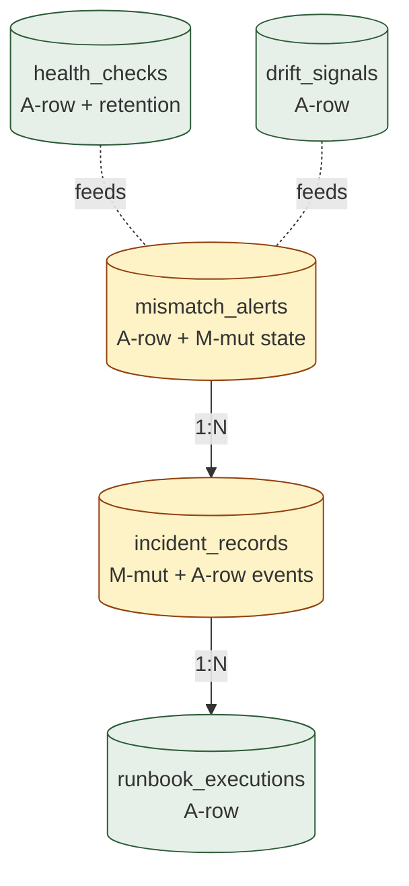

# 13. Operational Monitoring
> Health / Drift signal / Alert 의 영속화 — 운영 visibility 의 backbone

이 도메인은 자금을 다루지 않습니다. **운영 상태 의 시각화** 와 **사고 의 early signal** 영속화. 대부분 metric / event 가 단기 보존 + 정기 archival.

**Owning DB**: `monitordb` (옵션 — 작은 institution 은 auditdb 또는 별도 시계열 DB 사용)
**Owning service**: Operations Service / Monitoring Pipeline (write)
**Read-only consumers**: Operator Console, Incident Command, External SRE

---

## 1. 책임의 범위

| 본 도메인이 담당 | 본 도메인이 담당하지 않음 |
|----------------|------------------------|
| Health check 결과의 영속화 | 시계열 metric (Prometheus 등 별도 시스템) |
| Drift signal 영속화 (T1 stewardship discipline 의 input) | reconciliation 의 mismatch (Reconciliation Service) |
| Alert lifecycle (acknowledgment, resolution) | alert delivery (PagerDuty / Slack 등 — 외부) |
| Incident 의 metadata (incident_records) | incident 의 자금 영향 분석 (Audit) |
| Runbook execution log (옵션) | 자동 incident response (사람 결정) |

운영 상태의 **summary + signal** 만 영속화. 자세한 metric / trace 는 별도 observability stack (Prometheus / OpenTelemetry / etc.) — DB 아닌 시계열 시스템.

---

## 2. PK/FK dependency



---

## 3. `health_checks`

### 3.1 책임

- 각 service 의 자체 health check 결과 영속화
- DB / HSM / TEE / chain RPC / provider API 의 health
- Trending 위해 retention 권장 (예: 30 일)

| 속성 | 값 |
|------|-----|
| Storage class | `A-row` (단 retention 후 archive/delete 허용) |
| Source of truth | row 자체 |
| Mutation authority | Operations Service |
| Read access | Operator Console |
| Logical deletion | 허용 — retention 정책 후 (단 audit-relevant 한 health check 는 audit_events 에 별도 보존) |
| Partitioning | per-day |

### 3.2 Schema 제안

| 컬럼 | 타입 | NULL | Class | 의미 |
|------|------|------|-------|------|
| `id` | UUID | NOT NULL | PK | |
| `check_target` | enum | NOT NULL | `A-set` | `'wallet_service'`, `'ledger_service'`, `'approval_service'`, `'signing_service'`, `'hsm_cluster'`, `'tee_enclave'`, `'chain_adapter'`, `'walletdb'`, `'ledgerdb'`, `'approverdb'`, `'auditdb'`, `'chaindb'`, `'providerdb'`, `'recondb'`, `'provider_api'`, ... |
| `check_target_id` | TEXT | NULL | `A-set` | sub-identifier (예: chain_id, provider_id) |
| `check_type` | enum | NOT NULL | `A-set` | `'liveness'`, `'readiness'`, `'connectivity'`, `'latency'`, `'queue_depth'`, `'replication_lag'`, `'attestation_valid'` |
| `result` | enum | NOT NULL | `A-set` | `'healthy'`, `'degraded'`, `'unhealthy'`, `'unknown'` |
| `latency_ms` | INT | NULL | `A-set` | check 의 latency (informational) |
| `details` | JSONB | NULL | `A-set` | check-specific data |
| `checked_at` | TIMESTAMPTZ | NOT NULL | `A-set` | check 시각 |

### 3.3 핵심 invariant

#### 3.3.1 Append-only during retention period

```sql
CREATE TRIGGER health_checks_no_mutation
  BEFORE UPDATE OR DELETE ON health_checks
  FOR EACH ROW EXECUTE FUNCTION prevent_mutation_unless_archival();
```

`prevent_mutation_unless_archival` 은 retention 정책의 archival worker 만 DELETE 허용 (별도 role 의 user 만 사용 가능).

### 3.4 Retention

- 30 일 hot retention (PostgreSQL)
- 30 일 후 → archive (시계열 DB) 또는 delete
- audit-relevant 한 specific check 는 audit_events 에 별도 보존 (영구)

### 3.5 Indexing

| Index | 목적 |
|-------|------|
| `health_checks_pkey (id)` | PK |
| `idx_hc_target_recent (check_target, checked_at DESC)` | 최근 health (operator dashboard) |
| `idx_hc_unhealthy (checked_at DESC) WHERE result IN ('degraded', 'unhealthy')` | 문제 있는 check 만 |

---

## 4. `drift_signals`

### 4.1 책임

- Stewardship discipline (T1 — `guide/07-stewardship.md` 참고) 의 drift detection 결과 영속화
- AI sample / reader report / cross-doc drift 의 evidence

| 속성 | 값 |
|------|-----|
| Storage class | `A-row` |
| Source of truth | row 자체 |
| Mutation authority | Operations Service + Stewards |
| Read access | Operator, Steward, Audit |
| Logical deletion | 금지 (drift signal 의 history 는 stewardship 의 input) |
| Partitioning | per-year |

### 4.2 Drift signal 의 5 종류 (corpus T1 §3)

| Species | 의미 |
|---------|------|
| `D1-terminology-mutation` | 같은 용어의 다른 sense 가 사용됨 |
| `D2-invariant-erosion` | invariant 의 scope 가 흔들림 |
| `D3-abstraction-drift` | 추상화 level 의 변경 |
| `D4-audience-drift` | 문서 audience 가 다른 곳으로 이동 |
| `D5-scope-creep` | 문서 scope 의 silent 확장 |

본 시스템에서는 corpus stewardship 의 일부 — 자세한 운영은 `guide/07-stewardship.md`.

### 4.3 Schema 제안 (간단)

| 컬럼 | 타입 | NULL | Class | 의미 |
|------|------|------|-------|------|
| `id` | UUID | NOT NULL | PK | |
| `signal_species` | enum | NOT NULL | `A-set` | 위 §4.2 |
| `subject_doc_ref` | TEXT | NOT NULL | `A-set` | 어떤 doc 의 drift (예: `'persistence-architecture/03-ledger-settlement.md §4.2'`) |
| `description` | TEXT | NOT NULL | `A-set` | |
| `severity` | enum | NOT NULL | `A-set` | `'minor'`, `'moderate'`, `'severe'` |
| `evidence_refs` | JSONB | NULL | `A-set` | sample query 결과, AI output diff 등 |
| `reported_by` | UUID | NULL | `A-set` | steward 또는 system |
| `reported_at` | TIMESTAMPTZ | NOT NULL | `A-set` | |
| `action_taken` | TEXT | NULL | `M-mut` | follow-up action (steward 갱신) |
| `closed_at` | TIMESTAMPTZ | NULL | `A-set` | drift 해결 시점 |

---

## 5. `mismatch_alerts`

### 5.1 책임

- Reconciliation finding 또는 다른 종류의 mismatch 의 alert lifecycle
- Acknowledgment + resolution tracking

| 속성 | 값 |
|------|-----|
| Storage class | `A-row` (event log) + `M-mut` (current status) |
| Source of truth | row 자체 |
| Mutation authority | Operations Service + Operator |
| Read access | Operator Console, Incident Command |
| Logical deletion | 금지 |
| Partitioning | per-month |

### 5.2 Schema 제안

| 컬럼 | 타입 | NULL | Class | 의미 |
|------|------|------|-------|------|
| `id` | UUID | NOT NULL | PK | |
| `alert_type` | enum | NOT NULL | `A-set` | `'reconciliation-mismatch'`, `'replication-lag'`, `'stuck-tx'`, `'unknown-incoming'`, `'webhook-signature-failed'`, `'critical-error-rate'`, `'queue-backlog'`, ... |
| `severity` | enum | NOT NULL | `A-set` | `'info'`, `'warning'`, `'critical'`, `'emergency'` |
| `source_finding_id` | UUID | NULL | `A-set` | FK (recondb.mismatch_findings.id, providerdb.provider_state_diff.id, 등) |
| `description` | TEXT | NOT NULL | `A-set` | |
| `evidence_refs` | JSONB | NOT NULL | `A-set` | |
| `triggered_at` | TIMESTAMPTZ | NOT NULL | `A-set` | |
| `status` | enum | NOT NULL | `M-mut` | `'open'`, `'acknowledged'`, `'investigating'`, `'resolved'`, `'false-positive'` |
| `acknowledged_at` | TIMESTAMPTZ | NULL | `A-set` | set-once |
| `acknowledged_by` | UUID | NULL | `A-set` | set-once |
| `resolved_at` | TIMESTAMPTZ | NULL | `A-set` | set-once |
| `resolved_by` | UUID | NULL | `A-set` | set-once |
| `resolution_notes` | TEXT | NULL | `M-mut` (set-once 권장) | |
| `incident_id` | UUID | NULL | `A-set` | 해당 alert 가 incident 가 된 경우 |
| `notification_channels` | TEXT[] | NULL | `A-set` | 어디로 알림 (PagerDuty, Slack, 등) |

### 5.3 핵심 invariant

- `status` 의 sticky terminal (`resolved`, `false-positive`).
- `acknowledged_at`, `resolved_at` 등은 set-once.
- Critical 이상의 alert 는 별도 alert pipeline (외부 service) 통해 즉시 알림.

### 5.4 Indexing

| Index | 목적 |
|-------|------|
| `mismatch_alerts_pkey (id)` | PK |
| `idx_ma_open (status, severity, triggered_at)` WHERE status IN ('open', 'acknowledged', 'investigating') | active alerts |
| `idx_ma_critical (triggered_at DESC) WHERE severity IN ('critical', 'emergency')` | high-severity history |
| `idx_ma_source (source_finding_id)` | source finding → alert lookup |

---

## 6. `incident_records`

### 6.1 책임

- 형식적 incident 의 metadata + lifecycle
- Post-mortem 의 evidence anchor

### 6.2 Schema 제안

| 컬럼 | 타입 | NULL | Class | 의미 |
|------|------|------|-------|------|
| `id` | UUID | NOT NULL | PK | |
| `incident_number` | TEXT | NOT NULL | `A-set` | UNIQUE — 사람이 referencing 하는 ID (예: `INC-2026-0042`) |
| `severity` | enum | NOT NULL | `A-set` | `'sev1'`, `'sev2'`, `'sev3'`, `'sev4'` |
| `title` | TEXT | NOT NULL | `M-mut` (set-once 권장 after declaration) | |
| `description` | TEXT | NOT NULL | `M-mut` | |
| `triggered_alerts` | UUID[] | NOT NULL | `M-mut` (append-only via array_append) | |
| `affected_aggregates` | JSONB | NOT NULL | `M-mut` | |
| `incident_state` | enum | NOT NULL | `M-mut` | `'opened'`, `'investigating'`, `'mitigating'`, `'resolved'`, `'post-mortem'`, `'closed'` |
| `incident_commander` | UUID | NULL | `M-mut` | |
| `opened_at` | TIMESTAMPTZ | NOT NULL | `A-set` | |
| `mitigated_at` | TIMESTAMPTZ | NULL | `A-set` | set-once |
| `resolved_at` | TIMESTAMPTZ | NULL | `A-set` | set-once |
| `closed_at` | TIMESTAMPTZ | NULL | `A-set` | set-once |
| `post_mortem_doc_ref` | TEXT | NULL | `A-set` | post-mortem document URL |
| `audit_event_id` | UUID | NULL | `A-set` | cross-DB ref |

### 6.3 Lifecycle 의 strict ordering

```
opened → investigating → mitigating → resolved → post-mortem → closed ★
```

각 transition 은 strict — backward 금지.

### 6.4 Indexing

| Index | 목적 |
|-------|------|
| `incident_records_pkey (id)` | PK |
| `uniq_incident_number (incident_number)` | UNIQUE |
| `idx_incidents_open (incident_state, severity, opened_at)` WHERE incident_state != 'closed' | active incidents |
| `idx_incidents_severity (severity, opened_at DESC)` | severity 별 history |

---

## 7. `runbook_executions` (옵션)

### 7.1 책임

- Standard runbook 의 step-by-step 실행 evidence
- 사람이 어떤 절차 따랐는지 audit

### 7.2 Schema (간단)

| 컬럼 | Class |
|------|-------|
| `id` | PK |
| `runbook_ref` | `A-set` (runbook 문서 reference) |
| `incident_id` | `A-set` |
| `step_seq` | `A-set` |
| `step_description` | `A-set` |
| `step_outcome` | `A-set` |
| `performed_by` | `A-set` |
| `performed_at` | `A-set` |
| `evidence_refs` | `A-set` |

Append-only. recovery_events 와 유사한 패턴.

---

## 8. Cross-DB references

본 도메인은 다른 모든 DB 의 `id` 를 reference 가능:
- `mismatch_alerts.source_finding_id` → recondb.mismatch_findings.id 또는 providerdb.provider_state_diff.id
- `incident_records.affected_aggregates` JSONB 안에 wallet_id / withdrawal_id 등

cross-DB FK 강제 불가 — application + 정기 reconciliation.

---

## 9. Retention 정책

| Aggregate | Retention |
|-----------|-----------|
| `health_checks` | 30 일 hot + archive (또는 delete) |
| `drift_signals` | 영구 (stewardship history) |
| `mismatch_alerts` | 영구 |
| `incident_records` | 영구 (regulatory + 학습 evidence) |
| `runbook_executions` | 영구 (audit) |

Hot tier 에 비해 운영 데이터 자체는 작음.

---

## 10. Operational considerations

### 10.1 별도 시계열 DB 의 활용

- Prometheus / InfluxDB / TimescaleDB — high-volume metric 영속화
- 본 도메인의 `health_checks` 는 **summary** 만 (예: 분 단위 aggregate)
- 별도 시계열 DB 에서 second-level metric 추적

### 10.2 Alert delivery

- 본 DB 의 `mismatch_alerts` 는 evidence
- 실제 delivery (PagerDuty, Slack, email) 는 외부 service
- delivery success 의 추적은 별도 system

### 10.3 Incident 의 post-mortem

- post-mortem document 는 외부 doc system (Notion / Confluence 등)
- 본 도메인은 reference 만
- post-mortem 의 일자는 incident_records 의 `post_mortem_doc_ref` 로

---

## 11. Anti-patterns

| Anti-pattern | 왜 안 좋은가 |
|--------------|-------------|
| `health_checks` 를 영구 보존 | volume 폭증; 운영 데이터 cost 낭비 |
| Alert 의 자동 정정 (resolved 자동 처리) | 사고 evidence 손실 |
| `incident_records` 의 backward state transition | timeline 무력화 |
| Critical alert 의 acknowledgment 강제 안 함 | 사고 인지 누락 |
| Drift signal 의 deletion | stewardship 의 long-term pattern 손실 |
| 시계열 DB 와의 분리 안 함 | DB 의 storage / performance 부담 |
| `incident_number` UNIQUE 누락 | 외부 communication 의 ID 모호 |

---

## 12. 다음 읽을 글

- Reconciliation finding → alert flow → [09-reconciliation-consistency.md](09-reconciliation-consistency.md)
- Stewardship discipline 의 drift detection → `guide/07-stewardship.md`
- Recovery ceremony (severe incident 의 일부) → [11-recovery-ceremony.md](11-recovery-ceremony.md)
- Cross-cutting (retention / hot-cold) → [14-cross-cutting-concerns.md](14-cross-cutting-concerns.md)
