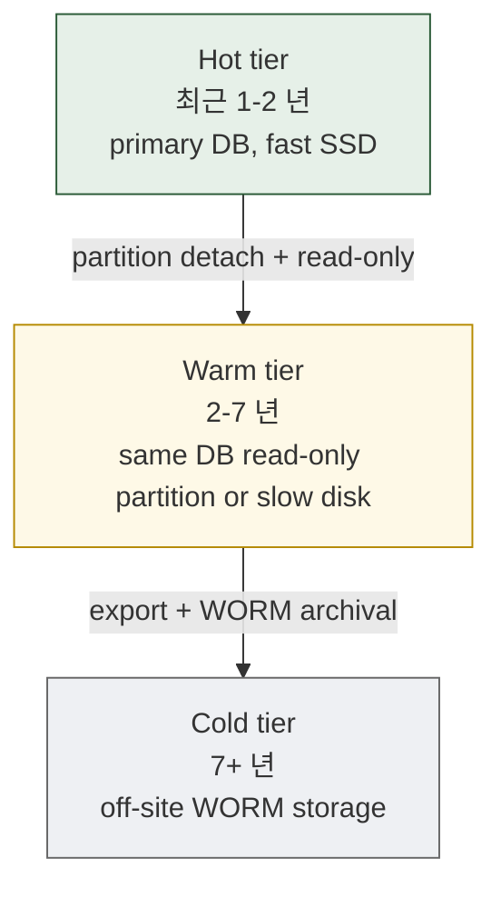
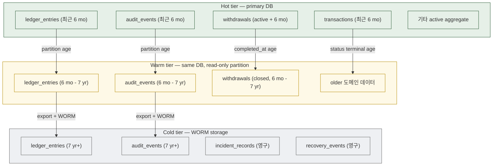

# 14. Cross-cutting Concerns
> Indexing / Retention / Hot-cold / Optimistic locking / Partitioning 의 통합 reference

이 문서는 모든 도메인에 적용되는 cross-cutting persistence concerns 를 통합 정리합니다.

---

## 1. Indexing strategy (통합)

### 1.1 Index 의 분류

| 분류 | 예 | 목적 |
|------|-----|------|
| **PK** | 모든 테이블의 `id` | 기본 lookup |
| **UNIQUE constraint** | `withdrawals.reference_id`, `(chain_id, tx_hash)` | invariant 강제 |
| **FK lookup** | `idx_*.parent_id` | join 가속 |
| **State machine** | `idx_*.state WHERE state IN (active 상태들)` | active query |
| **Time-range** | `idx_*.created_at`, `idx_*.event_at` | reporting / audit |
| **Cross-domain** | `idx_*.cross_aggregate_ref` | reconciliation query |
| **Hash chain ordering** | `(partition_key, seq)` | append-only consistency |
| **Partial** | `WHERE state = 'active'`, `WHERE NOT reorged` | 큰 테이블의 일부만 index |

### 1.2 도메인 별 critical index (재게시)

| 도메인 | Critical index |
|--------|---------------|
| Wallet Topology | `addresses (chain_id, value)` UNIQUE — 입금 매칭 |
| Ledger | `ledger_entries (account_id, seq)` UNIQUE — balance 계산 |
| Transaction | `transactions (chain_id, tx_hash)` UNIQUE — chain binding |
| Approval | `initiator_nonce_seen (initiator_pubkey, nonce)` PK — idempotency |
| Signing | `signing_events (signing_request_id, key_role)` UNIQUE — role 단일성 |
| Deposit | `chain_events (chain_id, tx_hash, log_index)` UNIQUE — dedup |
| Withdrawal | `withdrawals.reference_id` UNIQUE — idempotency |
| Reconciliation | `reconciliation_snapshots (session_id, domain)` UNIQUE |
| Audit | `audit_events (partition_key, seq)` UNIQUE — hash chain |
| Recovery | `(ceremony_id, step_seq)` UNIQUE |
| Provider | `(provider_account_id, provider_external_id)` UNIQUE |

각 도메인 파일의 indexing 절 참고.

### 1.3 Index 의 cost 의식

- PostgreSQL 의 each index 는 INSERT 마다 update 비용
- Index 가 많으면 write throughput ↓
- 권장: query pattern 의 80/20 rule — 자주 사용되는 query 만 index
- 별로 사용 안 되는 query 는 read replica + slow query OK

### 1.4 Composite index 의 ordering

```sql
-- 좋은 예
CREATE INDEX idx_wd_state_time
  ON withdrawals (state, state_updated_at);
-- query: WHERE state = 'BROADCASTING' ORDER BY state_updated_at;

-- 나쁜 예 (compound 의 첫 컬럼이 high cardinality)
CREATE INDEX idx_wd_id_state
  ON withdrawals (id, state);
-- id 자체는 PK 이고, state 만 따로 index 가 필요한 경우 이 composite 의 두 번째 컬럼 활용 안 됨
```

원칙: **equality 조건의 컬럼이 먼저, range 조건이 다음, ORDER BY 가 마지막**.

---

## 2. Retention 정책 (통합)

### 2.1 Retention 의 기본 가이드

| Data 종류 | Retention | 정당화 |
|----------|-----------|--------|
| Audit events / checkpoints | **영구** | regulatory + audit defense |
| Ledger entries | **영구** | 자금 history (회계 의무 + 분쟁 대응) |
| Signing events | **영구** | audit defense |
| Recovery ceremony events | **영구** | governance audit |
| Approval decisions | **영구** | policy audit |
| Master key operations | **영구** | key history |
| Transactions / broadcast / confirmations | **영구** | chain mirror (chain 자체에 있긴 하지만 internal evidence) |
| Customer / KYC data | **regulatory minimum + safety margin** | jurisdiction 의존 (예: 한국 5+ 년) |
| Provider event log | **5-10 년** | provider audit |
| Reconciliation sessions / findings | **영구** (drift + audit) |
| Health checks | **30 일** (운영 metric) |
| Drift signals | **영구** (stewardship) |
| Mismatch alerts | **영구** (incident learning) |
| Incident records | **영구** (regulatory + 학습) |
| Provider state diff | **영구** (provider migration audit) |

본 reference 의 default: 자금 / governance / audit 관련은 **영구**, 운영 metric 은 단기.

### 2.2 Tiered retention (hot / warm / cold)



*Figure 16. Hot / Warm / Cold storage tier — append-only 데이터의 자연스러운 migration path.*

### 2.3 Tier migration 의 원칙

- **Hot → Warm**: PostgreSQL partition detach + read-only attach. application 의 query 는 그대로 작동.
- **Warm → Cold**: export 후 WORM (Write-Once-Read-Many) — 예: AWS S3 + Object Lock, Azure Blob 의 immutability. **export 후 DB row 는 metadata 만 보존, payload 는 cold tier 의 reference**.
- **Cold 의 검색**: 정상 운영 query 가 아닌 audit / forensic 요청 — 시간 단위 retrieval 허용 가능 (분 단위 SLA 아님).

### 2.4 Tier 별 access patterns

| Tier | Query latency | Cost (storage) | Access frequency |
|------|--------------|---------------|------------------|
| Hot | < 100ms | high | 95% |
| Warm | < 1s | medium | 5% |
| Cold | minutes - hours | very low | <1% (audit / forensic only) |

---

## 3. Hot vs Cold storage map



*Figure 17. Hot vs Cold storage map — 시간 기반 자연스러운 migration.*

---

## 4. Partitioning strategy (통합)

### 4.1 Partition 의 종류

| Type | 예 | 용도 |
|------|-----|------|
| **RANGE (time)** | `created_at` monthly | append-only growing tables |
| **LIST (key)** | `chain_id`, `tenant_id` | 격리 + 평행 운영 |
| **HASH** | `account_id` 의 hash | balanced distribution |
| **Composite (LIST + RANGE)** | tenant + month | multi-tenant 큰 institution |

### 4.2 도메인 별 partition strategy

| 도메인 / 테이블 | Partition |
|----------------|-----------|
| `customers`, `vaults`, `wallets`, `addresses` | N/A (cardinality 낮음) |
| `ledger_entries` | per-month RANGE (가장 빠른 growth) |
| `transactions`, `broadcast_attempts`, `confirmations` | per-month RANGE |
| `chain_events` | per-month RANGE + per-chain LIST (composite) 또는 per-month 만 |
| `approval_requests`, `approval_decisions` | per-month RANGE |
| `signing_events`, `key_lifecycle` | per-month RANGE |
| `audit_events` | per-tenant LIST (또는 per-month RANGE) — institution scale 의존 |
| `withdrawals`, `withdrawal_events` | per-month RANGE |
| `deposit_observations` | per-month RANGE |
| `recovery_events` | per-year RANGE (volume 낮음) |
| `health_checks` | per-day RANGE (retention 짧음 — partition drop 으로 archival) |
| `provider_event_log` | per-month RANGE |
| `reconciliation_sessions`, `mismatch_findings` | per-month RANGE |

### 4.3 Partition pruning 의 활용

PostgreSQL 가 query plan 시 partition pruning 자동:

```sql
-- partition key 가 WHERE 절에 있으면 pruning
SELECT * FROM ledger_entries WHERE created_at >= '2026-05-01' AND created_at < '2026-06-01';
-- → ledger_entries_2026_05 partition 만 scan

-- partition key 없으면 모든 partition scan (slow)
SELECT * FROM ledger_entries WHERE account_id = '...';
-- → 모든 partition scan (account_id 의 index 만 도움)
```

권장: query pattern 의 80% 가 partition key 포함하도록 application 설계.

### 4.4 Partition rotation (운영)

```sql
-- 매월 새 partition 자동 생성 (cron 또는 pg_partman)
CREATE TABLE ledger_entries_2026_07 PARTITION OF ledger_entries
  FOR VALUES FROM ('2026-07-01') TO ('2026-08-01');

-- 오래된 partition 은 detach (read-only warm tier 로)
ALTER TABLE ledger_entries DETACH PARTITION ledger_entries_2024_05 CONCURRENTLY;
-- detached partition 은 standalone table 로 — read-only attach 가능
```

자세한 PostgreSQL partition 운영은 [15-db-split-and-postgresql.md](15-db-split-and-postgresql.md) 참고.

---

## 5. Optimistic locking / versioning

### 5.1 적용 위치

| 테이블 | Version column | 사용 시점 |
|--------|----------------|----------|
| `ledger_accounts` | `version BIGINT` | balance cache update |
| `withdrawals` | `version BIGINT` | state machine 진행 |
| `approval_requests` | `version BIGINT` | state 진행 |
| `wallets` | `version BIGINT` | metadata edit |
| `vaults` | `version BIGINT` | metadata edit |
| `customers` | `version BIGINT` | KYC status update |
| `policy_rules` | `version BIGINT` | hot reload 의 race 회피 |
| `provider_accounts` | `version BIGINT` | metadata edit |

`A-row` 테이블은 version 불필요 (INSERT-only 라 race 없음 — `seq` UNIQUE constraint 가 강제).

### 5.2 패턴

```sql
-- application code (pseudo):
SELECT version INTO @current_version
  FROM withdrawals WHERE id = $1;

-- ... business logic ...

UPDATE withdrawals
   SET state = 'APPROVED', version = version + 1
 WHERE id = $1 AND version = @current_version;

-- if 0 rows updated → retry from SELECT
-- if 1 row updated → success
```

### 5.3 ABA problem 회피

`version` 이 BIGINT 라 overflow 까지 약 9 × 10^18 increment — 사실상 unbounded. ABA 우려 없음.

### 5.4 Multi-row update 시

여러 row update 시 deadlock 회피:
- 항상 같은 순서로 lock (예: id ascending)
- Or advisory lock 으로 transaction 의 logical lock

```sql
SELECT pg_advisory_xact_lock(hashtext('ledger_account:' || account_id));
-- ... 같은 account 의 concurrent updates 직렬화
```

---

## 6. Reversal-entry strategy (통합)

### 6.1 적용 가능 테이블

`A-row` 테이블 중 reversal capability 가 있는 것:

- `ledger_entries` — 자금 정정 (가장 흔함)
- (다른 테이블은 일반적으로 reversal 보다는 새 row 가 자연스러움)

### 6.2 패턴 reminder

[03-ledger-settlement.md](03-ledger-settlement.md) §6 참고. 핵심:
- 원본 row 그대로 두고 **새 reversal row 발행**
- `reverses_entry_id` FK 로 연결
- reversal reason + authorizer + ceremony reference 명시
- net balance 자동 0

### 6.3 자동 reversal 금지

reconciliation 또는 다른 mechanism 이 mismatch 발견해도 **사람이 결정**. application 자동 reversal 금지.

---

## 7. Idempotency enforcement (통합)

### 7.1 Layer 별 idempotency key

| Layer | Key | Table |
|-------|-----|-------|
| Caller → API | `reference_id` | `withdrawals`, `internal_transfers` |
| Initiator → Approval | `(initiator_pubkey, nonce)` | `initiator_nonce_seen` |
| Approval → Signing | `(approval_decision_id)` | `signing_requests` UNIQUE |
| Signing → Chain | `(chain_id, tx_hash)` | `transactions` UNIQUE |
| Chain Adapter → Internal | `(chain_id, tx_hash, log_index)` | `chain_events` UNIQUE |
| Provider → Internal | `(provider_account_id, provider_event_external_id)` | `provider_event_log` UNIQUE |

### 7.2 Application pattern

```python
# Common idempotency check pattern:
try:
    INSERT INTO ... VALUES (..., idempotency_key, ...)
except unique_violation:
    existing = SELECT * FROM ... WHERE idempotency_key = ...
    return existing  # idempotent response — same response 반환
```

UNIQUE constraint 의 violation 을 application 이 idempotent response 로 변환.

---

## 8. Cross-DB consistency

### 8.1 Cross-DB FK 불가

PostgreSQL 의 FK 는 same-DB 만. 7-DB split (walletdb, ledgerdb, approverdb, auditdb, chaindb, providerdb, recondb) 의 cross-references 는 application + reconciliation 으로 정합성 유지.

### 8.2 권장 patterns

| Pattern | 사용 |
|---------|------|
| **Application-level integrity** | 참조 시 lookup + 검증; orphan FK detection |
| **Periodic reconciliation** | 정기 query 로 cross-DB consistency 검증 |
| **Outbox pattern** | source DB 의 outbox row → worker → target DB INSERT (eventual consistency) |
| **Saga** | multi-step transaction 의 compensating actions |

### 8.3 Eventual consistency 의 수용

- audit_events 의 INSERT 가 source service 의 critical path 아니어도 됨 (outbox)
- replication lag (sync vs async)
- provider event ingestion 의 lag

각 도메인이 acceptable lag boundary 명시.

---

## 9. Backup / DR strategy (통합)

### 9.1 DB 별 backup 정책

| DB | Backup 전략 | Replication |
|----|------------|-------------|
| `walletdb` | daily full + WAL streaming | sync 또는 async (replication lag 가시화) |
| `ledgerdb` | continuous + WAL streaming + snapshot | **synchronous** (자금 critical) |
| `approverdb` | continuous + WAL | sync 권장 |
| `auditdb` | continuous + WAL + WORM archival | **synchronous** (audit critical) |
| `chaindb` | continuous + WAL | async OK (chain 자체에 있음) |
| `providerdb` | daily + WAL | async OK |
| `recondb` | daily | async OK |
| `monitordb` | daily | async OK |

### 9.2 RPO / RTO 권장값 (★ Hypothesis)

| DB | RPO (Recovery Point Objective) | RTO (Recovery Time Objective) |
|----|--------------------------------|-------------------------------|
| `ledgerdb` | 0 (sync replication) | < 5 분 |
| `auditdb` | 0 (sync replication) | < 5 분 |
| `approverdb` | < 1 분 | < 10 분 |
| `walletdb` | < 5 분 | < 30 분 |
| `chaindb` | < 5 분 (chain 으로 복구 가능) | < 1 시간 |
| `providerdb` | < 5 분 | < 1 시간 |
| `recondb` | < 1 시간 | < 4 시간 |

### 9.3 DR (Disaster Recovery)

자세한 DR ceremony 는 [11-recovery-ceremony.md](11-recovery-ceremony.md) §8 참고.

---

## 10. Schema 변경 (migration) 의 안전 운영

### 10.1 Schema migration 의 분류

| Change | Risk | Practice |
|--------|------|---------|
| **Add column (nullable)** | 낮음 | online migration |
| **Add index (CONCURRENTLY)** | 낮음 | online |
| **Add constraint** | 중간 | online with validation |
| **Drop column** | 중간 | 두 단계 (release N: 사용 중단, N+1: drop) |
| **Rename column** | 높음 | 두 단계 (release N: 새 컬럼 추가, N+1: 이전 컬럼 drop) |
| **Change column type** | 높음 | rewrite — long lock; off-peak 또는 partitioned approach |
| **Drop table** | **금지** | 절대 안 됨 — soft archival 만 |
| **Add trigger** | 중간 | DB 권한 변경 — governance event |
| **Remove trigger** | **금지** (특히 append-only enforcement trigger) | invariant 위반 |

### 10.2 Migration 의 governance

각 schema migration 은:
1. **Schema review** — DBA + Security Engineer + Architect 의 review
2. **Lint check** — forbidden patterns 검출
3. **Migration plan** — rollback plan 포함
4. **Staging test** — 운영 환경 동일 schema 에서 dry-run
5. **Production migration** — change-window 안에 실행
6. **Audit event 발행** — schema change 자체가 audit event

trigger 의 변경 (특히 append-only enforcement) 은 **charter-class** event — multi-quorum approval 필요.

---

## 11. Operational invariants enforceable at DB layer (재정리)

[01-principles-and-discipline.md §12](01-principles-and-discipline.md) 의 15 invariant 재정리. 모두 DB 자체로 강제:

| # | Invariant | 강제 방식 |
|---|-----------|---------|
| 1 | `A-row` UPDATE/DELETE 금지 | trigger |
| 2 | `A-set` 컬럼 NULL → non-NULL 1회 | trigger |
| 3 | `A-chain` prev_hash 연속성 | trigger |
| 4 | State machine sticky terminal | trigger + CHECK |
| 5 | Idempotency key UNIQUE | UNIQUE constraint |
| 6 | Orphan FK 금지 | FK NOT NULL + ON DELETE RESTRICT |
| 7 | Optimistic locking version | application UPDATE 시 WHERE version = $old |
| 8 | Per-account sequence UNIQUE | UNIQUE (account_id, seq) |
| 9 | Per-aggregate sequence 연속성 | trigger 검증 |
| 10 | `chain_events (chain_id, tx_hash, log_index)` UNIQUE | UNIQUE |
| 11 | Reversal entry 의 reverses_entry_id 필수 | CHECK |
| 12 | Checkpoint mrenclave 의 일관성 | application + 외부 attestation |
| 13 | `policy_decisions.verdict` 변경 불가 | trigger |
| 14 | Forbidden 컬럼 부재 | schema lint |
| 15 | Runtime-only 의 schema 부재 | schema lint |

이 15 invariant 가 DB 자체의 audit-reviewable schema 의 기반.

---

## 12. 다음 읽을 글

- DB split rationale + PostgreSQL 운영 → [15-db-split-and-postgresql.md](15-db-split-and-postgresql.md)
- 각 도메인의 indexing detail → 각 도메인 파일
- Append-only enforcement 의 자세한 trigger 코드 → [01-principles-and-discipline.md §2](01-principles-and-discipline.md)
