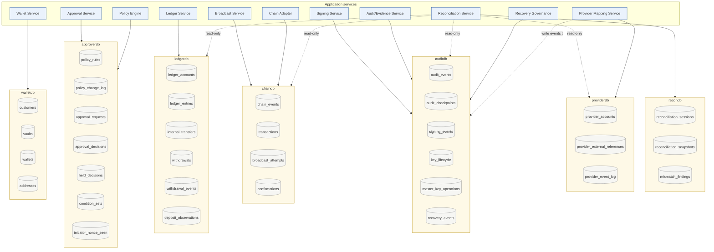
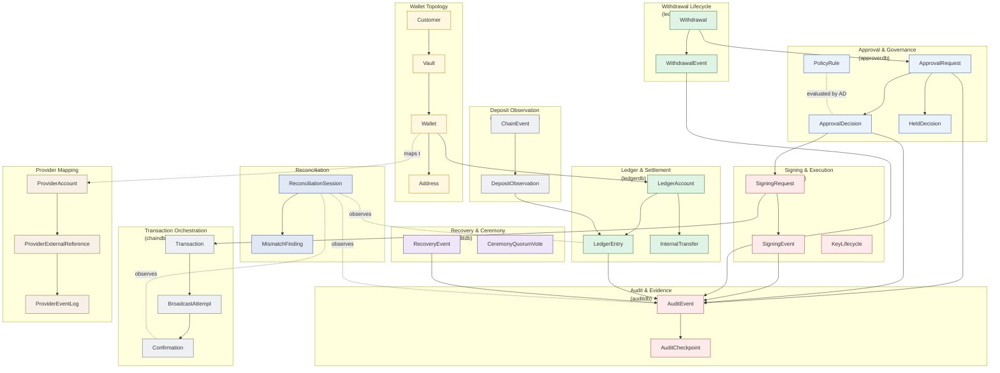

# Institutional Persistence Architecture
> 수탁형 지갑의 물리 persistence 설계 reference

이 문서는 `reference-architecture/` 의 추론을 한 단계 더 내려, **DB 테이블 / 컬럼 / 제약 / 운영 invariant 수준** 에서 institutional custody persistence 를 정의합니다.

대상 독자: DBA, Backend Engineer, Security Engineer, Auditor, Reconciliation Engineer, Architecture Reviewer.

---

## 1. 왜 "wallet + balance + transaction" 으로 환원 안 되는가

수탁형 지갑의 흔한 오해:

> "지갑 ↔ 잔액 ↔ 트랜잭션, 세 테이블이면 되지 않나?"

이 환원이 institutional custody 에서 작동하지 않는 이유:

| 환원했을 때 | 실제 institutional 요구 |
|------------|---------------------|
| 잔액을 mutable 컬럼으로 유지 | 잔액은 **derived view**, 진실은 `ledger_entries` |
| 한 트랜잭션 = 한 row | 한 withdrawal 은 N broadcast attempt + reorg 가능; 분리된 lifecycle |
| 승인 = transaction.status 변경 | Approval 은 별개 state machine + set-once signature + sticky terminal |
| 입금 = transaction insert | Deposit 은 observation path — chain event ingestion + reorg-safe window + compliance gate |
| 정산 = balance 비교 | Reconciliation 은 **truth-domain cross-check** (ledger ↔ chain ↔ audit ↔ counterparty) |
| 감사 = log 테이블 | Audit 는 hash chain + TEE-signed checkpoint + cross-DB binding |
| 복구 = backup restore | Recovery 는 ceremony 의 m-of-n 절차 + append-only ceremony log |
| 키 = 어딘가 저장 | 키는 **forbidden storage** — DB 어디에도 plaintext 금지 |
| 서명 = 함수 call | Signing 은 3-key 별도 ownership + runtime-only context + sealed execution |
| Provider 연동 = API call | Provider 는 **external reference** — 내부 canonical 과 분리 |

본 reference 는 위 12 개 운영 도메인을 **각자의 persistence boundary** 로 분리합니다.

---

## 2. 12 운영 도메인 (분리된 persistence boundary)

| # | 도메인 | 파일 | 핵심 테이블 |
|---|--------|------|------------|
| 01 | Principles & Discipline (cross-cutting) | [01-principles-and-discipline.md](01-principles-and-discipline.md) | (N/A — 규율) |
| 02 | Wallet Topology | [02-wallet-topology.md](02-wallet-topology.md) | `customers`, `vaults`, `wallets`, `addresses` |
| 03 | Ledger & Settlement | [03-ledger-settlement.md](03-ledger-settlement.md) | `ledger_accounts`, `ledger_entries`, `internal_transfers` |
| 04 | Transaction Orchestration | [04-transaction-orchestration.md](04-transaction-orchestration.md) | `transactions`, `broadcast_attempts`, `confirmations` |
| 05 | Approval & Governance | [05-approval-governance.md](05-approval-governance.md) | `approval_requests`, `approval_decisions`, `policy_rules`, `policy_change_log`, `held_decisions`, `condition_sets`, `initiator_nonce_seen` |
| 06 | Signing & Execution | [06-signing-execution.md](06-signing-execution.md) | `signing_requests`, `signing_events`, `key_lifecycle`, `master_key_operations` |
| 07 | Deposit Observation | [07-deposit-observation.md](07-deposit-observation.md) | `chain_events`, `deposit_observations` |
| 08 | Withdrawal Lifecycle | [08-withdrawal-lifecycle.md](08-withdrawal-lifecycle.md) | `withdrawals`, `withdrawal_events` |
| 09 | Reconciliation & Consistency | [09-reconciliation-consistency.md](09-reconciliation-consistency.md) | `reconciliation_sessions`, `reconciliation_snapshots`, `mismatch_findings` |
| 10 | Audit & Evidence Integrity | [10-audit-evidence-integrity.md](10-audit-evidence-integrity.md) | `audit_events`, `audit_checkpoints` |
| 11 | Recovery & Ceremony | [11-recovery-ceremony.md](11-recovery-ceremony.md) | `recovery_events`, `ceremony_quorum_votes` |
| 12 | Provider Mapping | [12-provider-mapping.md](12-provider-mapping.md) | `provider_accounts`, `provider_external_references`, `provider_event_log` |
| 13 | Operational Monitoring | [13-operational-monitoring.md](13-operational-monitoring.md) | `health_checks`, `drift_signals`, `mismatch_alerts` |
| 14 | Cross-cutting concerns | [14-cross-cutting-concerns.md](14-cross-cutting-concerns.md) | (indexing / retention / locking / hot-cold) |
| 15 | DB split & PostgreSQL | [15-db-split-and-postgresql.md](15-db-split-and-postgresql.md) | (배치 모델 + PG 운영) |

---

## 3. Physical persistence topology

*Figure 1. Physical persistence topology — 7 개 DB, 각 service 의 write authority 와 read-only 의존.*

자세한 DB split 근거는 [15-db-split-and-postgresql.md](15-db-split-and-postgresql.md) 참고.

---

## 4. Aggregate ownership map

*Figure 2. Aggregate ownership — 각 aggregate 는 하나의 owning 도메인을 가지며, 그 도메인의 service 만이 write authority 보유. cross-domain 은 ID 참조로만 연결.*

---

## 5. 핵심 운영 invariant (DB 계층에서 강제)

다음 invariant 들은 application 코드가 아니라 **DB 제약 / trigger / row-level constraint** 로 강제됩니다. 자세한 enforcement 는 [01-principles-and-discipline.md](01-principles-and-discipline.md) 참고.

| Invariant | DB-level 강제 방식 |
|-----------|-------------------|
| `ledger_entries` 의 UPDATE / DELETE 금지 | trigger `prevent_mutation_on_ledger_entries` |
| `approval_decisions` 의 set-once columns (`auth_approver_sig`, `auth_approver_pubkey`) | trigger + column-level constraint |
| State machine 의 sticky terminal (`approval_requests.state` 단방향) | trigger 검증 + CHECK 제약 |
| `(initiator_pubkey, nonce)` idempotency | UNIQUE constraint on `initiator_nonce_seen` |
| `audit_events` 의 hash chain 연속성 | trigger: `new.prev_hash = (SELECT hash FROM audit_events WHERE seq = new.seq - 1)` |
| Orphan ledger entry 금지 | FK `ledger_entries.action_ref → withdrawals.id` NOT NULL |
| Withdrawal 잔액 reserve 의 atomicity | application-level transaction + balance version (optimistic locking) |
| Forbidden 컬럼 부재 | schema review + lint (DB schema 자체에 컬럼 없음) |
| Internal transfer 의 atomic debit + credit pair | transaction + `ledger_entries` 2-row insert in 1 SQL transaction |
| Reorg 후 `confirmed_debit` reversal | `ledger_entries` 새 reversal row insert (DELETE 금지) |

---

## 6. Source-of-truth 정리

| Aggregate | Source of truth | Cache / derived |
|-----------|----------------|-----------------|
| Customer | `customers` row (mutable + history append-only) | — |
| Vault | `vaults` row | — |
| Wallet | `wallets` row | — |
| Address | `addresses` row (1 wallet : N address) | — |
| LedgerAccount balance | `ledger_entries` 의 SUM | `ledger_accounts.balance_cached` (advisory) |
| Withdrawal state | `withdrawal_events` 의 latest | `withdrawals.state_cached` (advisory) |
| ApprovalDecision | `approval_decisions` row | — (set-once, append-only) |
| Transaction | `transactions` row | — |
| Confirmation | `confirmations` row | — |
| AuditEvent | `audit_events` row | — |
| Chain state | **외부 RPC** (canonical) | `chain_events` 는 mirror |
| HSM-held key material | **HSM 내부** | DB 에 없음 (forbidden) |
| TEE sealed blob | **disk file (sealed)** | DB 에 없음 |
| Provider state | **provider API** | `provider_event_log` 는 normalized mirror |

원칙: **canonical source 는 단 하나** — 같은 정보를 두 곳에 mutable 로 두면 정합성 깨짐. Cache 는 명시적으로 advisory 표시 + canonical 로부터 재계산 가능.

---

## 7. 12 diagram navigation

| Figure | 위치 | 내용 |
|--------|------|------|
| 1 | [index.md](index.md) §3 | Physical persistence topology — 7 DB + service 의존 |
| 2 | [index.md](index.md) §4 | Aggregate ownership map |
| 3 | [02-wallet-topology.md](02-wallet-topology.md) | PK/FK dependency graph (Wallet ↔ Ledger ↔ Withdrawal) |
| 4 | [03-ledger-settlement.md](03-ledger-settlement.md) | Ledger reversal-entry model |
| 5 | [03-ledger-settlement.md](03-ledger-settlement.md) | Internal vs External settlement persistence |
| 6 | [05-approval-governance.md](05-approval-governance.md) | State-machine persistence boundaries (approval) |
| 7 | [08-withdrawal-lifecycle.md](08-withdrawal-lifecycle.md) | Withdrawal state-machine persistence + cross-domain refs |
| 8 | [09-reconciliation-consistency.md](09-reconciliation-consistency.md) | Reconciliation query topology |
| 9 | [10-audit-evidence-integrity.md](10-audit-evidence-integrity.md) | Evidence-chain physical schema |
| 10 | [10-audit-evidence-integrity.md](10-audit-evidence-integrity.md) | Append-only enforcement flow |
| 11 | [12-provider-mapping.md](12-provider-mapping.md) | Provider mapping architecture |
| 12 | [14-cross-cutting-concerns.md](14-cross-cutting-concerns.md) | Hot vs cold storage map |
| 13 | [15-db-split-and-postgresql.md](15-db-split-and-postgresql.md) | DB split topology |

---

## 8. 본 문서가 다루지 않는 것

- **SQL DDL 통째로 dump** — 본 문서는 reasoning 이지 generation target 이 아님
- **ORM 매핑** — 언어 / framework 의존; 본 문서는 vendor-neutral
- **Code 구현 detail** — service 의 implementation 은 별도
- **MPC 프로토콜 detail** — corpus discipline 상 cryptography tutorial 회피
- **특정 PostgreSQL 버전 / 익스텐션 추천** — 운영 환경 의존
- **TPS / latency / capacity 수치** — institution scale 의존

---

## 9. 읽는 순서

| 독자 | 권장 순서 |
|------|----------|
| **신규 합류 backend engineer** | 01 → 02 → 03 → 04 → 08 → 14 |
| **DBA** | 01 → 14 → 15 → 03 → 10 → 09 |
| **Security engineer** | 01 → 06 → 10 → 11 → 14 |
| **Reconciliation engineer** | 03 → 09 → 10 → 04 → 07 |
| **Audit reviewer** | 10 → 05 → 06 → 09 → 11 |
| **Provider integration** | 12 → 01 → 03 → 04 |

본 reference 의 모든 도메인 파일은 `reference-architecture/` 의 aggregate / state-machine / storage-boundary 문서와 cross-reference 됩니다. 추상 layer 는 `reference-architecture/` 에, 물리 layer 는 본 `persistence-architecture/` 에.
