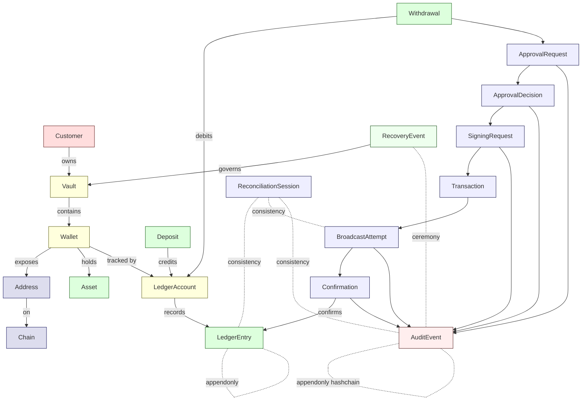

# Core Aggregates
> Direct-build custodial wallet 의 19 개 recurring aggregate

이 문서는 vendor / institution 과 무관하게 **반복적으로 등장하는 19 개 aggregate** 를 정의합니다. 각 aggregate 는:

- **역할** — 무엇을 표현하는가
- **왜 필요한가** — 이 aggregate 가 없으면 무엇이 깨지는가
- **Mutability** — mutable / append-only / runtime-only / external reference / forbidden
- **PM 리스크** — 빠지기 쉬운 함정

자세한 storage classification 은 [storage-boundaries.md](storage-boundaries.md) 참고.

---

## 1. Aggregate relationship (한 페이지)

---

## 2. Identity & containment (4)

### 2.1 Customer

| 속성 | 값 |
|------|-----|
| **역할** | 자금의 ultimate beneficial owner — institutional or individual |
| **왜 필요한가** | KYC / regulatory reporting / 권한 결정의 최상위 entity |
| **Mutability** | **Mutable** (KYC 정보 갱신) + **append-only KYC history** |
| **출처 (corpus)** | D11 compliance / D16 identity / NodeInfra compliance/regulations/kyc |
| **PM 리스크** | "Customer" 가 institutional account 인지 individual user 인지 ambiguous 하게 두면 KYC scope 가 무너짐 — 처음부터 명확히 |

≠ proposition: Customer ≠ User. Customer 는 KYC 의 대상; User 는 system 사용자 (operator / API consumer).

---

### 2.2 Vault

| 속성 | 값 |
|------|-----|
| **역할** | Customer 의 자금 container — 1 customer 가 N vault 가질 수 있음 (omnibus / segregated 등) |
| **왜 필요한가** | Wallet 보다 상위 단위에서 권한 / 정책 / accounting 을 묶기 위함 |
| **Mutability** | **Mutable metadata** + **append-only event log** |
| **출처 (corpus)** | D1a vault/wallet/ledger schema |
| **PM 리스크** | Vault 와 Wallet 을 같은 단위로 두면 정책 / 회계 scope 와 chain-specific 단위 가 섞임 — 분리 유지 |

≠ proposition: Vault ≠ Wallet. Vault 는 회계 / 정책 단위; Wallet 은 chain-specific 단위.

---

### 2.3 Wallet

| 속성 | 값 |
|------|-----|
| **역할** | Chain-specific 자금 단위. 한 Vault 안에 다수 Wallet (chain 별, asset 별, role 별) |
| **왜 필요한가** | chain 마다 다른 protocol / address derivation / fee model — chain-specific 추상화 필요 |
| **Mutability** | **Mutable metadata** + **append-only state change** |
| **출처 (corpus)** | D1a / NodeInfra dev/architecture (3 wallet types 패턴) |
| **PM 리스크** | Wallet 의 종류 (user / omnibus / gas / cold / hot) 를 type system 으로 분리 안 하면 wallet 의 의도 (deposit 받는 곳 vs 출금 보내는 곳) 가 혼동됨 |

★ 3 가지 표준 wallet type (NodeInfra recurring + Fireblocks variants):
- **User wallet** — per-customer deposit address
- **Omnibus wallet** — pooled hot wallet (institution 의 working capital)
- **Gas wallet** — chain fee subsidization

★ Additional types (institution context):
- **Cold wallet** — offline storage (long-term reserve)
- **Settlement wallet** — counterparty 와의 정산 전용

---

### 2.4 Address

| 속성 | 값 |
|------|-----|
| **역할** | Chain 상의 string identifier — 한 Wallet 이 시간에 따라 N Address 가질 수 있음 |
| **왜 필요한가** | UTXO chain (Bitcoin) 은 address rotation 이 일반적; account chain (Ethereum) 도 다른 path 발급 가능 |
| **Mutability** | **Append-only** — 한 번 발급된 address 는 status 변경 (active / archived) 가능하지만 string 자체 변경 불가 |
| **출처 (corpus)** | D1a / D9 multi-chain adapter |
| **PM 리스크** | Address ↔ Wallet 의 N:1 관계를 1:1 로 두면 address rotation / archive 시 model 파괴 |

---

## 3. Money domain (4)

### 3.1 Asset

| 속성 | 값 |
|------|-----|
| **역할** | Chain 상의 asset identifier (BTC / ETH / USDC mint / SOL / ...) |
| **왜 필요한가** | 같은 token symbol 이 chain 마다 다른 contract (multi-chain USDC); fungibility 단위 |
| **Mutability** | **Append-only reference data** — asset metadata 는 거의 변하지 않음 (decimals / symbol / contract address) |
| **출처 (corpus)** | D9 multi-chain adapter / D10 treasury |
| **PM 리스크** | "USDC" 를 하나의 asset 으로 두면 multi-chain 환경에서 fund movement 가 cross-chain bridge 처럼 무너짐 — asset_id = (chain, contract / mint) tuple |

≠ proposition: Asset symbol ≠ Asset identity. 같은 symbol (USDC) 이라도 chain / contract 다르면 다른 asset.

---

### 3.2 Chain

| 속성 | 값 |
|------|-----|
| **역할** | Blockchain 의 identifier + chain-specific 설정 (finality threshold / fee model / address format) |
| **왜 필요한가** | 각 chain 의 chain semantics 가 다름 (block time / finality / event model / address format) |
| **Mutability** | **Mutable config** + **append-only chain history** (e.g., halt event) |
| **출처 (corpus)** | D9 multi-chain adapter |
| **PM 리스크** | Chain config (finality threshold 등) 을 hard-code 하면 chain 의 protocol change 대응 불가; chain-as-data |

---

### 3.3 LedgerAccount

| 속성 | 값 |
|------|-----|
| **역할** | Internal ledger 의 계정 단위 — 1 wallet : N ledger account (asset 별, sub-account 별) |
| **왜 필요한가** | Wallet (chain-side abstraction) 과 Ledger (accounting abstraction) 의 분리; double-entry accounting |
| **Mutability** | **Mutable current balance** (cached) + **append-only entries** (source of truth) |
| **출처 (corpus)** | D1a / D1b reconciliation |
| **PM 리스크** | balance 를 source of truth 로 두면 audit 불가 / 사후 수정 가능 — balance = SUM(entries) 의 derived view |

≠ proposition: LedgerAccount.balance ≠ source of truth. balance 는 entries 의 derived. entries 가 truth.

---

### 3.4 LedgerEntry

| 속성 | 값 |
|------|-----|
| **역할** | Ledger 의 single line item — credit / debit / amount / asset / reference |
| **왜 필요한가** | **Append-only event sourcing 의 원자 단위**. 정정은 새 entry (reversing entry); 절대 in-place 수정 안 함 |
| **Mutability** | **Append-only — strict**. DB trigger 또는 column constraint 로 강제 |
| **출처 (corpus)** | D1a / D5 audit event sourcing |
| **PM 리스크** | "잘못된 entry 가 있어도 수정 가능" 으로 설계하면 audit chain 무너짐 — 항상 reversing entry |

≠ proposition: Entry deletion ≠ Entry reversal. Deletion 은 audit chain 파괴; reversal 은 새 entry 로 net-zero.

---

## 4. Flow domain (10)

### 4.1 Deposit

| 속성 | 값 |
|------|-----|
| **역할** | 외부 → custody 로의 자금 이동 — 관찰 (observe) 의 result, 서명 ceremony 없음 |
| **왜 필요한가** | 입금은 chain event 이미 일어난 상태에서 internal ledger 에 반영하는 controlled recognition |
| **Mutability** | Lifecycle 안에서 mutable (state 진행) + **append-only event log** |
| **출처 (corpus)** | D7 deposit lifecycle / NodeInfra security/architecture/multisig §작업별 차이 |
| **PM 리스크** | Deposit 을 "감지 즉시 ledger 반영" 하면 finality threshold 미만에서 chain reorganization 시 ledger inconsistency 발생 — multi-confirmation discipline |

≠ proposition: Deposit ≠ Deposit recognition. Chain event 발생 ≠ ledger 반영 시점.

자세한 state machine 은 [state-machines.md §4](state-machines.md) 참고.

---

### 4.2 Withdrawal

| 속성 | 값 |
|------|-----|
| **역할** | Custody → 외부 로의 자금 이동 — 서명 ceremony 필수 |
| **왜 필요한가** | 가장 위험한 자금 이동 path — approval / signing / broadcast / confirmation 의 full cascade 필요 |
| **Mutability** | Lifecycle 안에서 mutable + **append-only event log** |
| **출처 (corpus)** | D8 withdrawal lifecycle / D2 signing / D3 approval |
| **PM 리스크** | Withdrawal 의 "단순화" 가 가장 흔한 사고 원인 — full lifecycle 단축 시 사고 발생 |

자세한 state machine 은 [state-machines.md §3](state-machines.md) 참고.

---

### 4.3 Transaction

| 속성 | 값 |
|------|-----|
| **역할** | Chain 상의 raw transaction — withdrawal / sweep / internal transfer 의 chain-side representation |
| **왜 필요한가** | Withdrawal 의 chain-side 표현; transaction 의 lifecycle 은 withdrawal 과 별개 |
| **Mutability** | **Append-only** — tx hash 로 identified; raw payload 는 변경 불가 |
| **출처 (corpus)** | D2 signing / D9 multi-chain adapter |
| **PM 리스크** | Transaction 과 Withdrawal 을 합치면 internal transfer (chain 없는) / 실패 broadcast (tx hash 없는) 처리 불가 |

≠ proposition: Transaction ≠ Withdrawal. 한 withdrawal 이 여러 transaction 시도 가능 (broadcast retry, replacement tx).

---

### 4.4 ApprovalRequest

| 속성 | 값 |
|------|-----|
| **역할** | 자금 이동 요청의 governance entity — Withdrawal 또는 큰 amount 의 internal Transfer 마다 발생 |
| **왜 필요한가** | 자금 이동을 "요청" 과 "결정" 으로 분리. 요청 자체는 권한 검증 / 신원 확인 / payload 검증의 단위 |
| **Mutability** | Lifecycle 안에서 mutable + **append-only event log** |
| **출처 (corpus)** | D3 approval / Fireblocks approval groups / NodeInfra compliance/decision-lifecycle |
| **PM 리스크** | ApprovalRequest 가 immediate ApprovalDecision 으로 collapse 되면 policy engine 의 의미 무너짐 |

≠ proposition: ApprovalRequest ≠ ApprovalDecision. 요청과 결정은 서로 다른 시점, 서로 다른 권한.

---

### 4.5 ApprovalDecision

| 속성 | 값 |
|------|-----|
| **역할** | Policy engine 이 ApprovalRequest 에 대해 내린 verdict — Allow / Held / Deny |
| **왜 필요한가** | 결정 자체는 append-only artifact. 결정 변경 시 새 decision (보강 / overturn) 으로 처리 |
| **Mutability** | **Append-only — strict**. 한 번 INSERT 후 변경 불가. signing-key columns 는 set-once |
| **출처 (corpus)** | D3 approval / NodeInfra compliance/decision-lifecycle (Allow / Held / Deny, sticky decision) |
| **PM 리스크** | Decision 을 mutable 하게 두면 사후 verdict 변경 가능 → audit 불가 |

≠ proposition: ApprovalDecision = mutable ≠ append-only. **Mutability 가 audit chain 의 core invariant**.

---

### 4.6 SigningRequest

| 속성 | 값 |
|------|-----|
| **역할** | ApprovalDecision = Allow 후 서명 ceremony 시작을 요청하는 entity |
| **왜 필요한가** | ApprovalDecision 과 actual signing 의 분리. Approval 권한과 Signing 권한이 다른 service / 다른 key |
| **Mutability** | Lifecycle 안에서 mutable (state 진행) + **append-only signing event log** |
| **출처 (corpus)** | D2 signing workflow / NodeInfra security/architecture/multisig (3-key signing chain) |
| **PM 리스크** | SigningRequest 를 ApprovalDecision 의 단순 후속으로 두면 signing 실패 / 재시도 / replacement 처리 불가 |

≠ proposition: Approval ≠ Signing. 정책 통과 ≠ 서명 완료.

자세한 state machine 은 [state-machines.md §2](state-machines.md) 참고.

---

### 4.7 BroadcastAttempt

| 속성 | 값 |
|------|-----|
| **역할** | Signed transaction 의 chain submit 시도 — 여러 attempt 가능 (RPC failure, replacement tx, RBF) |
| **왜 필요한가** | 한 SigningRequest → N BroadcastAttempt. retry / replacement / failure 의 history 보존 |
| **Mutability** | **Append-only** — attempt 자체는 변경 불가; 결과 (success / failure / replaced) 는 새 attempt 또는 confirmation entry |
| **출처 (corpus)** | D8 withdrawal lifecycle / D9 multi-chain adapter |
| **PM 리스크** | "한 번 broadcast 하면 끝" 으로 두면 mempool eviction / RBF / chain reorg 처리 불가 |

≠ proposition: Broadcast ≠ Finality. Broadcast 성공 ≠ chain confirm.

---

### 4.8 Confirmation

| 속성 | 값 |
|------|-----|
| **역할** | BroadcastAttempt 가 chain 에 confirm 되었음의 증거 — block height + tx hash + receipt |
| **왜 필요한가** | Finality threshold (chain 마다 다른 confirmation count) 까지 도달했음의 explicit record |
| **Mutability** | **Append-only** — confirmation 은 chain 의 immutable record 의 mirror |
| **출처 (corpus)** | D8 withdrawal / D9 multi-chain adapter |
| **PM 리스크** | "1 confirmation = settled" 로 두면 chain reorganization 시 ledger 손상 — finality threshold 명시 |

≠ proposition: Settlement ≠ Finality. 내부 settle 와 chain finality 는 별개 시점.

---

### 4.9 ReconciliationSession

| 속성 | 값 |
|------|-----|
| **역할** | Truth-domain (Ledger / Chain / Audit / Counterparty) 간 정합성 검사의 single session |
| **왜 필요한가** | 정기적 / event-driven reconciliation 의 단위. 각 session 은 input state snapshot + verdict + 발견된 mismatch |
| **Mutability** | **Append-only** — session 결과는 변경 불가; 정정은 새 session 또는 reversing ledger entry |
| **출처 (corpus)** | D1b reconciliation / settlement / consistency |
| **PM 리스크** | Reconciliation 을 cron job 으로만 두고 session aggregate 없이 운영하면 mismatch 발견 시 "언제 / 무엇이 / 어떻게" 추적 불가 |

≠ proposition: Reconciliation ≠ Balance equality. 잔액 동일 ≠ truth-domain 정합성.

자세한 state machine 은 [state-machines.md §5](state-machines.md) 참고.

---

### 4.10 AuditEvent

| 속성 | 값 |
|------|-----|
| **역할** | 모든 state change / decision / signing / 자금 이동의 hash-chained event log |
| **왜 필요한가** | Evidence chain 의 atomic unit. external auditor 가 검증 가능한 cryptographic 단위 |
| **Mutability** | **Append-only — strict**. SHA-256 hash chain 으로 사후 변조 탐지 가능. TEE-signed checkpoint 동반 |
| **출처 (corpus)** | D5 audit / event sourcing / NodeInfra security/ops/audit-logs (Layer 1 + Layer 2) |
| **PM 리스크** | Logging 으로 시작하면 "Layer 1 evidence" 의 cryptographic-bound 성격을 놓침 — 처음부터 hash chain |

≠ proposition: Logging ≠ Evidence chain. Log 는 변경 가능; evidence chain 은 cryptographic-bound + append-only.

자세한 evidence design 은 [trust-boundaries.md §audit chain](trust-boundaries.md) 참고.

---

### 4.11 RecoveryEvent

| 속성 | 값 |
|------|-----|
| **역할** | Recovery ceremony 의 governance event — key rotation / vault restore / disaster recovery 등 |
| **왜 필요한가** | Recovery 는 1회성 사건이 아니라 **연속된 ceremony events** 의 흐름; 각 step 의 evidence 필요 |
| **Mutability** | **Append-only** — ceremony step 자체는 변경 불가 |
| **출처 (corpus)** | D4 recovery ceremony / Fireblocks recovery sources |
| **PM 리스크** | Recovery 를 "backup restore" 로 단순화하면 ceremony / quorum / evidence 책임 누락 |

≠ proposition: Recovery ≠ Backup. Backup 은 data copy; Recovery 는 ceremony + governance.

자세한 state machine 은 [state-machines.md §6](state-machines.md) 참고.

---

## 5. 어떤 aggregate 가 어떤 service 에 속하나

| Aggregate | Owning service | 왜 |
|-----------|---------------|----|
| Customer | KYC / Identity Service | Compliance domain |
| Vault | Wallet Service | Container hierarchy |
| Wallet | Wallet Service | Chain abstraction |
| Address | Wallet Service + Chain Adapter | Chain-specific 발급 |
| Asset | Reference Data Service | Static metadata |
| Chain | Reference Data Service | Static config |
| LedgerAccount | Ledger Service | Internal accounting |
| LedgerEntry | Ledger Service | Append-only entries |
| Deposit | Wallet Service + Chain Adapter | Observation path |
| Withdrawal | Approval Service (요청) → Signing Service | Multi-service flow |
| Transaction | Chain Adapter / Signing Service | Chain-side artifact |
| ApprovalRequest | Approval Service | Governance domain |
| ApprovalDecision | Policy Engine → Approval Service | Decision artifact |
| SigningRequest | Signing Service | Cryptographic operation |
| BroadcastAttempt | Broadcast Service | Chain submit attempt |
| Confirmation | Chain Adapter | Chain observation |
| ReconciliationSession | Reconciliation Service | Cross-domain consistency |
| AuditEvent | Audit/Evidence Service | Append-only evidence |
| RecoveryEvent | Recovery Governance Service | Ceremony orchestration |

Aggregate 가 단일 service 에만 속하지 않는 경우 (예: Address 가 Wallet Service + Chain Adapter 양쪽에 의존) 는 **service 간 contract 가 명시적** 이어야 함. 자세한 service 간 trust 관계는 [trust-boundaries.md](trust-boundaries.md) 참고.

---

## 6. 19 개 aggregate 의 mutability matrix

| Aggregate | Mutable current state | Append-only events | Runtime-only | Forbidden storage |
|-----------|----------------------|-------------------|--------------|-------------------|
| Customer | ✓ KYC info | ✓ KYC history | — | PII 의 일부 (regulatory) |
| Vault | ✓ metadata | ✓ event log | — | 키 material |
| Wallet | ✓ metadata + balance cache | ✓ state change | — | 키 material |
| Address | ✓ status (active/archived) | ✓ rotation history | derivation context | — |
| Asset | ✓ reference data | — | — | — |
| Chain | ✓ config | ✓ halt event | RPC session | — |
| LedgerAccount | ✓ balance cache | ✓ entries (truth) | — | — |
| LedgerEntry | — | ✓ strict append-only | — | — |
| Deposit | ✓ state (during lifecycle) | ✓ event log | — | — |
| Withdrawal | ✓ state (during lifecycle) | ✓ event log | — | — |
| Transaction | — | ✓ append-only | tx construction context | — |
| ApprovalRequest | ✓ state (during lifecycle) | ✓ event log | — | — |
| ApprovalDecision | — | ✓ strict append-only + set-once columns | — | — |
| SigningRequest | ✓ state (during lifecycle) | ✓ event log | signing context | partial signatures (MPC) |
| BroadcastAttempt | — | ✓ append-only | mempool watch state | — |
| Confirmation | — | ✓ append-only | block watcher state | — |
| ReconciliationSession | — | ✓ append-only | computation context | — |
| AuditEvent | — | ✓ strict append-only + hash chain + TEE checkpoint | — | — |
| RecoveryEvent | — | ✓ append-only | ceremony context | reconstructed keys / mnemonic |

자세한 storage 분류 (mutable / append-only / runtime / forbidden) 는 [storage-boundaries.md](storage-boundaries.md) 참고.

---

## 7. PM 이 처음부터 결정해야 할 aggregate-level 질문

[Source: corpus D1a + NodeInfra dev/architecture + Fireblocks vault-structure-best-practices]

1. **Customer ↔ Vault 의 cardinality**? — 1:1 (single-vault per customer) vs 1:N (multi-vault). 가장 흔한 선택: 1:N (omnibus / segregated / sub-account 분리 가능)
2. **Wallet 의 type system 을 closed enum vs flexible tag**? — closed enum 권장 (user / omnibus / gas / cold / settlement / ...)
3. **Address rotation 정책**? — Bitcoin: rotation 권장; Ethereum: 일반적으로 same address; institution 정책에 따라
4. **LedgerEntry 의 reversing entry 패턴**? — 모든 정정은 reversing entry (절대 deletion / update 아님)
5. **Asset identity = (chain, contract) tuple vs symbol-only**? — tuple 필수 (multi-chain USDC 등 대응)
6. **Confirmation count per chain**? — Bitcoin 6, Ethereum 12-30 (chain finality 권장값 + institution 위험 평가)
7. **AuditEvent 의 hash chain granularity**? — per-account vs global (per-account 권장; parallelization)
8. **RecoveryEvent 의 quorum 규모**? — institution 위험 평가 (★ 3-of-5, 4-of-7 등 vendor-observed patterns)

이 8 가지 결정은 **자료 model 의 형태를 좌우** 함. 처음에 잘못 결정하면 후속 migration 비용 큼.

---

## 8. Aggregate evolution discipline (R7 spirit)

이 19 개 aggregate 도 시간에 따라 진화 가능. 단, 다음 discipline 유지:

- **새 aggregate 추가** = R5 governance event (cooling-off 30+ days)
- **기존 aggregate 의 mutability profile 변경** = R5 C3+ change class
- **기존 aggregate 의 deletion** = 절대 안 됨 (R7 silent rewrite 금지)
- **새 attribute 추가** = backward-compatible (기존 row 는 NULL 허용)
- **mutability tightening** (mutable → append-only) = 새 column 또는 새 table 로 migration; 기존 row 보존

자세한 evolution discipline 은 corpus 의 R5 (Evolution Governance) 참고.

---

## 9. 다음 읽을 글

- 각 aggregate 의 lifecycle (state machine) → [state-machines.md](state-machines.md)
- 어디에 무엇을 저장하는가 → [storage-boundaries.md](storage-boundaries.md)
- 누가 누구를 신뢰하는가 → [trust-boundaries.md](trust-boundaries.md)
- PM 결정 기준 → [pm-decision-guide.md](pm-decision-guide.md)
