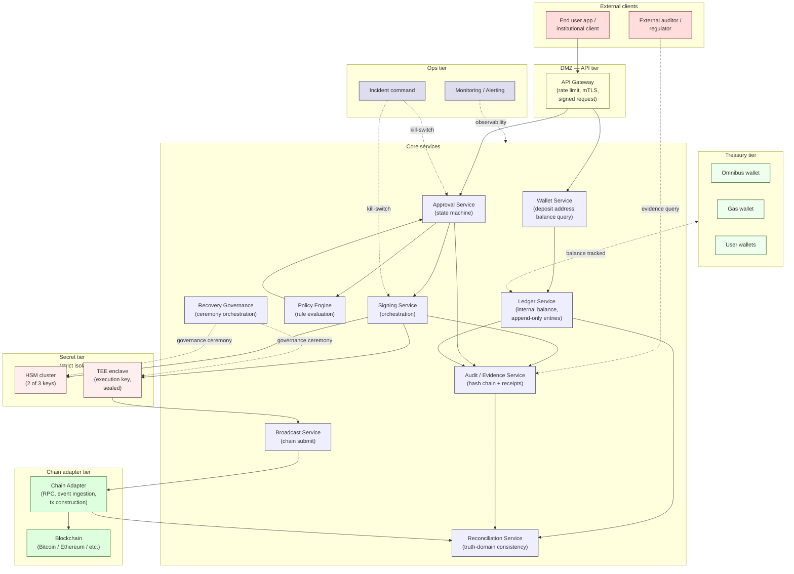

# Direct-build Custodial Wallet — Reference Architecture
> Projection of the generalized custody corpus into a build-actionable blueprint

이 문서는 `docs/architecture/` 의 61-doc generalized corpus 와 `sources/fireblocks/`, `sources/nodeinfra/` 의 vendor source 를 기반으로, **"Fireblocks 없이 직접 구축하는 수탁형 지갑"** 의 reference architecture 를 추출합니다.

대상 독자: PM, Tech Lead, Backend Engineer, Security Engineer, Operations, Architecture Reviewer.

**이 문서는 새 theory 가 아닙니다.** generalized corpus 의 PM/Engineering 수준 projection 입니다.

---

## 1. Executive Summary

### 1.1 핵심 메시지

> **수탁형 지갑 Direct-build 는 "Wallet DB 를 만드는 문제" 가 아니다.**
>
> 상태 (state), 증거 (evidence), 승인 (governance), 서명 (signing), 정산 (reconciliation), 복구 (recovery) 책임을 **직접 운영** 하는 문제다.

DB schema 는 며칠이면 만들 수 있다. 위 6 가지 책임을 **24/7 운영 가능한 수준** 으로 운영하는 것은 분기/연 단위의 design 결정이 필요하다.

### 1.2 Direct-build 가 의미하는 것

| 영역 | Direct-build 의 의미 |
|------|---------------------|
| **Governance** | approval policy 의 설계 / 변경 / 감사 책임 직접 소유 |
| **Signing** | 키 보관 / 서명 ceremony / 키 회전 / 운영 quorum 직접 소유 |
| **Reconciliation** | 다중 truth domain (내부 ledger ↔ chain ↔ counterparty) 의 정합성 보장 직접 소유 |
| **Evidence** | append-only event chain + 외부 검증 가능한 증거 직접 운영 |
| **Recovery** | 키 / data / ceremony / 의식 절차 의 backup-vs-recovery 분리 직접 운영 |
| **Operational survivability** | 24/7 incident response + 운영자 quorum + handoff 직접 운영 |

이 6 가지는 **vendor 가 흡수해 주는 운영 복잡도** 입니다. Direct-build 는 이 복잡도를 **institution 이 직접 소유** 하는 선택.

### 1.3 무엇이 vendor 의 가치인가

Fireblocks / NodeInfra 같은 vendor 는 **기술만 제공하지 않습니다**:

- 기술 (MPC / HSM / TEE) — implementation
- **운영 복잡도 흡수** — 위 6 가지 책임의 일부를 vendor 가 standardize 함
- 인증 (SOC2 / ISMS / KCMVP / 보안기능확인서)
- 사고 대응 craft (incident command 누적 경험)
- governance template (approval workflow, audit interface 의 default)

vendor 를 거치지 않는다는 것은 **이 6 가지 모두를 자신이 운영** 한다는 의미.

### 1.4 이 reference architecture 의 scope

이 문서는 다음을 다룹니다:

- **Recurring aggregates** — vendor 와 무관하게 등장하는 19 개 핵심 aggregate
- **State machines** — 6 가지 핵심 lifecycle (approval / signing / withdrawal / deposit / reconciliation / recovery)
- **Storage boundaries** — mutable / append-only / runtime-only / external / forbidden
- **Trust boundaries** — 6 개 layer 의 trust separation
- **Vendor-independent patterns** — Fireblocks / NodeInfra / generalized 모두에서 나타나는 구조
- **PM decision points** — 만들기 전에 결정해야 할 것들
- **MVP → Production** — 단계별 minimum bar
- **Open risks** — Direct-build 의 잔여 불확실성

이 문서는 다음을 **다루지 않습니다**:

- 특정 vendor 추천 (corpus discipline)
- MPC 프로토콜의 cryptographic 구현 상세
- Cryptography tutorial
- 특정 chain (Bitcoin / Ethereum / Solana) 의 implementation guide
- 코드 예시 (architecture 수준)

---

## 2. Architecture Principles

이 architecture 의 모든 결정은 다음 10 개 원칙 위에 서 있습니다. 각 원칙은 corpus 의 ≠ proposition 또는 invariant 와 대응합니다.

### 2.1 10 가지 핵심 원칙

| # | 원칙 | 의미 | 위반 시 |
|---|------|------|--------|
| 1 | **Approval ≠ Signing** | 정책 승인과 암호 서명은 다른 권한 / 다른 서비스 / 다른 키 | 단일 권한 손상 = 자금 손실 |
| 2 | **Settlement ≠ Finality** | 내부 settle 와 chain finality 는 다른 시점 / 다른 truth domain | 미확정 자금에 대한 의존 |
| 3 | **Visibility ≠ Control** | 보이는 것 (잔액 조회) 과 조작 권한 (이동 권한) 은 별개 | viewer 가 mover 가 되는 권한 escalation |
| 4 | **Recovery ≠ Backup** | backup 은 data 의 copy / recovery 는 ceremony + governance 의 의식 | backup 만 있으면 recover 가능하다는 잘못된 가정 |
| 5 | **Audit log ≠ Evidence chain** | log 는 변경 가능 / evidence chain 은 cryptographic-bound + append-only | "log 가 있으니 감사 가능" 의 false sense |
| 6 | **Reconciliation ≠ Balance equality** | 잔액 동일 ≠ truth domain 간 정합성 통과 | balance 만 보고 정산 종료 |
| 7 | **Survivability > Efficiency** | 30 년 살아남는 design 이 단기 우아함보다 우선 | 신기술 chase 로 운영 부담 폭증 |
| 8 | **Evidence-first** | 모든 자금 이동은 evidence 가 먼저 생성된 후 행위 | 사후 reconstruction 의존 |
| 9 | **Append-only** | 자금-결정-증거 의 row 는 silent 수정 불가 | 사후 변조 가능 = 감사 불가 |
| 10 | **Human operational irreducibility** | 일부 결정은 사람이 하지 않으면 의미 없음 (charter / Class A invariant 변경 / vendor 결정 / 사고 결정) | AI / 자동화 가 결정 책임 흡수 → accountability 손실 |

### 2.2 원칙 적용의 우선순위

원칙 간 충돌 시 우선순위:

```
1, 4, 9 (자금-evidence-append-only)  →  사고-방지 절대 우선
8        (evidence-first)             →  설계 시 무조건 적용
2, 5, 6 (state-truth domain 분리)     →  운영 시 무조건 적용
3       (visibility/control 분리)     →  권한 design 시 적용
7       (survivability)                →  기술 선택 시 적용
10      (human irreducibility)         →  governance design 시 적용
```

원칙 1, 4, 9 가 **non-negotiable**. 나머지는 institutional context 에 따라 trade-off.

---

## 3. System Topology

### 3.1 High-level service topology



### 3.2 4 가지 trust boundary

| Boundary | 무엇을 분리하나 | 인증 수단 |
|----------|----------------|---------|
| **B1 — Customer ↔ API** | 외부 ↔ 내부 | mTLS + signed request + IP allowlist |
| **B2 — API ↔ Core** | DMZ ↔ 격리 구역 | service mesh / token-based auth |
| **B3 — Core ↔ Secret tier** | 일반 격리 ↔ key custody | PKCS#11 / DCAP attestation / sealed IPC |
| **B4 — Operator ↔ Production** | 운영자 ↔ 시스템 | YubiKey / HSM PED / ceremony quorum |

자세한 trust boundary 분석은 [trust-boundaries.md](trust-boundaries.md) 참고.

### 3.3 핵심 service 책임 (한 줄 요약)

| Service | 책임 | 갖지 않는 것 |
|---------|------|--------------|
| API Gateway | request 인증, rate limit | 비즈니스 로직 |
| Wallet | 주소 발급, 잔액 조회 | 키, 정책 결정, 서명 |
| Ledger | 내부 balance, 명령형 entry | 키, 외부 chain state |
| Approval | 결정 state machine | 키, 정책 평가 |
| Policy Engine | 룰 평가, verdict 산출 | 잔액 조회 (coordinator 가 사전계산), 서명 |
| Signing | 서명 orchestration | 정책 결정, 잔액 조회 |
| Broadcast | chain submit, retry | 서명, 정책 |
| Reconciliation | truth-domain 정합성 | 자금 이동 권한 |
| Audit/Evidence | hash chain + receipts | 정책 결정, 자금 이동 |
| Recovery Governance | ceremony orchestration | runtime 서명 |
| Chain Adapter | RPC / 이벤트 수집 / tx 구성 | 정책 결정 |
| Monitoring | 관측 + alert | 결정 권한 |

각 service 가 **자기 책임 외의 권한을 갖지 않는다** 는 것이 architecture 의 backbone.

---

## 4. 60-second mental model

처음 이 architecture 를 보는 사람이 60 초 안에 잡아야 할 framing:

```
[자금 이동 요청]
         ↓
   Approval Service ← Policy Engine (rule 평가)
         ↓ (verdict = Allow)
   Signing Service
   ├─ 개시 key (Initiation, HSM)
   ├─ 승인 key (Approval, HSM)
   └─ 실행 key (Execution, TEE sealed)
         ↓ (3-key 모두 서명)
   Broadcast Service
         ↓
   Chain (Bitcoin / Ethereum / etc.)

병행 (parallel):
   Audit/Evidence ←─ approval 결정 + signing 영수증 + 체인 confirmation
   Ledger ←─ pending → confirmed entry
   Reconciliation ←─ Ledger ↔ Chain ↔ Audit 정합성 주기 검사
```

핵심:
- 3 개 service / 3 개 key 가 모두 협조해야 자금이 이동.
- 모든 단계가 evidence 를 produce.
- balance / state / evidence 가 별개 service.
- 사람이 결정하는 layer (charter / recovery / incident) 는 자동화에서 분리.

---

## 5. 무엇이 새로운 theory 가 아닌가

이 reference architecture 의 모든 design 결정은 다음 corpus 출처를 가집니다:

| 결정 | 출처 |
|------|------|
| 3-key separation | D2 + D14 + NodeInfra security/architecture/multisig |
| Approval state machine | D3 + Fireblocks approval groups + NodeInfra compliance/decision-lifecycle |
| 2-layer evidence chain | D5 + NodeInfra security/ops/audit-logs |
| 4-DB split | D1a + NodeInfra compliance/architecture |
| Reconciliation as cross-truth-domain | D1b |
| Recovery as ceremony | D4 + Fireblocks recovery-related sources |
| Trust boundaries | D14 |
| Multi-chain adapter | D9 |
| Wallet types (user / omnibus / gas) | D1a + NodeInfra dev/architecture |
| Append-only invariants | D5 + R7 |

새로 도입한 entity / aggregate / hub: **0** 개.
새로 도입한 architectural pattern: **0** 개.
모든 patternㅡ recurring — Fireblocks / NodeInfra / corpus 셋 중 최소 2 곳에서 나타남.

자세한 vendor-independent recurring pattern 비교는 [recurring-patterns.md](recurring-patterns.md) 참고.

---

## 6. 이 reference architecture 의 7 개 파일

| 파일 | 내용 |
|------|------|
| **index.md** (이 파일) | Executive Summary + Principles + Topology + Final Position |
| **[aggregates.md](aggregates.md)** | 19 개 core aggregate (Customer / Vault / Wallet / Address / Asset / Chain / LedgerAccount / LedgerEntry / Deposit / Withdrawal / Transaction / ApprovalRequest / ApprovalDecision / SigningRequest / BroadcastAttempt / Confirmation / ReconciliationSession / AuditEvent / RecoveryEvent) |
| **[state-machines.md](state-machines.md)** | 6 개 state machine (Approval / Signing / Withdrawal / Deposit / Reconciliation / Recovery) + lifecycle diagram |
| **[storage-boundaries.md](storage-boundaries.md)** | 5 storage domain (Mutable / Append-only / Runtime-only / External Reference / Forbidden) |
| **[trust-boundaries.md](trust-boundaries.md)** | 6 trust boundary (governance / execution / reconciliation / treasury / recovery / evidence) + audit chain |
| **[recurring-patterns.md](recurring-patterns.md)** | vendor-independent recurring structures + Fireblocks/NodeInfra/corpus 비교 |
| **[pm-decision-guide.md](pm-decision-guide.md)** | PM decision points + MVP→Production 단계 + open risks/unknowns |

---

## 7. Final Position

### 7.1 Direct-build 는 가능하다

이 reference architecture 가 보여주는 것은 **Direct-build 가 기술적으로 불가능하지 않다** 는 것. 모든 component, state machine, storage domain, trust boundary 는 well-defined 패턴이고 verifiable.

### 7.2 하지만 "DB 를 만드는 문제" 가 아니다

Direct-build 는 다음을 **직접 소유** 하는 것:

| 책임 | 운영 부담 |
|------|---------|
| **Governance** | approval workflow / policy DSL / 변경 governance / audit interface |
| **Signing** | HSM operator quorum / TEE image management / key rotation ceremony / 24/7 availability |
| **Reconciliation** | mismatch 탐지 / 조사 / 정정 ceremony / counterparty 협조 |
| **Evidence** | hash chain integrity / checkpoint cadence / 외부 감사관 onboarding |
| **Recovery** | ceremony 절차 / quorum 운영자 명단 / disaster drill / cross-DC backup |
| **Operational survivability** | incident command / 24/7 on-call / handoff / post-mortem / audit response |

이 6 가지가 **vendor 가 absorb 해 주는 운영 복잡도** 입니다.

### 7.3 Vendor 의 실제 역할

Fireblocks / NodeInfra 같은 vendor 는:

- **기술 (MPC / HSM / TEE / chain adapter)** — 제공.
- **운영 복잡도의 일부 흡수** — vendor 의 standardized workflow / SLA / 사고 craft.
- **인증** (SOC2 / ISMS / KCMVP / 보안기능확인서) — vendor 가 보유.
- **사고 대응 경험 누적** — institution 보다 더 많은 사례.
- **default governance template** — approval / audit / recovery 의 baseline.

Direct-build 는 **위 5 가지를 자기 institution 의 자원 / 사람 / 시간으로 대체** 해야 한다는 의미. 기술이 어려운 것이 아니라 **운영 복잡도의 ownership** 이 가장 큰 부담.

### 7.4 언제 Direct-build 가 합리적인가

★ Hypothesis — 모든 institution 에 Direct-build 가 적합한 것은 아닙니다. 다음 조건이 충족될 때 합리적:

- **규제 / 정책상 vendor 의존 불가** (예: 망분리 환경, sovereign hosting 요구사항)
- **institution 자체에 institutional-grade ops 인력 + craft** 존재
- **장기 stewardship + multi-decade 운영 의지**
- **인증 (KCMVP / 보안기능확인서 / 등) 의 직접 획득 의지 + 자원**
- **24/7 incident response team** 운영 가능
- **vendor 의 default 가 부적합한 specific 운영 요구사항** 존재

위 6 가지 중 4 개 미만이 충족되면 ★ Hosted 옵션 (Fireblocks / NodeInfra / 등) 이 합리적.

### 7.5 이 architecture 의 honest limitation

이 reference architecture 가 **답하지 못하는 것** 들:

- **TPS / latency 의 구체적 수치** — institution scale 에 따라 다름
- **HSM 모델별 비용 / 운영 차이** — vendor-specific
- **chain 별 specifics** (block time, finality assumption, RPC reliability) — 별도 chain 책 필요
- **regulatory 의 구체적 implementation** — 변호사 자문 필요
- **MPC vs HSM 의 implementation trade-off** — corpus discipline 상 cryptographic detail 회피
- **DR / capacity / SLA 수치** — institutional context 의존

이런 영역은 institution 의 자체 구체화 또는 외부 자문에 의존.

---

## 8. 이 문서의 use case

| 상황 | 어떻게 사용하나 |
|------|----------------|
| **PM 이 새 product spec 작성** | aggregates.md + state-machines.md + pm-decision-guide.md |
| **Tech Lead 가 system 설계** | index.md + aggregates.md + storage-boundaries.md + trust-boundaries.md |
| **Backend Engineer 가 implementation** | state-machines.md + storage-boundaries.md + recurring-patterns.md |
| **Security Engineer 가 threat model** | trust-boundaries.md + recurring-patterns.md + corpus D14 |
| **Operations 가 incident playbook** | state-machines.md (실패 상태) + pm-decision-guide.md (24/7 운영) |
| **Architecture reviewer 가 design review** | 전부, especially pm-decision-guide.md (open risks) |
| **C-level 이 build-vs-buy 결정** | index.md §7 (Final Position) + pm-decision-guide.md MVP→Prod |

---

## 9. 다음 읽을 글

순서대로:

1. **[aggregates.md](aggregates.md)** — 어떤 entity 들이 필요한가
2. **[state-machines.md](state-machines.md)** — 어떻게 움직이는가
3. **[storage-boundaries.md](storage-boundaries.md)** — 어디에 무엇을 저장하는가
4. **[trust-boundaries.md](trust-boundaries.md)** — 누가 누구를 신뢰하는가
5. **[recurring-patterns.md](recurring-patterns.md)** — vendor-independent 한 패턴인가
6. **[pm-decision-guide.md](pm-decision-guide.md)** — PM 이 결정해야 할 것 + MVP→Prod

---

## 10. Uncertainty boundary

★ Hypothesis (이 reference architecture 의 limitation):

- 이 architecture 는 **institutional custody** 의 일반 패턴. retail wallet / DeFi protocol / DEX 의 경우 다른 architecture 가 필요.
- 모든 numeric (24h Held TTL, 60s timestamp window 등) 은 vendor-observed defaults — institution context 에 따라 조정.
- 3-key separation 은 **HSM + TEE 조합** 의 vendor-observed pattern. MPC 기반 multi-share 는 cryptographically 다른 architecture (corpus D2 generalization 안에서 valid 한 alternative).
- 4-DB split 은 **NodeInfra 의 instantiation**. 다른 institutional vendor 는 3-DB 또는 5-DB 분할 가능 — 본질은 mutability profile 의 분리.
- Recovery 의 ceremony 는 **discipline frame**. 구체적 ceremony 절차는 institution 의 위험 평가에 따라.
- 이 architecture 는 **2026 년 기준 corpus / vendor source** 의 projection. 시간이 지나면 frontier (CBDC / intent-based / autonomous treasury / post-quantum) 변화에 따라 amendment 필요 (R7 spirit).

---

> **이 문서는 corpus 의 projection 입니다.** 새 theory 가 아니라, generalized reasoning 의 actionable form.
> 변경 사항은 R5 governance review + R7 snapshot 절차에 따라 amendment 로 추가됩니다.
