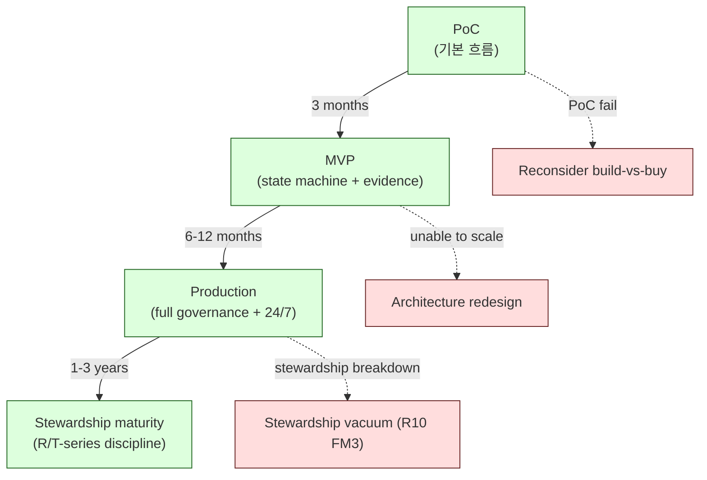
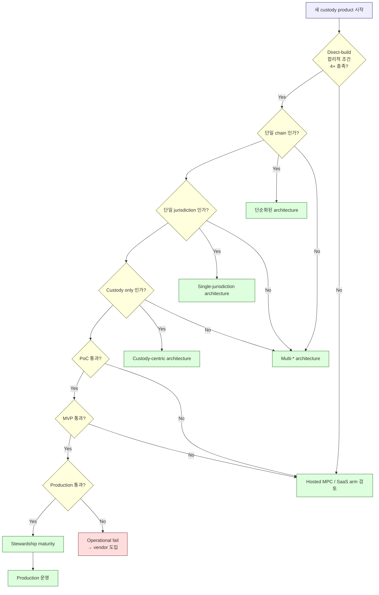

# PM Decision Guide
> 만들기 전에 결정해야 할 것 + MVP → Production + Open risks

이 문서는 Direct-build custodial wallet 의 PM / Tech Lead 가 **process 시작 전에 답해야 할 질문** 들과, MVP → Production 단계별 minimum bar, 그리고 잔여 risk 를 catalog 합니다.

---

## 1. 시작 전 결정 4 가지 (수정 어려움)

이 4 가지는 **architecture 의 형태를 좌우** — 처음 잘못 결정하면 후속 retrofit 비용 큼.

### Decision 1 — Build-vs-buy

**질문**: SaaS / Hosted MPC / Direct-build 중 어느 arm 인가?

**필수 검토 (corpus D6)**:

| 조건 | True 면 Direct-build, False 면 다른 arm |
|------|------------------------------------|
| 망분리 / sovereign hosting 요구사항 | ✓ Direct-build |
| Institution 에 institutional-grade ops 인력 + craft | ✓ Direct-build |
| 장기 stewardship + multi-decade 운영 의지 | ✓ Direct-build |
| 인증 (KCMVP / 보안기능확인서 / 등) 직접 획득 의지 | ✓ Direct-build |
| 24/7 incident response team 운영 가능 | ✓ Direct-build |
| Vendor 의 default 가 부적합한 specific 요구사항 | ✓ Direct-build |
| **위 6 가지 중 4+ 가 True** | → Direct-build 합리적 |
| **위 6 가지 중 3 이하만 True** | → Hosted arm 합리적 |

★ Hypothesis — Direct-build 의 default 답은 "★ 더 신중히 검토" 입니다. SaaS / Hosted 가 default 가 아닙니다. 양쪽 다 deliberate choice 여야 합니다.

### Decision 2 — 단일 chain vs multi-chain (now or future)

**질문**: 처음부터 multi-chain 인가, 향후 추가 예정인가?

| 선택 | 함의 |
|------|------|
| **Single chain (now + forever)** | D9 multi-chain adapter 의 abstraction 없이 단순화 가능 |
| **Single chain (now, multi later)** | D9 의 adapter pattern 을 처음부터 — 비용 ★ but retrofit 어려움 |
| **Multi-chain (now)** | D9 adapter 가 first-class — full complexity 부담 |

[★ Hypothesis] **단일 chain only** 결정은 매우 신중히. 향후 추가 시 retrofit 비용이 크고, 중간에 architecture 재설계 가능성 높음.

### Decision 3 — Single-jurisdiction vs multi-jurisdiction

**질문**: 처음부터 한 국가 / 한 regulatory regime, 또는 여러?

| 선택 | 함의 |
|------|------|
| **Single jurisdiction** | 규제 framework simplification; D11 의 일부 invariant 만 적용 |
| **Multi-jurisdiction** | D11 + D13 + D23 의 multi-jurisdictional invariants 모두 적용 |

[★ Hypothesis] 단일 jurisdiction → multi-jurisdiction 의 retrofit 은 거의 ground-up rewrite — 시작 시 결정.

### Decision 4 — Custody 만 vs custody + issuance + treasury

**질문**: 우리는 **자금을 보관** 하는가, **자금을 발행** 하는가, 둘 다인가?

| 선택 | 함의 |
|------|------|
| **Custody only** | D6 + D10 + D17 의 일부만 |
| **Custody + issuance (stablecoin)** | D10 (mint-burn) + D21 (depeg crisis) 추가 |
| **Custody + treasury optimization** | D17 + D18 + D19 + D20 추가 |
| **All three** | 모든 cluster (Foundation + Specialization + Liquidity + Crisis) 적용 |

다른 scope 면 다른 reference architecture 필요. 이 문서는 **custody-centric** scope.

---

## 2. 시작 후 결정 12 가지

이 12 가지는 architecture 의 detail. 처음에 답 못 해도 진행 가능, 다만 **명시적 deferred decision 으로 기록**.

### 2.1 Approval 영역

#### Q1. Approval 권한이 누구에게 있는가?

| 옵션 | 함의 |
|------|------|
| Compliance team only | Compliance / business workflow 분리 |
| Per-cluster (예: per asset type) | 권한 분산 |
| Hybrid (auto + manual tier) | NodeInfra approval_tier 패턴 |

★ Recurring: **Hybrid (auto + tier)** 가 vendor-observed default.

#### Q2. Held 의 외부 해소 방법은?

| 옵션 | 함의 |
|------|------|
| Manual button on console | ★ Anti-pattern (NodeInfra discipline 위반) |
| 정책 임시 수정 (audit logged) | ★ NodeInfra recurring |
| External quorum + 정책 수정 | High-amount tier 권장 |

권장: 정책 임시 수정 + audit log (Console manual button 금지).

### 2.2 Signing 영역

#### Q3. Signing authority 의 위치는?

| 옵션 | 함의 |
|------|------|
| On-prem HSM cluster | NodeInfra style |
| Cloud HSM (AWS CloudHSM / Azure Dedicated HSM) | 운영 부담 ↓, sovereign 요구사항 ✗ |
| MPC nodes (self-hosted) | Fireblocks-like |
| HSM + TEE hybrid | NodeInfra 의 3-key |
| Pure MPC (no HSM) | Cryptographic-only |

★ 결정 기준:
- 망분리 요구사항 → On-prem HSM 필수
- Sovereign hosting → On-prem 또는 self-hosted MPC
- 비용 우선 → Cloud HSM 또는 Hosted MPC vendor

#### Q4. HSM vendor mix 는?

| 옵션 | 함의 |
|------|------|
| Single vendor (Thales Luna) | 비용 ↓, vendor lock-in |
| Multi vendor (Thales + Utimaco + ...) | 운영 부담 ↑, 강한 격리 |

★ Recurring (NodeInfra recommendation): 가능하면 multi-vendor for key separation, single vendor for partition separation.

#### Q5. TEE 사용 여부?

| 옵션 | 함의 |
|------|------|
| TEE 없음 (HSM only) | 단순화; HSM 의존 (계속 online) |
| Intel SGX | NodeInfra style; MRENCLAVE binding |
| AMD SEV / TDX | alternative TEE |
| TPM | embedded TEE; 다른 use case |

★ TEE 의 핵심 가치: HSM 과 독립적 operation (실행 키 sealed) + Layer 2 evidence checkpoint signing.

### 2.3 Secret / key boundary 영역

#### Q6. Secret boundary 가 어디인가?

| 옵션 | 함의 |
|------|------|
| HSM + TEE 만 | Forbidden storage 강제, attestation-based access |
| HSM only | TEE 의 추가 layer 없음 |
| Cloud KMS | Single point of failure (vendor) |

★ Direct-build 권장: HSM + TEE (NodeInfra recurring) 또는 multi-HSM partition.

### 2.4 Reconciliation 영역

#### Q7. Reconciliation mismatch 는 누가 조사?

| 옵션 | 함의 |
|------|------|
| Engineering 24/7 on-call | Tech-heavy approach |
| Operations team 별도 | Process-heavy approach |
| Hybrid (auto-triage + escalation) | 권장 |

★ Recurring: 모든 mismatch 는 **사람이 결정** (자동 정정 금지). 자동화는 detection 까지.

#### Q8. Reconciliation cadence?

★ Recurring (NodeInfra):
- Continuous (real-time, structural enforcement)
- 60s ~ 5min (Ledger ↔ Chain)
- Hourly (audit hash chain checkpoint)
- Daily (counterparty / reserve attestation)
- Weekly (vendor state comparison)

### 2.5 Recovery 영역

#### Q9. Recovery ceremony 는 누가 수행?

| 옵션 | 함의 |
|------|------|
| Engineering team m-of-n | Tech-heavy |
| Cross-team (Engineering + Ops + Compliance) m-of-n | 권장 |
| External witnesses 포함 | 강한 audit defense |

★ Recurring: ceremony 의 m-of-n 운영자는 **rotation 의 대상** (T0 §11). 인사 변경 시 즉시 갱신.

#### Q10. Recovery drill frequency?

★ Hypothesis:
- Quarterly disaster drill (key rotation 또는 vault restore)
- Annual full DR (multi-DC failover)
- Post-incident review (실제 사고 후)

### 2.6 Audit / Evidence 영역

#### Q11. Audit evidence 는 누가 보관?

| 옵션 | 함의 |
|------|------|
| Institution 자체 | Direct-build 의 default |
| Vendor (Hosted) | Hosted arm 의 경우 |
| 3rd party 위탁 | 외부 attestation service |
| Hybrid (internal + 3rd party periodic export) | 권장 (audit defense) |

★ External auditor 의 DCAP-based verification 이 가능해야 함 (D5 + D15).

#### Q12. Evidence retention?

★ Hypothesis (regulatory minimum + safety margin):
- Korean financial (전금법): 5+ years
- Global (FATF): 5+ years
- Custody industry default: 영구 보존 권장

---

## 3. Operational responsibilities (24/7 운영)

### 3.1 누가 stop / resume 하는가

| 상황 | Authority |
|------|-----------|
| Global halt 발동 | Compliance team + on-call engineer (joint) |
| Service-specific stop | Service owner |
| Resume after halt | m-of-n quorum + audit trail |
| Recovery trigger | Recovery 위원회 |

★ Recurring: kill-switch 의 권한은 **strict** — 다수 권한자 (다른 timezone / 다른 team) 의 cross-approval.

### 3.2 24/7 운영 의 minimum

[Source: D12 + R10 FM3]

| 항목 | Minimum bar |
|------|------------|
| On-call coverage | 24/7 — single-timezone 안 됨 |
| Escalation policy | Documented + 정기 drill |
| Incident command | Pre-trained team |
| Post-mortem | Mandatory + within 7 days |
| Audit trail | All incidents + decisions logged |

### 3.3 Operational team scale (★ Hypothesis)

| Institution scale | 최소 team size |
|-------------------|--------------|
| Small (1-2 customer) | 5+ FTE (engineering + ops + compliance 합쳐서) |
| Medium (multiple institutional customers) | 15+ FTE |
| Large (enterprise scale) | 30+ FTE |

★ Hypothesis: Direct-build 의 **hidden cost** 의 90% 는 운영 인력. 인증 / hardware / 도구 비용은 상대적 작음.

---

## 4. MVP → Production 진행

### 4.1 PoC (Proof of Concept)

**목적**: 기본 흐름 작동 검증.

**Must have**:
- Wallet registry (Customer + Vault + Wallet + Address)
- Transaction tracking (Deposit + Withdrawal observation)
- Basic ledger (LedgerAccount + LedgerEntry — append-only)
- Manual reconciliation (정기 비교)

**Acceptable shortcut**:
- Approval 은 single-step (Allow / Deny only)
- Signing 은 1-key (HSM 한 partition)
- Audit 는 simple log (hash chain 없음)
- Recovery 는 documented 만, drill 미실시

**Not yet**:
- Frontier reasoning (D27-D32) 의 어떤 것도 도입 X
- AI-assisted automation

★ PoC 의 timeline: 1-3 개월. 목적: build-vs-buy 결정의 보조 자료.

### 4.2 MVP (Minimum Viable Product)

**목적**: 실제 customer (제한된 수) 에게 서비스 시작.

**Must have (PoC + 추가)**:
- Full Approval state machine (Allow / Held / Deny, sticky decision, set-once columns, 24h TTL)
- Full Signing state machine (3-key 또는 MPC equivalent)
- Audit evidence chain (Layer 1 — TEE receipts + foreign-key; Layer 2 는 partial)
- Complete Deposit lifecycle (finality threshold + compliance gate)
- Complete Withdrawal lifecycle (full state machine + ledger pending/confirmed)
- Operator quorum (m-of-n for key activation)
- Manual reconciliation + auto-triage
- Recovery ceremony documented + first drill 실시

**Acceptable shortcut**:
- 단일 chain 만 (multi-chain 은 production 으로)
- 단일 tenant 만 (multi-tenant 는 production 으로)
- AML / Travel Rule integration 은 manual
- Daily reconciliation 만 (real-time 없음)

**Not yet**:
- 24/7 자동 incident response
- 외부 auditor onboarding
- Recovery 의 cross-DC

★ MVP 의 timeline: 6-12 개월 후 PoC 이후. 목적: 실제 small customer (1-3) 운영.

### 4.3 Production (Full)

**목적**: Multi-customer / regulator-ready 운영.

**Must have (MVP + 추가)**:
- Full governance (Charter / R-series-style discipline)
- Reconciliation automation (continuous + multiple cadence)
- Recovery governance (cross-DC + quarterly drill)
- Incident command (24/7 + post-mortem culture)
- Operational survivability (T-series-style stewardship cadence)
- Audit-ready evidence chain (Layer 1 + Layer 2 모두 + DCAP-based auditor access)
- Multi-tenant separation (if applicable)
- Multi-chain (if applicable)
- Regulatory reporting (per jurisdiction)
- Stewardship rotation (1-2 년 cycle)

**Operational maturity**:
- Drift detection (T1) — weekly sampling, quarterly drift report
- Contradiction governance (T2) — registry + R3 process
- Memory survivability (T3) — handoff document discipline
- Controlled evolution (T4) — cooling-off + "not yet" discipline
- Stewardship failure self-recognition (T5)

★ Production 의 timeline: MVP 이후 1-3 년. Goal: institutional-grade 운영.

### 4.4 단계별 progression check

각 단계는 **gate** — 다음 단계로 자동 progression 없음. Build-vs-buy 재검토 또는 architecture redesign 의 chance.

---

## 5. PM 의 "Not yet" 가이드

[Source: corpus T4 §controlled evolution]

새 feature 요청 시 default response 가 **"yes"** 가 아니라 **"not yet"**:

| 요청 | Default response |
|------|----------------|
| 새 chain 추가 | "not yet" — D9 adapter 의 abstraction 검증 후 |
| 새 vendor 의존성 추가 | "not yet" — vendor risk + 운영 부담 평가 |
| 새 approval workflow | "not yet" — 기존 rule taxonomy 로 표현 가능한가 |
| 새 recovery 절차 | "not yet" — 기존 ceremony pattern 으로 표현 가능한가 |
| AI 자동화 도입 | "not yet" — R8 Zone A/B/C boundary 검토 후 |

"Not yet" 는 **거절이 아닙니다**. 다음을 명시:
- 어떤 조건이 충족되면 yes 가 되는가
- 누가 결정하는가
- 언제 재검토하는가

★ Acceptance velocity 를 success metric 으로 쓰지 마세요 (anti-pattern).

---

## 6. 12 가지 main open risks

Direct-build 의 **잔여 불확실성** — 이 문서가 답하지 못하는 것들.

### Risk 1 — Operational team turnover

★ Hypothesis: Direct-build 의 가장 큰 risk. 6 가지 책임 영역의 craft 가 사람에게 누적 — turnover 시 institutional memory 손실.

**Mitigation**: T3 institutional memory survivability + 정기 handoff document + apprenticeship.

### Risk 2 — Single-vendor dependency for hardware

★ Hypothesis: HSM 또는 TEE vendor 의 single dependency. 해당 vendor 의 vulnerability / 단종 / 가격 인상.

**Mitigation**: Multi-vendor HSM (NodeInfra recommendation) + 정기 vendor risk review.

### Risk 3 — Regulatory shift

★ Hypothesis: 5-10 년 단위로 regulatory regime 변화 (예: 새 sanctions list, 새 KYC 요구사항, CBDC).

**Mitigation**: Policy DSL + hot-reload + E2 regulatory evolution discipline.

### Risk 4 — Chain protocol change

★ Hypothesis: Chain 의 finality threshold / fee model / consensus 변화 (예: Ethereum merge, fork events).

**Mitigation**: Chain config as data + D9 multi-chain adapter abstraction.

### Risk 5 — Audit trail growth

★ Hypothesis: Append-only data 가 무한 성장. Storage 비용 + query 속도.

**Mitigation**: Per-account hash chain (parallelization) + checkpoint-based archival.

### Risk 6 — TEE vulnerability (Intel SGX 등)

★ Hypothesis: SGX 의 새 vulnerability 출현 (예: Foreshadow, ZombieLoad 등 historical).

**Mitigation**: HSM-based 키 보관 (TEE 와 독립) + DCAP rotation + 새 enclave image attestation.

### Risk 7 — DR / multi-DC complexity

★ Hypothesis: Multi-DC sync replication 의 complexity 가 매우 큼 (특히 append-only audit chain).

**Mitigation**: Sync replication for audit; async for mutable; 정기 DR drill.

### Risk 8 — Counterparty 의존성

★ Hypothesis: External attestation, KYC vendor, sanctions list vendor 의 lock-in.

**Mitigation**: Multi-vendor (특히 sanctions list) + abstraction layer.

### Risk 9 — Compliance team capacity

★ Hypothesis: Compliance team 이 rule taxonomy 의 evolution 을 keep up 못함.

**Mitigation**: Hot reload (rule 변경 cycle 단축) + audit trail 자동화.

### Risk 10 — Insider threat

★ Hypothesis: m-of-n quorum 의 운영자 중 다수가 합의해서 abuse.

**Mitigation**: Cross-team quorum + 회의록 / 외부 evidence + rotation.

### Risk 11 — Vendor recapture during stewardship rotation

★ Hypothesis: Incoming steward 가 특정 vendor 의 framing 으로 corpus 재구성.

**Mitigation**: Stewardship handoff discipline + R10 FM9 awareness.

### Risk 12 — Frontier shift (CBDC / intent / quantum)

★ Hypothesis: 5-10 년 후 architecture 가 outdated 될 가능성.

**Mitigation**: Frontier isolation (E4) + 정기 frontier review + 점진적 institutionalization.

---

## 7. PM checklist (구축 전 답변)

이 reference architecture 를 implementation 으로 옮기기 전, 이 25 개 질문에 답할 수 있어야:

### Identity & containment
- [ ] Customer 의 정의 (institutional vs individual)?
- [ ] Vault 와 Wallet 의 cardinality?
- [ ] Wallet type system (closed enum or flexible)?
- [ ] Tenant model — 처음부터 multi-tenant 인가?

### Money domain
- [ ] Asset identity = (chain, contract) tuple 인가?
- [ ] Address rotation 정책 (chain 별)?
- [ ] LedgerEntry 의 reversing entry 정책 (절대 deletion 금지)?

### Flow
- [ ] Approval / Signing / Withdrawal lifecycle 의 state 전수 정의?
- [ ] Confirmation count per chain?
- [ ] Compliance gate (AML / sanctions / KYT) 의 implementation?

### Storage
- [ ] DB 분할 정책 (4-DB? mutability-split?)?
- [ ] Append-only enforcement (DB trigger?)?
- [ ] Hash chain granularity (per-account)?
- [ ] Checkpoint cadence?
- [ ] Encryption at rest 의 key management?

### Trust boundaries
- [ ] HSM 모델 선택 + 인증?
- [ ] TEE 사용 여부 + image management?
- [ ] HSM partition vs multi-HSM?
- [ ] Operator quorum 규모?
- [ ] Recovery quorum?
- [ ] External auditor access 방식?

### Operational
- [ ] 24/7 on-call coverage?
- [ ] Incident command structure?
- [ ] Stewardship rotation cadence?
- [ ] Recovery drill cadence?
- [ ] Post-mortem culture?

이 25 가지 모두에 명시적 답 (★ Hypothesis 라도) 이 있어야 구축 가능. 답이 비어 있는 항목은 **deferred decision 으로 명시**.

---

## 8. 최종 결정 트리

각 단계는 **명시적 gate**. 자동 progression 없음. Build-vs-buy 의 재검토는 **언제든** 가능.

---

## 9. Final position (PM 관점)

### 9.1 Direct-build 의 honest summary

**기술적으로 가능** — 이 reference architecture 의 모든 component 는 well-defined 패턴.

**경제적으로 합리적이려면** — 위 6 가지 조건 (sovereign / institutional ops / multi-decade / 인증 / 24/7 / specific 요구사항) 의 4+ 가 충족되어야.

**운영적으로 도전적** — 기술 부담의 ~10% 가 architecture 이고 ~90% 가 6 가지 책임 영역 (governance / signing / reconciliation / evidence / recovery / survivability) 의 운영.

**시간적으로 long horizon** — PoC 3 개월, MVP 1 년, Production 2-3 년, Stewardship maturity 5+ 년.

### 9.2 PM 의 가장 중요한 3 가지 결정

1. **Build-vs-buy** — 위 6 가지 조건의 honest 평가.
2. **Scope (single chain / jurisdiction / custody-only)** — retrofit 어려운 결정.
3. **Operational ownership** — vendor 가 흡수하는 운영 부담을 누가, 어떻게 운영할지.

### 9.3 Vendor 의 가치 재인식

[Source: corpus D6 + R10 FM9 vendor recapture]

Fireblocks / NodeInfra / 등 vendor 는 **기술만 제공하지 않습니다**:

- 기술 (MPC / HSM / TEE) — implementation
- 운영 복잡도 흡수 — vendor 의 standardized workflow / SLA / 사고 craft
- 인증 (SOC2 / ISMS / KCMVP / 보안기능확인서)
- 사고 대응 craft (incident command 누적 경험)
- governance template (approval workflow, audit interface 의 default)

Direct-build 는 **이 5 가지를 institution 의 자원 / 사람 / 시간으로 대체** 한다는 의미.

### 9.4 이 문서가 답하지 않는 것

- **TPS / latency 의 구체적 수치** — institution scale 의존
- **HSM 모델별 비용** — vendor-specific (정확한 견적은 vendor 와)
- **Chain 별 specific behavior** — chain-specific guide 별도
- **Regulatory 의 구체적 implementation** — 변호사 자문
- **MPC vs HSM 의 implementation trade-off** — corpus discipline 상 crypto detail 회피
- **DR / capacity / SLA 수치** — institutional context

이런 질문은 institution 의 자체 구체화 또는 외부 자문에 의존.

---

## 10. 다음 단계

이 PM decision guide 를 읽은 후:

1. **Build-vs-buy 결정** — corpus D6 + index §7 (Final Position) 재검토
2. **Architecture review board** 구성 — cross-functional (PM + Tech + Security + Ops + Compliance)
3. **PoC scope 정의** — 위 §4.1 의 minimum 만 (절대 scope creep 금지)
4. **Operational team scale planning** — §3.3 의 hypothesis 기반
5. **Stewardship policy** 초안 — corpus R5 + T0 참조

---

## 11. 다음 읽을 글

- 처음으로 → [index.md](index.md)
- 19 aggregate 의 상세 → [aggregates.md](aggregates.md)
- 6 state machine → [state-machines.md](state-machines.md)
- Storage classification → [storage-boundaries.md](storage-boundaries.md)
- Trust boundary 분석 → [trust-boundaries.md](trust-boundaries.md)
- Vendor 별 recurring 비교 → [recurring-patterns.md](recurring-patterns.md)
- Corpus → `../docs/architecture/`
- 운영 가이드 → `../guide/`
