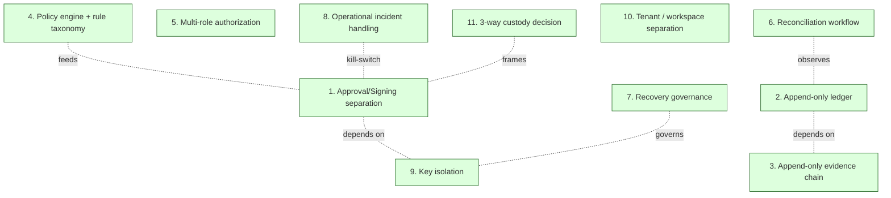
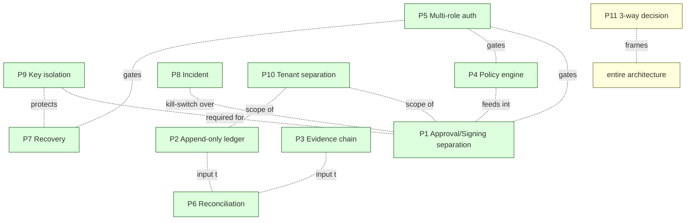

# Vendor-independent Recurring Patterns
> Fireblocks / NodeInfra / generalized corpus 에서 모두 반복되는 구조

이 문서는 **vendor 와 무관하게 반복되는 구조** 를 catalog 합니다. 한 vendor 에서만 등장하는 패턴은 `sources/<vendor>/source-notes/vendor-specific-patterns.md` 에 격리됩니다. 이 문서는 **3 곳 이상 (Fireblocks + NodeInfra + generalized corpus)** 에서 나타나는 패턴만 다룹니다.

핵심 메시지:

> **vendor 가 어떻게 구현하든, 다음 구조는 반복된다.**
> 같은 구조가 반복되면 → architecture invariant.
> Direct-build 도 이 구조 를 따라야 한다 (vendor-specific implementation 은 다르더라도).

---

## 1. 핵심 11 개 recurring pattern (개요)

각 패턴은 다음 3 곳에서 etiology 확인:
- **Generalized corpus** — D-series 의 어느 invariant
- **Fireblocks** — `sources/fireblocks/` 의 어디
- **NodeInfra** — `sources/nodeinfra/` 의 어디

---

## 2. Pattern P1 — Approval / Signing separation

### 2.1 무엇이 반복되나

자금 이동의 **정책 결정 (approval)** 과 **암호 서명 (signing)** 이 **다른 서비스 / 다른 권한 / 다른 키** 에 분리.

### 2.2 3 곳의 instantiation

| 위치 | Instantiation |
|------|--------------|
| **Generalized (D3 + D2)** | Approval state machine + Signing state machine (별개의 child SM) |
| **Fireblocks** | Approval Groups (정책) + MPC signing (cryptographic) — 별개 layer |
| **NodeInfra** | 정책 엔진 (승인 키 co-sign) + SGX enclave (실행 키 sign) — 다른 service / 다른 key |

### 2.3 왜 반복되나

[Source: D3 ≠ proposition #1 "Approval ≠ Signing"]

- 정책 권한 손상 만으로 자금 이동 가능하면 → policy bypass 시 catastrophic.
- 서명 권한 손상 만으로 자금 이동 가능하면 → key compromise 시 catastrophic.
- 분리하면 → 두 권한 모두 손상해야 catastrophic.

**Single-point-of-compromise ≠ catastrophic** invariant.

### 2.4 Direct-build implication

- Approval Service 와 Signing Service 는 **항상 별개**.
- 두 service 가 같은 host / 같은 process / 같은 key 를 공유하면 invariant 무너짐.

---

## 3. Pattern P2 — Append-only ledger

### 3.1 무엇이 반복되나

자금 movement 의 source of truth 는 **append-only LedgerEntry**. 정정은 reversing entry 로만.

### 3.2 3 곳의 instantiation

| 위치 | Instantiation |
|------|--------------|
| **Generalized (D1a + D5)** | 9-plane DB / selective event-sourcing / append-only entries |
| **Fireblocks** | Internal Ledger (transactional history) + Audit Log (별도) |
| **NodeInfra** | `ledgerdb` (per-account hash chain) + `policy_decisions` (append-only via `prevent_mutation()` trigger) |

### 3.3 왜 반복되나

[Source: D1a + D5 invariant "ledger 의 source of truth 는 entries"]

- Balance 만 mutable 하게 두면 사후 변조 가능 → audit 불가.
- Entries 가 append-only 면 → balance 는 derived → audit 가능.
- 정정도 evidence — deletion 은 evidence 파괴.

### 3.4 Direct-build implication

- DB schema 에서 LedgerEntry 의 UPDATE / DELETE 는 **DB trigger 로 차단**.
- Balance 는 cached derived (canonical 은 entries).
- 정정은 reversing entry (절대 deletion 아님).

---

## 4. Pattern P3 — Append-only evidence chain

### 4.1 무엇이 반복되나

자금 / 결정 / 서명의 **cryptographic-bound + append-only evidence chain**.

### 4.2 3 곳의 instantiation

| 위치 | Instantiation |
|------|--------------|
| **Generalized (D5)** | Unified Evidence Spine — append-only + cross-domain binding |
| **Fireblocks** | TX history + signed receipts + SOC2 audit |
| **NodeInfra** | 2-layer audit (Layer 1: TEE receipts + foreign-key; Layer 2: SHA-256 hash chain + TEE checkpoint) |

### 4.3 왜 반복되나

[Source: D5 ≠ proposition "Audit log ≠ Evidence chain"]

- Log 는 변경 가능 → "log 가 있다 = 감사 가능" 의 false sense.
- Evidence chain 은 **cryptographic-bound** — 사후 변조 탐지 가능.
- Real-time defense (Layer 1) + post-tamper detection (Layer 2) — 두 다 필요.

### 4.4 NodeInfra recurring detail (★ instantiation example)

| Layer | 메커니즘 |
|-------|---------|
| **Layer 1** | enclave-signed receipt per action + DB foreign-key constraint (orphan entry 구조적 불가능) |
| **Layer 2** | SHA-256 per-account hash chain + 주기적 enclave-signed checkpoint (MRENCLAVE recorded) |

### 4.5 Direct-build implication

- Evidence DB 는 **append-only + hash chain + TEE checkpoint** 모두 갖춰야 함.
- Layer 1 만 있고 Layer 2 없음 → 사후 변조 탐지 못함.
- Layer 2 만 있고 Layer 1 없음 → 사고 방지 못함.
- 외부 auditor 가 DCAP attestation 기반으로 검증 가능해야.

---

## 5. Pattern P4 — Policy engine + rule taxonomy

### 5.1 무엇이 반복되나

자금 이동 정책이 **closed rule taxonomy + priority-based evaluation + 3-verdict (Allow / Held / Deny)** 패턴으로 운영.

### 5.2 3 곳의 instantiation

| 위치 | Instantiation |
|------|--------------|
| **Generalized (D3 + D11)** | Approval state machine + compliance policy rules |
| **Fireblocks** | Transaction Authorization Policy (TAP) — rule list + priority + workflow |
| **NodeInfra** | 10 rule types (global_halt / address_list / time_window / per_tx / daily / velocity / velocity_window / address_cooldown / approval_tier / expression) + priority + short-circuit + Allow/Held/Deny |

### 5.3 왜 반복되나

[Source: D11 + D3 + Fireblocks TAP + NodeInfra compliance/decision-lifecycle]

- 정책을 code 로 만들면 → 변경 시 redeploy + audit 어려움.
- Rule taxonomy + DSL 로 만들면 → hot-reload + audit trail + 규제 대응.
- Priority + short-circuit → 평가 시간 bound + mental model 명확.

### 5.4 NodeInfra 의 10 rule type (★ recurring core types)

| Rule | 일반 form |
|------|----------|
| global_halt | Kill-switch — 모든 거래 즉시 차단 |
| address_list | Whitelist / blacklist — condition set 참조 |
| time_window | 영업시간 제한 |
| per_tx_amount_limit | 건당 amount 상한 |
| daily_withdrawal_limit | 일일 누적 상한 |
| velocity_limit | 일일 건수 제한 |
| velocity_window | 슬라이딩 윈도우 (건수 + amount) |
| address_cooldown | 신규 주소 cooling |
| approval_tier | 구간별 manual approval (AUTO / SINGLE_APPROVE / QUORUM_2_OF_3) |
| expression | 커스텀 DSL |

★ 이 10 type 은 NodeInfra-specific 이지만, **각 type 의 본질** (kill-switch / list / time / amount / count / window / cooldown / tier / custom) 은 vendor-independent.

### 5.5 Direct-build implication

- Rule taxonomy 는 **closed set + extension point** (custom expression).
- Priority + short-circuit 평가.
- Allow / Held / Deny 3-verdict (shadow_mode 금지 — Held 가 자동 결정 보류).
- Hot reload (ArcSwap or equivalent).
- 모든 rule 변경은 `policy_change_log` 같은 append-only 에 기록.

---

## 6. Pattern P5 — Multi-role authorization

### 6.1 무엇이 반복되나

운영자가 **여러 명**, **다른 권한**, **m-of-n quorum**.

### 6.2 3 곳의 instantiation

| 위치 | Instantiation |
|------|--------------|
| **Generalized (D3 + R5)** | governance roles (Steward / Cluster lead / Charter council) — m-of-n quorum |
| **Fireblocks** | Admin / Approver / Editor / Viewer roles + admin quorum |
| **NodeInfra** | Compliance Portal 의 admin / operator / auditor roles + HSM operator quorum (예: 3-of-5, 4-of-7) |

### 6.3 왜 반복되나

[Source: D3 + Fireblocks roles + NodeInfra security/keys/hsm §운영자 쿼럼]

- Single-owner 운영은 capture / bus-factor / mistake 모두 위험.
- m-of-n 은 **collective accountability**.
- 다른 role 은 **different scope** — least-privilege.

### 6.4 Standard role 분류

★ vendor-observed recurring:

| Role | 권한 |
|------|-----|
| **Admin** | Operational config 변경 + role 부여 |
| **Approver** | Approval workflow 의 manual approval 참여 |
| **Operator** | 일상 operational task (운영자) |
| **Auditor** | Read-only audit trail 조회 |
| **Editor** | Policy 변경 (rule editing) |
| **Viewer** | Read-only |
| **Recovery participant** | Recovery ceremony 의 m-of-n |

각 role 의 권한은 **service 마다 다름** — RBAC 이 across services.

### 6.5 Direct-build implication

- 각 service 가 자기 RBAC 갖춤 (Wallet Service 의 admin ≠ Policy Engine 의 admin).
- Quorum 은 **physical (YubiKey, HSM PED)** + **logical (m-of-n approval row)** 양쪽.
- Rotation 은 **인사 변경에 따른 권한 갱신** 의식.

---

## 7. Pattern P6 — Reconciliation workflow

### 7.1 무엇이 반복되나

**여러 truth domain 의 cross-check** + 정기적 + event-driven + manual.

### 7.2 3 곳의 instantiation

| 위치 | Instantiation |
|------|--------------|
| **Generalized (D1b)** | 5 truth-domain reconciliation (Ledger / Chain / Audit / Counterparty / Reserve attestation) |
| **Fireblocks** | Daily reconciliation report + cross-chain settlement reports |
| **NodeInfra** | 정합성 체크 작업 (Ledger ↔ Action records ↔ On-chain state, ≤ 60s cadence) |

### 7.3 왜 반복되나

[Source: D1b ≠ proposition "Reconciliation ≠ Balance equality"]

- Balance 동일 ≠ 정합성 (다른 truth domain 의 inconsistency 가능).
- Multiple cadence (continuous / minute / hour / day / week) — 각 domain 마다 적정 주기.
- Mismatch 발생 시 **자동 정정 금지** — manual investigation.

### 7.4 Truth domain 분류 (★ recurring)

| Truth domain | 무엇 |
|--------------|-----|
| Internal ledger | LedgerEntry 의 합 |
| Chain state | Adapter 가 관찰한 on-chain balance |
| Audit chain | AuditEvent 의 hash chain integrity |
| Counterparty | Prime broker / custodian attestation |
| Reserve | External reserve attestation |
| Vendor state (해당 시) | Hosted MPC vendor 의 상태 |

각 institution 의 scope 에 따라 활성화되는 domain 다름.

### 7.5 Direct-build implication

- Reconciliation Service 는 **read-only across all truth domains**.
- Mismatch 발견 시 **investigation state** + **manual review**.
- 정정은 **reversing ledger entry** (절대 직접 update 아님).
- Cadence: 연속적 (structural) + 분 (high-frequency) + 시간 (checkpoint) + 일 (counterparty) + 주 (full).

---

## 8. Pattern P7 — Recovery governance

### 8.1 무엇이 반복되나

Recovery 가 **backup 의 restore 가 아니라 ceremony + governance** 형태.

### 8.2 3 곳의 instantiation

| 위치 | Instantiation |
|------|--------------|
| **Generalized (D4)** | Recovery ceremony as governance under cryptographic risk |
| **Fireblocks** | Recovery Kit (workspace) + Mobile Quorum (m-of-n participants) — multi-step ceremony |
| **NodeInfra** | HSM operator quorum (PED 키) + SGX MRENCLAVE + master key provisioning ceremony |

### 8.3 왜 반복되나

[Source: D4 ≠ proposition "Recovery ≠ Backup"]

- Backup 은 data copy — 누구나 restore 가능하면 위험.
- Recovery 는 **권한 / 의식 / 검증** 의 ceremony — 사고 발생 후의 governance.
- Automation 영역 밖 — 모든 step 이 사람의 결정.

### 8.4 Direct-build implication

- Recovery 의 모든 step 이 **named operator + m-of-n quorum + 외부 evidence**.
- Console 의 "one-click restore" 금지.
- 정기 disaster drill — 실전이 처음이면 안 됨.
- Ceremony procedure document — drift detection (T1 / T2).

---

## 9. Pattern P8 — Operational incident handling

### 9.1 무엇이 반복되나

**Incident command** — kill-switch + escalation + post-mortem + audit chain 의 일부.

### 9.2 3 곳의 instantiation

| 위치 | Instantiation |
|------|--------------|
| **Generalized (D12)** | Operational maturity + incident command + 24/7 |
| **Fireblocks** | Customer Success / Incident Response team + workspace freeze 권한 |
| **NodeInfra** | `global_halt` policy rule (priority 10-19) — 모든 거래 즉시 차단 |

### 9.3 왜 반복되나

[Source: D12 + R10 FM3 stewardship vacuum]

- 사고는 **반드시 발생** (질문은 시기 / 빈도 / 영향 규모).
- 사고 시 신속한 **stop the world** 메커니즘 필요.
- 사고 후 **forensic + recovery** 의 ceremony.
- 24/7 on-call 의 institutional commitment.

### 9.4 Direct-build implication

- **Global kill-switch** (NodeInfra 의 global_halt 같은) — 단일 권한 보유자 + 강력한 권한.
- **Escalation rules** — 어떤 signal 이 어떤 incident level 을 trigger.
- **On-call playbook** — common incident 의 standard response.
- **Post-mortem ceremony** — 사고 후의 evidence 정리 + learning.

---

## 10. Pattern P9 — Key isolation

### 10.1 무엇이 반복되나

자금 서명 키가 **physical / cryptographic 격리** — HSM 또는 TEE 또는 MPC.

### 10.2 3 곳의 instantiation

| 위치 | Instantiation |
|------|--------------|
| **Generalized (D14)** | Trust boundaries B1-B14+; key custody 의 isolation invariant |
| **Fireblocks** | MPC-CMP (key shards distributed across nodes) |
| **NodeInfra** | HSM-partitioned 2 keys + SGX-sealed 1 key |

### 10.3 왜 반복되나

[Source: D2 + D14 + Fireblocks MPC + NodeInfra security/keys]

- 키 가 plaintext 로 한 곳에 있으면 → 단일 host compromise = 자금 손실.
- Physical (HSM) 또는 cryptographic (MPC) 또는 hardware (TEE) 격리 → compromise containment.

### 10.4 Key isolation 의 형태들 (vendor variance)

| 형태 | 예 |
|------|-----|
| HSM-only | Thales Luna 단일 — 모든 키가 HSM 안에서만 |
| HSM-partitioned | NodeInfra 의 3-key separation |
| HSM + TEE | NodeInfra 의 HSM (개시/승인) + SGX (실행) |
| Pure MPC | Fireblocks MPC-CMP — 키 shards distributed |
| MPC + HSM | Hybrid — 일부 MPC + HSM-protected |

본질은 동일 (key isolation), instantiation 만 다름.

### 10.5 Direct-build implication

- 어떤 instantiation 을 선택하든, **key isolation invariant** 충족.
- Forbidden storage 강제 (key plaintext 절대 DB 등에 안 들어감).
- DCAP / FIPS 140-3 / equivalent attestation.

---

## 11. Pattern P10 — Tenant / workspace separation

### 11.1 무엇이 반복되나

다수의 sub-organization (계열사 / 부서 / customer) 가 **격리된 state** + **격리된 권한** + **격리된 키**.

### 11.2 3 곳의 instantiation

| 위치 | Instantiation |
|------|--------------|
| **Generalized (D1a)** | Tenant isolation invariant |
| **Fireblocks** | Workspace 별 분리 (admin quorum, vault structure 모두 workspace 별) |
| **NodeInfra** | Per-tenant 3-key sets + SPKI-hash binding + payload `tenant_id` |

### 11.3 왜 반복되나

[Source: D1a + Fireblocks workspace + NodeInfra security/architecture/tenant]

- 같은 platform 에서 다수의 institutional unit 운영 시 격리 필수.
- 한 tenant compromise 가 다른 tenant 자금 영향 못 줘야.

### 11.4 Direct-build implication

- Tenant_id 가 모든 signing payload 에 포함.
- Per-tenant key set (HSM partition / MPC group / 등).
- Tenant 경계는 **3 개 key 모두에서 cross-verify** (NodeInfra pattern).
- DB schema 의 first-class concept — 후속 retrofit 어려움.

---

## 12. Pattern P11 — 3-way custody decision framework

### 12.1 무엇이 반복되나

Custody architecture 선택을 **SaaS / Hosted MPC / Direct-build** 3 way 로 framing.

### 12.2 3 곳의 instantiation

| 위치 | Instantiation |
|------|--------------|
| **Generalized (D6)** | 3-way custody decision framework — sovereignty vs operational burden |
| **Fireblocks** | Hosted MPC 의 vendor framing |
| **NodeInfra** | 자체 비교 표 — "VASP 하이브리드 / Cloud MPC / 노드월렛 (설치형)" |

### 12.3 왜 반복되나

[Source: D6 + NodeInfra index §다른 솔루션과의 비교]

- Build-vs-buy 결정 의 standard decomposition.
- 각 arm 의 trade-off 가 다른 axis (sovereignty / cost / 운영 부담 / 인증).

### 12.4 3-way 의 axes (vendor-observed recurring)

| Axis | SaaS | Hosted MPC | Direct-build |
|------|------|------------|--------------|
| Key ownership | Vendor | Vendor (shards) | Institution |
| Policy 실행 위치 | Vendor cloud | Vendor cloud | Institution infra |
| Operational burden | Low | Medium | High |
| 망분리 지원 | X | X | O |
| 인증 | SOC 2 (vendor) | SOC 2 (vendor) | Institution 직접 (ISMS / KCMVP / etc.) |
| 외부 의존성 | High | Medium | Low |
| Customization | Low | Medium | High |
| TTM (time to market) | Fast | Fast | Slow |

### 12.5 Direct-build implication

- 이 reference architecture 는 **Direct-build arm 의 instantiation**.
- 다른 arm 을 선택하면 — vendor 가 일부 책임을 흡수 (위 trust boundary 의 일부가 vendor 의 책임).
- 선택은 institutional context (규제 / 인력 / 자원 / 인증 의무) 의존.

---

## 13. Vendor 별 recurring summary table

| Pattern | Generalized | Fireblocks | NodeInfra |
|---------|-------------|-----------|-----------|
| P1 Approval/Signing separation | ✓ D3 + D2 | ✓ Approval Groups + MPC | ✓ 정책 엔진 + SGX |
| P2 Append-only ledger | ✓ D1a + D5 | ✓ Internal Ledger | ✓ ledgerdb + per-account hash chain |
| P3 Append-only evidence | ✓ D5 | ✓ TX history + SOC2 | ✓ 2-layer audit |
| P4 Policy engine + rule taxonomy | ✓ D3 + D11 | ✓ TAP | ✓ 10 rule types |
| P5 Multi-role authorization | ✓ D3 + R5 | ✓ Roles + admin quorum | ✓ Portal roles + HSM quorum |
| P6 Reconciliation workflow | ✓ D1b | ✓ Daily reconciliation reports | ✓ 정합성 체크 |
| P7 Recovery governance | ✓ D4 | ✓ Recovery Kit + Mobile Quorum | ✓ HSM PED + SGX provisioning |
| P8 Operational incident handling | ✓ D12 | ✓ Workspace freeze | ✓ global_halt rule |
| P9 Key isolation | ✓ D14 + D2 | ✓ MPC-CMP | ✓ HSM + SGX |
| P10 Tenant separation | ✓ D1a | ✓ Workspace | ✓ Per-tenant key sets |
| P11 3-way custody decision | ✓ D6 | ✓ (Hosted MPC arm) | ✓ 비교 표 |

**11/11** pattern 이 **3 곳 모두에서 recurring**.

핵심 결론: **이 11 가지 pattern 은 vendor 와 무관한 architecture invariant**. Direct-build 도 반드시 이 11 가지를 갖춰야 함 — instantiation 만 institution context 에 따라.

---

## 14. Pattern 의 dependencies

순서:
1. **P11 (3-way decision)** 이 architecture choice 의 frame.
2. **P9 (key isolation) + P10 (tenant)** 이 foundational substrate.
3. **P4 (policy) + P1 (separation)** 이 governance backbone.
4. **P5 (multi-role)** 이 모든 결정의 quorum layer.
5. **P2 + P3 (ledger + evidence)** 이 state management.
6. **P6 (reconciliation)** 이 P2 / P3 의 consistency layer.
7. **P7 (recovery) + P8 (incident)** 이 emergency layer.

---

## 15. 어떤 패턴이 가장 자주 잘못 implement 되나

[★ Hypothesis — vendor + customer 의 incident 분석 기반]

| Pattern | 자주 발견되는 실수 | 결과 |
|---------|------------------|-----|
| P1 | Approval 과 Signing 이 같은 service / 같은 key | Single compromise = catastrophic |
| P2 | LedgerEntry 의 UPDATE / DELETE 허용 | Audit chain 파괴 |
| P3 | Layer 2 (hash chain) 만 있고 Layer 1 (TEE receipt) 없음 | Real-time defense 부재 |
| P4 | Rule taxonomy 가 open-ended (모든 SQL query 허용) | Audit 불가능 + policy DSL 의 의미 손상 |
| P5 | Quorum 이 형식적 (실제 다수가 동시 압박 받음) | Effective single-owner |
| P6 | Reconciliation 이 cron 으로만 (session aggregate 없음) | Mismatch 시 추적 불가 |
| P7 | Recovery 의 "one-click restore" UI | Ceremony 우회 |
| P8 | Kill-switch 의 권한이 너무 많은 곳 | Accidental trigger |
| P9 | HSM PIN 이 DB 또는 file | Physical protection 의미 없음 |
| P10 | Tenant_id 가 payload 에 없거나 single key 에서만 check | Tenant 경계 우회 가능 |
| P11 | "Direct-build = SaaS 대비 더 좋음" 식 framing | 실제 operational burden 누락 |

이 11 가지 실수 중 어느 하나라도 발견되면 **architecture review 의 immediate stop**.

---

## 16. Direct-build 가 vendor 와 다른 점은 무엇인가

★ 패턴 자체는 동일. 다른 것은 **누가 운영 부담을 소유하는가**:

| Pattern | SaaS / Hosted | Direct-build |
|---------|---------------|--------------|
| P1 | Vendor 가 separation 보장 | Institution 이 직접 |
| P2 | Vendor DB | Institution DB + operational ownership |
| P3 | Vendor 의 audit (SOC2) | Institution 의 evidence + 외부 감사관 onboarding |
| P4 | Vendor 의 rule engine | Institution 의 policy DSL + change governance |
| P5 | Vendor 의 role system | Institution 의 IAM + m-of-n |
| P6 | Vendor 의 reconciliation report | Institution 의 cross-truth-domain workflow |
| P7 | Vendor 의 Recovery Kit + ceremony template | Institution 의 직접 ceremony + drill |
| P8 | Vendor 의 incident response | Institution 의 24/7 on-call |
| P9 | Vendor 의 HSM / MPC infra | Institution 의 HSM cluster + TEE infra |
| P10 | Vendor 의 workspace | Institution 의 tenant model |
| P11 | (Direct-build 가 아닌 arm 선택) | (Direct-build arm 선택) |

**Direct-build = 위 11 가지를 institution 이 직접 운영** — 기술이 어려운 것이 아니라 **operational ownership** 이 부담.

---

## 17. 다음 읽을 글

- PM 결정 기준 → [pm-decision-guide.md](pm-decision-guide.md)
- 처음으로 → [index.md](index.md)
- corpus 의 generalized invariant — `../docs/architecture/`
- Fireblocks source — `../sources/fireblocks/`
- NodeInfra source — `../sources/nodeinfra/`
