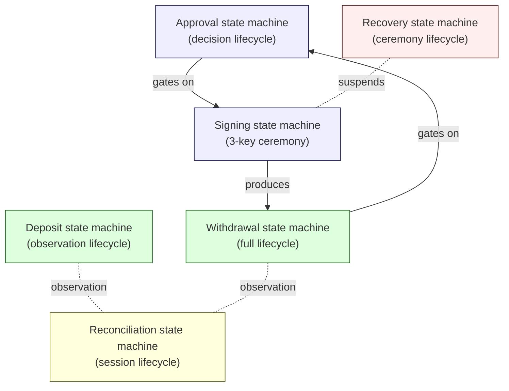
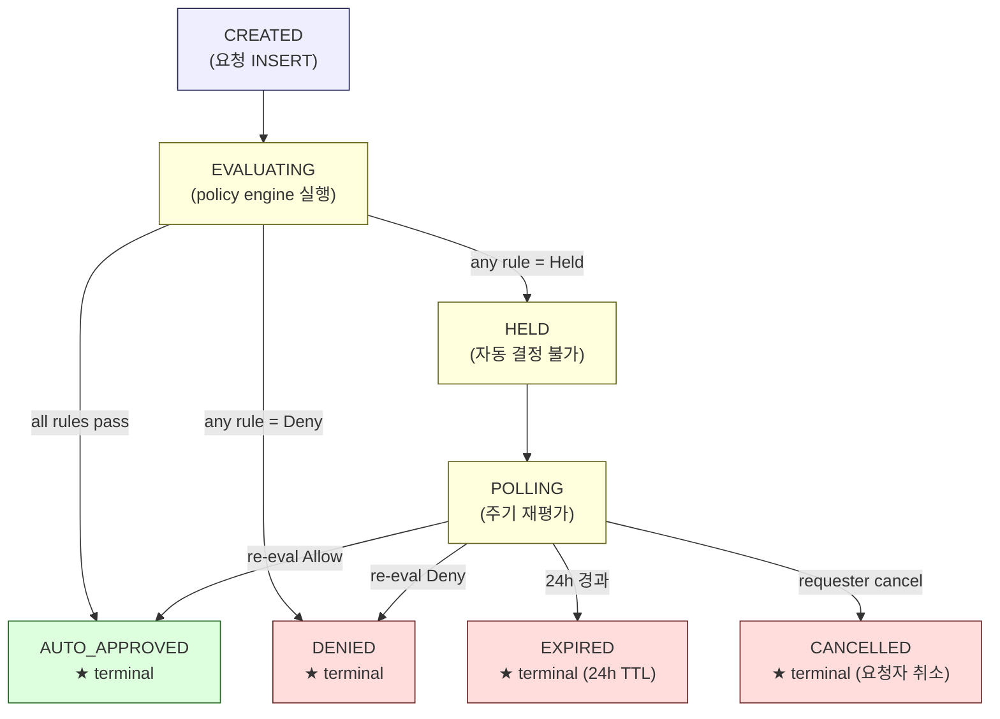
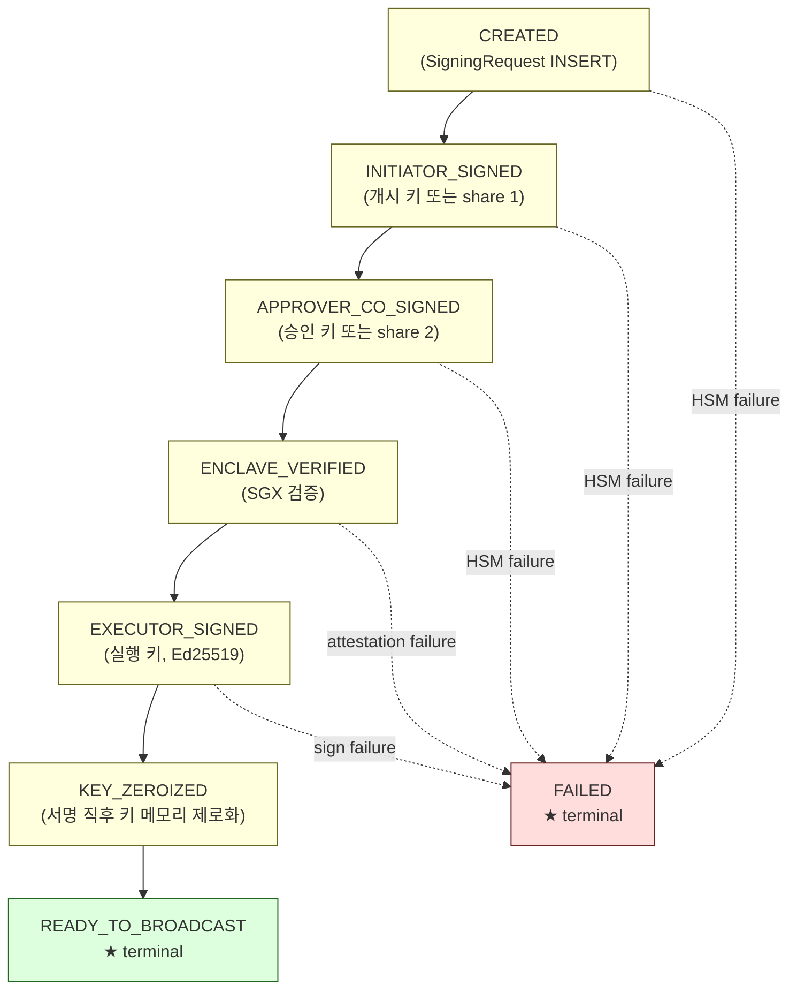
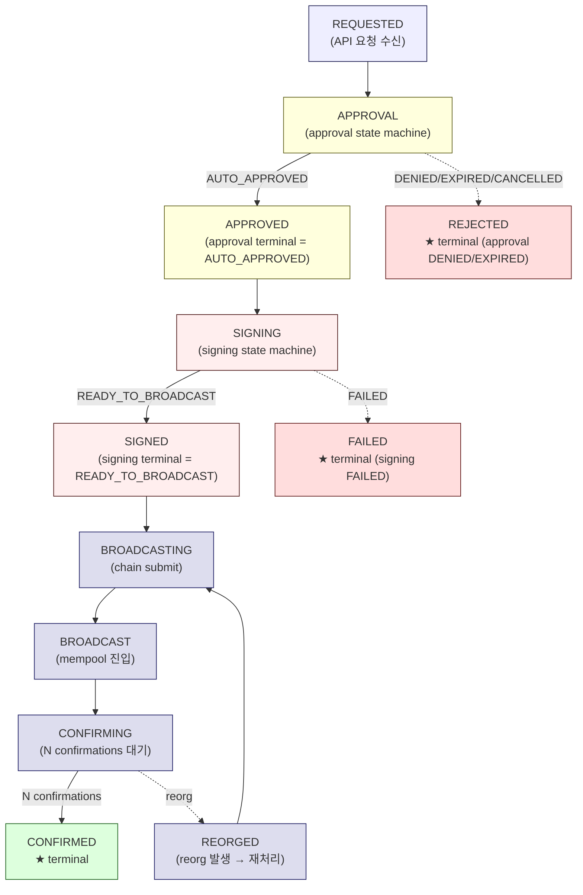
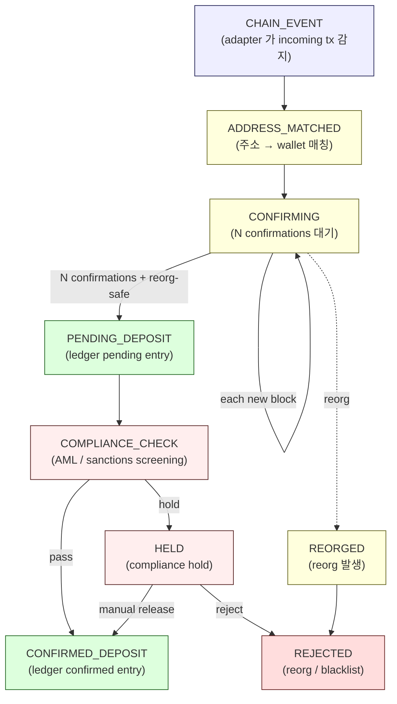
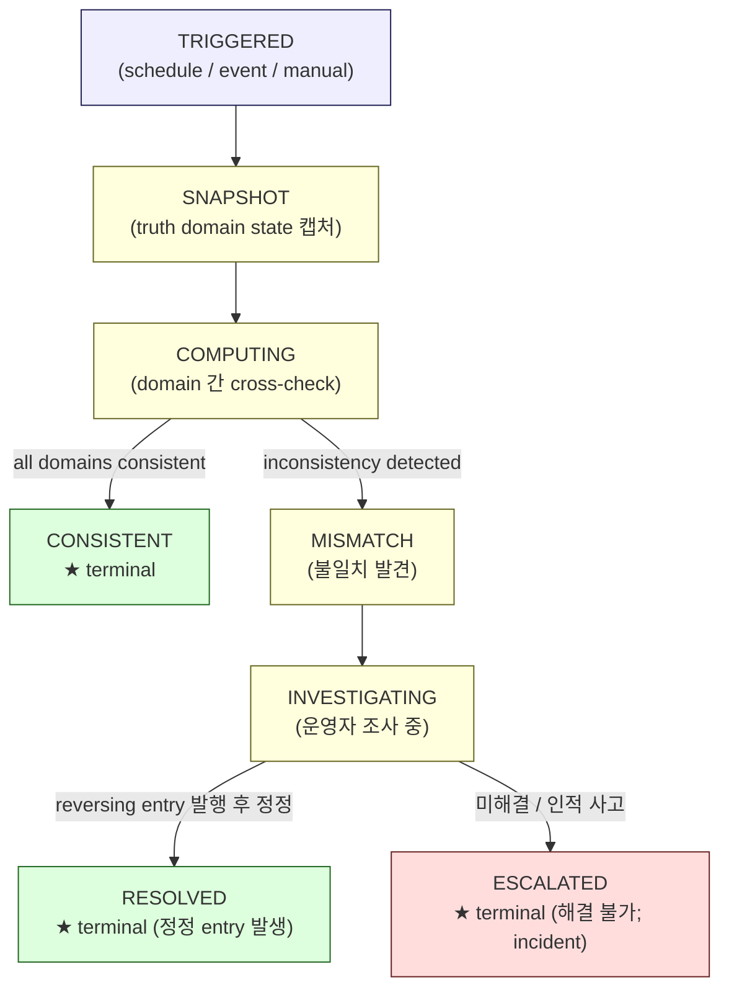
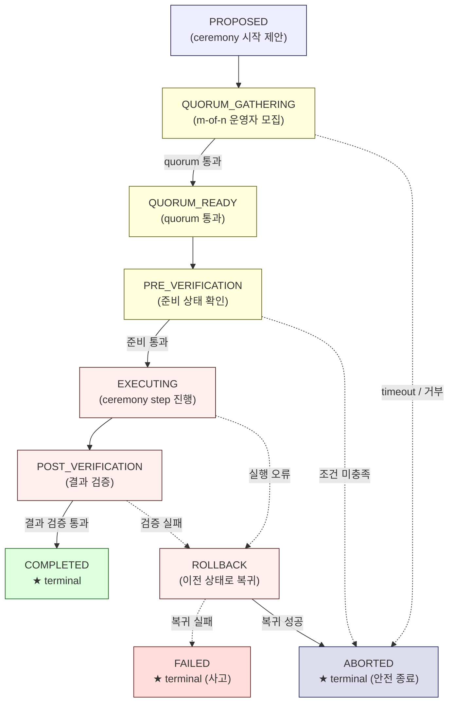
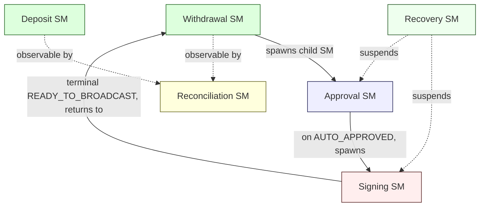

# State Machines
> Direct-build custodial wallet 의 6 개 핵심 state machine

이 문서는 자금 / 결정 / 서명 / 정산 / 복구 의 lifecycle 을 state machine 형태로 정의합니다.

각 machine 마다:
- **정상 흐름** — happy path
- **실패 상태** — 어디서 멈출 수 있는가
- **Cancellation** — 사람이 멈추는 path
- **Retry / replacement** — 재시도 / 대체
- **Timeout** — 시간 만료
- **Manual intervention** — 사람이 들어가는 지점

---

## 1. State machine 개요

각 machine 의 핵심 invariants:

- **Sticky transition** — terminal state (AUTO_APPROVED / DENIED / CONFIRMED 등) 에 도달하면 되돌아갈 수 없음
- **Set-once columns** — signing key, decision rationale 등 핵심 column 은 INSERT 후 변경 불가
- **Idempotency** — 모든 outside trigger 는 (key, nonce) 로 dedup
- **Append-only events** — 모든 transition 은 event log 에 기록
- **fail-closed** — 모든 정의되지 않은 상황은 Deny / Halt 로 처리

---

## 2. Approval state machine

### 2.1 정상 흐름

### 2.2 State 의 invariants

| Invariant | 의미 | 강제 방식 |
|-----------|-----|---------|
| Sticky terminal | AUTO_APPROVED / DENIED / EXPIRED / CANCELLED 에서 되돌아갈 수 없음 | DB trigger |
| Set-once decision | `auth_approver_sig` / `auth_approver_pubkey` 컬럼은 INSERT 후 변경 불가 | DB column constraint |
| Idempotent | `(initiator_pubkey, nonce)` 동일하면 같은 요청 | unique constraint |
| 24h TTL | HELD 가 24 시간 안에 resolve 안 되면 EXPIRED → DENIED | coordinator polling |
| fail-closed | DB / HSM / policy engine 실패 시 → DENIED | service-level error handling |

[Source: D3 + NodeInfra compliance/decision-lifecycle]

### 2.3 실패 / 비정상 상태 처리

| 상황 | State 결과 | 운영 행동 |
|------|----------|---------|
| Policy engine 응답 실패 | EVALUATING → DENIED (fail-closed) | 서비스 alert + 재시도 (새 ApprovalRequest 로) |
| DB 연결 실패 | EVALUATING 멈춤 → DENIED 또는 EVALUATING-stuck (조사 필요) | 서비스 alert + 수동 조사 |
| HSM 응답 실패 (승인 키 co-sign) | EVALUATING → DENIED (fail-closed) | HSM cluster status 확인 |
| 24h TTL 경과 | HELD → EXPIRED (자동) | 운영자에게 알림; 재요청은 새 ApprovalRequest |
| 요청자 cancel | * → CANCELLED | 진행 중 단계 graceful stop |

### 2.4 Manual intervention 지점

- **HELD 상태의 외부 해소** — operator 가 console 에서 "approve" 버튼 없음. 대신 정책 자체를 임시 수정 (예: `approval_tier` 의 한도를 일시적으로 올림) 후 polling 으로 자동 해소. 변경은 `policy_change_log` 에 기록.
- **EXPIRED 후 재요청** — 새 ApprovalRequest 로 시작 (이전 요청은 audit chain 에 보존).

[Source: NodeInfra compliance/rules/approval-tier "Held 의 외부 해소"]

---

## 3. Signing state machine

### 3.1 정상 흐름 (3-key 또는 MPC 변형)

### 3.2 State invariants

| Invariant | 의미 | 강제 방식 |
|-----------|-----|---------|
| Sequential dependency | 이전 단계 서명 없이는 다음 단계 진행 불가 | enclave verifies prior signatures |
| Key isolation | 각 키는 자기 service / partition / enclave 안에서만 접근 | PKCS#11 partition + SGX MRENCLAVE binding |
| Key zeroization | EXECUTOR_SIGNED 직후 실행 키 메모리 제로화 | enclave 내부 강제 |
| MRENCLAVE binding | sealed blob 은 같은 MRENCLAVE 만 unseal 가능 | SGX hardware |
| fail-closed | 어느 단계 실패 → FAILED + alert | service-level error handling |

[Source: D2 + NodeInfra security/architecture/multisig + NodeInfra security/keys/tee-enclave]

### 3.3 Retry / replacement

| 상황 | 처리 |
|------|------|
| 한 단계 transient failure (HSM session timeout 등) | 같은 SigningRequest 안에서 단계만 retry |
| 한 단계 fatal failure (HSM partition unavailable) | SigningRequest → FAILED; 새 SigningRequest 로 재시작 (idempotency 키 유지) |
| Tx replacement (RBF, fee bump) | 새 SigningRequest (다른 nonce) — 전체 ceremony 재실행 |

### 3.4 MPC 변형 (corpus D2 generalization)

★ MPC-based signing 의 경우 state 가 약간 다름:
- INITIATOR_SIGNED → SHARE_1_PRODUCED
- APPROVER_CO_SIGNED → SHARE_2_PRODUCED
- EXECUTOR_SIGNED → AGGREGATED_SIGNATURE_PRODUCED
- partial signature 는 runtime-only — DB 저장 금지

본질적인 invariant (sequential / key isolation / fail-closed) 는 동일.

자세한 D2 generalization 은 corpus 의 `docs/architecture/signing-workflow-orchestration.md` 참고.

---

## 4. Withdrawal lifecycle (full)

### 4.1 End-to-end flow

### 4.2 Ledger entry 의 lifecycle 동반

각 state 에서 ledger 의 변화 (D1a + D1b discipline):

| Withdrawal state | Ledger entry 변화 |
|------------------|-------------------|
| REQUESTED | (없음 — 요청만, 잔액 변화 없음) |
| APPROVAL | (없음) |
| APPROVED | `PENDING_DEBIT` entry (가용 잔액에서 reserve) |
| SIGNING / SIGNED | (변화 없음 — pending 유지) |
| BROADCASTING / BROADCAST | (변화 없음 — pending 유지) |
| CONFIRMING | (변화 없음 — pending 유지) |
| CONFIRMED | `PENDING_DEBIT` → `CONFIRMED_DEBIT` (reversing + new entry) |
| REJECTED / FAILED | `PENDING_DEBIT` reversal entry (잔액 복원) |
| REORGED | `CONFIRMED_DEBIT` reversal (chain reorg 발생) — alert + manual review |

[Source: D1a + D5 (append-only ledger) + D8 withdrawal]

### 4.3 실패 / 비정상 처리

| 상황 | State 결과 | 운영 행동 |
|------|---------|---------|
| Approval DENIED | REJECTED | 자동; 사용자에게 reason 전달 |
| Approval EXPIRED | REJECTED | 자동; 사용자에게 expired 안내 |
| Signing FAILED (HSM unavailable) | FAILED | 운영 alert + HSM 복구 후 재요청 |
| Broadcast failure (RPC down) | BROADCASTING 멈춤 → retry | adapter retry; 일정 시간 후 alert |
| Tx mempool eviction | BROADCAST → 재진입 (RBF or replacement) | adapter 자동 또는 운영자 결정 |
| Chain reorg (이미 confirmed 후) | REORGED | manual review; ledger reversal + 재처리 |
| Counterparty 가 받지 않음 (chain confirmed 후) | CONFIRMED (custodial 책임 종료) | 운영 범위 외 |

### 4.4 Manual intervention 지점

- **운영자 cancel** — REQUESTED / APPROVAL state 에서만 가능 (SIGNING 이후는 cancel 불가)
- **HSM 복구 후 재요청** — FAILED 후 새 Withdrawal 로 재시작 (이전 audit chain 보존)
- **Reorg 후 재처리** — REORGED 시 ledger reversal + chain 재제출 → manual review 필수
- **Stuck transaction** — BROADCAST 후 N 시간 confirmation 없으면 fee bump 또는 replacement (운영자 결정)

---

## 5. Deposit lifecycle

### 5.1 정상 흐름

### 5.2 Deposit ≠ Sign 의 의미

[Source: D7 + NodeInfra security/architecture/multisig §작업별 차이]

Deposit 은 **observation path** 입니다:
- 서명 ceremony **없음** — chain event 가 이미 일어난 상태에서 ledger 에 반영
- 단, **입금된 자금의 후속 이동 (Sweep)** 은 Withdrawal 과 동일한 3-key ceremony

따라서 deposit lifecycle 은 **chain → custody** 의 controlled recognition, not 자금 이동.

### 5.3 State invariants

| Invariant | 의미 | 강제 방식 |
|-----------|-----|---------|
| Finality threshold | N confirmations 미만에서 ledger 반영 금지 | adapter 의 chain config |
| Reorg-safe | reorg 가능 구간에서 PENDING_DEPOSIT 단계 머무름 | block depth check |
| Compliance gate | AML / sanctions / KYC 검사 통과 전 CONFIRMED_DEPOSIT 금지 | service-level |
| Append-only ledger | reversal 은 새 entry; deletion 금지 | D5 invariant |

### 5.4 실패 / 비정상 처리

| 상황 | State 결과 | 운영 행동 |
|------|---------|---------|
| Reorg (N confirmation 미만) | CONFIRMING 머무름 또는 ADDRESS_MATCHED 재시작 | 자동; reorg history audit |
| Reorg (N confirmation 이후) | REORGED → REJECTED | manual review; ledger reversal entry; customer notification |
| Compliance hold | HELD | 운영자 review; release 또는 reject |
| Blacklisted source (AML) | COMPLIANCE_CHECK → REJECTED | 운영자 review; 법적 의무 (보고 / freeze) |
| Adapter (RPC) 장애 | CHAIN_EVENT 누락 가능 | adapter 의 polling / event replay |
| Address unknown (deposit 발생했지만 wallet 매칭 안 됨) | ADDRESS_MATCHED 단계에서 stuck | 운영자 review |

### 5.5 Manual intervention 지점

- **Compliance HOLD 의 release 또는 reject** — 운영자가 외부 의식 (KYC 보충 / 신고 / 등) 거친 후 결정
- **Reorg 후 ledger reversal** — manual review (reorg 의 depth 와 영향 분석)
- **Unknown address 의 매칭** — wallet ID 가 부재하거나 customer 정보 부재 시 운영자 결정

---

## 6. Reconciliation state machine

### 6.1 Session lifecycle

### 6.2 Truth domains (D1b)

reconciliation 은 **여러 truth domain 간 cross-check** :

| Truth domain | 무엇 |
|--------------|-----|
| **Internal ledger** | LedgerEntry 의 합 |
| **Chain state** | adapter 가 관찰한 on-chain balance |
| **Audit chain** | AuditEvent 의 hash chain |
| **Counterparty / reserve** | 외부 attestation, prime broker statement (해당 시) |
| **Vendor (해당 시)** | vendor service 의 상태 (Hosted MPC 사용 시) |

reconciliation = **모든 활성 truth domain 의 cross-domain consistency proof** (D1b invariant).

### 6.3 Trigger 종류

| Trigger | 빈도 | 예 |
|---------|------|-----|
| **Scheduled** | 자주 (60s, 5min, hourly) | 정기 sweep / aggregation |
| **Event-driven** | 자금 이동 직후 | confirmed withdrawal/deposit 후 즉시 |
| **Manual** | 임의 | 사고 조사 / audit 요청 / migration |
| **Continuous** | 실시간 | Layer 1 (foreign-key 등 structural enforcement) |

[Source: D1b + NodeInfra security/ops/audit-logs §정합성 체크 작업]

### 6.4 Mismatch 처리

| Mismatch 종류 | 처리 |
|--------------|------|
| **Ledger > Chain** | internal 에 가짜 credit; 즉시 incident — 운영자 조사 |
| **Chain > Ledger** | chain 에 자금 있는데 ledger 반영 안 됨; deposit miss / orphan address |
| **Audit chain integrity 실패** | TEE checkpoint 또는 hash chain 깨짐; 가장 심각한 사고 |
| **Counterparty mismatch** | external attestation 과 internal ledger 불일치 |
| **Vendor state mismatch** (Hosted MPC) | vendor 의 record 와 internal 불일치 |

각각 다른 incident priority (audit chain integrity 가 가장 critical).

### 6.5 Manual intervention 지점

- **INVESTIGATING state** — 운영자가 mismatch 원인 조사 (RPC 누락? compliance hold? bug? attack?)
- **Reversing entry 발행** — 정정은 새 entry 로 (D5 append-only invariant)
- **ESCALATED state** — incident command 로 escalation (D12)

### 6.6 Reconciliation cadence

★ Hypothesis (institution 별 다름):

| Cadence | Domain |
|---------|--------|
| Continuous (real-time) | Layer 1 structural (foreign-key 등) |
| 60s ~ 5 min | Ledger ↔ Chain (high-frequency) |
| Hourly | Audit hash chain checkpoint |
| Daily | Counterparty / reserve attestation |
| Weekly / Monthly | Vendor state full comparison (해당 시) |

자세한 reconciliation patterns 은 corpus 의 D1b 참고.

---

## 7. Recovery state machine (ceremony lifecycle)

### 7.1 Recovery 의 종류

[Source: D4 + Fireblocks recovery sources]

Recovery 는 **하나의 사건이 아니라 ceremony 의 연속**:

| Recovery 종류 | trigger |
|--------------|--------|
| **Key rotation** | 정기 (예: 분기) 또는 incident 후 |
| **Vault restore** | data corruption / disaster |
| **Operator transition** | quorum 의 한 명 교체 |
| **TEE enclave rotation** | MRENCLAVE 변경 (security update) |
| **Cross-DC failover** | 한 DC 장애 → 다른 DC 활성화 |
| **Disaster recovery** | 전체 cluster 손실 |

각각 다른 ceremony 절차이지만 **state machine pattern 은 공통**.

### 7.2 Ceremony state machine (general)

### 7.3 State invariants

| Invariant | 의미 | 강제 방식 |
|-----------|-----|---------|
| Quorum required | m-of-n 운영자 / m-of-n key 가 명시적 통과 | HSM 또는 application-level |
| Pre-verification mandatory | 실행 전 조건 확인 (HSM 상태 / TEE attestation / etc.) | service-level |
| Append-only ceremony log | 각 step 의 AuditEvent | D5 invariant |
| Rollback-able | 실행 중 오류 시 이전 상태 복귀 가능 | ceremony design |
| External evidence | 운영자 회의록 / 별도 시스템 로그 등 외부 evidence | institution policy |

### 7.4 Manual intervention 지점

Recovery 의 **모든 단계가 manual intervention**:
- PROPOSED 가 시작되는 것 자체 — incident 발견 또는 정기 cadence
- QUORUM_GATHERING — quorum 운영자 모임
- PRE_VERIFICATION — 운영자가 check list 통과
- EXECUTING — ceremony steps (key generation / sealing / restore)
- POST_VERIFICATION — 운영자가 결과 검증
- COMPLETED — incident report / audit submission

Recovery 는 **자동화의 영역이 아닙니다**. AI / system 이 propose 가능하지만, 모든 결정은 사람.

### 7.5 자주 발생하는 실패 모드

| 실패 | 원인 | 대응 |
|------|------|-----|
| Quorum 미달 | 운영자 부재 / 거부 | timeout 후 ABORTED — 비상시 emergency quorum (별도 정책) |
| HSM 의 다른 state | 사전 점검 실패 | ABORTED — 사전 상태 복구 후 재시작 |
| Sealed blob 손상 | hardware failure | FAILED — incident command + 다른 DC 의 sealed blob 으로 시도 |
| Quorum 운영자의 incident | 운영자 incapacitated | emergency quorum policy 또는 ABORTED |
| Ceremony 중 외부 사고 | network / power | ROLLBACK → 환경 안정화 후 재시작 |

[Source: D4 + Fireblocks recovery materials]

---

## 8. State machine 의 cross-machine interaction

핵심:
- **Approval 과 Signing 은 별개 state machine** — 다른 service, 다른 권한
- **Withdrawal 은 Approval + Signing 을 child SM 으로 spawn**
- **Recovery 가 시작되면 Signing 일시 정지** (active SigningRequest 는 ABORTED 또는 hold)
- **Reconciliation 은 다른 SM 의 결과를 observe** (자금 이동 권한 없음)

---

## 9. 한 페이지 mental model

| State machine | trigger | terminal states | manual intervention 지점 |
|---------------|---------|----------------|------------------------|
| Approval | 자금 이동 요청 | AUTO_APPROVED, DENIED, EXPIRED, CANCELLED | HELD 의 외부 해소 (정책 임시 수정) |
| Signing | Approval = AUTO_APPROVED | READY_TO_BROADCAST, FAILED | HSM 복구 후 재요청 |
| Withdrawal | API 요청 | CONFIRMED, REJECTED, FAILED | reorg 후 재처리, fee bump |
| Deposit | chain event | CONFIRMED_DEPOSIT, REJECTED | compliance HOLD release, reorg 처리 |
| Reconciliation | scheduled / event / manual | CONSISTENT, RESOLVED, ESCALATED | mismatch 조사, 정정 entry 발행 |
| Recovery | incident or cadence | COMPLETED, ABORTED, FAILED | 모든 단계 |

---

## 10. 자주 묻는 PM 질문

### Q. 모든 자금 이동에 full lifecycle 이 필요한가?
A. **Withdrawal 은 항상 full** (Approval + Signing + Broadcast + Confirmation). **Internal transfer** 은 chain 없는 ledger 이동 — 2-key 서명 + enclave receipt 패턴 (NodeInfra 의 Transfer flow 참고). **Deposit** 은 서명 없음.

### Q. Held 의 자동 expire 가 24h 가 적정한가?
A. ★ Hypothesis. NodeInfra 는 24h fixed. 24h 가 **business day cycle** 에 맞춰 설계됨. institution 의 SLA 요구사항에 따라 12h / 48h / 72h 도 가능 — 단 일관성 유지.

### Q. Recovery 의 quorum 규모는?
A. ★ Hypothesis. NodeInfra: 개시 키 3-of-5, 승인 키 3-of-5, 실행 키 4-of-7 (자료 example). institution 의 위험 평가 + operational capacity 에 따라.

### Q. Approval 과 Signing 을 같은 service 에 두면 안 되나?
A. **절대 안 됨**. ≠ proposition #1 (Approval ≠ Signing). 같은 service 는 단일 권한 손상 시 정책 우회 + 서명 가능 = 자금 손실.

### Q. Reconciliation mismatch 가 발견되면 어떻게 자동 정정?
A. **자동 정정 금지**. 모든 정정은 INVESTIGATING → manual review → RESOLVED. reversing entry 도 사람이 결정.

---

## 11. 다음 읽을 글

- 어떤 storage 가 어떤 mutability 인가 → [storage-boundaries.md](storage-boundaries.md)
- 누가 누구를 신뢰하는가 → [trust-boundaries.md](trust-boundaries.md)
- vendor 간 recurring patterns → [recurring-patterns.md](recurring-patterns.md)
- PM 결정 기준 → [pm-decision-guide.md](pm-decision-guide.md)
