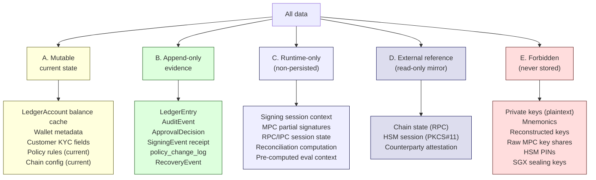
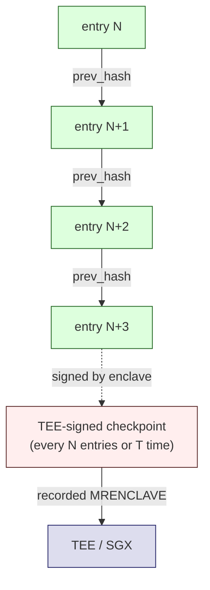
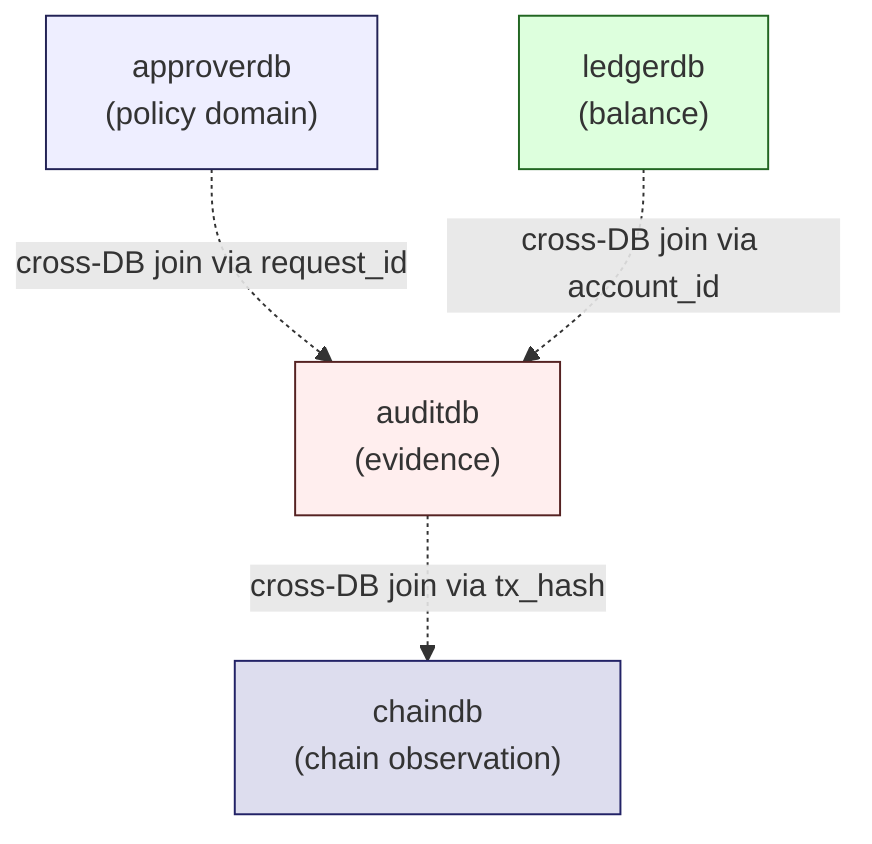

# Storage Boundaries
> 무엇을 어디에 / 어떻게 / 절대 안 저장하는가

이 문서는 Direct-build custodial wallet 의 **storage classification** 을 정의합니다. 모든 data 는 5 개 class 중 하나에 속하며, 각 class 는 다른 mutability profile / 다른 storage backend / 다른 risk 를 갖습니다.

---

## 1. Storage classification 한 페이지

각 class 의 식별 기준:

| Class | 식별 기준 |
|-------|---------|
| A. Mutable | data 가 시간에 따라 변하지만 변경 history 가 별도 (append-only) 에 보존됨 |
| B. Append-only | 한 번 written → 영원 보존; 정정은 reversal entry 로만 |
| C. Runtime-only | 한 request / session 안에서만 의미; 영속화 금지 |
| D. External reference | external system 의 read-only mirror; canonical state 는 외부 |
| E. Forbidden | 어떤 storage 에도 plaintext 로 저장 금지 |

---

## 2. A. Mutable current state

### 2.1 무엇이 들어가나

| Data | 왜 mutable |
|------|----------|
| `LedgerAccount.balance` (cached) | 자주 조회 — entries 의 sum 을 매번 계산하면 부담; 단, **canonical 은 entries** |
| `Wallet.metadata` (name, tags) | 운영자가 갱신; 변경 history 는 audit log |
| `Customer.KYC_status` (active / expired) | KYC 갱신; 변경 history 는 audit log |
| `policy_rules` (current ruleset) | hot-reloadable; 변경 history 는 `policy_change_log` (append-only) |
| `Chain.config` (current finality threshold 등) | chain protocol change 대응; 변경 history 는 audit log |
| `Address.status` (active / archived) | rotation 시 변경; rotation history 는 append-only |
| `ApprovalRequest.state` (during lifecycle) | state machine 진행; 변경 history 는 state transition events |

### 2.2 Storage backend

- 일반 transactional DB (PostgreSQL, MySQL 등).
- **DB trigger 또는 column constraint** 로 audit trail 자동 생성.
- Optimistic locking 으로 race condition 회피.

### 2.3 Mutable 의 invariants

- **항상 audit trail 동반** — mutable data 의 변경은 audit log (append-only) 에 동시 기록.
- **derived value 는 canonical 이 아님** — balance cache 가 canonical 이면 audit 불가. 항상 `entries` 가 canonical, balance 는 derived.
- **변경 권한이 분리** — service 마다 다른 mutable scope (Wallet Service 는 Wallet.metadata, Policy Engine 은 policy_rules).

### 2.4 PM 리스크

- ❌ **Mutable 만 두고 append-only 누락** — 변경 시점 / 변경자 / 변경 이유 추적 불가.
- ❌ **Derived value 를 canonical 로** — 사후 정정 시 inconsistency.
- ❌ **모든 service 가 모든 mutable 에 write 가능** — 권한 escalation.

[Source: D1a + D5 + NodeInfra compliance/architecture (policy_rules + policy_change_log 패턴)]

---

## 3. B. Append-only evidence

### 3.1 무엇이 들어가나

| Data | 왜 strictly append-only |
|------|------------------------|
| `LedgerEntry` | 자금 의 source of truth — 사후 수정 시 audit chain 파괴 |
| `AuditEvent` | evidence chain 의 atomic unit — hash chain 의 consistency |
| `ApprovalDecision` | 결정 자체는 변경 불가 — set-once columns (`auth_approver_sig`, `auth_approver_pubkey`) |
| `SigningEvent receipt` | TEE / HSM 가 발행한 receipt — cryptographic-bound |
| `policy_change_log` | 정책 변경의 audit trail |
| `RecoveryEvent` | ceremony 의 각 step |
| `Confirmation` (chain) | chain 의 immutable state mirror |
| `BroadcastAttempt` | 각 attempt 는 별개 row |
| `velocity_windows` (compliance rule counter) | insert-only counter |
| `address_first_use` (compliance rule timestamp) | insert-only timestamp |
| Chain halt / forking event | chain reference event |

### 3.2 Storage backend

- Append-only table (DB trigger `prevent_mutation()` 또는 동등).
- **Hash chain** 또는 **TEE-signed checkpoint** 로 사후 변조 탐지 가능.
- Cross-DB binding 가능 (예: `signing_events.approver_decision_rationale` = CBOR `PolicyDecision`).

### 3.3 Append-only 의 invariants

- **DELETE 절대 금지** — 모든 정정은 새 reversing entry.
- **UPDATE 금지** — set-once columns 은 INSERT 후 변경 불가.
- **Hash chain** — 각 entry 가 `prev_hash` field 로 이전 entry 와 cryptographic link.
- **Periodic TEE checkpoint** — N entries 또는 T time 마다 enclave-signed checkpoint.
- **MRENCLAVE recorded** — checkpoint 가 어느 enclave image 가 signed 했는지 명시.

### 3.4 2-layer evidence design (NodeInfra recurring)

[Source: D5 + NodeInfra security/ops/audit-logs (2-layer audit)]

**Layer 1 (real-time defense)**: 모든 자금 이동은 enclave-signed receipt + foreign-key constraint 로 ledger entry 가 receipt 없이 존재 불가 ("orphan entry 구조적 불가능").

**Layer 2 (post-tamper detection)**: 주기적 enclave-signed checkpoint 로 hash chain integrity 검증 가능 — auditor 가 임의 시점의 chain head 를 검증.

### 3.5 PM 리스크

- ❌ **append-only 누락** — "잠깐 수정" 이 정상 절차가 되면 audit chain 파괴.
- ❌ **hash chain 없음** — append-only 만으로는 사후 변조 탐지 못함.
- ❌ **TEE 없는 checkpoint** — 단순 hash 만으로는 운영자가 변조 가능.
- ❌ **Layer 1 없이 Layer 2 만** — Layer 2 는 변조 탐지지 사고 방지 아님. real-time 방어 필요.

[Source: D5 + NodeInfra security/ops/audit-logs]

---

## 4. C. Runtime-only

### 4.1 무엇이 들어가나

| Data | 왜 runtime-only |
|------|-----------------|
| **MPC session context** (Hosted MPC 사용 시) | partial signatures, session keys |
| **Signing transaction context** | tx 구성 중간 state |
| **RPC / IPC session state** | chain adapter, enclave IPC |
| **Pre-computed EvaluationContext** | coordinator 의 사전계산 (daily total, balance) |
| **Reconciliation computation context** | session 안에서의 중간 계산 |
| **HSM PKCS#11 session handle** | session-bound; close 시 사라짐 |
| **DCAP attestation quote** | per-session 검증 |
| **Pending tx in mempool** (adapter 의 watch state) | mempool eviction 시 갱신 |

### 4.2 Storage backend

- **메모리만** (RAM).
- 한 service 의 한 process 안에서만.
- 다른 service 와 공유 시 IPC / mTLS / sealed channel.
- 저장 매체 (DB, file, Redis 등) **금지**.

### 4.3 Runtime-only 의 invariants

- **Process termination 시 사라짐** — graceful restart 도 OK (data 의 lifecycle 이 process 의 lifecycle 과 같음).
- **Persistence 금지** — DB, Redis, file 어디에도 저장하지 않음.
- **Replication 시 fresh generation** — 다른 instance 로 복제하지 않고 새로 generate.

### 4.4 PM 리스크

- ❌ **MPC partial signature 를 DB 저장** — MPC 의 security model 파괴.
- ❌ **HSM PKCS#11 session handle 을 cross-process 공유** — session timeout 후 사용 시 undefined behavior.
- ❌ **Reconciliation 의 중간 계산을 cache** — race condition / stale data.
- ❌ **Pre-computed context 를 stale 한 상태로 사용** — ledger commit 과 evaluation 의 race.

[Source: D2 + NodeInfra compliance/architecture (coordinator pre-compute)]

---

## 5. D. External reference (read-only mirror)

### 5.1 무엇이 들어가나

| Data | 왜 external |
|------|------------|
| **Chain state** (block, tx, balance via RPC) | canonical 은 chain — 우리의 mirror 는 advisory |
| **HSM key material** (PKCS#11 호출 가능, but plaintext 노출 안 됨) | canonical 은 HSM |
| **TEE sealed blob** (disk 에 저장되지만 enclave 만 unseal 가능) | canonical 은 enclave |
| **Counterparty attestation** (prime broker statement, custodian attestation 등) | canonical 은 counterparty |
| **Regulatory feeds** (sanctions list, VASP allowlist) | canonical 은 regulator / 공식 vendor |
| **AML / KYT vendor 결과** (Chainalysis, TRM Labs 등) | canonical 은 vendor |

### 5.2 Storage backend

- **Read-only mirror** — 우리 system 에 cache 가능하지만 canonical 은 외부.
- **Refresh cadence** 명시 (RPC: real-time; sanctions list: hourly; etc.).
- **Mirror 의 staleness** 가 가능; cross-check 시 fresh fetch.

### 5.3 External reference 의 invariants

- **우리의 cache 와 canonical 의 차이를 가정** — 항상 fresh fetch 의 option.
- **Reconciliation 의 input** — external reference 도 truth domain.
- **Vendor 의존성 명시** — 어떤 외부 시스템이 의존되는지 architecture diagram 에 표시.

### 5.4 PM 리스크

- ❌ **Cache 를 canonical 로 가정** — 외부 system 의 변경 시 stale answer.
- ❌ **External 의존 없이 운영 시도** — chain RPC 없이 wallet 운영 불가능 (architecture invariant).
- ❌ **Refresh cadence 미명시** — 어떤 data 는 분 단위, 어떤 data 는 일 단위 — 명시 필요.

[Source: D9 multi-chain adapter + D1b reconciliation]

---

## 6. E. Forbidden storage (never stored)

### 6.1 무엇이 절대 저장 금지

| Forbidden | 왜 |
|-----------|---|
| **Private keys (plaintext)** | 모든 키는 HSM 또는 TEE 안에서만 |
| **Mnemonics / seed phrases (plaintext)** | 같은 이유 — recover 가능한 plaintext 형태로 저장 금지 |
| **Reconstructed keys** (m-of-n share 의 reconstruction) | reconstruction 결과는 ceremony 종료 즉시 zeroize |
| **Raw MPC key shares (plaintext)** | encrypted 또는 HSM-held; raw plaintext 절대 X |
| **HSM PINs / activation passwords** | 운영자 brain / hardware token; DB 저장 금지 |
| **SGX sealing keys** | hardware-bound; 외부 추출 금지 |
| **DCAP attestation private keys** | attestation infrastructure 의 root of trust |
| **Customer PII 의 일부** (regulatory 에 따라) | KYC system 의 별도 책임 영역 |
| **API key plaintext** | hash 만 저장 (사용자에게는 1회 노출) |

### 6.2 Forbidden 의 invariants

- **검색하면 안 됨** — code review 에서 "키를 저장하는 코드" 가 발견되면 즉시 reject.
- **로그에도 안 됨** — debug log 에 key 가 찍히는 것도 forbidden.
- **메모리에도 최소 시간** — runtime 사용 후 즉시 zeroize.
- **Memory dump 시도 차단** — SGX EPC encryption, HSM physical protection.

### 6.3 Forbidden 의 storage 가 발생한 경우

[Source: corpus R7 + R10 anti-patterns]

만약 forbidden data 가 실수로 storage 에 들어간 것을 발견:

1. **즉시 quarantine** — 해당 storage 의 access 차단.
2. **Incident command 발동** — 노출된 자금 / 키 영향 평가.
3. **Key rotation** — 노출된 키와 연관된 모든 키 rotate.
4. **Audit report** — incident 의 full disclosure.
5. **Root-cause analysis** — code review 강화, lint 추가.

이는 가장 high-severity incident 입니다.

### 6.4 PM 리스크

- ❌ **"임시로만 DB 에" 라는 정당화** — 임시는 영구가 됩니다.
- ❌ **Backup 에 plaintext key 포함** — backup 도 forbidden storage.
- ❌ **Log 에 key 일부라도 출력** — 충분한 정보 누설.

[Source: D14 security threat model + D4 recovery + NodeInfra security/keys/hsm + security/keys/tee-enclave]

---

## 7. 4-DB split (NodeInfra recurring)

[Source Fact: NodeInfra compliance/architecture + dev/architecture]

NodeInfra 의 실제 instantiation 은 **4 개 DB 분리**:

| DB | 책임 | Mutability profile |
|----|------|-------------------|
| **approverdb** | policy_rules, policy_decisions, held queue, condition_sets, policy_change_log | Mixed: rules mutable / decisions append-only / counters insert-only |
| **auditdb** | signing_events, key_lifecycle, master_key_operations | Append-only |
| **ledgerdb** | LedgerEntry + balance cache | Mixed: entries append-only / cache derived |
| **chaindb** | chain events, deposit observations | Append-only |

### 7.1 4-DB split 의 이유

- **Service 별 storage ownership** — 다른 service 는 다른 DB 에 접근. 권한 escalation 방지.
- **Mutability profile 의 isolation** — append-only 와 mutable 의 mixed 운영 어려움; 분리로 mental model 명확.
- **Cross-DB binding 의 forensic value** — `request_id ↔ tx_hash ↔ chain_evidence_ref` 의 chain 이 cross-DB 변조 탐지.
- **Backup / DR 정책 다름** — append-only audit DB 와 mutable ledger DB 는 다른 backup cadence.

### 7.2 4-DB 가 항상 right answer 인가?

★ Hypothesis (corpus discipline):
- 4-DB 는 **NodeInfra 의 specific instantiation**.
- 다른 institutional vendor 는 **3-DB 또는 5-DB split** 가능.
- **Mutability profile 의 분리** 가 본질; DB 개수는 institutional context 의존.
- 단일 DB 로 모든 mutability 를 운영하면 **operational error 위험** 증가.

자세한 vendor-independent pattern 은 [recurring-patterns.md](recurring-patterns.md) §4-DB split 참고.

---

## 8. Storage classification 의 cross-cutting concerns

### 8.1 Encryption at rest

- Mutable / Append-only: **encryption at rest** 권장 (DB-level 또는 application-level).
- Runtime-only: 메모리 — encryption 의미 없음 (SGX EPC 가 자동).
- External: vendor / external system 의 정책에 따름.
- Forbidden: 저장하지 않음.

### 8.2 Backup

| Class | Backup 정책 |
|-------|------------|
| Mutable | Snapshot + diff; restoration 시 audit chain 과 cross-check |
| Append-only | Daily full + transaction log; **integrity verification** (hash chain replay) |
| Runtime-only | Backup 없음 (process restart 로 재생성) |
| External | Mirror 의 backup 은 필요 없음; vendor 의 SLA 의존 |
| Forbidden | Backup 도 forbidden |

### 8.3 Replication / multi-DC

- Mutable: 일반 DB replication (synchronous or asynchronous).
- Append-only: **strictly synchronous** — 사고 시 split-brain 방지.
- Runtime-only: replicate 안 함 (per-instance regenerate).
- External: vendor 의 multi-DC 정책 의존.
- Forbidden: 해당 없음.

### 8.4 Retention

★ Hypothesis (institution context):

| Class | Retention 권장 |
|-------|---------------|
| Mutable (current state) | 영구 (DB 의 main state) |
| Append-only evidence | **영구 또는 regulatory minimum + safety margin** (예: 7 년 / 30 년 / 영구) |
| Runtime-only | N/A |
| External reference | refresh cadence 의존 |
| Forbidden | N/A |

자세한 retention discipline 은 corpus 의 R6 (Knowledge Decay) 또는 institution 의 regulatory 의무 참고.

---

## 9. 절대 안 되는 5 가지 storage 오류

[Source: D5 + D14 + R10 anti-patterns + NodeInfra security/keys/hsm]

| Anti-pattern | 왜 안 되는가 | 예 |
|--------------|------------|-----|
| 1. Forbidden 의 plaintext storage | 키 노출 = 자금 손실 | private key 를 DB column 에 |
| 2. Append-only 의 silent rewrite | audit chain 파괴 | "잘못된 entry 를 UPDATE" |
| 3. Mutable 의 derived value 를 canonical 로 | source of truth 손실 | balance cache 를 ledger 의 truth 로 |
| 4. Runtime 의 persistence | runtime invariant 손상 | MPC partial signature 를 Redis 에 |
| 5. External 의 cache 를 fresh state 로 가정 | stale data 의존 | RPC cache 를 canonical 로 |

이 5 가지 중 하나라도 발견되면 architecture review 의 immediate stop.

---

## 10. PM 결정 사항 (storage)

[Source: corpus D1a + NodeInfra patterns]

1. **DB 분할 정책** — single DB / mutability-split (NodeInfra 4-DB) / service-split? 권장: mutability-split.
2. **Append-only 강제 방식** — DB trigger / column constraint / application-level? 권장: DB-level (trigger).
3. **Hash chain granularity** — per-account / global / per-resource? 권장: per-account (parallelization).
4. **Checkpoint cadence** — N entries / T time / both? 권장: both with conservative bounds.
5. **TEE 의 사용 여부** — Layer 2 evidence 가 TEE-signed 인가 plain SHA-256 인가? TEE 권장 (운영자 변조 방지).
6. **HSM vendor mix** — Thales Luna / Utimaco / YubiHSM / 다중 vendor? institution policy + 인증 요구사항 의존.
7. **Backup / DR 정책** — append-only 의 sync vs async replication? 권장: synchronous.
8. **Retention** — regulatory minimum + safety margin; 영구 보존 도 선택지.
9. **Encryption at rest 의 key management** — KMS / HSM-managed / institution-managed? institution policy.
10. **External reference 의 refresh cadence** — chain (real-time) / sanctions (hourly) / counterparty (daily)? 각 별도 명시.

자세한 PM decision tree 는 [pm-decision-guide.md](pm-decision-guide.md) 참고.

---

## 11. 다음 읽을 글

- 누가 누구를 신뢰하는가 → [trust-boundaries.md](trust-boundaries.md)
- vendor 간 recurring patterns → [recurring-patterns.md](recurring-patterns.md)
- PM 결정 기준 → [pm-decision-guide.md](pm-decision-guide.md)
