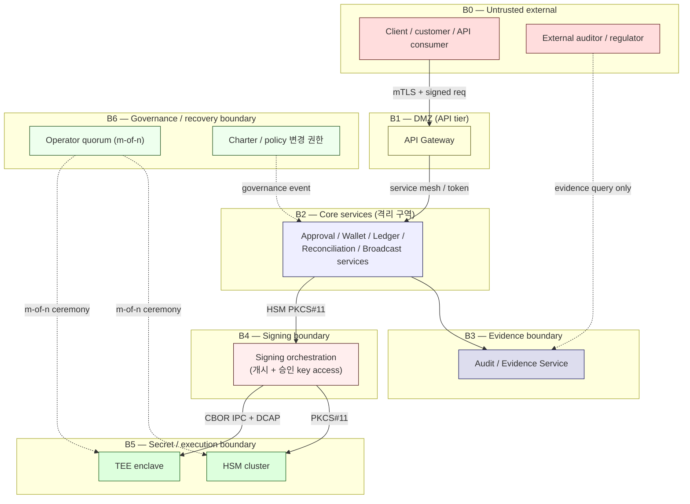
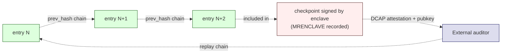

# Trust Boundaries
> 누가 누구를 신뢰하는가, 어디서 신뢰가 끊기는가

이 문서는 Direct-build custodial wallet 의 **trust boundary** 를 정의합니다. trust boundary 는 "이쪽 신뢰가 저쪽으로 자동 carry-over 되지 않는 선" — 각 경계를 넘으려면 **별도의 인증 / 검증** 이 필요합니다.

핵심 invariant: **각 경계는 서로 다른 인증 수단과 검증 로직을 적용하며, 이전 경계의 신뢰를 그대로 이어받지 않는다.**

[Source: D14 + NodeInfra security/architecture/trust-boundaries]

---

## 1. Trust boundary map (한 페이지)

7 개 boundary (B0-B6) + 6 개 functional 분류 (governance / execution / reconciliation / treasury / recovery / evidence).

---

## 2. Boundary B0 — External untrusted

### 2.1 무엇이 이 layer 에 있나

- Customer / institutional client
- External auditor / regulator (read-only 접근)
- 3rd party services (KYT / sanctions vendor 등) — semi-trusted

### 2.2 신뢰 가정

- **None** — 모든 입력은 의심.
- 검증 없이 신뢰 carry-over 금지.

### 2.3 Boundary 통과 방법

- API request 는 **mTLS** 또는 **API key + Ed25519 signed request**
- IP allowlist (institutional 환경)
- Rate limiting
- Request 의 **60s timestamp window** (replay 방지)
- (외부 auditor) **read-only credentials** + **append-only audit log 만 노출**

### 2.4 PM 리스크

- ❌ "내부 customer 라서 less strict 해도 됨" — 같은 검증 적용.
- ❌ Replay window 가 너무 넓음 (5+ 분) — replay 공격 가능.
- ❌ Auditor 에게 write access 부여 — append-only invariant 무너짐.

[Source: D14 + NodeInfra security/architecture/trust-boundaries 의 client → 격리구역 경계]

---

## 3. Boundary B1 — DMZ (API tier)

### 3.1 무엇이 이 layer 에 있나

- API Gateway / Reverse Proxy
- Rate limiting / DDoS defense
- TLS termination
- Request 의 1차 validation

### 3.2 신뢰 가정

- **Untrusted ingress** — 외부 침입 가능.
- 내부 service 와의 통신은 **별도 인증** 필요.

### 3.3 Boundary 통과 방법 (DMZ → Core)

- Service mesh / mTLS (DMZ ↔ Core)
- Service-to-service token (short-lived)
- Network segmentation (VLAN / security group)

### 3.4 PM 리스크

- ❌ DMZ 가 internal service 를 직접 호출 (network 우회) — Core 의 service 가 untrusted 요청 직접 수신.
- ❌ DMZ 의 compromise 가 Core 까지 직접 전파 — 별도 인증 layer 필수.

---

## 4. Boundary B2 — Core services (격리 구역)

### 4.1 무엇이 이 layer 에 있나

- Wallet Service / Ledger Service
- Approval Service / Policy Engine
- Reconciliation Service
- Chain Adapter / Broadcast Service
- Monitoring infrastructure

### 4.2 신뢰 가정

- **Partially trusted** — internal network 이지만 service 간 권한 분리 유지.
- 한 service compromise 가 다른 service 권한 사용 못 함.

### 4.3 Boundary 통과 방법 (service 간)

- Service mesh (mTLS)
- Per-service authentication token
- API contract 기반 access control (RBAC)
- **권한 분리 strictly enforced**:
  - Approval Service 는 Signing 권한 없음
  - Wallet Service 는 정책 변경 권한 없음
  - Ledger Service 는 키 접근 없음

### 4.4 NodeInfra recurring pattern (4-축 격리)

[Source: NodeInfra compliance/architecture §4-축 격리]

1. **서비스 격리** — `승인 키` 는 `개시 키` / `실행 키` 와 분리된 HSM partition
2. **정책 격리** — policy engine 만 정책 read/write
3. **신뢰 격리** — TEE 가 chain signing 의 sole authority
4. **시간·증거 격리** — 결정 → 서명 사이가 cross-DB hash-chained evidence 로 묶임

### 4.5 PM 리스크

- ❌ 단일 service 가 모든 권한 (single point of compromise).
- ❌ Service token 의 long lifetime — compromise 시 broad blast radius.
- ❌ Cross-service mutation 권한 — escalation path.

---

## 5. Boundary B3 — Evidence boundary

### 5.1 무엇이 이 layer 에 있나

- Audit / Evidence Service
- Append-only DB (auditdb)
- Hash chain + TEE-signed checkpoint
- Auditor 의 read-only 접근 endpoint

### 5.2 신뢰 가정

- **Verifiable by external** — 외부 auditor 가 cryptographic 검증 가능해야 함.
- Internal operator 도 변조 못 함.

### 5.3 Boundary 통과 방법

- **Write**: 다른 service 가 audit event 생성 시, **structural enforcement** (foreign-key) + TEE receipt.
- **Read**: read-only credentials; query 결과는 변조 불가.
- **Auditor verification**: DCAP attestation → enclave pubkey → receipt verification → checkpoint chain replay.

### 5.4 Evidence 의 cryptographic chain

[Source: D5 + NodeInfra security/ops/audit-logs §감사관 검증 절차]

### 5.5 Evidence boundary 의 invariants

- **Append-only — DB-level enforced**.
- **Hash chain integrity** — `prev_hash` 가 cryptographically 연결.
- **TEE checkpoint** — 운영자 변조 불가.
- **MRENCLAVE recorded** — 어떤 enclave image 가 sign 했는지 명시.
- **External auditor 만 read-only access**, no write.

### 5.6 PM 리스크

- ❌ Evidence DB 에 운영자 write access — append-only 의 의미 무너짐.
- ❌ TEE 없는 checkpoint (단순 SHA-256 만) — 운영자가 hash 재계산 가능.
- ❌ Layer 2 만 있고 Layer 1 없음 — real-time 사고 방어 못함.

---

## 6. Boundary B4 — Signing boundary

### 6.1 무엇이 이 layer 에 있나

- Signing Service (orchestrator)
- 개시 key / 승인 key 의 HSM access path (PKCS#11)
- 실행 key 의 TEE enclave entry point (CBOR IPC)

### 6.2 신뢰 가정

- **Highly restricted** — 이 layer 의 compromise 가 자금 손실로 직결.
- 각 key 의 access 는 **별도 partition / 별도 enclave**.

### 6.3 Boundary 통과 방법

- **개시 key / 승인 key**: PKCS#11 v2.40/v3.0 session — partition 별 별도 PIN / operator quorum.
- **실행 key**: CBOR over stdin/stdout IPC + **DCAP remote attestation** (MRENCLAVE match).

### 6.4 3-key separation 의 의미

[Source: D2 + NodeInfra security/architecture/multisig + Fireblocks MPC patterns]

- **개시 key 만 compromise** → 승인 key co-sign 없으면 자금 이동 불가.
- **승인 key 만 compromise** → 개시 key 서명 없으면 요청 자체 도달 못 함.
- **실행 key 만 compromise** → 개시 / 승인 서명 없으면 서명 대상 없음.
- **HSM 전체 compromise** → FIPS 140-3 Level 3 물리 방호 (key extraction 불가) + 실행 key 는 SGX-sealed (HSM 무관).
- **SGX host compromise** → sealed blob 은 MRENCLAVE 에 봉인 (다른 image 로 unseal 불가) + EPC memory 는 CPU 내부 encryption.

5 가지 key-theft scenario 모두 **자금 이동을 막는 지점이 존재** — 이것이 trust boundary 의 의미.

### 6.5 MPC variant (corpus D2 generalization)

★ MPC-based signing 에서도 trust boundary 의 본질은 동일:
- 각 share 는 별도 endpoint
- single share compromise 가 signature reconstruction 불가
- threshold 미달 시 fail-closed

다만 cryptographic 메커니즘은 다름:
- HSM: PKCS#11 + physical protection
- MPC: distributed protocol + share-level isolation

본질 (single-point-of-compromise ≠ catastrophic) 은 동일.

### 6.6 PM 리스크

- ❌ 3-key 가 같은 service 안에서 access 가능 — single service compromise = catastrophic.
- ❌ HSM PIN 이 DB / file 에 저장 — physical protection 의미 없음.
- ❌ DCAP attestation 미사용 — 임의 image 로 enclave 호출 가능.
- ❌ Sealed blob 의 backup 이 unseal 가능한 매체 — MRENCLAVE binding 우회.

---

## 7. Boundary B5 — Secret / execution boundary

### 7.1 무엇이 이 layer 에 있나

- HSM cluster (개시 key + 승인 key, 또는 multi-HSM 으로 분리)
- TEE enclave (실행 key, sealed blob)
- 키 material (plaintext 형태 절대 없음)

### 7.2 신뢰 가정

- **Highest trust within system**, but **physically isolated**.
- Service 호출은 가능하지만 키 material extract 불가.

### 7.3 Boundary 통과 방법 (key 가 이 layer 를 떠나지 않음)

- **PKCS#11**: 외부 service 가 sign 요청; HSM 이 결과 (signature) 만 반환. Private key 는 HSM 안에서만.
- **TEE EGETKEY**: enclave 가 sealed blob 을 unseal. unseal 결과는 enclave 안에서만.
- **HSM ↔ TEE provisioning**: master key 가 HSM 안에서 RSA-OAEP 로 enclave 의 one-time pubkey 로 wrap → enclave 가 decrypt → MRENCLAVE 에 sealing. plaintext master key 는 enclave 안에서만.

[Source: NodeInfra security/keys/hsm §키 생성과 래핑]

### 7.4 Physical / cryptographic invariants

| Invariant | 강제 방식 |
|-----------|---------|
| HSM 의 키 extract 불가 | FIPS 140-3 Level 3 hardware |
| Enclave 의 EPC memory 보호 | Intel SGX CPU-internal encryption |
| Sealed blob 의 cross-image unseal 불가 | MRENCLAVE binding |
| Master key 가 HSM/enclave 외부에 plaintext 로 노출 없음 | Provisioning protocol |
| Execution key 가 서명 직후 zeroize | Enclave 내부 강제 |

### 7.5 PM 리스크

- ❌ HSM 의 administrative interface 에 운영자가 직접 접근 — 우회 가능.
- ❌ Enclave 의 sealed blob 의 backup 이 다른 image 로 unseal 가능 — MRENCLAVE binding 우회.
- ❌ Master key provisioning 시 plaintext 노출 — 가장 high-severity 위험.

[Source: D14 + NodeInfra security/keys/hsm + security/keys/tee-enclave]

---

## 8. Boundary B6 — Governance / Recovery

### 8.1 무엇이 이 layer 에 있나

- Operator quorum (m-of-n)
- Charter / policy 변경 권한
- Recovery ceremony 실행 권한
- Stewardship audit trail

### 8.2 신뢰 가정

- **Human accountability** — 자동화의 영역 밖.
- 분산된 사람의 collective 권한 (single owner 없음).

### 8.3 Boundary 통과 방법

- **m-of-n quorum** — 다수의 인간 운영자가 협조해야 진행
- **YubiKey / HSM PED** — physical 인증
- **Ceremony procedure** — 사전 documented protocol
- **External evidence** — 회의록 / 외부 system 의 별도 로그

### 8.4 Quorum design 예시 (★ Hypothesis — NodeInfra observed)

| Operation | Quorum |
|-----------|--------|
| 개시 키 활성화 | 3-of-5 (operator pool 의 60%) |
| 승인 키 활성화 | 3-of-5 (operator pool 의 60%) |
| 실행 키 master ceremony | 4-of-7 (operator pool 의 ~57%) |
| Charter 변경 | charter council 의 supermajority |
| Recovery ceremony | recovery 위원회 합의 |

[Source: NodeInfra security/keys/hsm §운영자 쿼럼]

### 8.5 Manual override 의 absence (governance design)

★ 강력한 trust boundary 의 핵심:

- **Console 에 "approve" 버튼 없음** — operator 가 policy engine 의 결정을 우회 못 함.
- **결정 변경은 정책 자체의 변경** — `policy_change_log` 에 기록.
- **Recovery 의 자동화 없음** — 모든 step 이 human ceremony.

[Source: NodeInfra compliance/decision-lifecycle §수동 승인 없는 이유]

### 8.6 PM 리스크

- ❌ Single operator 가 모든 권한 — bus-factor 1 + capture 위험.
- ❌ Quorum 운영자 list 가 static — 인사 변경 / capture 후 갱신 안 됨.
- ❌ Emergency override 가 표준 절차의 일부 — "이번 한 번만" cascade.

---

## 9. 6 가지 functional trust boundary

위 B0-B6 은 layered (network / process) boundary. functional 측면에서는 6 가지로 분류:

### 9.1 Governance boundary

| 구분 | 내용 |
|------|-----|
| **무엇을 분리** | 정책 결정 권한 vs 시스템 운영 권한 |
| **누가 통과** | Policy steward, Charter council |
| **인증** | m-of-n governance quorum |
| **recurring 비교** | Fireblocks: Admin quorum + Policy Editor / NodeInfra: Compliance Portal admin roles |

### 9.2 Execution boundary

| 구분 | 내용 |
|------|-----|
| **무엇을 분리** | 결정의 evaluator vs 결정의 executor (서명자) |
| **누가 통과** | Signing Service (HSM/TEE access) |
| **인증** | PKCS#11 partition + TEE attestation |
| **recurring 비교** | Fireblocks: MPC node / NodeInfra: 3-key (HSM partition + SGX enclave) |

### 9.3 Reconciliation boundary

| 구분 | 내용 |
|------|-----|
| **무엇을 분리** | 자금 이동 권한 vs 정합성 검증 권한 |
| **누가 통과** | Reconciliation Service (read-only across truth domains) |
| **인증** | service-level token + read-only credentials |
| **recurring 비교** | Fireblocks / NodeInfra 모두 reconciliation = read-only service |

### 9.4 Treasury boundary

| 구분 | 내용 |
|------|-----|
| **무엇을 분리** | Customer 자금 vs institution working capital |
| **누가 통과** | Treasury Service (internal transfer 권한) |
| **인증** | Internal transfer approval workflow |
| **recurring 비교** | Fireblocks: workspace 별 분리 / NodeInfra: tenant 별 분리 (omnibus / gas / user wallets) |

### 9.5 Recovery boundary

| 구분 | 내용 |
|------|-----|
| **무엇을 분리** | Normal operation vs emergency / ceremony operation |
| **누가 통과** | Recovery governance (m-of-n + ceremony protocol) |
| **인증** | Operator quorum + physical ceremony |
| **recurring 비교** | Fireblocks: Recovery Kit + Mobile App quorum / NodeInfra: HSM PED + SGX provisioning ceremony |

### 9.6 Evidence boundary

| 구분 | 내용 |
|------|-----|
| **무엇을 분리** | Read-only audit consumer vs system writer |
| **누가 통과** | External auditor (read-only), Internal services (write via TEE receipt) |
| **인증** | DCAP attestation + signed checkpoint |
| **recurring 비교** | Fireblocks: SOC2 audit trail / NodeInfra: 2-layer audit (TEE receipts + hash chain checkpoint) |

---

## 10. Trust boundary 의 cross-vendor 비교

```mermaid
graph TB
  subgraph FB["Fireblocks (Hosted MPC)"]
    FB_GOV["Admin quorum + Policy Editor"]
    FB_EXEC["MPC nodes (cloud-hosted)"]
    FB_RECON["Account → workspace"]
    FB_TREAS["Workspace separation"]
    FB_REC["Recovery Kit + Mobile quorum"]
    FB_EVID["SOC2 audit trail"]
  end

  subgraph NI["NodeInfra (On-prem)"]
    NI_GOV["Compliance Portal roles<br/>+ policy_change_log"]
    NI_EXEC["3-key: HSM partition + SGX enclave"]
    NI_RECON["Read-only across 4 DBs"]
    NI_TREAS["Per-tenant omnibus / gas / user wallets"]
    NI_REC["HSM PED + SGX provisioning ceremony"]
    NI_EVID["2-layer audit (TEE receipts + hash chain)"]
  end

  subgraph GEN["Generalized corpus"]
    G_GOV["Governance boundary"]
    G_EXEC["Execution boundary"]
    G_RECON["Reconciliation boundary"]
    G_TREAS["Treasury boundary"]
    G_REC["Recovery boundary"]
    G_EVID["Evidence boundary"]
  end

  FB_GOV -.same boundary type.- G_GOV
  NI_GOV -.same boundary type.- G_GOV
  FB_EXEC -.same boundary type.- G_EXEC
  NI_EXEC -.same boundary type.- G_EXEC
  FB_RECON -.same boundary type.- G_RECON
  NI_RECON -.same boundary type.- G_RECON
  FB_TREAS -.same boundary type.- G_TREAS
  NI_TREAS -.same boundary type.- G_TREAS
  FB_REC -.same boundary type.- G_REC
  NI_REC -.same boundary type.- G_REC
  FB_EVID -.same boundary type.- G_EVID
  NI_EVID -.same boundary type.- G_EVID

  classDef fb fill:#ffd,stroke:#662
  classDef ni fill:#dfd,stroke:#262
  classDef gen fill:#eef,stroke:#225
  class FB_GOV,FB_EXEC,FB_RECON,FB_TREAS,FB_REC,FB_EVID fb
  class NI_GOV,NI_EXEC,NI_RECON,NI_TREAS,NI_REC,NI_EVID ni
  class G_GOV,G_EXEC,G_RECON,G_TREAS,G_REC,G_EVID gen
```

**핵심 관찰**: 6 개 functional boundary 는 vendor 와 무관하게 recurring. instantiation (구체적 기술 / vendor / 운영 모델) 만 다름.

자세한 vendor 별 recurring pattern 비교는 [recurring-patterns.md](recurring-patterns.md) 참고.

---

## 11. Trust boundary 위반 시

Trust boundary 위반의 예와 대응:

| 위반 | 의미 | 대응 |
|------|-----|-----|
| **B4 → B5 의 plaintext key extraction** | HSM 내부 키가 application memory 로 leak | Incident command + immediate key rotation + audit |
| **B6 governance bypass** | Policy 우회 (예: console override button 의 사용) | Architecture review + R5 governance update |
| **B3 evidence integrity 손상** | Hash chain 깨짐 또는 TEE checkpoint 불일치 | Highest-severity incident + forensic + external audit |
| **B5 sealed blob 의 cross-image unseal** | MRENCLAVE binding 우회 | Image rotation + investigation |
| **B2 service 권한 escalation** | Wallet Service 가 Signing 권한 보유 | Code review + permission audit |

[Source: D14 + R10 corpus-level failure modes]

---

## 12. PM 결정 사항 (trust boundary)

[Source: corpus D14 + NodeInfra security 전체]

1. **HSM 모델 선택** — Thales Luna / Utimaco / YubiHSM. institution 위험 평가 + 인증 요구사항.
2. **TEE 사용 여부** — SGX / SEV / TPM / no-TEE. SGX 가 vendor-observed default; institution 의 hardware 환경에 따라.
3. **HSM partition vs multi-HSM** — single HSM partitioning 은 비용 효율; multi-HSM 은 강한 격리.
4. **Operator quorum 규모** — 3-of-5 / 4-of-7 / 5-of-9. operational capacity + 위험 평가.
5. **Recovery quorum** — operator quorum 의 superset 또는 별도 group.
6. **External auditor 접근 방식** — read-only API / dump / DCAP-based verification.
7. **Incident kill-switch 권한** — 누가 global_halt 발동 가능한가.
8. **m-of-n 의 rotation cadence** — quarterly / annually.

자세한 PM decision 은 [pm-decision-guide.md](pm-decision-guide.md) 참고.

---

## 13. 다음 읽을 글

- vendor 간 recurring patterns → [recurring-patterns.md](recurring-patterns.md)
- PM 결정 기준 → [pm-decision-guide.md](pm-decision-guide.md)
