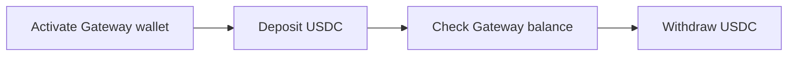

<!--
source_url: https://developers.fireblocks.com/docs/usdc-gateway
downloaded_at: 2026-08-11
status: full
priority: TIER1
domain: Governance
acquisition_method: "curl .md → file save (v3.2.2 Mode C)"
-->

# USDC Gateway

## Overview

New to USDC Gateway? See the [USDC Gateway Overview](https://support.fireblocks.io/hc/en-us/articles/27419996238620-USDC-Gateway-Overview) for a product introduction to the Circle Gateway integration and a console overview, before following this API guide.

USDC Gateway connects your Fireblocks vault accounts to [Circle Gateway](https://developers.circle.com/gateway), a cross-chain liquidity layer for USDC. Each vault account can have one Gateway wallet that holds a unified USDC balance across supported chains. You deposit USDC from a vault asset wallet into Gateway, then withdraw to any supported chain without managing per-chain inventory yourself. Deposits can also be put on a recurring schedule instead of submitted manually — see [Automate deposits](#automate-deposits).

This guide covers the full API flow: activate a Gateway wallet, deposit USDC, check balance, withdraw USDC, and archive the wallet. Deposits and withdrawals use the standard [Create a new transaction](/reference/createtransaction) endpoint with `subType: VIRTUAL_ACCOUNT` on the source or destination.

<Note>
  **Beta feature:** USDC Gateway is currently in beta and available through the Fireblocks API and Console. Behavior, endpoints, and limits may change. To request access, contact your Customer Success Manager, or enable it yourself from [Labs](https://console.fireblocks.io/v2/settings/labs) in the Fireblocks Console (Settings → Labs).
</Note>

## Requirements

See [Prerequisites](https://support.fireblocks.io/hc/en-us/articles/27420202963612-USDC-Gateway-Prerequisites-and-Setup-Guide#h_01KREPP3DYFG5A4QJEZ8CKY836) in the USDC Gateway Setup Guide for full workspace requirements, including policy rules, vault account setup, USDC asset wallets, and native gas balance.

## API flow

The integration follows this order: Activate → Deposit → Check balance → Withdraw.



### Step 1: Activate the Gateway wallet

Activation creates the Gateway wallet bound to the vault account. No funds move.

See [Activate a USDC Gateway wallet](/api-reference/vaults/activate-a-usdc-gateway-wallet).

**Request body**

```json theme={"system"}
{
  "vaultAccountId": "1267"
}
```

**Response**

```json theme={"system"}
{
  "walletId": "9b...",
  "status": "ACTIVATED"
}
```

Re-run the activate endpoint on an archived wallet to reactivate it.

### Step 2: Deposit USDC into Gateway

Submit a deposit using the [Create a new transaction](/reference/createtransaction) endpoint. Set `subType: VIRTUAL_ACCOUNT` on the **destination** to route funds into the Gateway wallet instead of a standard asset wallet.

`POST /v1/transactions`

**Request body**

```json theme={"system"}
{
  "assetId": "USDC_ETH_TEST5",
  "amount": "10",
  "source": {
    "type": "VAULT_ACCOUNT",
    "id": "0"
  },
  "destination": {
    "type": "VAULT_ACCOUNT",
    "id": "0",
    "subType": "VIRTUAL_ACCOUNT"
  }
}
```

**Field notes:**

* `assetId`: the USDC asset ID for the source chain. For the current list of Gateway-supported chains, see the [Gateway supported blockchains](https://support.fireblocks.io/hc/en-us/articles/27420202963612-USDC-Gateway-Prerequisites-and-Setup-Guide#h_01KTM72K9G6VQ9J2DN3SQHMAQW).
* `source.id` and `destination.id`: the same vault account ID that hosts the Gateway wallet.
* `destination.subType`: must be `VIRTUAL_ACCOUNT` for Gateway deposits.

The deposit reaches `COMPLETED` once your workspace's transaction confirmation policy is satisfied — either a policy you've defined, or the Fireblocks default if you haven't set one. Track status via the [Transactions API](/api-reference/transactions/get-a-transaction-by-id) or [transaction webhooks](/reference/monitoring-transaction-status).

<Note>
  Because completion is driven by your confirmation policy rather than by Circle Gateway's own balance-credit confirmation, a deposit can occasionally show as `COMPLETED` slightly before on-chain finality and the Gateway balance update are fully reflected.
</Note>

The first deposit from a vault address on a given chain triggers an automatic `APPROVE` transaction for Gateway smart contract approval. If your workspace Policies do not already cover this, add an `APPROVE` rule (see [Setting up policy rules for USDC Gateway](https://support.fireblocks.io/hc/en-us/articles/28897919442588-Setting-up-policy-rules-for-USDC-Gateway)) before initiating your first deposit on each chain. Once approved, subsequent deposits on the same chain proceed without an additional approval step.

### Step 3: Check Gateway balance

Retrieve your total balance and per-chain breakdown.

See [Get USDC Gateway wallet info](/api-reference/vaults/get-usdc-gateway-wallet-info).

**Response fields**

| Field              | Description                                           |
| ------------------ | ----------------------------------------------------- |
| `status`           | `ACTIVATED` or `DEACTIVATED`                          |
| `symbol`           | Always `USDC`                                         |
| `totalBalance`     | Total USDC balance across all supported chains        |
| `balanceBreakdown` | Per-chain breakdown showing how funds are distributed |
| `assetIds`         | Fireblocks asset IDs covered by this Gateway wallet   |

### Step 4: Withdraw USDC from Gateway

Submit a withdrawal using the [Create a new transaction](/reference/createtransaction) endpoint. Set `subType: VIRTUAL_ACCOUNT` on the **source** to draw from the Gateway wallet instead of a standard asset wallet.

`POST /v1/transactions`

**Request body (one-time address destination)**

```json theme={"system"}
{
  "assetId": "USDC_ETH_TEST5",
  "amount": "10",
  "source": {
    "type": "VAULT_ACCOUNT",
    "id": "0",
    "subType": "VIRTUAL_ACCOUNT"
  },
  "destination": {
    "type": "ONE_TIME_ADDRESS",
    "oneTimeAddress": {
      "address": "0x..."
    }
  }
}
```

**Request body (vault account destination)**

```json theme={"system"}
{
  "assetId": "USDC_ETH_TEST5",
  "amount": "10",
  "source": {
    "type": "VAULT_ACCOUNT",
    "id": "0",
    "subType": "VIRTUAL_ACCOUNT"
  },
  "destination": {
    "type": "VAULT_ACCOUNT",
    "id": "1"
  }
}
```

**Field notes:**

* `assetId`: the USDC asset ID for the destination chain.
* `source.subType`: must be `VIRTUAL_ACCOUNT` for Gateway withdrawals.
* `destination`: another Fireblocks vault account or a one-time address.

Fireblocks selects which chain to draw from based on your current Gateway balance. The transaction reaches `COMPLETED` when destination-chain delivery is confirmed.

### Step 5: Archive the Gateway wallet (optional)

Archiving stops using Gateway on a vault account. It does not move funds. Any USDC already held in Circle Gateway remains and is accessible again by re-activating.

See [Deactivate a USDC Gateway wallet](/api-reference/vaults/deactivate-a-usdc-gateway-wallet).

## Automate deposits

Instead of submitting each deposit manually (Step 2), you can configure a deposit automation that sweeps USDC from a vault account's asset wallets into its Gateway wallet on a recurring schedule, once the balance clears a threshold you set.

### Set up a deposit automation

`POST /vault/accounts/{vaultAccountId}/virtual_asset_wallet/usdc_gateway/deposit_automation`

See [Set up a USDC Gateway deposit automation for a vault account](/api-reference/vaults/set-up-a-usdc-gateway-deposit-automation-for-a-vault-account). Returns an error if an automation already exists for this vault account and asset — use `PATCH` to change an existing one instead.

**Request body**

```json theme={"system"}
{
  "automationType": "USDC_GATEWAY_DEPOSIT",
  "assetId": "USDC_ETH",
  "timeBased": {
    "intervalValue": 60,
    "intervalUnit": "MINUTES",
    "balanceThreshold": "1000"
  }
}
```

**Field notes:**

* `automationType`: must be `USDC_GATEWAY_DEPOSIT`.
* `assetId`: optional. Scopes the automation to a single Fireblocks asset ID; omit to cover all supported USDC Gateway assets.
* `timeBased.intervalValue` / `timeBased.intervalUnit`: how often the automation runs. `intervalUnit` is one of `MINUTES`, `HOURS`, or `DAYS`.
* `timeBased.balanceThreshold`: minimum USDC balance required before a deposit runs. Set to `"0"` to sweep the full available balance every time, with no minimum.

**Response**

```json theme={"system"}
{
  "automationId": "b68a9e08-b59c-4ff9-893f-52d4f78c21e6"
}
```

### Read configured automations

`GET /vault/accounts/{vaultAccountId}/virtual_asset_wallet/usdc_gateway/deposit_automation`

See [Read the USDC Gateway deposit automations for a vault account](/api-reference/vaults/read-the-usdc-gateway-deposit-automations-for-a-vault-account).

**Response**

```json theme={"system"}
{
  "settings": [
    {
      "automationId": "b68a9e08-b59c-4ff9-893f-52d4f78c21e6",
      "vaultAccountId": "42",
      "assetId": "USDC_ETH",
      "automationType": "USDC_GATEWAY_DEPOSIT",
      "timeBased": {
        "intervalValue": 60,
        "intervalUnit": "MINUTES",
        "balanceThreshold": "1000"
      }
    }
  ]
}
```

### Change an automation

`PATCH /vault/accounts/{vaultAccountId}/virtual_asset_wallet/usdc_gateway/deposit_automation/{automationId}`

See [Change a USDC Gateway deposit automation](/api-reference/vaults/change-a-usdc-gateway-deposit-automation). Only the schedule (`timeBased`) can be changed; `automationType` and `assetId` are fixed for the lifetime of the automation.

**Request body**

```json theme={"system"}
{
  "timeBased": {
    "intervalValue": 30,
    "intervalUnit": "MINUTES",
    "balanceThreshold": "500"
  }
}
```

### Stop an automation's schedule

`DELETE /vault/accounts/{vaultAccountId}/virtual_asset_wallet/usdc_gateway/deposit_automation/{automationId}`

See [Stop a USDC Gateway deposit automation's schedule](/api-reference/vaults/stop-a-usdc-gateway-deposit-automations-schedule). This stops the schedule without deleting the automation's configuration — turn it back on later with `PATCH`, without setting it up again from scratch.

## Supported chains

For the current list of chains supported by USDC Gateway, refer to the [Gateway supported blockchains](https://support.fireblocks.io/hc/en-us/articles/27420202963612-USDC-Gateway-Prerequisites-and-Setup-Guide#h_01KTM72K9G6VQ9J2DN3SQHMAQW).

## Limits and fees

For current limits and fees, see [Limits and Fees](https://support.fireblocks.io/hc/en-us/articles/27420202963612-USDC-Gateway-Prerequisites-and-Setup-Guide#h_01KREPP3EFEEVTVZRFRGHQWQSW) in the USDC Gateway Setup Guide.

## Related

* [Create vault wallets](/reference/create-vault-wallet) — create USDC asset wallets before activating Gateway.
* [Set transaction authorization policy](/docs/set-transaction-authorization-policy) — configure `TRANSFER` and `APPROVE` rules.
* [Work with Gas Station](/docs/work-with-gas-station) — automate native gas for deposit transactions.
* [Monitoring transaction statuses](/reference/monitoring-transaction-status) — track deposit and withdrawal progress via webhooks.
