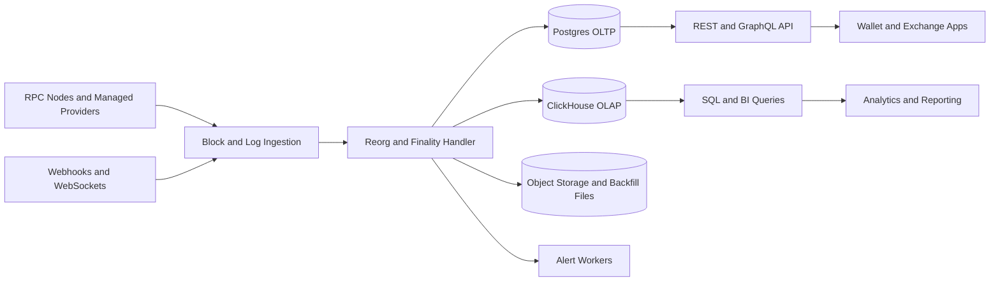
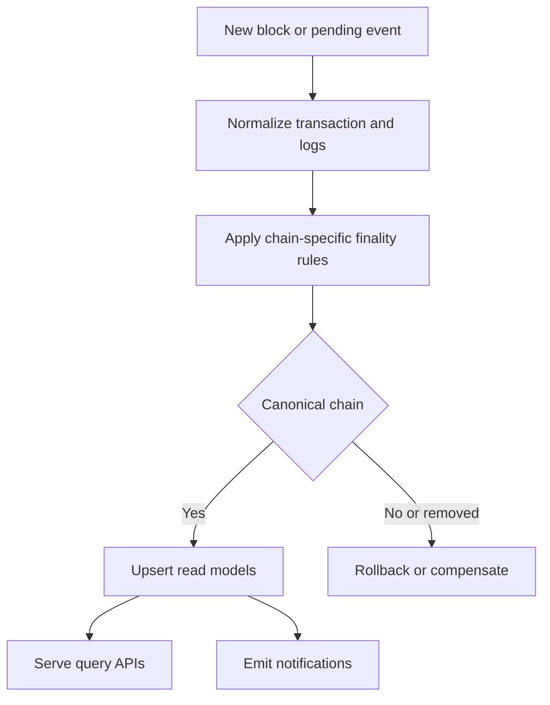
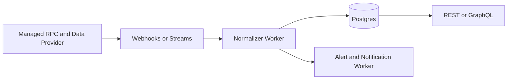
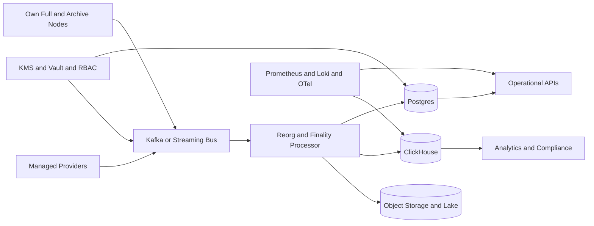

<!--
★ TIER: UNVERIFIED VENDOR ANALYSIS (★ 출처 = LLM 생성 자료, ChatGPT 추정)
ingested_at: 2026-06-01 (Stage 43 promote)
ingested_as: hypothesis tier — B1/B2 보다 한 단계 신뢰도 ↑ (citation tag + 자체 tier 분리)

★ B1/B2 와의 차이:
- ChatGPT citation tag (`citeturn34view0` 등) 본문 포함 — 외부 source 부분 traceable
- Fireblocks 영역에서 "공개적으로 확인됨 / 합리적 추론 / 미확인" 자체 분류
- 일부 fact 는 Stage 41 reference (28 공식 출처) 와 cross-confirm 가능 (예: Geth 2TB/6.5TB)

★ 그래도 unverified tier 유지 이유:
- ChatGPT citation tag 의 실제 외부 source 와의 paragraph-level 매핑은 verify 안 됨
- 비용 수치 (Alchemy/QuickNode pricing) 는 vendor 공식 페이지에서 별도 확인 권장
- Fireblocks 의 인용된 공식 문서명은 정확하지만 paragraph-level 인용은 cross-verify 필요

→ promote 결정: Stage 43 (2026-06-01) — Stage 42 hypothesis 페이지의 §5 로 흡수, Q-VRF 일부 cross-confirm 표시
-->

# 블록체인 인덱서 구현 사례와 Fireblocks 사례 분석

## Executive Summary

블록체인 인덱서는 원시 체인 데이터(블록, 트랜잭션, 로그, 상태 변화)를 애플리케이션이 바로 사용할 수 있는 조회 모델로 변환하는 계층이다. 공개 문서 기준으로 보면 The Graph는 서브그래프를 “블록체인 데이터를 추출·처리·저장해 GraphQL로 쉽게 질의할 수 있게 하는 커스텀 오픈 API”로 정의하고, Alchemy는 자사 Data APIs를 “자체 인덱싱 인프라 없이도 사용하는 사전 변환된(pre-transformed), 프로덕션 준비 데이터”로 설명하며, QuickNode는 Streams를 “블록체인 데이터를 저장소나 인덱싱 시스템으로 가져오고 처리해 전달하는 데이터 파이프라인”으로 설명한다. 이 세 정의를 합치면, 인덱서는 단순한 RPC 프록시가 아니라 **정규화, 상태 추적, 재조직 대응, 질의 최적화, 이벤트 전달**을 담당하는 데이터 접근 계층이라고 보는 것이 정확하다. citeturn34view0turn29view3turn29view0

인덱서가 필요한 가장 직접적인 이유는 원시 RPC만으로는 대규모 서비스가 원하는 질의를 효율적으로 처리하기 어렵기 때문이다. 공식 문서 기준으로 `eth_getLogs`는 이벤트 기준이 아니라 블록 범위 기준으로만 다루기 쉬우며, web3.py 문서는 이벤트 페이지네이션이 어렵고 재조직(minor reorg) 대응을 직접 설계해야 한다고 설명한다. Alchemy도 대형 `eth_getLogs` 요청에 응답 크기·블록 범위 제한을 두고 있고, Infura는 로그 구독 시 재조직 때문에 같은 트랜잭션 로그가 다시 올 수 있다고 문서화한다. 즉, “지갑 입금 내역”, “주소별 전체 거래 이력”, “실시간 알림”, “분석용 대량 집계” 같은 요구는 원시 RPC만으로는 운영 부담이 커지고, 결국 별도의 색인 계층이 필요해진다. citeturn39view0turn29view5turn33view1

Fireblocks의 공개 자료를 보면, Fireblocks는 범용 “인덱서 SaaS”를 전면적으로 판매하기보다는 **거래 상태 API, 트랜잭션 히스토리, 웹훅, EVM 영수증 조회, 확인 수 정책, AML 실시간 모니터링**을 제공하는 디지털 자산 운영 플랫폼에 가깝다. 그러나 이 기능들을 구현하려면 내부적으로는 멀티체인 감시, 트랜잭션 객체 정규화, 확인 수/최종성 처리, 블록 높이 기준 잔액 검증과 같은 **인덱서적 기능**이 반드시 필요하다. 다만 Fireblocks는 공개 문서에서 내부 저장소, 스트리밍 버스, 노드 토폴로지, Kafka/DB 선택 같은 구체적 구현 스택을 밝히지 않으므로, 그 부분은 **미확인**으로 두는 것이 엄밀하다. citeturn30view0turn30view2turn31view2turn31view3turn31view4turn30view5

실무 설계 관점에서 가장 중요한 결론은 다음 세 가지다. 첫째, 인덱서는 “빠른 조회용 DB”가 아니라 **최종성 모델과 재조직 보정 로직을 포함한 데이터 시스템**이어야 한다. 둘째, 작은 팀은 관리형 공급자(Alchemy, QuickNode, The Graph)를 활용해 빠르게 구축하고, 규모가 커질수록 **자체 노드/스트림/Kafka/OLTP·OLAP 분리**로 이동하는 것이 합리적이다. 셋째, 지갑·거래소·컴플라이언스 서비스는 특히 “입금 크레딧 시점”, “블록 높이 일치”, “확인 수 정책”, “웹훅 재시도와 중복 제거”, “감사 추적”이 핵심 요구사항이다. citeturn30view4turn30view3turn31view3turn29view2turn29view0

## 인덱서의 정의와 기능

인덱서는 블록체인 노드가 제공하는 원시 인터페이스를 애플리케이션 친화적 인터페이스로 바꾸는 계층이다. The Graph의 정의처럼 “추출 → 처리 → 저장 → GraphQL 질의”가 전형적인 형태이고, QuickNode의 정의처럼 “블록체인 데이터를 저장소/인덱싱 시스템으로 전달하는 파이프라인”일 수도 있으며, Alchemy처럼 “사전 인덱싱된 Data API” 형태일 수도 있다. 구현 형식은 달라도 기능적 본질은 동일하다. citeturn34view0turn29view0turn29view3

### 핵심 기능 매트릭스

| 기능 | 의미 | 공개 구현 사례 |
|---|---|---|
| 블록·트랜잭션 색인 | `blockNumber`, `blockHash`, `txHash`, 주소, 자산, 상태별로 빠르게 조회 가능하게 구조화하는 기능 | Fireblocks는 트랜잭션 히스토리 API와 상태 API를 제공하고, 트랜잭션 웹훅에 `blockInfo`, `numOfConfirmations` 등을 포함한다. citeturn30view1turn31view1 |
| 이벤트·로그 인덱싱 | 스마트컨트랙트 이벤트를 `address`, `topics`, `logIndex` 단위로 구조화하는 기능 | Infura의 `eth_getLogs`는 `topics`, `address`, `removed` 필드를 반환하고, The Graph는 Subgraph manifest에서 이벤트 핸들러를 선언해 이벤트를 처리한다. Fireblocks의 EVM 영수증 API는 `logs` 배열을 반환한다. citeturn33view0turn34view3turn31view2 |
| 상태 스냅샷·히스토리 | 특정 블록 높이의 잔액·컨트랙트 상태를 재현하거나 즉시 조회하는 기능 | Ethereum 문서는 아카이브 노드가 과거 상태 조회에 필요하다고 설명하고, Geth path-based archive는 reverse diffs와 별도 state index로 과거 상태 질의를 지원한다. citeturn37view0turn37view1 |
| 쿼리 API | REST, GraphQL, SQL 등 읽기 전용·최적화된 인터페이스 제공 | The Graph는 GraphQL API, QuickNode SQL Explorer는 REST로 실행 가능한 SQL, Alchemy는 Transfers/Portfolio/Token/Prices/Webhooks를 제공한다. citeturn34view2turn36view0turn36view1turn29view3 |
| 알림·스트리밍 | 새 블록, 로그, 입금, 상태 변경을 push 방식으로 전달 | Fireblocks는 웹훅으로 상태 갱신을 권장하고, Alchemy는 실시간 웹훅, Infura는 WebSocket `eth_subscribe`, QuickNode는 exactly-once Webhooks·Streams를 제공한다. citeturn30view4turn32view1turn33view1turn29view1turn29view0 |

상태 스냅샷 기능은 종종 과소평가되지만, 실제 운영에서는 매우 중요하다. Ethereum 공식 문서는 풀 노드가 최근 상태만 보관하고 오래된 상태는 재생성해야 하며, 아카이브 노드는 과거 특정 블록의 잔액이나 상태를 즉시 질의할 수 있어 블록 탐색기, 지갑 제공자, 체인 분석 서비스에 유용하다고 설명한다. Geth의 최신 path-based archive는 전체 flat state 히스토리를 약 2TB 수준에서 유지할 수 있고, historical state indexing이 끝난 뒤에야 과거 상태가 노출된다. 이것은 “과거 어떤 시점의 사용자 잔액이 얼마였는가” 같은 질문이 단순 트랜잭션 로그 집계보다 훨씬 무거운 문제임을 보여준다. citeturn37view0turn37view1

이벤트·로그 인덱싱의 핵심은 “단순 수집”이 아니라 “체인 재조직을 견디는 정규화”다. Infura 문서와 Ethereum JSON-RPC 문서는 로그 객체에 `removed=true`가 들어올 수 있고, 재조직 시 같은 높이의 헤더나 같은 트랜잭션 로그가 다시 전달될 수 있다고 명시한다. 따라서 인덱서는 최소한 `(chain_id, block_number, tx_hash, log_index, removed)` 또는 동등한 버전 키 전략을 가져야 한다. citeturn33view0turn33view1turn17search0

## 왜 필요한가

인덱서는 성능 때문에만 필요한 것이 아니다. 실제로는 **성능, 운영 단순화, 멀티체인 정규화, 실시간성, 비용 통제, 컴플라이언스**가 함께 작동하는 이유로 필요하다. Alchemy의 Transfers API는 전체 체인을 스캔하지 않고도 주소의 역사적 트랜잭션을 한 번에 가져오게 해 주며, QuickNode Streams는 블록체인 데이터를 필터링하고 여러 목적지로 보내는 파이프라인을 제공한다. Fireblocks는 웹훅을 동기식 polling보다 효율적이며 reconciliation에 더 적합하다고 권장한다. 이는 인덱서가 단순히 “조회 속도 개선”이 아니라 **운영 구조를 바꾸는 계층**임을 보여준다. citeturn32view0turn38view0turn30view4

원시 RPC만으로 운영할 때 부딪히는 가장 큰 문제는 “원하는 데이터와 체인이 제공하는 데이터 형식이 다르다”는 점이다. web3.py는 대규모 이벤트 수집에서 `eth_getLogs` 한계, 장시간 실행 중단, 재조직 처리, 동적 청크 조절을 모두 직접 구현해야 한다고 설명한다. Alchemy도 대형 `eth_getLogs` 요청에 로그 수/블록 범위 안전장치를 설명하고, Infura는 로그·헤더 구독에서 중복 이벤트 가능성을 문서화한다. 인덱서는 이 복잡성을 애플리케이션 바깥으로 밀어내는 역할을 한다. citeturn39view0turn29view5turn33view1

### 구체적 시나리오

| 시나리오 | 인덱서가 해결하는 문제 | 핵심 포인트 |
|---|---|---|
| 지갑 서비스 | 입금 감지, 확인 수 반영, 잔액 반영, 중복 입금 방지 | Fireblocks는 입금 크레딧 전에 같은 `blockHeight` 기준으로 잔액이 갱신되었는지 확인하라고 권고한다. 웹훅 기반 처리와 잔액 검증이 핵심이다. citeturn31view3turn30view4 |
| 거래소·트레저리 | 출금 상태 추적, 컨펌 정책, AML/KYT, 감사 추적 | Fireblocks는 사용자 정의 확인 수 정책, 상태 API, 트랜잭션 히스토리, AML 실시간 모니터링을 제공한다. citeturn30view3turn30view1turn31view4 |
| 분석 플랫폼 | 수십억 행 규모의 집계·필터·조인 | The Graph는 GraphQL 서브그래프, QuickNode는 수십억 행의 indexed data에 대한 SQL Explorer를 제공한다. citeturn34view0turn36view0turn36view1 |
| 알림 서비스 | 새 블록/이벤트/주소 활동을 지연 없이 push | Alchemy Webhooks, Infura WebSockets, QuickNode Webhooks/Streams는 polling 대신 push 기반 알림을 지원한다. citeturn32view1turn29view4turn29view1turn29view0 |

온체인 데이터 접근성 측면에서도 인덱서는 중요하다. Alchemy의 Data APIs는 “지갑, NFT 플랫폼, 분석 대시보드, DeFi 앱”을 위해 사전 인덱싱된 데이터를 제공한다고 설명하고, The Graph는 애플리케이션이 자체 데이터 서버나 인덱싱 인프라 없이도 쿼리할 수 있게 한다고 설명한다. 즉, 인덱서는 개발팀이 노드 운영보다 **제품 기능에 집중**하게 만드는 계층이다. citeturn29view3turn34view4

비용 절감도 중요한 이유다. 여기에선 두 종류의 비용을 구분해야 한다. 하나는 직접 인프라 비용이고, 다른 하나는 엔지니어링 운영비다. QuickNode Streams 문서는 수동 파이프라인을 없애고 데이터 필터링·목적지 전달을 단순화한다고 설명하고, Fireblocks는 웹훅이 polling보다 효율적이며 reconciliation에 적합하다고 말한다. 운영 인력이 줄어드는 구조가 바로 인덱서의 숨은 ROI다. citeturn38view0turn30view4

## 요구사항과 구현 아키텍처

좋은 인덱서는 “체인을 빨리 읽는 프로그램”이 아니라 **일관성 있는 데이터 플랫폼**이다. 요구사항을 제대로 나누지 않으면, 초기에는 빨라 보여도 재조직·중복·컴플라이언스·백필·장애 복구 단계에서 무너지기 쉽다. citeturn30view6turn39view0

### 요구사항 매트릭스

| 요구사항 | 실무 해석 | 근거 |
|---|---|---|
| 데이터 일관성과 최종성 처리 | EVM 로그의 `removed=true`, `safe/finalized` 블록 태그, 체인별 확인 수 정책을 모델링해야 한다. Solana처럼 commitment 수준이 다른 체인은 별도 파라미터화가 필요하다. citeturn33view0turn17search16turn17search10turn30view3 | 재조직·확인 수는 인덱싱의 일부이지 부가 기능이 아니다. |
| 처리량과 지연 | 실시간 알림 계층은 초 단위, 입금 크레딧 계층은 확인 수 기반 지연을 허용하는 식으로 계층별 SLO를 분리해야 한다. Prometheus는 online-serving 시스템의 핵심 메트릭으로 쿼리 수, 에러, 지연을 제시한다. citeturn40view0turn29view0turn30view4 | “빠름”이 아니라 어떤 경로가 얼마나 빨라야 하는지 정의해야 한다. |
| 저장소 설계 | OLTP는 Postgres 파티셔닝, OLAP는 ClickHouse MergeTree·압축, 메트릭/로그는 Elastic TSDS나 Loki, 저수준 상태 인덱스는 RocksDB/Pebble류가 적합하다. citeturn10search1turn10search2turn10search12turn10search3turn40view3turn10search19turn37view1 | 하나의 DB로 모든 읽기 패턴을 해결하려 하면 곧 병목이 된다. |
| 확장성 | 읽기와 쓰기를 분리하고, The Graph처럼 query nodes와 index nodes를 분리하는 CQRS형 구조가 유리하다. citeturn29view2 | 색인과 조회의 리소스 패턴이 다르다. |
| 장애복구 | Postgres는 WAL 아카이빙 기반 PITR, Kafka는 복제, ClickHouse는 ReplicatedMergeTree 기반 복제를 고려해야 한다. RPO/RTO를 사전에 수치화해야 한다. citeturn13search0turn13search2turn13search16turn13search10turn13search6 | “백업 있음”과 “복구 가능함”은 다르다. |
| 보안 | 비밀값은 KMS/Vault로 보호하고, 최소권한과 RBAC를 적용하며, 저장 시 암호화와 감사 추적을 남겨야 한다. citeturn12search0turn12search1turn12search2turn12search7turn12search9 | 인덱서는 키를 직접 보관하지 않아도 API 키·웹훅 서명키·DB 자격증명을 가진다. |
| 모니터링 | 모든 서브시스템을 계측하고, 에러 타입 표준화(`error.type`)와 로그 집계를 갖춰야 한다. citeturn40view0turn40view1turn40view2turn40view3 | 인덱서 장애는 종종 “조용한 데이터 손실”로 나타난다. |
| 업그레이드와 마이그레이션 | 스키마 버저닝, 백필 재실행, dual-run/dual-write 전략이 필요하다. Alchemy Subgraphs sunset 사례는 인덱싱 계층도 제품 생명주기를 탄다는 점을 보여준다. citeturn32view4 | 마이그레이션 불가능한 인덱서는 장기적으로 위험하다. |

### 구현 아키텍처 패턴

가장 단순한 아키텍처는 **관리형 RPC 또는 관리형 Data API + Postgres**다. Alchemy처럼 사전 인덱싱된 API를 쓰거나, QuickNode Streams로 필터링한 이벤트를 Postgres에 적재하면 MVP를 빠르게 만들 수 있다. 장점은 빠른 구축이고, 단점은 공급자 종속성과 복잡한 분석 질의 확장성이다. citeturn29view3turn38view0

중간 단계의 아키텍처는 **Streams/Webhooks → Kafka 또는 큐 → 정규화 워커 → OLTP/OLAP 분리 저장소 → API 레이어**다. QuickNode Streams는 exactly-once delivery를 finality order 기준으로 제공한다고 문서화하고, Kafka는 이벤트 스트리밍과 exactly-once 처리 지원을 공식 문서에서 강조한다. 이 조합은 이벤트 소싱에 가깝다. 체인 이벤트를 append-only 사실 원장으로 보고, 읽기 모델(Postgres, ClickHouse, GraphQL, REST)을 따로 구축하는 방식이다. citeturn29view0turn10search10

엔터프라이즈형 아키텍처는 **자체 풀 노드/아카이브 노드 + 관리형 공급자 혼합 + Kafka + Postgres + ClickHouse + 오브젝트 스토리지 + 관측/보안 계층**이다. Ethereum 공식 문서는 풀 노드·아카이브 노드·라이트 노드의 역할 차이를 명확히 구분하며, Geth는 path-based archive가 약 2TB의 flat state history를 요구한다고 설명한다. 즉, 과거 상태·트레이싱이 필요한 워크로드는 노드 모드 선택 자체가 아키텍처 결정이다. citeturn37view0turn37view1turn37view2

### 기술 스택 선택 가이드

| 계층 | 적합한 선택지 | 적합한 경우 |
|---|---|---|
| 노드 | 라이트 노드, 풀 노드, 아카이브 노드 | 최신 상태만 필요하면 풀 노드, 과거 상태·트레이싱·감사면 아카이브 노드, 경량 검증 클라이언트면 라이트 노드. citeturn37view0turn37view2 |
| 스트리밍 | Webhooks, WebSockets, Streams, Kafka | 단순 알림이면 Webhooks/WebSockets, 대량 ETL이면 Streams/Kafka가 유리하다. citeturn30view4turn32view1turn33view1turn29view0turn10search10 |
| DB | Postgres, ClickHouse, Elastic, RocksDB/Pebble | 관계형 조회/운영 데이터는 Postgres, 대규모 집계는 ClickHouse, 메트릭·로그는 Elastic/Loki, 내장 상태 인덱스는 RocksDB/Pebble. citeturn10search1turn10search2turn10search12turn10search3turn40view3turn10search19turn37view1 |
| 캐시 | hot-path read cache, indexed cache | 최신성보다 응답성이 우선인 조회엔 캐시가 유용하지만, Alchemy의 `indexed` 블록 태그처럼 캐시는 최신 헤드보다 지연될 수 있다. citeturn32view0 |
| API | REST, GraphQL, SQL | 외부 제품 API는 REST, 엔티티 탐색은 GraphQL, 분석은 SQL이 보통 더 효율적이다. citeturn34view2turn36view1 |

### 아키텍처 다이어그램

### 데이터 흐름 차트

## Fireblocks 공개 사례 분석

Fireblocks의 공개 자료를 종합하면, Fireblocks는 **디지털 자산 보관·정책·운영 자동화 플랫폼**이고, 여기에 강한 모니터링·정규화 계층이 붙은 구조로 보인다. Wallet-as-a-Service 문서는 트랜잭션 상태 API, 웹훅, 트랜잭션 히스토리로 상태를 모니터링할 수 있다고 설명한다. Monitoring Transaction Statuses 문서는 UTXO 기반 자산은 mempool 단계에서 incoming notification이 생성되고, account-based 자산은 mined 시점에 생성된다고 적시하며, 상태 갱신은 웹훅으로 받는 것이 best practice라고 말한다. 이는 Fireblocks가 체인별 모델 차이를 흡수해 내부의 통일된 트랜잭션 객체로 노출하고 있음을 강하게 시사한다. citeturn30view0turn30view2

트랜잭션 객체 수준에서도 인덱서적 성격이 드러난다. Fireblocks의 트랜잭션 웹훅은 `numOfConfirmations`, `blockInfo`, EVM 계열에서의 `index`, `blockchainIndex`, 중간 온체인 트랜잭션을 담는 `networkRecords`를 포함한다. EVM 컨트랙트 상호작용에 대해서는 별도의 transaction receipt API를 제공하며, 여기서 `logs`, `blockNumber`, `status`, `transactionIndex` 등을 반환한다. 이는 단순 custody UI가 아니라 **체인 사건을 애플리케이션 객체로 재구성해 노출하는 데이터 계층**을 이미 갖고 있음을 보여준다. citeturn31view1turn31view2

최종성 처리도 공개적으로 확인된다. Fireblocks는 기본 확인 수 정책, 커스텀 확인 수 정책, 그리고 특정 트랜잭션별 동적 override를 지원한다. 또한 입금 크레딧 전에 같은 `blockHeight` 기준으로 잔액이 실제로 반영되었는지 검증하라고 권고한다. 이는 Fireblocks가 단순히 “트랜잭션이 보였다”는 사실과 “서비스가 사용 가능하다고 간주하는 시점”을 분리하고 있다는 뜻이며, 거래소·결제·지갑 운영에서 매우 중요한 인덱서 요구사항이다. citeturn30view3turn31view3

컴플라이언스 측면에서도 Fireblocks는 실시간 모니터링을 강조한다. AML 기능 문서는 Chainalysis나 Elliptic과 연계해 incoming/outgoing transaction을 실시간으로 스크리닝하고, 정책에 따라 approve/reject/alert를 할 수 있다고 설명한다. 즉 Fireblocks의 데이터 계층은 단순 조회를 넘어 **정책 엔진과 실시간 위험 판정**에 연결된다. 이것은 지갑/거래소 인덱서가 왜 일반 분석용 인덱서와 다른지를 보여주는 좋은 사례다. citeturn31view4

보안 아키텍처는 Fireblocks가 인덱서 “주변” 계층을 어떻게 다루는지 보여준다. 2026년 보안 리포트는 zero-trust 원칙, SGX/Nitro enclave 기반 하드웨어 격리, attestation, 정책 엔진, 승인 quorum, 포괄적 audit trail 및 외부 로깅/분석 플랫폼으로의 실시간 스트리밍을 설명한다. 다시 말해 Fireblocks의 강점은 단순히 체인 데이터를 인덱싱하는 것이 아니라, **인덱싱된 운영 데이터가 승인·정책·감사와 결합되도록 만드는 것**에 있다. citeturn30view5

Fireblocks 블로그도 이를 뒷받침한다. “The Rise of the Blockchain Architect” 글은 블록체인 아키텍처에서 “blockchain data access, indexing, and monitoring”이 별도 설계 축이며, 다중 체인 환경에서 intensive retrieval과 indexing이 점점 복잡해지고, 재조직도 off-chain monitoring과 indexing 서비스가 모델링해야 한다고 말한다. 즉, Fireblocks 스스로도 인덱싱을 단순 부가기능이 아니라 핵심 아키텍처 고민으로 인식하고 있다. citeturn30view6

### Fireblocks에서 공개적으로 확인되는 것과 미확인인 것

| 구분 | 판단 |
|---|---|
| 공개적으로 확인됨 | 트랜잭션 히스토리 API, 상태 API, 웹훅, EVM receipt/log 조회, 확인 수 정책, blockHeight 기반 잔액 검증, AML 실시간 모니터링, 정책 엔진·감사 추적. citeturn30view1turn30view2turn31view2turn31view3turn31view4turn30view5 |
| 합리적 추론 | Fireblocks 내부에는 체인 감시기, 정규화 레이어, 상태 저장소, 확인 수·재조직 처리 로직이 존재할 가능성이 높다. 그렇지 않으면 위 기능들을 안정적으로 제공하기 어렵다. 이 문장은 공개 기능에서 도출한 **추론**이다. citeturn30view0turn30view2turn31view1turn31view3 |
| 미확인 | 내부 노드 구성(자체 풀/아카이브/서드파티 RPC 혼합 여부), Kafka 사용 여부, DB 선택(Postgres/ClickHouse/RocksDB 등), 스트리밍 버스, 특허 귀속과 구현 세부는 본 조사 범위의 공개 자료만으로는 확인되지 않았다. |

### Fireblocks 사례의 핵심 해석

Fireblocks 사례는 “범용 인덱서 회사”의 사례라기보다, **지갑·거래소·결제·컴플라이언스 서비스가 실제로 어떤 인덱서 기능을 필요로 하는가**를 보여준다. 이 회사가 공개적으로 강조하는 것은 GraphQL/SQL 자체가 아니라, **트랜잭션의 운영 상태, 확인 수, 블록 높이 정합성, 실시간 정책 검사, 감사 가능성**이다. 따라서 Fireblocks가 보여주는 인덱서의 본질은 “데이터 접근성”보다 더 넓은 **운영 안전성 계층**이라고 보는 것이 맞다. citeturn30view2turn30view3turn31view3turn30view5

## 기업별 비교

### 공개 자료 기반 비교표

| 회사 | 공개 포지셔닝 | 주요 데이터 접근 방식 | 재조직·최종성 처리 힌트 | 적합한 사용 사례 | 차이점 요약 |
|---|---|---|---|---|---|
| Fireblocks | 디지털 자산 인프라·지갑·트랜잭션 운영 플랫폼 | 상태 API, 트랜잭션 히스토리, 웹훅, EVM receipt/log 조회, AML 모니터링. citeturn30view0turn30view1turn31view2turn31view4 | 확인 수 정책, UTXO mempool vs account-based mined 처리, blockHeight 일치 검증. citeturn30view2turn30view3turn31view3 | 지갑, 거래소, 결제, 트레저리, 컴플라이언스 | “범용 인덱서”보다 운영·보안·정책 중심이다. 내부 스택은 미확인. |
| Alchemy | 사전 인덱싱된 Data APIs 제공 플랫폼 | Transfers API, Portfolio/Token/Prices APIs, Webhooks. Transfers API는 “체인 전체를 스캔하고 인덱싱하지 않아도” 주소 이력을 조회하게 해 준다. citeturn29view3turn32view0 | `indexed` 태그는 캐시 데이터로 최신 블록보다 뒤처질 수 있고, Webhooks는 at-least-once 전달을 보장한다. citeturn32view0turn32view2 | 지갑 포트폴리오, 주소 이력, NFT/토큰 백엔드, 알림 | 빠른 구축에 최적화. 다만 Alchemy Subgraphs는 2025년 12월 8일 sunset되었다. citeturn32view4 |
| Infura | 고가용성 RPC/WebSocket 중심 인프라 | `eth_getLogs`, `eth_subscribe`, 표준 JSON-RPC. private key는 저장하지 않고 signed tx 전송만 지원. citeturn33view0turn33view1turn33view2 | `logs`와 `newHeads` 모두 재조직 가능성을 문서화하며, `removed=true`, 동일 높이 헤더 중복, 중복 로그 발생 가능성을 명시한다. `safe`/`finalized` 태그도 지원한다. citeturn33view0turn33view1 | 표준 RPC 백엔드, 실시간 구독, 자체 인덱서의 upstream | 고수준 “거래 이력 API”보다 표준 RPC에 강하다. |
| The Graph | 탈중앙 인덱싱 프로토콜 | Subgraph, Graph Node, GraphQL API, Postgres store, IPFS metadata. citeturn29view2turn34view0turn34view2 | Graph Node가 네트워크를 모니터링하고, query nodes와 index nodes 분리를 권장한다. 일부 서브그래프는 archive mode와 tracing API가 필요하다. Substreams는 병렬 인덱싱 기술이다. citeturn29view2turn34view1 | 프로토콜 프론트엔드, DeFi/NFT 엔티티 질의, 커스텀 스키마 API | 계약 중심·엔티티 중심 쿼리에 강하다. |
| QuickNode | 스트리밍·웹훅·SQL을 결합한 데이터 플랫폼 | Streams, Webhooks, SQL Explorer, RPC. Streams는 저장소/인덱싱 시스템으로 데이터를 전달하고 exactly-once delivery를 finality order 기준으로 제공한다. SQL Explorer는 indexed data에 SQL을 제공한다. citeturn29view0turn29view1turn36view0turn36view1 | Streams는 exactly-once·자동 재시작·backfill/tip streaming을 지원하고, Webhooks는 exactly-once 전달을 표방한다. citeturn29view0turn29view1turn35view1 | 멀티체인 ETL, 실시간 알림, 대규모 분석, REST/SQL 혼합 | 비교 대상 중 가장 “데이터 파이프라인형 인덱서”에 가깝다. |

비교하면, Alchemy와 QuickNode는 **관리형 인덱싱 제품**에 가깝고, Infura는 **표준 RPC 기반의 upstream 인프라**에 더 가깝다. The Graph는 **스마트컨트랙트 도메인 모델을 GraphQL 엔티티로 노출하는 전용 인덱싱 체계**이고, Fireblocks는 **운영·보안·정책을 위해 인덱서적 기능을 내장한 지갑 인프라**에 가깝다. 따라서 “무엇을 만들 것인가”에 따라 적합한 선택이 달라진다. 지갑/거래소 백오피스면 Fireblocks형 요구사항이 중요하고, 프로토콜 프론트엔드면 The Graph형이, ETL과 데이터 웨어하우스면 QuickNode형이 더 자연스럽다. citeturn30view0turn34view0turn29view0turn33view2turn29view3

## 설계 권장안과 구현 체크리스트

### 소규모 스타트업용 권장 아키텍처

초기 스타트업에는 **자체 아카이브 노드 운영보다 관리형 공급자 + 작은 운영 DB**가 유리하다. 가장 현실적인 조합은 다음과 같다. upstream은 Alchemy나 QuickNode 같은 관리형 서비스로 두고, 실시간은 Webhooks 또는 Streams로 받아서, Postgres에 핵심 읽기 모델만 저장한다. 과거 전체 상태가 아니라 “주소별 입출금”, “사용자별 포트폴리오”, “특정 컨트랙트 이벤트” 중심으로 문제를 축소하는 전략이 좋다. The Graph가 제공하는 서브그래프나 Alchemy Transfers API를 활용하면 백필과 조회 로직을 크게 줄일 수 있다. citeturn29view3turn32view0turn38view0turn34view5

이 구조의 장점은 구축 속도와 낮은 초기 운영비다. Alchemy 무료 플랜은 월 30M CU와 5개 웹훅을 제공하고, QuickNode Build 플랜은 월 42~49달러 수준에서 80M API credits와 Streams/Webhooks를 제공한다. AWS EC2 온디맨드 t3.large는 시간당 0.0832달러, gp3 볼륨은 GB-월당 0.08달러이므로, 소형 워커·DB를 자가호스팅해도 기본 인프라 비용은 낮게 출발할 수 있다. 다만 백필 규모와 공급자 사용량이 늘면 비용 구조가 빠르게 변한다. citeturn32view3turn35view0turn14search4turn14search3

이 보고서의 추정으로는, 스타트업형 구성은 **월 100~800달러** 수준에서 시작하는 경우가 많다. 예를 들어 QuickNode Build 42~49달러, 소형 EC2 두세 대, 수백 GB 수준 gp3 저장소, 기본 관측 도구를 더하면 수백 달러대가 된다. 반대로 Alchemy 무료/저사용량 + 소형 EC2 1~2대 + 적은 저장소로는 100달러대 초반도 가능하다. 여기에는 대규모 백필, 고급 BI, 멀티리전, 프리미엄 지원, 데이터 이그레스 비용은 포함하지 않았다. 이런 범위는 공개 단가를 기초로 한 **운영 추정치**다. citeturn32view3turn35view0turn14search4turn14search3

### 엔터프라이즈용 권장 아키텍처

엔터프라이즈에는 **멀티공급자 + 자체 노드 일부 보유 + Kafka형 버스 + OLTP/OLAP 분리 + 엄격한 보안/감사**를 권장한다. 특히 거래소, 결제, 기관용 트레저리처럼 운영 리스크가 큰 서비스는 raw RPC 의존도를 낮추고, 이벤트 소싱과 CQRS를 명시적으로 채택하는 편이 좋다. 읽기 경로와 쓰기 경로를 분리하고, query nodes와 index nodes를 분리하라는 The Graph의 권고는 일반 엔터프라이즈 인덱서에도 그대로 적용된다. citeturn29view2turn30view5

이 구조의 장점은 가용성, 데이터 통제력, 규정 준수 대응력이다. 단점은 비용과 운영 복잡성이다. Geth path-based archive는 flat state history만으로도 약 2TB, trie data까지 보관하면 약 6.5TB를 요구할 수 있다. QuickNode Business 플랜은 월 849~999달러 수준에서 2B API credits와 500 RPS를 제시하고, AWS MSK 공식 요금 예시는 3개 broker와 1,000GB ingest/storage 조합에서 총 1,020.66달러 예시를 보여준다. 여기에 2TB gp3만 더해도 약 160달러가 추가된다. 따라서 엔터프라이즈급 상용 구성은 **월 3,000~20,000달러 이상**이 매우 현실적이며, 멀티리전·감사보관·추가 분석 웨어하우스까지 들어가면 그 이상도 흔하다. citeturn37view1turn35view0turn14search2turn14search3

### 성능·비용 비교 차트

| 패턴 | 구축 속도 | 유연성 | 운영 난이도 | 월 비용 경향 |
|---|---:|---:|---:|---:|
| 사전 인덱싱 API 활용형 | █████ | ██ | ██ | $~$$ |
| Streams + Postgres 하이브리드형 | ████ | ████ | ███ | $$~$$$ |
| 자체 노드 + Kafka + OLTP/OLAP형 | ██ | █████ | █████ | $$$~$$$$$ |

이 차트는 공급자 문서와 인프라 단가를 바탕으로 한 정성 비교다. 사전 인덱싱 API는 Alchemy·The Graph처럼 초기 속도가 빠르고, Streams + Postgres는 QuickNode형 ETL에 적합하며, 자체 노드 + 버스 + 다중 저장소는 Ethereum 노드·Kafka·ClickHouse·Postgres를 직접 다루는 대가로 유연성과 통제력을 얻는다. citeturn29view3turn34view5turn29view0turn37view0turn13search2turn10search1turn10search2

### 구현 체크리스트

실제 구현 전에는 다음 항목이 선행되어야 한다.

- 체인별 최종성 매트릭스를 만든다. EVM은 `safe/finalized`와 `removed` 로그, Solana는 commitment 수준을 명시한다. citeturn33view0turn17search16turn17search10
- idempotent 키를 정한다. 최소한 `chain_id + tx_hash + log_index + block_hash` 또는 동등한 키가 필요하다. 재조직 보정을 위한 tombstone 또는 version row 전략도 정한다. citeturn33view0turn33view1
- 저장소를 분리한다. 운영 조회는 Postgres, 집계/BI는 ClickHouse, 로그/메트릭은 Loki/Prometheus 또는 Elastic 계층을 둔다. citeturn10search1turn10search2turn10search3turn40view0turn40view3
- 비밀값과 권한을 정의한다. KMS/Vault, 최소권한, RBAC, 감사 로그를 기본으로 둔다. citeturn12search0turn12search1turn12search2turn12search7
- 장애복구 목표를 숫자로 쓴다. RPO와 RTO를 정의하고, Postgres PITR와 메시지 버스 복구 절차를 테스트한다. citeturn13search0turn13search10turn13search6
- 스키마 버저닝과 백필 전략을 만든다. 새 스키마 배포 시 dual-write 또는 재처리 경로가 필요하다. citeturn32view4

### 테스트 시나리오

테스트는 단순 unit test가 아니라 **데이터 정합성, 장애복구, 성능 검증** 중심이어야 한다.

| 테스트 종류 | 시나리오 | 합격 기준 |
|---|---|---|
| 데이터 정합성 테스트 | 임의의 블록 구간을 선택해 raw RPC 결과와 인덱스 DB를 비교한다. EVM 이벤트는 `removed` 처리까지 포함한다. 지갑 서비스라면 입금 크레딧 전 잔액이 같은 blockHeight인지 확인한다. citeturn33view0turn31view3 | 샘플 구간 불일치율 0, 중복/누락 0 |
| 재조직 테스트 | 테스트넷 또는 포크 환경에서 재조직/removed log를 주입하고 보상 로직이 정상 동작하는지 본다. web3.py 예제처럼 최근 구간 재스캔 전략을 검증한다. citeturn39view0turn33view1 | 보상 후 최종 read model이 canonical chain과 일치 |
| 장애복구 테스트 | Postgres PITR 복구, Kafka offset 복원, ClickHouse replica 장애 전환을 연습한다. citeturn13search0turn13search5turn13search16 | 정의한 RPO/RTO 목표 충족 |
| 성능 벤치마크 | sustained ingest, backfill catch-up, query P95 latency, webhook retry storm를 측정한다. Prometheus 기준으로 query count, errors, latency를 본다. citeturn40view0turn29view0turn29view1 | 목표 TPS·lag·P95 달성 |
| 보안 테스트 | 권한 오남용, 비밀값 유출, 서명 검증, 웹훅 서명 검증 실패 케이스를 점검한다. Fireblocks형 서비스는 정책 drift와 승인 quorum도 점검해야 한다. citeturn12search1turn12search2turn30view5 | 최소권한·감사·차단 정책이 기대대로 작동 |

## 한계와 우선 참조 출처

이 보고서에서 가장 중요한 한계는 Fireblocks 내부 구현 세부가 공개되어 있지 않다는 점이다. Fireblocks는 기능·보안·운영 모범사례를 충분히 공개하지만, 내부 인덱서 스택의 노드 클라이언트, 스트리밍 버스, 저장소, 파티셔닝, 백필 메커니즘까지는 밝히지 않는다. 따라서 Fireblocks 부분에서 “확인된 사실”과 “기능에서 유추한 구조”를 구분했고, 내부 스택에 대한 단정은 피했다. 또한 Fireblocks 관련 특허성 자료는 후보가 검색되었지만, 본 조사 범위에서는 귀속과 구현 연관성을 엄밀히 검증하지 못해 **미확인**으로 남겼다. citeturn30view0turn30view2turn30view5

### 우선 참조할 공식 출처

가장 먼저 볼 자료는 Fireblocks 공식 자료다. 특히 Developer Docs 소개, Wallet-as-a-Service, Monitoring Transaction Statuses, Best practices for webhooks, Get transaction history, Get transaction receipt, Validate balances, AML overview, 2026 Security report, 그리고 “The Rise of the Blockchain Architect” 블로그가 핵심이다. citeturn22search11turn30view0turn30view2turn30view4turn30view1turn31view2turn31view3turn31view4turn30view5turn30view6

그 다음은 경쟁사 공식 문서다. Alchemy는 Data APIs overview, Transfers API, Webhooks overview, Pricing, Subgraphs deprecation notice가 중요하다. Infura는 `eth_getLogs`, `eth_subscribe`, WebSockets 개념 문서가 중요하다. The Graph는 Subgraphs, GraphQL API, Graph Node/Indexing Overview, Substreams introduction이 핵심이다. QuickNode는 Streams docs, Streams billing, Webhooks, SQL Explorer, “Build a Blockchain Indexer with Streams” 가이드가 가장 직접적이다. citeturn29view3turn32view0turn32view1turn32view3turn32view4turn33view0turn33view1turn29view4turn34view0turn34view2turn29view2turn34view1turn29view0turn35view1turn29view1turn36view0turn38view0

마지막으로 기반 기술 문서는 설계의 엄밀성을 높여 준다. Ethereum의 node types와 Geth archive mode 문서는 full/light/archive 선택에 필수이고, PostgreSQL 파티셔닝·PITR, ClickHouse 파티션·압축·복제, Elastic TSDS, RocksDB, Kafka, Prometheus, OpenTelemetry, AWS KMS/IAM/Vault 문서는 저장소·관측·보안 설계를 구체화하는 데 직접 쓸 수 있다. citeturn37view0turn37view1turn10search1turn13search0turn10search2turn10search12turn13search16turn10search3turn10search19turn10search10turn40view0turn40view1turn40view2turn12search0turn12search1turn12search2turn12search7

### 최종 결론

정리하면, 블록체인 인덱서는 “노드가 부족해서 붙이는 캐시”가 아니라 **블록체인 데이터를 제품 데이터로 바꾸는 운영 핵심 계층**이다. Fireblocks 사례는 그 계층이 단순 조회를 넘어 확인 수, 블록 높이 정합성, 정책 승인, AML, 감사 추적과 결합되어야 함을 보여준다. Alchemy, QuickNode, The Graph, Infura는 각각 이 문제를 다른 방식으로 푼다. 따라서 귀사의 목표가 지갑·거래소·결제 운영이면 Fireblocks형 요구사항을, 프로토콜 프론트엔드면 The Graph형을, 데이터 ETL과 분석이면 QuickNode형을, 자체 통제형 백엔드면 Infura/자체 노드형을 우선 검토하는 것이 가장 합리적이다. citeturn30view0turn30view2turn29view3turn29view0turn34view0turn33view2