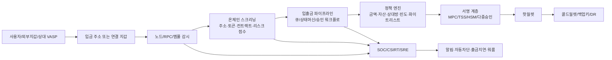
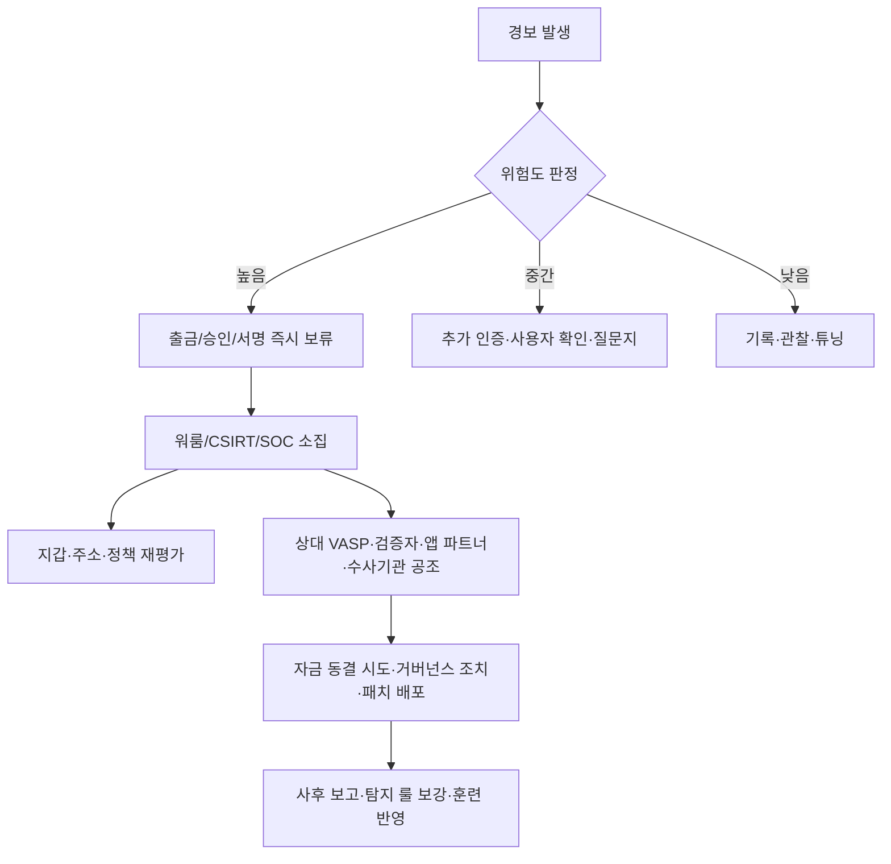

# 블록체인 안정성 및 모니터링 실무 보고서

## Executive Summary

공개 자료를 종합하면, 주요 거래소·지갑 서비스 제공업체의 안정성 운영은 단일 솔루션이 아니라 **온체인 스크리닝과 리스크 태깅**, **출금주소 화이트리스트와 출금 지연**, **트랜잭션 승인 정책과 다중서명·MPC/TSS**, **노드·RPC·입출금 파이프라인 관제**, **실시간 알림과 자동 차단**, **전담 CSIRT/SOC/SRE 조직과 훈련**이 겹겹이 결합된 형태로 진화해 왔습니다. 특히 2019년 업비트 해킹, 2021년 Coinbase 장애, 2022년 BNB Chain 브리지 사고, 2023년 Ledger Connect Kit 사고, 2023~2024년 MetaMask 보안 알림 기본화, 2024년 빗썸 AML 고도화는 “체인 위 위험 탐지”와 “체인 밖 승인·정지·복구 통제”를 동시에 갖추지 않으면 손실 확산을 막기 어렵다는 점을 보여줍니다. citeturn36search1turn36news21turn18view3turn30view2turn24view0turn38view4turn38view0

한국 사례를 먼저 보면, 업비트와 빗썸은 모두 **24시간/72시간 출금 지연제**, **개인지갑·상대 VASP 등록/확인**, **이상거래탐지시스템(FDS) 기반 출금 심사**, **트래블룰 기반 자동·수동 반영**, **미신고 VASP 및 출처 불명 지갑 제한**을 운영하고 있습니다. 2024년 이후에는 금융위원회 감독규정에 따라 **이용자 가상자산 가치의 80% 이상을 콜드월렛으로 상시 유지**해야 하고, 빗썸은 공개적으로 **90% 이상 콜드월렛 보관**, **분기 실사**, **법정 기준을 상회하는 준비금 적립**, **자체 AML 시스템 운영**을 공지했습니다. citeturn35view1turn35view2turn35view4turn35view5turn38view0turn38view1turn38view2turn38view3turn11search0turn11search5

해외 주요 사업자도 비슷한 방향으로 수렴했습니다. Coinbase는 노드 운영에서 GitHub 릴리즈 감시 자동화, 멀티리전 배치, 롤백 우선 설계, staking 노드 업그레이드 자동화와 alerting을 공개했고, 보안 운영에서는 CSIRT가 **Slack 기반 SecurityBot**, 자동 응답 워크플로, 문맥 테이블 기반 false-positive 억제를 도입했습니다. Binance는 **risk control team**과 **전문화된 compliance 부서**를 두고 Chainalysis·TRM·Elliptic과 협업하여 거래 모니터링을 수행한다고 밝혔고, Kraken은 실시간 의심행위 모니터링, GSL(Global Settings Lock), 출금 주소 추가 제한을 전면 보안 기능으로 내세웁니다. BitGo와 Fireblocks는 각각 **정책 엔진·속도 제한·주소 화이트리스트·불변 로그**, **MPC/SGX 기반 정책 집행·AML/KYT 연동·webhook 중심 상태 관제·DR 키트**를 공개합니다. MetaMask는 2024년에 Blockaid 기반 보안 알림을 기본값으로 전환했고, Ledger는 2023년 Connect Kit 사고 뒤 40분 내 수정 배포와 업계 공조·자금 동결 지원을 기록했습니다. citeturn16view2turn16view5turn18view1turn18view2turn19view1turn30view0turn30view1turn29view0turn29view1turn29view2turn28view0turn28view1turn31view1turn31view2turn31view3turn31view4turn31view5turn38view4turn38view5turn24view0turn24view3

다만 공개 문서에는 **HSM 내부 health-check 지표**, **서명 서비스의 CPU/latency 임계값**, **SOC/SRE 온콜 인원·시프트 편성**, **정확한 FDS 룰·스코어링 가중치**, **블랙리스트 룰셋**이 거의 드러나지 않습니다. 따라서 이 보고서는 공개적으로 확인된 사실과, 그 사실들로부터 실무적으로 도출되는 권고를 엄격히 구분해 제시합니다. 공개 확인이 안 되는 항목은 모두 **미확인**으로 표시했습니다. citeturn15view4turn28view1turn31view5turn38view0turn35view1

## 조사 범위와 공통 아키텍처

이 보고서는 **2019년 1월부터 2024년 12월까지의 인시던트·개선 사례**를 중심으로, 거래소와 지갑 서비스 제공업체가 실제로 공개한 운영·보안·규제 대응 조치를 조사했습니다. 우선순위는 **공식 블로그, 고객센터 문서, 규제기관 발표, 사고 보고서**에 두었고, 한국 사례는 금융위원회와 업비트·빗썸 공지/가이드를 우선 반영했습니다. 해외 사례는 Coinbase, Binance, Kraken, BitGo, Fireblocks, MetaMask, Ledger의 공식 문서를 사용했습니다. citeturn11search0turn11search2turn11search5turn35view1turn35view2turn38view0turn29view0turn30view0turn15view0turn28view0turn31view0turn38view4turn24view0

아래 도식은 공개 사례를 합쳐 단순화한 **거래소·지갑 서비스의 공통 통제 아키텍처**입니다. 실제 배치와 벤더 조합은 업체마다 다르지만, Binance의 거래 모니터링 및 출금 보류, Coinbase의 노드·큐·CSIRT 체계, Fireblocks의 정책 엔진·AML 스크리닝·webhook, BitGo의 HSM·정책 엔진, 업비트·빗썸의 FDS·화이트리스트·트래블룰 검증을 한 장으로 묶은 모델로 이해하면 됩니다. citeturn30view0turn30view1turn30view3turn15view0turn18view1turn31view1turn31view2turn31view5turn28view0turn35view4turn35view5turn38view1turn38view3

공개 사례의 핵심은 **체인 이벤트만 봐서는 충분하지 않다**는 점입니다. 체인 위에서는 주소, 토큰, 스마트컨트랙트, 리스크 점수, whitelist/blacklist를 보고, 체인 밖에서는 승인 큐, 서명 단계, 입금 검증, 노드 동기화, API/RPC 성능, 휴지기와 롤백 가능성을 관찰해야 실제 손실을 줄일 수 있습니다. Coinbase는 노드 소프트웨어 릴리즈와 sync 문제를 직접 사업 리스크로 봤고, Fireblocks는 AML screening과 webhook 상태관제를 결합했으며, 한국 거래소들은 FDS·트래블룰·출금지연을 결합했습니다. citeturn16view2turn16view5turn31view1turn31view2turn31view3turn35view1turn35view4turn35view5turn38view1turn38view2

## 사례 타임라인

아래 표는 2019~2024년 사이 공개적으로 확인 가능한 대표 사례를 **사건/개선 시점, 구현 세부, 효과, 한계** 기준으로 요약한 것입니다. 효과는 공식 문서가 직접 언급한 수준까지만 적었고, 정량적 검증이 없는 경우 “목표·의도”로 표현했습니다. citeturn36search1turn18view3turn30view2turn16view5turn24view0turn38view4turn38view0turn18view0

| 시점 | 사업자 | 공개된 트리거 | 실제 조치 | 효과 | 한계 | 출처 |
|---|---|---|---|---|---|---|
| 2019-11-27 | 업비트 | ETH 342,000이 핫월렛에서 미확인 지갑으로 전송됨 | 즉시 대응 시작, 핫월렛 자산을 콜드월렛으로 이전, 입출금 중단, 손실을 회사 자산으로 충당 공지 | 고객 자산 직접 손실 방지, 추가 확산 억제 | 사후 탐지형 대응이었고, 당시 내부 관제 구조·실시간 차단 룰은 미확인 | citeturn36search1turn36news21 |
| 2021-05-19 | Coinbase | 급격한 트래픽 스파이크로 GraphQL, Coinbase Pro API, 카드결제 큐 장애 | 병목 원인별 병렬 대응, Nginx 한도 상향, GraphQL autoscaling 조정, DB throughput 확장, queue worker 증설, 후속 load test 개선 | 기능 복구, 큐 백로그 해소, 이후 급격한 스파이크 모사 테스트 강화 | 블라인드 스팟은 이미 사용자 영향 후 드러남 | citeturn18view3turn19view5 |
| 2022-10-07 | BNB Chain | BSC Token Hub 브리지 취약점 악용 | 검증자들과 오프체인 공조해 체인 정지, 거버넌스 투표 계획, 버그바운티·화이트햇 보상 발표 | 대다수 자금 통제 유지, 확산 최소화 | 수동 검증자 조정이 필요했고 중앙집중 논란 노출 | citeturn30view2 |
| 2022-06 ~ 2023-05 | Coinbase | 노드 업그레이드·동기화 지연·slashing 리스크 | ARM 서비스로 GitHub release 모니터링 자동화, 비프로덕션 자동 배포, 멀티리전 GCP/AWS, StatefulSet/PVC, 단일 replica로 double-signing 회피, 약 1,000건/주 업그레이드 자동화 | human error 감소, uptime·cloud-agnostic 운영 개선, slashing 방지 | downtime보다 double signing을 더 위험하게 보고 짧은 중단을 수용 | citeturn16view2turn16view5 |
| 2023-09 | Coinbase | 보안 알림 과다와 MTTR/MTTT 문제 | Slack 기반 SecurityBot, 사용자·팀 확인 질문, timeout 후 security analyst 자동 에스컬레이션, 자동 response task로 계정 정지·자산 격리 가능 | false positive 감소, noisy alert 활용 가능, 고위험 경보 대응 속도 향상 | 사용자 오판 가능성, high-severity엔 완전 위임 부적절 | citeturn18view1turn19view1turn19view2turn19view4 |
| 2023-12-14 | Ledger | Connect Kit NPM 패키지 오염 | 탐지 후 약 40분 내 정상 버전 배포, 업계 공조로 자금 동결 시도, 사고 리포트 공개, 법적 신고 | 활발한 drain 창구를 2시간 미만으로 제한했다고 설명 | 타사 dApp 공급망 의존성 노출, CDN 캐시로 악성 파일 노출 연장 | citeturn24view0turn24view3 |
| 2023-10 ~ 2024-08 | MetaMask | 악성 dApp·서명 사기 증가 | Blockaid와 프라이버시 보존형 transaction simulation/보안 알림 도입, 2024년 다중 네트워크 기본값 전환, real-time wallet notifications 추가 | 서명 전 위험 경고와 지갑 활동 알림 제공 | 정량 성과 공개는 제한적이며, 탐지 정확도·우회율은 미확인 | citeturn22search17turn38view4turn38view5 |
| 2024-07 ~ 2024-11 | 빗썸 | 이용자보호법 시행 및 AML·보호조치 강화 | 자체 차세대 AML 구축, 이상거래 모니터링·입금차단, 90%+ 콜드월렛, 분기 실사 공개, 약 1,000억 원 준비금 적립 | 규제 대응력·내부통제 강화, 자산보호 가시성 제고 | AML 스코어링 룰, 오탐률, 인력 운영 방식은 미확인 | citeturn38view0turn11search0turn11search5 |

이 표를 관통하는 교훈은 세 가지입니다. 첫째, **손실 예방의 1차 방어선은 출금·승인·주소등록 계층**에 있습니다. 둘째, **온체인 경보만으로는 부족하고** 큐·상태·서명·승인용 모바일 채널·노드 업그레이드·동기화까지 관제해야 합니다. 셋째, **사고 대응의 실제 속도는 사람과 조직 구조**—전담팀, runbook, timeout, war room, 외부 파트너 공조—에 크게 좌우됩니다. citeturn30view3turn35view1turn38view1turn19view2turn18view0turn24view3

## 온체인과 오프체인 관제에서 확인된 실제 조치

공개 문서에서 가장 자주 확인되는 **온체인 모니터링**은 네 가지입니다. 첫째, **주소/지갑 스크리닝**입니다. Chainalysis Address Screening은 위험 지갑을 즉시 차단하는 용도로 소개되고, Elliptic의 Lens/Navigator 계열은 실시간 cross-chain 리스크 인사이트·wallet screening·transaction monitoring·audit trail을 전면에 내세웁니다. Fireblocks는 Chainalysis와 Elliptic를 네이티브 AML 공급자로 연동해, 발신·수신 지갑의 자산, 금액, origin/beneficiary address, tx hash를 넘기고 risk score 결과에 따라 정책 기반 승인·거절과 추가 알림을 수행하도록 설계했습니다. Binance도 Chainalysis, TRM, Elliptic 파트너 데이터를 자사 거래 데이터와 결합해 transaction monitoring을 수행한다고 공개합니다. citeturn39search19turn39search15turn40search0turn40search12turn31view1turn30view0

둘째, **토큰·스마트컨트랙트·서명 요청 수준의 모니터링**입니다. MetaMask는 2024년에 Blockaid와 함께 **거래 시뮬레이션(transaction simulation)**과 **악성 dApp 경고**를 기본값으로 바꿨고, 거래를 제3자에게 그대로 넘기지 않는 privacy-preserving 처리라는 점을 강조했습니다. Fireblocks는 defense-in-depth 문서에서 pre-execution simulation, smart contract analysis, typed message 해석, unlimited approval 탐지, 위험한 dApp 연결 차단, 이상 패턴 탐지를 한 묶음으로 설명합니다. Tenderly 역시 실시간 스마트컨트랙트·지갑·트랜잭션 alert, webhook 전달, TX Preview를 공식 기능으로 제시합니다. citeturn38view4turn31view0turn39search8turn39search16turn40search14turn39search20

셋째, **패턴·스코어링 기반 이상거래 탐지**입니다. 한국에서는 금융위원회가 2023년 준법역량 강화 협의회에서 업비트의 **AI 활용 FDS 운영**, 빗썸의 원격제어 앱 탐지 및 통정거래 탐지 기능, 코인원의 위험 지갑주소 블랙리스트 관리 사례를 직접 소개했습니다. 업비트는 트래블룰 입금대기 건이 “모니터링에 의해 이상입출금으로 감지”되면 반려될 수 있다고 명시하고, 반복적인 100만원 미만 입출금은 이상입출금으로 간주될 수 있다고 안내합니다. 빗썸은 모든 가상자산 출금이 **FDS 심사 후 진행**되며 금융사고 패턴으로 탐지되면 최대 72시간 제한될 수 있다고 밝힙니다. citeturn11search2turn35view4turn9search1turn38view1

넷째, **화이트리스트/블랙리스트 운영**입니다. 업비트는 개인지갑 주소 등록에 고객확인절차와 2채널 추가 인증을 요구하고, 등록된 개인지갑과 상대 VASP 유형별로 자동 반영·수동 검증·출금 가능 범위를 나눕니다. 빗썸은 화이트리스트를 “본인 소유 지갑주소만 등록 가능한 사전 등록 정책”으로 정의하고, 100만원 이상 출금에는 주소 등록과 증빙을 요구합니다. Binance는 계정단의 출금 화이트리스트와 “새로 추가된 화이트리스트 주소에 대한 출금 보류 시간” 기능을 제공하며, Kraken은 GSL로 아예 새 출금주소 추가 자체를 막고 unlock 대기시간을 24시간에서 최대 30일까지 둘 수 있게 합니다. 반대로 블랙리스트 성격의 통제는 한국 거래소들이 **미신고 VASP 및 출처 불명 지갑 제한**으로 구현하고 있습니다. citeturn35view2turn35view5turn38view3turn38view1turn30view4turn29view1turn29view2turn8search7

**오프체인 관제**에서는 트랜잭션 큐·상태 파이프라인과 서명 서비스 관제가 핵심입니다. Coinbase의 2021년 장애 공지는 Non-US 카드 결제 파이프라인에서 **queue backlog**가 발생하자 worker 수를 늘려 복구했다고 설명합니다. Fireblocks는 transaction created/status updated/approval status updated 이벤트를 webhook으로 수신하고, transaction ID·status·substatus를 중심으로 내부 reconciliation과 후속 자동화 로직을 구현하는 방식을 권장합니다. 업비트의 입금대기/추가확인, 빗썸의 FDS 후 출금 심사도 결국 off-chain 상태머신과 수동 심사 대기열이 존재함을 보여줍니다. citeturn18view3turn31view2turn31view3turn35view4turn38view1

**지갑 서명 서비스와 HSM/TSS 관제**는 공개도가 가장 낮지만, 몇 가지 핵심 단서는 있습니다. Coinbase의 Threshold Signing Service는 서버가 전달하는 모든 데이터를 참여자들이 검증하고, 데이터 변조나 nonce reuse 징후가 있으면 **프로토콜을 중단하고 incident response를 발동**하도록 설계했습니다. BitGo는 purpose-built HSM이 각 거래에 대해 추가 검사를 수행하고, 어떤 키셰어가 서명에 사용되었는지 불변 로그를 남긴다고 공개합니다. Fireblocks는 정책 엔진과 API 자격증명을 SGX enclave에서 보호하고, webhook/status 이벤트를 통해 승인·서명·완료 상태를 연계하도록 합니다. 다만 **HSM 내부 health metric, latency threshold, signer saturation 경보값**은 공개 문서 기준 **미확인**입니다. citeturn15view4turn28view1turn31view2turn31view5

**노드·풀·RPC 성능·동기화 관제**는 Coinbase가 가장 구체적입니다. Coinbase는 노드가 입금 감지와 출금 브로드캐스트의 “eyes & ears”라고 규정하고, full sync가 수주 걸릴 수 있어 Snapchain이라는 백업·배포 시스템을 설계했다고 설명했습니다. 2022년에는 ARM 서비스가 GitHub release activity를 모니터링해 비프로덕션 배포를 자동화했고, 2023년에는 staking 노드를 GCP/AWS 멀티리전으로 운영하며 약 1,000건/주 업그레이드를 자동화했다고 밝혔습니다. 공개 자료에서 업비트·빗썸·Kraken의 구체적인 RPC lag, peer count, sync gap 임계값은 **미확인**입니다. citeturn15view1turn16view2turn16view5

## 보안 대응과 인프라 가용성

공개 사례를 보면 **실시간 알림과 자동 차단**은 세 가지 층위에서 작동합니다. 계정 보안 층에서는 Kraken GSL, Binance의 출금 보류·anti-scam questionnaire·cool-down period, 업비트의 스스로 잠금이 대표적입니다. 승인·보안운영 층에서는 Coinbase SecurityBot의 timeout 후 자동 에스컬레이션과 자동 response workflow가 있고, 지갑/거래 층에서는 Fireblocks webhook·transaction alert event, MetaMask wallet notifications가 존재합니다. 이는 “탐지 → 사람 확인 → 자동/수동 차단”의 다계층 구조입니다. citeturn29view1turn29view2turn30view3turn35view3turn19view1turn19view2turn31view2turn21search9turn38view5

공개 문서로 실제 확인되는 **휴지기·스냅샷·롤백 성격의 운영**도 분명합니다. Binance는 계정 보안 작업 후 24~48시간 출금 정지를 두고, 위험 패턴이면 anti-scam 절차와 cooldown을 추가합니다. 업비트와 빗썸은 원화 입금 후 24시간 또는 72시간 출금 지연을 적용합니다. Kraken은 GSL unlock에 최소 24시간, 설정에 따라 최대 30일의 시간잠금이 가능합니다. 인프라 쪽에서는 Coinbase가 Snapchain 백업 배포 시스템과 빠른 롤백을 전제로 한 단일 replica 운영을 공개했고, Ledger는 사고 발생 후 오염 패키지를 정상 버전으로 되돌리는 공급망 롤백을 수행했습니다. 한편 BNB Chain 사례는 체인 자체 rollback보다 **validator halt + 후속 거버넌스** 방식을 선택했습니다. citeturn30view3turn35view1turn38view2turn29view1turn15view1turn16view5turn24view0turn30view2

아래 도식은 공개적으로 확인 가능한 사고 대응 공통 절차를 정리한 것입니다. Coinbase의 war room·runbook·automated response, Ledger의 외부 공조와 수정 배포, BNB Chain의 검증자 연락과 정지, 업비트·빗썸·Binance의 출금 보류를 결합한 일반화 모델입니다. citeturn18view0turn19view1turn24view3turn30view2turn30view3turn38view1turn35view1

**법집행·규제 대응**도 안정성 운영과 분리되지 않습니다. Binance는 former law enforcement와 regulators를 포함한 compliance 조직과 transaction monitoring 전담 팀을 공개했고, Fireblocks는 compliance suite에서 Transaction Monitoring·Wallet Screening·Travel Rule을 단일 워크플로로 묶었습니다. 한국에서는 금융위원회가 2024년 7월 19일부터 이용자 자산 80% 이상 콜드월렛 보관을 매일 유지하도록 했고, 업비트·빗썸은 상대 VASP 목록, 수동 증빙, 본인지갑 등록과 같은 트래블룰·AML 통제를 운영합니다. 업비트 2019 해킹은 2024년 한국 경찰과 FBI 공조 수사로 북한 연계 해킹조직 소행으로 확인되었고 일부 자산이 환수되어 거래소에 반환되었습니다. citeturn30view0turn34view1turn11search0turn11search5turn35view5turn38view1turn36news21

**인프라·가용성 측면**에서는 다중서명·콜드월렛·백업·DR·지리적 분산이 공통분모입니다. Coinbase는 98%+의 비트코인을 오프라인 보관하고 Shamir secret sharing, 지리적으로 분산된 key holder, 오프라인 생성·복구 절차를 설명합니다. BitGo는 M-of-N multi-sig, HSM·운영통제, 오프라인 backup key, 지리적 분산 key-share 보호를 강조합니다. Fireblocks는 DR kit를 고객 공개키로 암호화해 전달하고, offline isolated machine에서 복구 툴로 key share를 재생성하는 절차를 공개합니다. 빗썸은 2024년에 90%+ 콜드월렛과 분기 실사, 준비금을 공지했고, Kraken은 자산 인프라가 물리적으로 보호된 secure cages와 24/7 감시 환경에 있다고 설명합니다. citeturn15view5turn28view0turn28view1turn31view4turn38view0turn29view0

## 운영 조직과 훈련

운영·조직 측면에서 공개적으로 가장 구체적인 사례는 Coinbase입니다. Coinbase는 CSIRT가 있는 것을 명시하고, alert triage를 단순히 SOC 내부 업무로 두지 않고 **Slack 앱(SecurityBot)** 을 통해 사용자와 팀을 triage 과정에 끌어들였습니다. 사용자가 2FA를 통과하며 “내가 한 행동이 맞다”고 확인하면 alert를 종료하고, 아니라면 보안팀으로 즉시 escalation합니다. 또한 고신뢰·고위험 규칙은 자동 response task로 계정 정지나 자산 격리까지 수행할 수 있게 했습니다. 이는 인력 확충만이 아니라 **운영 절차 자체를 자동화**한 사례입니다. citeturn18view1turn19view1turn19view2

훈련 측면에서는 Coinbase의 2024년 **SEAL Wargame simulation**이 가장 실무적입니다. Coinbase는 Hexagate 상의 custom invariant monitor로 Optimism/Base 테스트 체인의 잘못된 출금을 탐지했고, 즉시 war room을 열어 OP·Base 팀과 runbook과 커뮤니케이션 채널을 가동했습니다. 사후에는 모니터링 품질, 중복 알림, 운영 중단 의사결정, 역할 명확화의 교훈을 정리했습니다. 이는 블록체인 보안 훈련이 “모의 해킹” 수준이 아니라 **탐지 룰 검증 + 의사결정 + 휴지/지속 판단 + 외부 팀 공조**까지 포함해야 한다는 점을 보여줍니다. citeturn18view0

다른 사업자들도 조직적 조치를 공개합니다. Fireblocks는 **미국·EMEA·APAC 분산 24/7 SOC**를 공식 문서에 명시했고, Kraken은 글로벌 보안 전문가 팀과 상시 실시간 의심행위 모니터링을 내세웁니다. Ledger는 내부 보안 평가 조직인 **Ledger Donjon**을 운영해 지속적 내부·외부 보안 평가를 수행한다고 설명합니다. Binance는 compliance 부서를 금융범죄·글로벌 자금세탁보고·제재·고위험 고객·transaction monitoring 등으로 세분화했다고 밝힙니다. 다만 업비트·빗썸의 **SOC 인원 수, SRE 편제, 온콜 회전표, 게임데이 빈도**는 공개 문서 기준 **미확인**입니다. citeturn31view0turn29view0turn26view2turn30view0

한국에서는 운영 조직의 구체적 편제보다 **감독기관이 무엇을 요구하고 거래소가 어떤 기능을 갖췄는지**가 더 분명하게 드러납니다. 금융위원회는 2023년 가상자산사업자 준법역량 강화 협의회에서 업비트의 AI FDS, 빗썸의 원격제어 앱 설치 시 앱 자동 종료 및 통정거래 탐지, 코인원의 위험 지갑 블랙리스트를 소개했습니다. 즉, 한국의 공개 가시성은 해외처럼 SRE 블로그보다 **준법·내부통제 기능명 중심**이라는 특징이 있습니다. citeturn11search2

## 도구 비교와 실무 KPI

먼저 도구 비교입니다. 아래 표는 공개 제품 문서 기준으로 기능·장단점·공개 비용 범위·적용 사례를 비교한 것입니다. 정확한 견적은 대부분 고객 규모·체인 수·screening volume·ingest volume에 따라 달라지므로, 공개되지 않은 값은 **미공개** 또는 **미확인**으로 표시했습니다. citeturn39search3turn40search0turn39search20turn40search1turn39search1turn40search2

| 도구 | 핵심 기능 | 장점 | 한계 | 공개 비용 범위 | 적용 사례 및 적합도 | 출처 |
|---|---|---|---|---|---|---|
| Chainalysis KYT / Address Screening / Reactor | 연속 거래 모니터링, 위험 주소 차단, cross-chain 조사 | 규제·수사·거래소 워크플로에 강함, screening과 investigation 분리 가능 | 가격 미공개, 탐지 세부 로직 비공개 | 엔터프라이즈 문의, 공개 정가 미공개 | Binance transaction monitoring, Fireblocks AML 연동에 적합 | citeturn39search3turn39search19turn39search15turn30view0turn31view1 |
| Elliptic Lens / Screening / Navigator | wallet screening, transaction monitoring, audit-ready AML workflow | cross-chain risk detection과 API/감사 추적 강조 | 가격 미공개, 세부 카테고리/스코어 가중치 미공개 | 엔터프라이즈 문의, 공개 정가 미공개 | Fireblocks compliance suite, 대형 거래소 AML에 적합 | citeturn40search0turn40search12turn40search8turn34view1 |
| Blocknative | 멤풀 모니터링, Notify API, mempool explorer | on-chain 이전 단계인 멤풀 가시성 확보에 강점 | AML/규제·케이스관리 기능은 약함, 현행 독립 상용 운영 상태는 도입 전 재확인 필요 | 상용 플랜 공지 존재, 현행 상세 가격 미확인 | 대기 거래·가스·MEV·체결 지연 관찰 용도 | citeturn39search2turn40search11turn40search15 |
| Tenderly | 실시간 contract/wallet/tx alerts, simulation, TX preview, webhook | 스마트컨트랙트 레벨 관제·디버깅·시뮬레이션 강점 | AML/KYT보다는 dApp 관제 중심 | 무료 시작 가능, 상위 플랜/엔터프라이즈 문의 | MetaMask Snap/TX preview, web3 wallet/dApp 운영 적합 | citeturn40search2turn39search20turn39search8turn39search16turn40search14 |
| Prometheus + Alertmanager | metrics 수집, rule 평가, dedup/grouping/routing | 오픈소스, Kubernetes 친화적, exporter 생태계 풍부 | 로그·트레이스·BI 문맥은 별도 구성 필요 | OSS 무료 | 노드/RPC/exporter, signer/rpc/gateway 인프라 KPI용 | citeturn40search1turn40search17turn40search21 |
| Grafana | 대시보드, 시각화, alerting, 다중 데이터소스 통합 | Prometheus/Loki/Tempo와 결합해 운영 가시성 높음 | 설계가 나쁘면 대시보드 스프로울과 비용 증가 | Free / Pro / Enterprise 공개 | 노드 성능, 큐 길이, HSM wrapper, RPC latency 시각화 | citeturn39search1turn40search13 |

실무적으로는 **규제 모니터링 툴**과 **운영 관제 툴**을 분리하는 편이 안정적입니다. Chainalysis·Elliptic은 AML/KYT·조사에 강하고, Tenderly·Blocknative는 서명 전/체결 전 on-chain 가시성에 강하며, Prometheus·Grafana는 노드/RPC/큐/승인지연 같은 off-chain 운영지표를 묶는 데 유리합니다. Fireblocks와 BitGo는 이 위에 정책 엔진과 승인 계층을 올리는 “운영 플랫폼” 쪽에 가깝습니다. citeturn31view1turn39search19turn40search12turn39search20turn40search15turn40search1turn40search13turn31view5turn28view0

다음 표는 공개 사례에서 도출한 **핵심 모니터링 KPI와 알림 정책**입니다. 여기서 “공개 확인 예시”는 실제 공개 정책·수치이고, “실무 권장”은 사례에 근거해 일반화한 권고입니다. 업체별 정확한 임계값은 대부분 **미확인**입니다. citeturn35view1turn38view2turn29view1turn18view3turn31view3turn16view2turn19view4

| KPI / 정책 | 공개 확인 예시 | 실무 권장 해석 | 알림 채널 우선순위 | 경보 소음 감소 기법 | 근거 |
|---|---|---|---|---|---|
| 출금 보류 시간 | 업비트·빗썸 24h/72h, Binance 24~48h, Kraken GSL 24h~30d | 신규 원화 입금, 비정상 패턴, 보안설정 변경 시 단계적 cooldown 도입 | 앱/이메일/SMS + SOC | 동일 사용자·동일 원인 묶음 처리 | citeturn35view1turn38view2turn30view3turn29view1 |
| 입출금 파이프라인 대기 시간 | Coinbase는 queue backlog가 실제 장애 원인 | pending age, backlog depth, stuck count를 핵심 SLO로 관리 | PagerDuty/Slack/SMS | 정상 혼잡과 장애 혼잡 분리, 상태기반 라우팅 | citeturn18view3turn31view3 |
| 노드 sync gap / upgrade lag | Coinbase는 릴리즈 감시와 sync 문제를 사업 리스크로 명시 | block height delta, peer count, RPC error rate, chain-specific upgrade deadline 추적 | SRE on-call + change management | 테스트넷/비프로덕션 자동 검증 후 승격 | citeturn15view0turn15view1turn16view2 |
| 승인 지연 / signer 대기 | Fireblocks는 approval/status webhook, Coinbase는 auto-response workflow | pending approval age, signer timeout, approval failure rate 추적 | Slack/모바일 승인 앱/PagerDuty | timeout 이후 자동 escalation | citeturn31view2turn19view1 |
| AML/KYT hit rate | Fireblocks는 risk score 기반 approve/reject, Binance는 transaction monitoring 전담 | hit rate뿐 아니라 false positive rate와 analyst minutes/alert를 함께 관리 | SOC/Compliance case queue | risk band별 정책 분리, 카테고리 기반 screening 단순화 | citeturn31view1turn30view0turn19view4 |
| 사용자 행위 이상징후 | Coinbase SecurityBot는 new device, 2FA 등록, impossible travel 등 활용 | user-facing 확인이 가능한 저·중위험 경보는 셀프 triage로 전환 | Slack/앱 내 확인 | context enrichment, end-user confirmation, timeout fallback | citeturn19view2 |
| 콜드월렛 비율 | 법정 최소 80%, 빗썸 공개 90%+ | 자산별 hot/warm/cold 분리와 일일 점검 필수 | 경영/리스크 대시보드 | 자산군별 예외 승인 절차 분리 | citeturn11search0turn11search5turn38view0 |
| 주소 등록/변경 이벤트 | Binance·Kraken·업비트·빗썸 모두 주소 등록/잠금 기능 운영 | new whitelist address, first withdrawal, address edit rate를 고위험 이벤트로 취급 | 이메일/SMS/푸시 + SOC | 신규 주소와 기존 주소 이벤트 분리 | citeturn30view4turn29view1turn35view2turn38view3 |

마지막으로, 아래 체크리스트는 조사 결과를 토대로 정리한 **권장 모범사례**입니다. “권장 상태”는 실무적으로 바람직한 최소 기준이며, 실제 업체별 구현 편차가 큽니다. citeturn31view5turn28view0turn35view5turn38view0turn19view2turn18view0

| 체크 항목 | 권장 상태 | 근거가 된 공개 사례 |
|---|---|---|
| 주소·지갑 스크리닝 | 입·출금 모두 risk score와 category 기반 screening 수행 | Fireblocks + Chainalysis/Elliptic, Binance compliance | 
| 스마트컨트랙트/서명 미리보기 | 서명 전 simulation/typed message 해석/approval risk 탐지 | MetaMask, Fireblocks, Tenderly |
| 출금 화이트리스트 | 본인지갑/상대 VASP 등록 후 출금, 신규 주소 cooldown | Upbit, Bithumb, Binance, Kraken |
| 출금 지연제 | 신규 원화입금·보안설정변경·고위험 패턴에 24h~72h 지연 | Upbit, Bithumb, Binance, Kraken |
| 노드/RPC 관제 | sync gap·upgrade deadline·RPC latency·queue backlog 상시 추적 | Coinbase |
| 서명 분리와 백업 | M-of-N 또는 MPC/TSS + 오프라인 backup key + DR 절차 | Coinbase, BitGo, Fireblocks |
| SOC/CSIRT | 24/7 또는 최소 follow-the-sun 운영 | Fireblocks, Coinbase, Kraken |
| 자동화된 triage | low/medium severity는 context enrichment와 user-confirmation | Coinbase SecurityBot |
| 게임데이/워게임 | 체인별 invariant monitor와 war room 훈련 정례화 | Coinbase SEAL simulation |
| 규제·수사 연계 | Travel Rule, STR, 미신고 VASP 차단, 사고 발생 시 법집행 공조 | Upbit, Bithumb, Binance, Fireblocks |

## 열린 쟁점과 한계

첫째, **업체별 내부 지표와 임계값의 비공개성**이 큽니다. 공개 문서로는 HSM 내부 상태지표, signer QPS 한계, RPC error budget, alert suppression 룰, SOC 교대표를 거의 확인할 수 없었습니다. 따라서 “실제 운영값”보다 “통제 구조와 명시적 공개 조치”를 중심으로 비교해야 합니다. 공개 확인이 안 되는 부분은 이 보고서에서 모두 **미확인**으로 처리했습니다. citeturn15view4turn28view1turn31view5

둘째, **거래소·지갑사별 공개 문화가 다릅니다**. Coinbase, Ledger, Fireblocks, BitGo는 엔지니어링/보안 블로그 공개가 활발한 반면, 한국 거래소는 고객센터·규제 대응 문서 중심으로 공개합니다. 그 결과 한국 사례는 실제 기능 존재는 확인되지만, 아키텍처·지표·온콜 구조까지 내려가면 공백이 생깁니다. citeturn18view1turn24view0turn31view0turn28view0turn35view1turn38view1

셋째, **“체인 롤백”은 극히 예외적**이고 대부분의 사업자는 체인 자체보다 **출금·승인·서명·연결 지갑 계층을 멈추는 방식**을 택합니다. BNB Chain처럼 검증자 공조가 가능한 특별한 경우를 제외하면, 일반 거래소와 지갑사가 선택하는 표준 대응은 cancel-only, queue hold, cooldown, whitelist enforcement, war room, forensic linkage, 법집행 공조입니다. citeturn30view2turn30view3turn29view1turn35view1turn38view1

넷째, **도구 도입보다 운영 조합이 더 중요**합니다. 같은 Chainalysis나 Elliptic를 써도, Fireblocks처럼 정책 엔진과 연계해 자동 approve/reject를 걸 수 있는지, Coinbase처럼 context enrichment와 response automation을 갖췄는지, 한국 거래소처럼 출금지연·본인지갑 검증과 묶는지에 따라 실제 방어력은 크게 달라집니다. 즉, 툴은 레이더이고, 안정성은 **큐·정책·조직·훈련**이 만든다고 보는 편이 실무에 가깝습니다. citeturn31view1turn19view1turn19view2turn35view2turn38view1